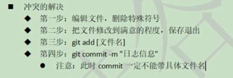

vim快捷键

|       按键       |            操作             |
| ---------------- | --------------------------- |
| o                | 下方插入一行                 |
| I                | 行首插入                     |
| :%/old/new/g     | 替换                        |
| u                | 撤销上一操作                 |
| ^0/$             | 行首/行尾                    |
| b/e、w           | 向前向后一个单词             |
| s                | 删除后插入                   |
| *                | 查找光标所在处的单词，向下查找 |
| >>               | 缩进                        |
| vim -O           | 垂直分屏                     |
| insert下ctrl+R+= | 计算器                      |
git pull origin master --allow-unrelated-histories

```shell
本地库初始化
命令：文件名 级别优先级
git init 

git config --global user.name fg
git config --global user.email fg@qq.com

$ git config user.name
fg
$ git config user.email
fg@qq.com

分支：git branch -v
创建git branch [分支名]
查看 git branch -v
切换 git checkout[分支名]
合并分支：
切换到被修改分支上
git merge[有新内容分支]

#SSH key
cd ~
ssh-keygen -t rsa -C finegrained@qq.com
cd .ssh
cat id_rsa.pub
```

project interpreter

anaconda\python.exe

-----


```
本地库初始化
命令：文件名 级别优先级
git init 

git config --global user.name fg
git config --global user.email fg@qq.com

$ git config user.name
fg
$ git config user.email
fg@qq.com

分支：git branch -v
创建git branch [分支名]
查看 git branch -v
切换 git checkout[分支名]
合并分支：
切换到被修改分支上
git merge[有新内容分支]

#SSH key
cd ~
ssh-keygen -t rsa -C finegrained@qq.com
cd .ssh
cat id_rsa.pub
```

```
New SSH keys
ssh-rsa AAAAB3NzaC1yc2EAAAADAQABAAABAQCl/3FBvWoxmFvcrd/74lPxryD+Xgbwg2Ai+7c68cJ4fgC2ndtIRgkkgw4Hk5cpNFsJP74d8CpKKncrCrTn7mZPoiYj7VcB8vqx6tDEXYYQRJe9OBkiTHmg6nfO+j8idr5H9T/kuXplPmMgTqVwUzc61tYuoIeo2jUwHkApN11odSUxhxmI9F2T6ORGbS//HH/L4x/jf4arSaJYx3xX+w1slWamw92mkh9o9matgT5aiu+Hw6Vja9azWC2pSCLJD764NDhghggoJRtpqzwt4Cuaq5yB5vieJEgmV2C2i77ro4wQqjzOfFrWr0g5q63cIah9xgas996XEeRqf4pXMm63 finegrained@qq.com
```

```
git remote add origin 新建别名(https:)
#推送
git push orign master 
#拉取
git pull orign master 
克隆 git clone https:
完整的把远程库下载到本地
创建别名
初始化本地库
冲突修改后提交不能带文件名 git commit -m ""
```

```
git status状态(工作区、暂存区)
添加git add [file name]
git add hua.txt
git add -A  提交所有变化
git add -u  提交被修改(modified)和被删除(deleted)文件，不包括新文件(new)
git add .  提交新文件(new)和被修改(modified)文件，不包括被删除(deleted)文件

git commit -m "test github" hua.txt#可不带文件名
提交 git commit -m "备注"  [file name]
删除文件并找回
git rm [-r] [文件名]
前提：删除前，文件存在时的状态提交到了本地库
操作：git reset-hard[指针位置]
比较文件git diff apple.txt可以与历史版本比较
git diff[本地库中历史版本][文件名]
不指定文件名比较所有文件
```

```
前进后退 git reflog 查看历史
索引值 git reset --hard [索引值](部分)
^符号（只能后退）只退一步 git reset --hard HEAD^
 ~3(后退3步) git reset --hard HEAD~3
reset命令参数
--soft 只在本地库移动HEAD指针
--mixed参数+重置暂存区
--hard参数+重置工作区
```



```
Git中从远程的分支获取最新的版本到本地有这样2个命令：
1. git fetch：相当于是从远程获取最新版本到本地，不会自动merge
git fetch origin master
git log -p master..origin/master
git merge origin/master
以上命令的含义：
首先从远程的origin的master主分支下载最新的版本到origin/master分支上
然后比较本地的master分支和origin/master分支的差别
最后进行合并
上述过程其实可以用以下更清晰的方式来进行：
git fetch origin master:tmp
git diff tmp
git merge tmp
从远程获取最新的版本到本地的test分支上
之后再进行比较合并

2. git pull：相当于是从远程获取最新版本并merge到本地
git pull origin master
上述命令其实相当于git fetch 和 git merge
在实际使用中，git fetch更安全一些
因为在merge前，我们可以查看更新情况，然后再决定是否合并
```

```
finegrained7865
finegrained@qq.com
sunduo786386#
区分不同开发人员身份
签名
用户名:finegrained
email地址:finegrained@qq.com
签名和github无关
仓库级别:仅在本地库范围有效
系统用户级别:登录当前操作系统用户的范围
GitHub Token: 
3bd99cdc2bfc718f45548d423e8cc911151cea05
GIST ID: 
f5cc7afcf00a532fbb56067d3126007c
idea Token: 
53321569e7f41c190da9821f9119bb43f522b8d5
```

