# 1. IOC（inversion of control)

反转资源获取的方向，传统的资源查找方式，要求组件向容器发起请求查找资源。作为回应，容器适时的返回资源。而应用了IOC之后，则是容器主动地将资源推送给它所管理的组件，组件所要做的仅是选择一种合适的方式来接受资源。
DI(Dependency Injection)-IOC的另一种表达方式：即组件以一些预先定义好的方式(例如：setter方式)接受来自容器的资源注入。相对IOC而言，这种表述更直接
Spring提供了两种类型的IOC容器实现

- BeanFactoryIOC容器的基本实现
- ApplicationContext提供了更多的高级特性 是BeanFactory的子接口
- BeanFactory是Spring框架的基础设施，面向Spring本身；ApplicationContext面向使用Spring框架的开发者，几乎所有的应用场合都直接使用ApplicationContext

ClassPathXmlApplicationContext是ApplicationContext接口的实现类，该实现类从以下
## 1.1. ApplicationContext

### 1.1.1. 依赖注入的方式

spring支持3中依赖注入的方式

属性注入

构造器注入

```xml
配置单例的集合bean,以供多个bean进行引用，需要导入util命名空间
<util:list id="cars">
    <ref bean="car"/>
    <ref bean="car2"/>
</util:list>   
```

- Spring IOC容器可以自动装配Bean。需要做的仅仅是在<bean>的autowire属性里指定自动装配的模式
- byType(根据类型自动装配):若IOC容器中有多个与目标Bean类型一致的Bean。在这种情况下，Spring将无法判定哪个Bean最适合该属性，所以不能执行自动装配。
- byName(根据名称自动装配):必须将目标Bean的名称和属性名设置的完全相同。
- constructor(通过构造器自动装配):当Bean中存在多个构造器时，此种自动装配方式将会很复杂，不推荐使用

测试赋空值<null/>

### 1.1.2. 集合属性

•Java.util.Map 通过 **<map>** 标签定义, <map> 标签里可以使用多个 **<entry>** 作为子标签. 每个条目包含一个键和一个值. 

•必须在 **<key>** 标签里定义键

•因为键和值的类型没有限制, 所以可以自由地为它们指定 <value>, <ref>, <bean> 或 <null> 元素. 

•可以将 Map 的键和值作为 <entry> 的属性定义: 简单常量使用 key 和 value 来定义; Bean 引用通过 key-ref 和 value-ref 属性定义

•使用 **<props>** 定义 java.util.Properties, 该标签使用多个 **<prop>** 作为子标签. 每个 **<prop>** 标签必须定义 **key** 属性. 


```xml
<bean id="person3" class="com.zc.cris.collectionProperty.Person2">
        <property name="name" value="james"></property>
        <property name="age" value="34"></property>
        <property name="cars">
            <map>
                <entry key="AA" value-ref="car1"></entry>
                <entry key="BB" value-ref="car2"></entry>
            </map>
        </property>
    </bean>
```

```xml
<!-- 配置properties属性 -->
    <bean name="dataSource" class="com.zc.cris.collectionProperty.DataSource">
        <property name="properties">
            <!-- 使用props和prop子节点来为properties属性值赋值 -->
            <props>
                <prop key="user">root</prop>
                <prop key="password">123456</prop>
                <prop key="jdbcUrl">jdbc:mysql:///test</prop>
                <prop key="driverClass">com.mysql.jdbc.Driver</prop>
            </props>
        </property>
    </bean>
```

### 1.1.3. 使用 utility scheme 定义集合

使用基本的集合标签定义集合时, 不能将集合作为独立的 Bean 定义, 导致其他 Bean 无法引用该集合, 所以无法在不同 Bean 之间共享集合

可以使用 util schema 里的集合标签定义独立的集合 Bean. 需要注意的是, 必须在 根元素里添加 util schema 定义

```xml
 <!-- 配置单例的集合bean，以供多个bean进行引用，需要导入util 命名空间 -->
    <util:list id="cars">
        <ref bean="car1"/>
        <ref bean="car2"/>
    </util:list>

    <bean id="person4" class="com.zc.cris.collectionProperty.Person">
        <property name="name" value="哈登"></property>
        <property name="age" value="29"></property>
        <property name="cars" ref="cars"></property>
    </bean>
```

```xml
<!-- 通过p命名空间为bean的属性赋值，需要先导入p命名空间，相对于传统的方式更加的简洁 -->
    <bean id="person5" class="com.zc.cris.collectionProperty.Person" 
    p:age="12" p:name="库里" p:cars-ref="cars" >

    </bean>
```

Spring IOC 容器可以自动装配 Bean. 需要做的仅仅是在 的 autowire 属性里指定自动装配的模式

byType(根据类型自动装配): 若 IOC 容器中有多个与目标 Bean 类型一致的 Bean. 在这种情况下, Spring 将无法判定哪个 Bean 最合适该属性, 所以不能执行自动装配.

byName(根据名称自动装配): 必须将目标 Bean 的名称和属性名设置的完全相同
```xml
 <bean id="car" class="com.zc.cris.autowire.Car">
        <property name="name" value="保时捷"></property>
        <property name="price" value="1234567.0"></property>
    </bean>
    <bean id="address" class="com.zc.cris.autowire.Address" p:city="上海" p:province="北京"></bean>

    <!-- 
        可以使用autowire属性指定自动装配的方式
        byName 根据bean的名字和当前待装配的bean的setter方法对应的属性名进行自动装配，匹配则装配，不匹配就不装配
        byType 根据bean的类型和当前bean的属性的类型进行自动装配，若ioc容器有一个以上的类型匹配的bean（即有两个car），则会抛异常
        很少使用，因为不够灵活，只有在整合第三方框架的时候可能会用到
     -->
    <bean id="person" class="com.zc.cris.autowire.Person" p:name="steve" autowire="byName">

    </bean>
```

### 1.1.4. Bean的生命周期

- Spring IOC 容器可以管理 Bean 的生命周期, Spring 允许在 Bean 生命周期的特定点执行定制的任务
- Spring IOC 容器对 Bean 的生命周期进行管理的过程:

>1. 通过构造器或工厂方法创建 Bean 实例
>2. 为 Bean 的属性设置值和对其他 Bean 的引用
>3. 调用 Bean 的初始化方法
>4. Bean 可以使用了
>5. 当容器关闭时, 调用 Bean 的销毁方法

在 Bean 的声明里设置 init-method 和 destroy-method 属性, 为 Bean 指定初始化和销毁方法


```java
- 创建一个bean

public class Car {

    private String name;

    public Car() {
        System.out.println("car has been created");
    }
    public void setName(String name) {
        System.out.println("set name");
        this.name = name;
    }
    public void carInit() {
        System.out.println("car init !");
    }
    public void carDestroy() {
        System.out.println("car destroy !");
    }
    @Override
    public String toString() {
        return "Car [name=" + name + "]";
    }
}

- beans-lifeCircle.xml

    <!-- 创建car这个bean的初始化方法和销毁方法 -->
    <bean id="car" class="com.zc.cris.beans.lifeCircle.Car" init-method="carInit" destroy-method="carDestroy">
        <property name="name" value="法拉利"></property>
    </bean>

- 测试代码

public static void main(String[] args) {

        ClassPathXmlApplicationContext context = new ClassPathXmlApplicationContext("beans-lifeCircle.xml");
        System.out.println(context.getBean("car"));
        //关闭ioc容器
        context.close();
    }

```


------


## 1.2. @Param注解的使用和解析

**作用：**用注解来简化xml配置的时候（比如Mybatis的Mapper.xml中的sql参数引入），**@Param注解的作用是给参数命名**,参数命名后就能根据名字得到参数值,正确的将参数传入sql语句中（一般通过#{}的方式，${}会有sql注入的问题）。

**实例说明：**

1，使用@Param注解  

Mapper接口方法：
```
 public int getUsersDetail(@Param("userid") int userid);
```
对应Sql Mapper.xml文件：
```
 <select id="getUserDetail" statementType="CALLABLE" resultMap="baseMap">           Exec WebApi_Get_CustomerList #{userid}  </select>
```
说明：

当你使用了使用@Param注解来声明参数时，如果使用 #{} 或 ${} 的方式都可以,当你不使用@Param注解来声明参数时，必须使用使用 #{}方式。如果使用 ${} 的方式，会报错。

2, 不使用@Param注解

不使用@Param注解时，最好传递 Javabean。在SQL语句里就可以直接引用JavaBean的属性，而且只能引用JavaBean存在的属性。

Mapper接口方法：
```
 public int getUsersDetail(User user);
```
对应Sql Mapper.xml文件：
```xml
 <!--这里直接引用对象属性即可，不需要对象.属性的方式-->
<select id="getUserDetail" statementType="CALLABLE" resultMap="baseMap">           Exec WebApi_Get_CustomerList #{userid} </select>
```


## 1.3. 新建springboot

 新建springboot项目有三种方式

1. eclipse安装sts插件 然后就可以直接创建springboot项目

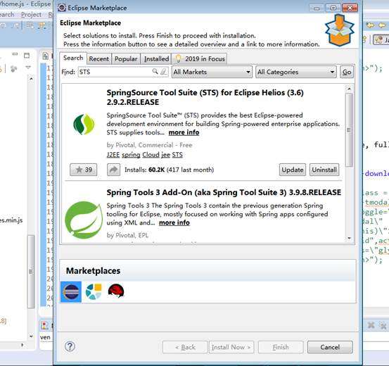

2. 先创建一个maven项目 然后去修改pom.xml 、添加启动类、添加配置文件

3. 直接在官网[**http://start.spring.io/**](http://start.spring.io/)选择版本然后会自动生成一个下载再自己导入就行

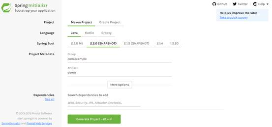

 

springboot自带的tomcat插件版本是9.0

jdk8是支持的最低版本

maven用的是3.2

 

springboot简化了部署和配置

因为自带tomcat插件 所以不需要用到外部的tomcat

配置方面只有一个application.yml 或者是application.properties

这两个文件的区别主要是写法上的区别 

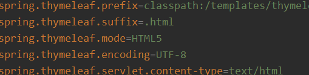

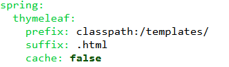

1.在properties文件里面的 "." 在yml文件里面全部换成 ":" 进行连接，每一级之间必须换行，同级的就不需要进行缩进。

2.在yml文件里面如果是需要进行赋值那么必须是要在 ":" 后面加一个空格

3.在yml文件里面所有的配置，相同级别只能出现一次，比如我们使用了spring这个级别，那么我们在后边进行spring级别的配置的时候就必须在这个地方进行，不能在写一个spring级别

 

 

 

Datatables

Datatables是一款jquery表格插件。

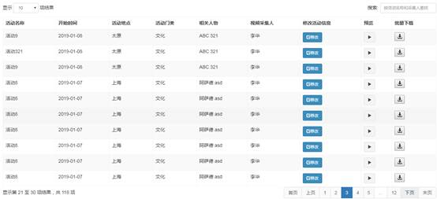

活动列表页就是通过datatables来展示的

分页和选择每页显示的条数都依赖了Paging类

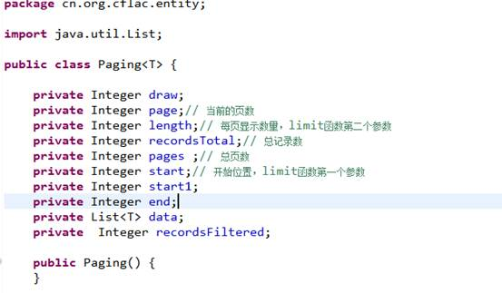

 

 

 

上传用的百度的webuploader

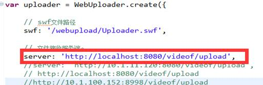

在这指出后台对应的服务

还可以对上传的文件进行一系列操作，加入队列时 上传成功时等

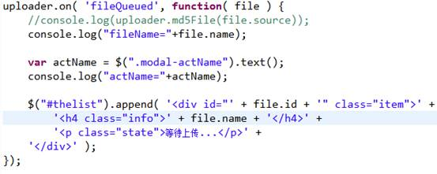

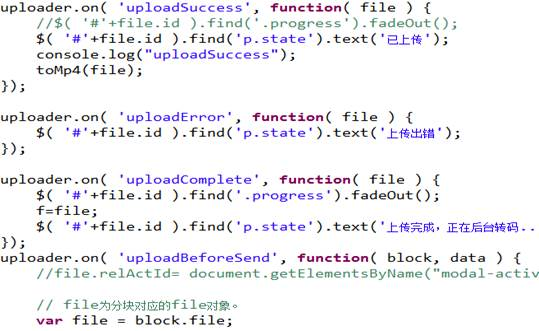

主要用到了上传成功时对视频生成缩略图和转码

 

转码工具ffmpeg

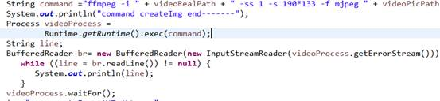

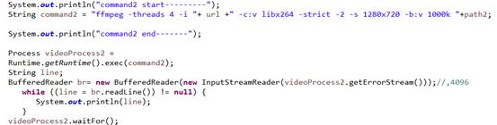


## 1.4. [@Component注解的解析](https://www.cnblogs.com/clwydjgs/p/9255083.html)

今天在写程序的时候看见一个以前没有见过的注解（@Component），在网上查找过后，经过实践，决定把它记录下来。

 1、@controller 控制器（注入服务）

- 用于标注控制层，相当于struts中的action层

2、@service 服务（注入dao）

- 用于标注服务层，主要用来进行业务的逻辑处理

3、@repository（实现dao访问）

- 用于标注数据访问层，也可以说用于标注数据访问组件，即DAO组件.

4、@component （把普通pojo实例化到spring容器中，相当于配置文件中的 `<bean id="" class=""/>`）

 

- - 泛指各种组件，就是说当我们的类不属于各种归类的时候（不属于@Controller、@Services等的时候），我们就可以使用@Component来标注这个类

下面写这个是引入component的扫描组件 

```
<context:component-scan base-package=”com.mmnc”>
```

 其中base-package为需要扫描的包（含所有子包） 

​       1、@Service用于标注业务层组件 

​       2、@Controller用于标注控制层组件(如struts中的action) 

​       3、@Repository用于标注数据访问组件，即DAO组件. 

​       4、@Component泛指组件，当组件不好归类的时候，我们可以使用这个注解进行标注。    

​             @Service public class UserServiceImpl implements UserService { }      

​            @Repository public class UserDaoImpl implements UserDao { } getBean的默认名称是类名（头字母小写），如果想自定义，可以@Service(“***”)               这样来指定，这种bean默认是单例的，如果想改变，可以使用@Service(“beanName”) 

​           @Scope(“prototype”)来改变。可以使用以下方式指定初始化方法和销毁方法（方法名任意）： @PostConstruct public void init() { }

 

## 1.5. Maven 那点事儿（转）

0. 前言

- 我们要开发一个 Java 项目，为了保证编译通过，我们会到处去寻找 jar 包。当编译通过了，在运行的时候，却发现ClassNotFoundException，卧槽！还差 jar 包啊？再去找找吧。
- 每个 Java 项目的目录结构都没有一个统一的标准，配置文件到处都是，单元测试代码到底应该放在哪里，没有一个权威的规范。
- 可使用 Ant 做为项目构建工具，它可以自动化地完成编译、测试、打包等任务，确实为我们省了不少事儿，但编写 Ant 的 XML 脚本绝非是一件轻松的事情。

有了 Maven，以上这一切都不再是问题了。

Jason 就是 Java 开发规范的“救世主”！他给我们带来了一种全新的项目构建方式，让我们的开发工作更加高效。

不仅如此，Jason 还是一名“野心家”，他不仅希望每个 Java 开发者都能使用他定义的规范，还要我们都从他家里去获取 jar 包（他家就是 Maven 中央仓库），我们只需告诉他，我们想要的 jar 包具体在什么位置即可（这个位置就是 Maven 坐标）。

看来 Jason 要做的是两件事情：

1. 统一开发规范与工具
2. 统一管理 jar 包

这两件事情他都做到了，而且还做了更多的事情。

工欲善其事，必先利其器。咱们也来玩玩 Maven 这货吧！先得去下载一个。

1.  安装 Maven

Maven 是 Apache 基金会的顶级项目，一般情况下，被 Apache 看中的都不会是烂货。

我们可以从 <http://maven.apache.org/> 下载 Maven 开发包，其实就是一个压缩包，下载完毕后，解压一下，配置一下环境变量就可以用了。真是超简单！

假设我们刚刚下载了一个 apache-maven-3.1.1-bin.zip 文件，现在将其解压到 D:/tool 目录下 。我们不妨将解压后的目录重命名为 Maven，这样Maven 的根目录就是 D:/tool/maven 了。

有两个环境变量可以配置：

- M2_HOME = D:/tool/maven
- MAVEN_OPTS = -Xms128m -Xmx512m

以上 M2_HOME 是必须要配置的，如果想让 Maven 跑得更快点，可以根据自己的情况来设置 MAVEN_OPTS。

现在我们可以打开 cmd，输入：

mvn -v

我想您一定会看到一些信息，恭喜您，Maven 安装成功！

在使用 Maven 之前，很有必要了解一下 Maven 到底是怎样管理 jar 包的，这就是 Maven 仓库要干的活了。

2. 了解 Maven 仓库

使用 Maven 给我们带来的最直接的帮助，就是 jar 包得到了统一管理，那么这些 jar 包存放在哪里呢？它们就在您的 本地仓库 中，位于 C:\Users\用户名\.m2 目录下（当然也可以修改这个默认地址）。

实际上可将本地仓库理解“缓存”，因为项目首先会从本地仓库中获取 jar 包，当无法获取指定 jar 包的时候，本地仓库会从 远程仓库（或 中央仓库） 中下载 jar 包，并放入本地仓库中以备将来使用。这个远程仓库是 Maven 官方提供的，可通过 <http://search.maven.org/> 来访问。这样一来，本地仓库会随着项目的积累越来越大。通过下面这张图可以清晰地表达项目、本地仓库、远程仓库之间的关系。

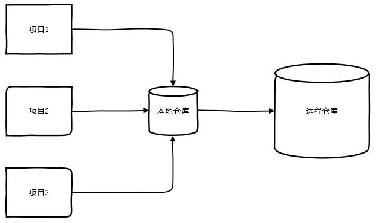

这个结构是否与 Git 的本地仓库与远程仓库有异曲同工之妙呢？

既然 Maven 安装了，那么本地仓库也就有了，下面我们就一起来创建一个 Maven 项目吧。

3. 创建 Maven 项目

我们不妨创建一个 Java Web 项目，只需在 cmd 中输入：

mvn archetype:generate

随后 Maven 将下载 Archetype 插件及其所有的依赖插件，这些插件其实都是 jar 包，它们存放在您的 Maven 本地仓库中。

在 cmd 中，您会看到几百个 Archetype（原型），可将它理解为项目模板，您得从中选择一个。

我们的目标是创建 Java Web 项目，所以您可以选择 maven-archetype-webapp（可以在 cmd 中进行模糊搜索），随后 Maven 会与您进行一些对话，Maven 想知道以下信息：

- 项目 Archetype Version（原型版本号）是什么？—— 可选择 1.0 版本
- 项目 groupId（组织名） 是什么？—— 可输入 com.smart
- 项目 artifactId（构件名）是什么？—— 可输入 smart-demo
- 项目 version（版本号）是什么？—— 可输入 1.0
- 项目 package（包名）是什么？—— 可输入 com.smart.demo

以上这种方式称为 Interactive Mode（交互模式）。

如果您是一位高效人士，或许觉得这样的交互过于繁琐，那么您也可以尝试仅使用一条命名，来完成同样的事情：

mvn archetype:generate -DinteractiveMode=false -DarchetypeArtifactId=maven-archetype-webapp -DgroupId=com.smart -DartifactId=smart-demo -Dversion=1.0

以上这种方式成为 Batch Mode（批处理模式）。

当然，还有第三种选择，使用 IDE 来创建 Maven 项目，您可以使用 Eclipse、NetBeans、IDEA 来创建 Maven 项目，操作过程应该是非常简单的。

您也可以使用 IDEA 直接打开一个 Maven 项目，只需要 File -> Open -> 选择 pom.xml，那么下面您就可以在 IDEA 中开发 Maven 项目了，贴一张图片吧：

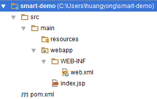


 

其实这个目录结构还不太完备，我们需要手工添加几个目录上去，最终的目录结构看起来是这样的：

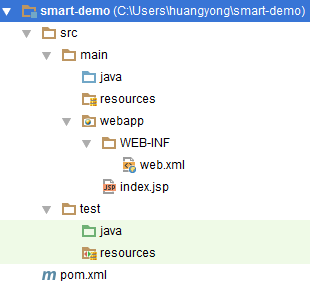

我们手工创建了三个目录：

1. src/main/java
2. src/test/java
3. src/test/resources

为什么自动生成的目录不完备？确实挺无语的，我们就不要去纠结了。不过有必要稍微解释一下这个 Maven 目录规范：

- main 目录下是项目的主要代码，test 目录下存放测试相关的代码。
- 编译输出后的代码会放在target 目录下（该目录与 src 目录在同一级别下，这里没有显示出来）。
- java 目录下存放 Java 代码，resources 目录下存放配置文件。
- webapp 目录下存放 Web 应用相关代码。
- pom.xml 是 Maven 项目的配置文件。

其中 pom.xml 称为 Project Object Model（项目对象模型），它用于描述整个 Maven 项目，所以也称为 Maven 描述文件。

可见 pom.xml 才是理解 Maven 的关键点，很有必要看看它到底长什么样。

4. 理解 pom.xml

当 您打开自动生成的 pom.xml，或许会感觉到可读性不太好，有必要做一下格式化，经过整理后是这样的：

```xml
<span style="font-family: 'Microsoft YaHei'; font-size: 16px;"><code class="hljs xml"><span class="hljs-tag"><<span class="hljs-name">project <span class="hljs-attr">xmlns=<span class="hljs-string">"http://maven.apache.org/POM/4.0.0"
         <span class="hljs-attr">xmlns:xsi=<span class="hljs-string">"http://www.w3.org/2001/XMLSchema-instance"
         <span class="hljs-attr">xsi:schemaLocation=<span class="hljs-string">"http://maven.apache.org/POM/4.0.0
         http://maven.apache.org/maven-v4_0_0.xsd">
 
    <span class="hljs-tag"><<span class="hljs-name">modelVersion>4.0.0<span class="hljs-tag"></<span class="hljs-name">modelVersion>
 
    <span class="hljs-tag"><<span class="hljs-name">groupId>com.smart<span class="hljs-tag"></<span class="hljs-name">groupId>
    <span class="hljs-tag"><<span class="hljs-name">artifactId>smart-demo<span class="hljs-tag"></<span class="hljs-name">artifactId>
    <span class="hljs-tag"><<span class="hljs-name">version>1.0<span class="hljs-tag"></<span class="hljs-name">version>
    <span class="hljs-tag"><<span class="hljs-name">packaging>war<span class="hljs-tag"></<span class="hljs-name">packaging>
 
    <span class="hljs-tag"><<span class="hljs-name">name>smart-demo Maven Webapp<span class="hljs-tag"></<span class="hljs-name">name>
    <span class="hljs-tag"><<span class="hljs-name">url>http://maven.apache.org<span class="hljs-tag"></<span class="hljs-name">url>
 
    <span class="hljs-tag"><<span class="hljs-name">dependencies>
        <span class="hljs-tag"><<span class="hljs-name">dependency>
            <span class="hljs-tag"><<span class="hljs-name">groupId>junit<span class="hljs-tag"></<span class="hljs-name">groupId>
            <span class="hljs-tag"><<span class="hljs-name">artifactId>junit<span class="hljs-tag"></<span class="hljs-name">artifactId>
            <span class="hljs-tag"><<span class="hljs-name">version>3.8.1<span class="hljs-tag"></<span class="hljs-name">version>
            <span class="hljs-tag"><<span class="hljs-name">scope>test<span class="hljs-tag"></<span class="hljs-name">scope>
        <span class="hljs-tag"></<span class="hljs-name">dependency>
    <span class="hljs-tag"></<span class="hljs-name">dependencies>
 
    <span class="hljs-tag"><<span class="hljs-name">build>
        <span class="hljs-tag"><<span class="hljs-name">finalName>smart-demo<span class="hljs-tag"></<span class="hljs-name">finalName>
    <span class="hljs-tag"></<span class="hljs-name">build>
 
<span class="hljs-tag"></<span class="hljs-name">project></span>
```


从上往下简要说明一下：

- modelVersion：这个是 POM 的版本号，现在都是 4.0.0 的，必须得有，但不需要修改。
- groupId、artifactId、version：分别表示 Maven 项目的组织名、构件名、版本号，它们三个合起来就是 Maven 坐标，根据这个坐标可以在 Maven 仓库中对应唯一的 Maven 构件。
- packaging：表示该项目的打包方式，war 表示打包为 war 文件，默认为 jar，表示打包为 jar 文件。
- name、url：表示该项目的名称与 URL 地址，意义不大，可以省略。
- dependencies：定义该项目的依赖关系，其中每一个 dependency 对应一个 Maven 项目，可见 Maven 坐标再次出现，还多了一个 scope，表示作用域（下面会描述）。
- build：表示与构建相关的配置，这里的 finalName 表示最终构建后的名称 smart-demo.war，这里的 finalName 还可以使用另一种方式来定义（下面会描述）。

如果用树形图来表达 pom.xml，那么会更加清晰：

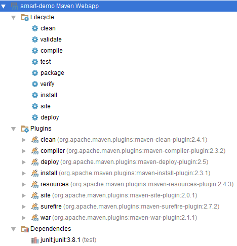

可见，除了项目的基本信息（Maven 坐标、打包方式等）以外，每个 pom.xml 都应该包括：

1. Lifecycle（生命周期）
2. Plugins（插件）
3. Dependencies（依赖）

Lifecycle 是项目构建的生命周期，它包括 9 个 Phase（阶段）。

大家知道，Maven 是一个核心加上多个插件的架构，而这些插件提供了一系列非常重要的功能，这些插件会在许多阶段里发挥重要作用。

| 阶段     | 插件                          | 作用                                             |
| -------- | ----------------------------- | ------------------------------------------------ |
| clean    | clean                         | 清理自动生成的文件，也就是 target 目录           |
| validate | 由 Maven 核心负责             | 验证 Maven 描述文件是否有效                      |
| compile  | compiler、resources           | 编译 Java 源码                                   |
| test     | compiler、surefire、resources | 运行测试代码                                     |
| package  | war                           | 项目打包，就是生成构件包，也就是打 war 包        |
| verify   | 由 Maven 核心负责             | 验证构件包是否有效                               |
| install  | install                       | 将构件包安装到本地仓库                           |
| site     | site                          | 生成项目站点，就是一堆静态网页文件，包括 JavaDoc |
| deploy   | deploy                        | 将构件包部署到远程仓库                           |


以上表格中所出现的插件名称实际上是插件的别名（或称为前缀），比如：compiler 实际上是 org.apache.maven.plugins:maven-compiler-plugin:2.3.2，这个才是 Maven 插件的完全名称。

每个插件又包括了一些列的 Goal（目标），以 compiler 插件为例，它包括以下目标：

- compiler:help：用于显示 compiler 插件的使用帮助。
- compiler:compile：用于编译 main 目录下的 Java 代码。
- compiler:testCompile：用于编译 test 目录下的 Java 代码。

可见，插件目标才是具体干活的人，一个插件包括了一个多个目标，一个阶段可由零个或多个插件来提供支持。

我们可以在 pom.xml 中定义一些列的项目依赖（构件包），每个构件包都会有一个 Scope（作用域），它表示该构件包在什么时候起作用，包括以下五种：

1. compile：默认作用域，在编译、测试、运行时有效
2. test：对于测试时有效
3. runtime：对于测试、运行时有效
4. provided：对于编译、测试时有效，但在运行时无效
5. system：与 provided 类似，但依赖于系统资源

可用一张矩阵表格来表示：

 

 

| 作用域   | 编译时有效 | 测试时有效 | 运行时有效 | 示例                     |
| -------- | ---------- | ---------- | ---------- | ------------------------ |
| compile  | √          | √          | √          | smart-framework.jar      |
| test     |            | √          |            | junit.jar                |
| runtime  |            | √          | √          | mysql-connector-java.jar |
| provided | √          | √          |            | servlet-api.jar          |
| system   | √          | √          |            | JDK 的 rt.jar            |


如果您想开发一个 Smart 应用，可参考如下 pom.xml：


 ```xml
 <project xmlns="http://maven.apache.org/POM/4.0.0"
          xmlns:xsi="http://www.w3.org/2001/XMLSchema-instance"
          xsi:schemaLocation="http://maven.apache.org/POM/4.0.0
          http://maven.apache.org/xsd/maven-4.0.0.xsd">
 
     <modelVersion>4.0.0</modelVersion>
 
     <properties>
         <project.build.sourceEncoding>UTF-8</project.build.sourceEncoding>
         <smart.version>1.0</smart.version>
     </properties>
 
     <groupId>com.smart</groupId>
     <artifactId>smart-demo</artifactId>
     <version>1.0</version>
     <packaging>war</packaging>
 
     <dependencies>
         <!-- JUnit -->
         <dependency>
             <groupId>junit</groupId>
             <artifactId>junit</artifactId>
             <version>4.11</version>
             <scope>test</scope>
         </dependency>
         <!-- MySQL -->
         <dependency>
             <groupId>mysql</groupId>
             <artifactId>mysql-connector-java</artifactId>
             <version>5.1.25</version>
             <scope>runtime</scope>
         </dependency>
         <!-- Servlet -->
         <dependency>
             <groupId>javax.servlet</groupId>
             <artifactId>javax.servlet-api</artifactId>
             <version>3.0.1</version>
             <scope>provided</scope>
         </dependency>
         <!-- JSTL -->
         <dependency>
             <groupId>javax.servlet</groupId>
             <artifactId>jstl</artifactId>
             <version>1.2</version>
             <scope>runtime</scope>
         </dependency>
         <!-- Smart -->
         <dependency>
             <groupId>com.smart</groupId>
             <artifactId>smart-framework</artifactId>
             <version>${smart.version}</version>
         </dependency>
     </dependencies>
 
     <build>
         <plugins>
             <!-- Compile -->
             <plugin>
                 <groupId>org.apache.maven.plugins</groupId>
                 <artifactId>maven-compiler-plugin</artifactId>
                 <version>2.5.1</version>
                 <configuration>
                     <source>1.6</source>
                     <target>1.6</target>
                 </configuration>
             </plugin>
             <!-- Test -->
             <plugin>
                 <groupId>org.apache.maven.plugins</groupId>
                 <artifactId>maven-surefire-plugin</artifactId>
                 <version>2.15</version>
                 <configuration>
                     <skipTests>true</skipTests>
                 </configuration>
             </plugin>
             <!-- Package -->
             <plugin>
                 <groupId>org.apache.maven.plugins</groupId>
                 <artifactId>maven-war-plugin</artifactId>
                 <version>2.4</version>
                 <configuration>
                     <warName>${project.artifactId}</warName>
                 </configuration>
             </plugin>
             <!-- Tomcat -->
             <plugin>
                 <groupId>org.apache.tomcat.maven</groupId>
                 <artifactId>tomcat7-maven-plugin</artifactId>
                 <version>2.2</version>
             </plugin>
         </plugins>
     </build> 
 </project>
 ```


 

以上 pom.xml 大致解释一下：

- 我们可使用 properties 来定义一些配置属性，例如：project.build.sourceEncoding（项目构建源码编码方式），可设置为 UTF-8，可防止中文乱码。也可定义相关构件包版本号，例如：smart.version，便于日后统一升级。
- 建议使用最新版本的 JUnit，通过 Archetype 自动生成的 JUnit 太老了（3.8.1），可改为最新版（4.11）。
- 因为没必要使用 MySQL 客户端的 API，它仅仅在运行时有效，所以我们将 MySQL 构件包的作用域设置为 runtime。
- 因为我们只想在代码中使用 Servlet API，而不想将它所对应的 jar 包放入 WEB-INF 的 lib 目录下，所以我们可设置 Servlet 构件包的作用域为 provided。
- 为了保证在 JDK 1.6 运行，我们可配置 maven-compiler-plugin 插件，设置输入源码为 1.6，编译输出的字节码也为 1.6。
- 如果想跳过测试，可配置 maven-surefire-plugin 插件，将 skipTests 设置为 true。
- 如果想配置生成的 war 包为 artifactId，可修改 maven-war-plugin 插件，将 warName 修改为 ${project.artifactId}，这样就无需再配置 finalName 了。
- 如果想通过 Maven 将应用部署到 Tomcat 中，可使用 tomcat7-maven-plugin 插件，可使用 mvn tomcat7:run-war 命令来运行 war 包。

5. 使用 Maven 命令

前面我们已经使用了几个 Maven 命令，例如：mvn archetype:generate，mvn tomcat7:run-war 等。其实，可使用两种不同的方式来执行 Maven 命令：

方式一：mvn <插件>:<目标> [参数]

方式二：mvn <阶段>

现在我们接触到的都是第一种方式，而第二种方式才是我们日常中使用最频繁的，例如：

- mvn clean：清空输出目录（即 target 目录）
- mvn compile：编译源代码
- mvn package：生成构件包（一般为 jar 包或 war 包）
- mvn install：将构件包安装到本地仓库
- mvn deploy：将构件包部署到远程仓库

执行 Maven 命令需要注意的是：必须在 Maven 项目的根目录处执行，也就是当前目录下一定存在一个名为 pom.xml 的文件。

6. 后记

Maven 使 Java 开发更加规范化与自动化，其实 Maven 那点事远远不止这些，如果您掌握了以上这些基础知识，再去学习 Maven 的高级特性，我想一定会是一件非常轻松的事情。

推荐大家使用 [OSC Maven](http://maven.oschina.net/)，它是国内 Maven 的镜像站点，使用它可加快构件包的下载速度，从而提升您的开发效率，可阅读《[使用 OSC Maven 仓库](http://my.oschina.net/huangyong/blog/180189)》这篇文章来学会如何使用 OSC Maven。

 

## 1.6. Struts

Alt+/ 自动补全 

- main+"..."
- syso+"..."

代码规范化ctrl+shift+F

删除某行ctrl+D

char为空'\u0000'或'\0'

java中容器都是从0开始变

数组创建后立即拥有默认值0，索引从0开始，连续分配

如果要用main调用，在定义函数时加static修饰

```java
//控制台输入
try{
    BufferedReader br = new BufferReader(new InputStreamReader(System.in));
    String s = br.readline();
    
}
catch(Exception e){
}
```


   String转double

`double h = Double.parseDouble(s);`

如果我们创建了有参构造器，建议加一个空构造器

1. 一个java文件 主类带public 其他对象实例用class即可
2. java中只能单继承，也就是每个类只能有一个父类
3. 每个类都有独特的构造器
4. 子类调用父类一般无参
5. final类不能被继承
6. static只能修饰类成员，不能修饰局部变量
7. 静态属性描述了类的所有对象的共同特征
8. 静态属性在该类第一次被加载到虚拟机时，分配静态存储区，以后每次运行不再分配空间
9. 静态方法中不能使用this
10. 接口不能含有任何非抽象方法，而抽象类可以


1. throw手动抛出 throws声明方法抛出异常 

```java
public static void proc() 
throws IOException{}
```


1. string 为引用数据类型默认为null unicode设置日期时注意月份的值 

```
Calendar c = Calendar.getInstance();
c.set(2009,12,5);//代表2010年1月5号
c.add(Calendar.MONTH,-2);
System.out.printLn(c.getTime())
```


1. java.lang.classCastException类型转换异常

implements

1. map中放元素是put方法
2. 对于输入流（读），一定要文件存在才可以；输出流（写），没文件自动创建（但要存在目录）

SQL-oracle

scott

tiger

services.msc打开服务窗口

服务器名neu oracle

1. 以下三种情况 列别名需加""

- 区分大小写
- 列别名中有空格
- 包含特殊字符

1. ''表示字符串 像SQL中""
2. t.hire_date<TO_DATE('1991-01-01','YYYY-MM-DD')也可将string转成date
3. 日期转换英文环境           ALTER SESSION SET NLS_LANGUAGE='AMERICAN'
4. WHERE job_id LIKE 'F^_%' ESCAPE '\';
5. NULL用is来比较
6. 空值在升序排列中排在最后，在降序排列中排在最开始
7. TRIM去除头或尾包含的字符
8. 取本月第一天ADD_MONTH(-1)+last_day+1
9. NOT IN包含null情况，即<>ALL返回为空 
10. JIS中字符串 -0即转成数字

表单验证

```
<form onSubmit= "return ...;">
```


jsp中默许第一部分路径开头

web.xml默认第二部分路径

<%=basePath%>jsp中获取的一、二部分路径值

cookie只能存纯文本

先在servlet中req.request获取+转发

在jsp中request.getAttribute使用或$(username555)

session比request范围大 （在任意浏览器范围内可以使用session存的信息）

```
<c:if><c:foreach>JSTL使用
jsp -p<... pageEncoding= "utf-8" contentType= ...charset= utf-8"%>
```

creamily Mildred blandness

1. 若要向后台传参则method= "post"
2. Ajax异步调用、局部刷新
3. 一个类只能实例成一个对象即为单例模式
4. web.xml中/*表示对所有请求都过滤
5. 普通Action的类要求返回string类型
6. RequestAware SessionAware ApplicationAware接口来访问Map类型的request session application对象（request放入Map类型通过put方法）

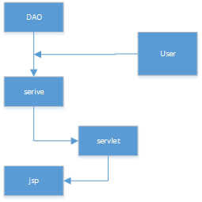

建一个struts工程：

- 构建路径 添加路径 jar包
- web.xml+struts的过滤器
- 引入API

struts标签

 if else标签

 Interator标签

```
int强转String String.value of(id);
              Integer.toString(id);
String强转成int int = int.Parse(num);
long.toString()
```


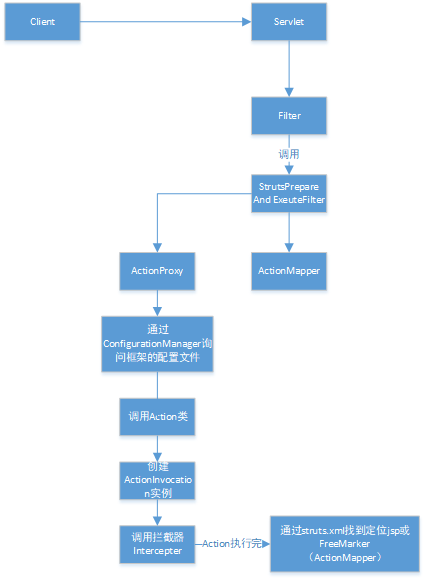


 ##  Java事务处理总结

**一、什么是Java事务**

通常的观念认为，事务仅与数据库相关。

事务必须服从ISO/IEC所制定的ACID原则。ACID是原子性（atomicity）、一致性（consistency）、隔离性（isolation）和持久性（durability）的缩写。事务的原子性表示事务执行过程中的任何失败都将导致事务所做的任何修改失效。一致性表示当事务执行失败时，所有被该事务影响的数据都应该恢复到事务执行前的状态。隔离性表示在事务执行过程中对数据的修改，在事务提交之前对其他事务不可见。持久性表示已提交的数据在事务执行失败时，数据的状态都应该正确。

通俗的理解，事务是一组原子操作单元，从数据库角度说，就是一组SQL指令，要么全部执行成功，若因为某个原因其中一条指令执行有错误，则撤销先前执行过的所有指令。更简答的说就是：要么全部执行成功，要么撤销不执行。

既然事务的概念从数据库而来，那Java事务是什么？之间有什么联系？

实际上，一个Java应用系统，如果要操作数据库，则通过JDBC来实现的。增加、修改、删除都是通过相应方法间接来实现的，事务的控制也相应转移到Java程序代码中。因此，数据库操作的事务习惯上就称为Java事务。

**二、为什么需要事务**

事务是为解决数据安全操作提出的，事务控制实际上就是控制数据的安全访问。具一个简单例子：比如银行转帐业务，账户A要将自己账户上的1000元转到B账户下面，A账户余额首先要减去1000元，然后B账户要增加1000元。假如在中间网络出现了问题，A账户减去1000元已经结束，B因为网络中断而操作失败，那么整个业务失败，必须做出控制，要求A账户转帐业务撤销。这才能保证业务的正确性，完成这个操走就需要事务，将A账户资金减少和B账户资金增加方到一个事务里面，要么全部执行成功，要么操作全部撤销，这样就保持了数据的安全性。

**三、Java事务的类型**

Java事务的类型有三种：JDBC事务、JTA(Java Transaction API)事务、容器事务。

1、JDBC事务

JDBC 事务是用 Connection 对象控制的。JDBC Connection 接口( java.sql.Connection )提供了两种事务模式：自动提交和手工提交。 java.sql.Connection 提供了以下控制事务的方法：

public void setAutoCommit(boolean)

public boolean getAutoCommit()

public void commit()

public void rollback()

使用 JDBC 事务界定时，您可以将多个 SQL 语句结合到一个事务中。JDBC 事务的一个缺点是事务的范围局限于一个数据库连接。一个 JDBC 事务不能跨越多个数据库。

2、JTA(Java Transaction API)事务

JTA是一种高层的，与实现无关的，与协议无关的API，应用程序和应用服务器可以使用JTA来访问事务。

JTA允许应用程序执行分布式事务处理--在两个或多个网络计算机资源上访问并且更新数据，这些数据可以分布在多个数据库上。JDBC驱动程序的JTA支持极大地增强了数据访问能力。

如果计划用 JTA 界定事务，那么就需要有一个实现 javax.sql.XADataSource 、 javax.sql.XAConnection 和 javax.sql.XAResource 接口的 JDBC 驱动程序。一个实现了这些接口的驱动程序将可以参与 JTA 事务。一个 XADataSource 对象就是一个 XAConnection 对象的工厂。 XAConnection s 是参与 JTA 事务的 JDBC 连接。

您将需要用应用服务器的管理工具设置 XADataSource 。从应用服务器和 JDBC 驱动程序的文档中可以了解到相关的指导。

J2EE 应用程序用 JNDI 查询数据源。一旦应用程序找到了数据源对象，它就调用 javax.sql.DataSource.getConnection() 以获得到数据库的连接。

XA 连接与非 XA 连接不同。一定要记住 XA 连接参与了 JTA 事务。这意味着 XA 连接不支持 JDBC 的自动提交功能。同时，应用程序一定不要对 XA 连接调用 java.sql.Connection.commit() 或者 java.sql.Connection.rollback() 。相反，应用程序应该使用 UserTransaction.begin()、 UserTransaction.commit() 和 serTransaction.rollback() 。

3、容器事务

容器事务主要是J2EE应用服务器提供的，容器事务大多是基于JTA完成，这是一个基于JNDI的，相当复杂的API实现。相对编码实现JTA事务管理，我们可以通过EJB容器提供的容器事务管理机制（CMT）完成同一个功能，这项功能由J2EE应用服务器提供。这使得我们可以简单的指定将哪个方法加入事务，一旦指定，容器将负责事务管理任务。这是我们土建的解决方式，因为通过这种方式我们可以将事务代码排除在逻辑编码之外，同时将所有困难交给J2EE容器去解决。使用EJB CMT的另外一个好处就是程序员无需关心JTA API的编码，不过，理论上我们必须使用EJB。

**四、三种事务差异**

1、JDBC事务控制的局限性在一个数据库连接内，但是其使用简单。

2、JTA事务的功能强大，事务可以跨越多个数据库或多个DAO，使用也比较复杂。

3、容器事务，主要指的是J2EE应用服务器提供的事务管理，局限于EJB应用使用。

**五、总结**

事务控制是构建J2EE应用不可缺少的一部分，合理选择应用何种事务对整个应用系统来说至关重要。一般说来，在单个JDBC 连接连接的情况下可以选择JDBC事务，在跨多个连接或者数据库情况下，需要选择使用JTA事务，如果用到了EJB，则可以考虑使用EJB容器事务。

## 1.7. [详细的正则表达式](https://www.cnblogs.com/clwydjgs/p/9366883.html)

只能输入数字："^[0-9]*$"。

只能输入n位的数字："^\d{n}$"。

只能输入至少n位的数字："^\d{n,}$"。

只能输入m~n位的数字：。"^\d{m,n}$"

只能输入零和非零开头的数字："^(0|[1-9][0-9]*)$"。

只能输入有两位小数的正实数："^[0-9]+(.[0-9]{2})?$"。

只能输入有1~3位小数的正实数："^[0-9]+(.[0-9]{1,3})?$"。

只能输入非零的正整数："^\+?[1-9][0-9]*$"。

只能输入非零的负整数："^\-[1-9][]0-9"*$。

只能输入长度为3的字符："^.{3}$"。

只能输入由26个英文字母组成的字符串："^[A-Za-z]+$"。

只能输入由26个大写英文字母组成的字符串："^[A-Z]+$"。

只能输入由26个小写英文字母组成的字符串："^[a-z]+$"。

只能输入由数字和26个英文字母组成的字符串："^[A-Za-z0-9]+$"。

只能输入由数字、26个英文字母或者下划线组成的字符串："^\w+$"。

验证用户密码："^[a-zA-Z]\w{5,17}$"正确格式为：以字母开头，长度在6~18之间，只能包含字符、数字和下划线。

验证是否含有^%&',;=?$\"等字符："[^%&',;=?$\x22]+"。

只能输入汉字："^[\u4e00-\u9fa5]{0,}$"

验证Email地址："^\w+([-+.]\w+)*@\w+([-.]\w+)*\.\w+([-.]\w+)*$"。

验证InternetURL："^http://%28[/\w-]+\.)+[\w-]+(/[\w-./?%&=]*)?$"。

验证电话号码："^(\(\d{3,4}-)|\d{3.4}-)?\d{7,8}$"正确格式为："XXX-XXXXXXX"、"XXXX-XXXXXXXX"、"XXX-XXXXXXX"、"XXX-XXXXXXXX"、"XXXXXXX"和"XXXXXXXX"。

验证身份证号（15位或18位数字）："^\d{15}|\d{18}$"。

验证一年的12个月："^(0?[1-9]|1[0-2])$"正确格式为："01"～"09"和"1"～"12"。

验证一个月的31天："^((0?[1-9])|((1|2)[0-9])|30|31)$"正确格式为；"01"～"09"和"1"～"31"。 

利用正则表达式限制网页表单里的文本框输入内容：

用正则表达式限制只能输入中文：onkeyup="value=value.replace(/[^\u4E00-\u9FA5]/g,'')" onbeforepaste="clipboardData.setData('text',clipboardData.getData('text').replace(/[^\u4E00-\u9FA5]/g,''))"

用正则表达式限制只能输入全角字符： onkeyup="value=value.replace(/[^\uFF00-\uFFFF]/g,'')" onbeforepaste="clipboardData.setData('text',clipboardData.getData('text').replace(/[^\uFF00-\uFFFF]/g,''))"

用正则表达式限制只能输入数字：onkeyup="value=value.replace(/[^\d]/g,'') "onbeforepaste="clipboardData.setData('text',clipboardData.getData('text').replace(/[^\d]/g,''))"

用正则表达式限制只能输入数字和英文：onkeyup="value=value.replace(/[\W]/g,'') "onbeforepaste="clipboardData.setData('text',clipboardData.getData('text').replace(/[^\d]/g,''))"

得用正则表达式从URL地址中提取文件名的javascript程序，如下结果为page1

s="http://www.jb51.net/about.htm"

s=s.replace(/(.*\/){0,}([^\.]+).*/ig,"$2")

alert(s)

匹配双字节字符(包括汉字在内)：[^\x00-\xff]

应用：计算字符串的长度（一个双字节字符长度计2，ASCII字符计1）

String.prototype.len=function(){return this.replace([^\x00-\xff]/g,"aa").length;}

匹配空行的正则表达式：\n[\s| ]*\r

匹配HTML标记的正则表达式：/<(.*)>.*<\/\1>|<(.*) \/>/

匹配首尾空格的正则表达式：(^\s*)|(\s*$)

String.prototype.trim = function()

{

​    return this.replace(/(^\s*)|(\s*$)/g, "");

}

利用正则表达式分解和转换IP地址：

下面是利用正则表达式匹配IP地址，并将IP地址转换成对应数值的Javascript程序：

function IP2V(ip)

{

 re=/(\d+)\.(\d+)\.(\d+)\.(\d+)/g  //匹配IP地址的正则表达式

if(re.test(ip))

{

return RegExp.$1*Math.pow(255,3))+RegExp.$2*Math.pow(255,2))+RegExp.$3*255+RegExp.$4*1

}

else

{

 throw new Error("Not a valid IP address!")

}

}

不过上面的程序如果不用正则表达式，而直接用split函数来分解可能更简单，程序如下：

var ip="10.100.20.168"

ip=ip.split(".")

alert("IP值是："+(ip[0]*255*255*255+ip[1]*255*255+ip[2]*255+ip[3]*1))

符号解释：

字符 

描述

\ 

将下一个字符标记为一个特殊字符、或一个原义字符、或一个 向后引用、或一个八进制转义符。例如，'n' 匹配字符 "n"。'\n' 匹配一个换行符。序列 '\\' 匹配 "\" 而 "\(" 则匹配 "("。

^ 

匹配输入字符串的开始位置。如果设置了 RegExp 对象的 Multiline 属性，^ 也匹配 '\n' 或 '\r' 之后的位置。

$ 

匹配输入字符串的结束位置。如果设置了RegExp 对象的 Multiline 属性，$ 也匹配 '\n' 或 '\r' 之前的位置。

\* 

匹配前面的子表达式零次或多次。例如，zo* 能匹配 "z" 以及 "zoo"。* 等价于{0,}。

\+ 

匹配前面的子表达式一次或多次。例如，'zo+' 能匹配 "zo" 以及 "zoo"，但不能匹配 "z"。+ 等价于 {1,}。

? 

匹配前面的子表达式零次或一次。例如，"do(es)?" 可以匹配 "do" 或 "does" 中的"do" 。? 等价于 {0,1}。

{n} 

n 是一个非负整数。匹配确定的 n 次。例如，'o{2}' 不能匹配 "Bob" 中的 'o'，但是能匹配 "food" 中的两个 o。

{n,} 

n 是一个非负整数。至少匹配n 次。例如，'o{2,}' 不能匹配 "Bob" 中的 'o'，但能匹配 "foooood" 中的所有 o。'o{1,}' 等价于 'o+'。'o{0,}' 则等价于 'o*'。

{n,m} 

m 和 n 均为非负整数，其中n <= m。最少匹配 n 次且最多匹配 m 次。例如，"o{1,3}" 将匹配 "fooooood" 中的前三个 o。'o{0,1}' 等价于 'o?'。请注意在逗号和两个数之间不能有空格。

? 

当该字符紧跟在任何一个其他限制符 (*, +, ?, {n}, {n,}, {n,m}) 后面时，匹配模式是非贪婪的。非贪婪模式尽可能少的匹配所搜索的字符串，而默认的贪婪模式则尽可能多的匹配所搜索的字符串。例如，对于字符串 "oooo"，'o+?' 将匹配单个 "o"，而 'o+' 将匹配所有 'o'。

. 

匹配除 "\n" 之外的任何单个字符。要匹配包括 '\n' 在内的任何字符，请使用象 '[.\n]' 的模式。

(pattern) 

匹配 pattern 并获取这一匹配。所获取的匹配可以从产生的 Matches 集合得到，在VBScript 中使用 SubMatches 集合，在JScript 中则使用 $0…$9 属性。要匹配圆括号字符，请使用 '′或′′或′'。

(?:pattern) 

匹配 pattern 但不获取匹配结果，也就是说这是一个非获取匹配，不进行存储供以后使用。这在使用 "或" 字符 (|) 来组合一个模式的各个部分是很有用。例如， 'industr(?:y|ies) 就是一个比 'industry|industries' 更简略的表达式。

(?=pattern) 

正向预查，在任何匹配 pattern 的字符串开始处匹配查找字符串。这是一个非获取匹配，也就是说，该匹配不需要获取供以后使用。例如，'Windows (?=95|98|NT|2000)' 能匹配 "Windows 2000" 中的 "Windows" ，但不能匹配 "Windows 3.1" 中的 "Windows"。预查不消耗字符，也就是说，在一个匹配发生后，在最后一次匹配之后立即开始下一次匹配的搜索，而不是从包含预查的字符之后开始。

(?!pattern) 

负向预查，在任何不匹配 pattern 的字符串开始处匹配查找字符串。这是一个非获取匹配，也就是说，该匹配不需要获取供以后使用。例如'Windows (?!95|98|NT|2000)' 能匹配 "Windows 3.1" 中的 "Windows"，但不能匹配 "Windows 2000" 中的 "Windows"。预查不消耗字符，也就是说，在一个匹配发生后，在最后一次匹配之后立即开始下一次匹配的搜索，而不是从包含预查的字符之后开始

x|y 

匹配 x 或 y。例如，'z|food' 能匹配 "z" 或 "food"。'(z|f)ood' 则匹配 "zood" 或 "food"。

[xyz] 

字符集合。匹配所包含的任意一个字符。例如， '[abc]' 可以匹配 "plain" 中的 'a'。

[^xyz] 

负值字符集合。匹配未包含的任意字符。例如， '[^abc]' 可以匹配 "plain" 中的'p'。

[a-z] 

字符范围。匹配指定范围内的任意字符。例如，'[a-z]' 可以匹配 'a' 到 'z' 范围内的任意小写字母字符。

[^a-z] 

负值字符范围。匹配任何不在指定范围内的任意字符。例如，'[^a-z]' 可以匹配任何不在 'a' 到 'z' 范围内的任意字符。

\b 

匹配一个单词边界，也就是指单词和空格间的位置。例如， 'er\b' 可以匹配"never" 中的 'er'，但不能匹配 "verb" 中的 'er'。

\B 

匹配非单词边界。'er\B' 能匹配 "verb" 中的 'er'，但不能匹配 "never" 中的 'er'。

\cx 

匹配由 x 指明的控制字符。例如， \cM 匹配一个 Control-M 或回车符。x 的值必须为 A-Z 或 a-z 之一。否则，将 c 视为一个原义的 'c' 字符。

\d 

匹配一个数字字符。等价于 [0-9]。

\D 

匹配一个非数字字符。等价于 [^0-9]。

\f 

匹配一个换页符。等价于 \x0c 和 \cL。

\n 

匹配一个换行符。等价于 \x0a 和 \cJ。

\r 

匹配一个回车符。等价于 \x0d 和 \cM。

\s 

匹配任何空白字符，包括空格、制表符、换页符等等。等价于 [ \f\n\r\t\v]。

\S 

匹配任何非空白字符。等价于 [^ \f\n\r\t\v]。

\t 

匹配一个制表符。等价于 \x09 和 \cI。

\v 

匹配一个垂直制表符。等价于 \x0b 和 \cK。

\w 

匹配包括下划线的任何单词字符。等价于'[A-Za-z0-9_]'。

\W 

匹配任何非单词字符。等价于 '[^A-Za-z0-9_]'。

\xn 

匹配 n，其中 n 为十六进制转义值。十六进制转义值必须为确定的两个数字长。例如，'\x41' 匹配 "A"。'\x041' 则等价于 '\x04' & "1"。正则表达式中可以使用 ASCII 编码。.

\num 

匹配 num，其中 num 是一个正整数。对所获取的匹配的引用。例如，'(.)\1' 匹配两个连续的相同字符。

\n 

标识一个八进制转义值或一个向后引用。如果 \n 之前至少 n 个获取的子表达式，则 n 为向后引用。否则，如果 n 为八进制数字 (0-7)，则 n 为一个八进制转义值。

\nm 

标识一个八进制转义值或一个向后引用。如果 \nm 之前至少有 nm 个获得子表达式，则 nm 为向后引用。如果 \nm 之前至少有 n 个获取，则 n 为一个后跟文字 m 的向后引用。如果前面的条件都不满足，若 n 和 m 均为八进制数字 (0-7)，则 \nm 将匹配八进制转义值 nm。

\nml 

如果 n 为八进制数字 (0-3)，且 m 和 l 均为八进制数字 (0-7)，则匹配八进制转义值 nml。

\un 

匹配 n，其中 n 是一个用四个十六进制数字表示的 Unicode 字符。例如， \u00A9 匹配版权符号 (?)。


## 1.8. [ArrayMap和HashMap区别](https://www.cnblogs.com/clwydjgs/p/9185574.html)

**什么是Map？**

Map的三个特点

1.包含键值对 

2.键唯一 

3.键对应的值唯一

**一：hash**

什么是Hash

Hash，也可以称为“散列”，就是把任意长度的输入，通过散列算法，变换成固定长度的输出，该输出就是散列值。这是一种压缩映射，也就是，散列值的空间通常远小于输入的空间，不同的输入可能会散列成相同的输出（也就是多对一的关系）。

**HashMap**

HashMap内部是使用一个默认容量为16的数组来存储数据的，而数组中每一个元素却又是一个链表的头结点，所以，更准确的来说，HashMap内部存储结构是使用哈希表的拉链结构（数组+链表），这种存储数据的方法叫做拉链法 。如图： 

 

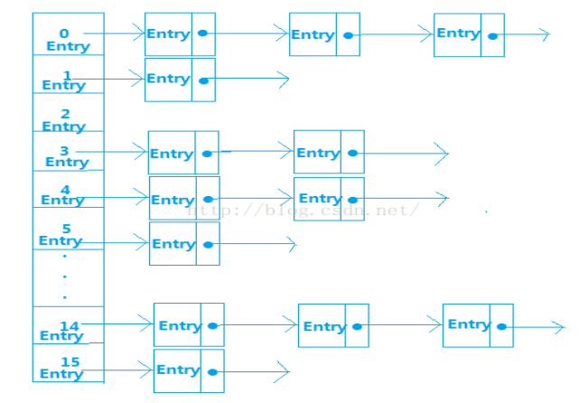

 

且每一个结点都是Entry类型，那么Entry是什么呢？我们来看看HashMap中Entry的属性：

```java
final K key;    
final V value;   
final int hash;   
HashMapEntry<K, V> next;  
```


从中我们得知Entry存储的内容有key、value、hash值、和next下一个Entry，那么，这些Entry数据是按什么规则进行存储的呢？就是通过计算元素key的hash值，然后对HashMap中数组长度取余得到该元素存储的位置，计算公式为hash(key)%len，比如：假设hash(14)=14,hash(30)=30,hash(46)=46 我们对len取余，得到hash(14)%16=14,hash(30)%16=14，hash(46)%16=14。所以hash值为14的这个元素存储在数组下标为14的位置。

从中可以看出，如果有多个元素key的hash值相同的话，后一个元素并不会覆盖上一个元素，而是采取链表的方式，把之后加进来的元素加入链表末尾，从而解决了hash冲突的问题，由此我们知道HashMap中处理hash冲突的方法是链地址法。

在此补充一个知识点，处理hash冲突的方法有以下几种：

1. 开放地址法
2. 再哈希法
3. 链地址法
4. 建立公共溢出区

讲到这里，重点来了，我们知道HashMap中默认的存储大小就是一个容量为16的数组，所以当我们创建出一个HashMap对象时，即使里面没有任何元素，也要分别一块内存空间给它，而且，我们再不断的向HashMap里put数据时，当达到一定的容量限制时（这个容量满足这样的一个关系时候将会扩容：HashMap中的数据量>容量*加载因子，而HashMap中默认的加载因子是0.75），HashMap的空间将会扩大，而且扩大后新的空间一定是原来的2倍，我们可以看put()方法中有这样的一行代码：

`int newCapacity = oldCapacity * 2;`

所以，只要一满足扩容条件，HashMap的空间将会以2倍的规律进行增大。假如我们有几十万、几百万条数据，那么HashMap要存储完这些数据将要不断的扩容，而且在此过程中也需要不断的做hash运算，这将对我们的内存空间造成很大消耗和浪费，而且HashMap获取数据是通过遍历Entry[]数组来得到对应的元素，在数据量很大时候会比较慢，所以在Android中，HashMap是比较费内存的。

所以我们在一些情况下可以使用SparseArray和ArrayMap来代替HashMap。

二：ArrayMap

ArrayMap是一个<key,value>映射的数据结构，它设计上更多的是考虑内存的优化，内部是使用两个数组进行数据存储，一个数组记录key的hash值，另外一个数组记录Value值，它和SparseArray一样，也会对key使用二分法进行从小到大排序，在添加、删除、查找数据的时候都是先使用二分查找法得到相应的index，然后通过index来进行添加、查找、删除等操作，所以，应用场景和SparseArray的一样，如果在数据量比较大的情况下，那么它的性能将退化至少50%。

ArrayMap方法：

```java
public V put(K key, V value)  
public V get(Objectkey)  
public V remove(Objectkey)  
public K keyAt(int index)   
public V valueAt(int index)
```

ArrayMap应用场景

- 1.数据量不大，最好在千级以内
- 2.数据结构类型为Map类型

## 1.9. CA

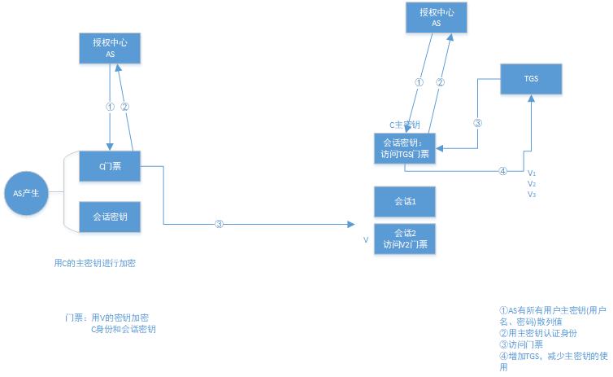

数字签名：用发送方私钥加密的文件摘要

证书

CA不唯一

1. 不同领域
2. 瓶颈单点失效
3. 层次管理(上下级)

认证

1. 密码 重放攻击(认证码，质询)                   传散列值而非"口令"
2. 令牌（质询令牌，时间令牌）
3. 证书（PKI体系） CA的作用 非对称密码学
4. 对称密码进行认证

```java
//quicksort
int quicksort(int[] array,int low,int high){
    int key = array[low];
    while(low < high){
        while(key <= array[high]&&low(high))
             h--;
        array[low] = array[high];
        while(key >= array[low]&&low < high)
             low++;
        array[high] = array[low];
    }
    array[high] = key;
    return high;
}

void sort(int[] array,int low,int high){
    if (low >= high)
       return;
    int index = quicksort(array,low,high);
    sort(array,low,index-1);
    sort(array,index+1,high);
}
```


## 1.10. java语言核心
|提纲|内容|
| -------------------- | ---------------------------------------- |
| java与数据库交互技术 | sql与pl/sql的使用                        |
|                      | mysql数据库                              |
|                      | 数据库事务                               |
|                      | 存储过程                                 |
|                      | 存储引擎                                 |
|                      | jdbc                                     |
|                      | Druid数据库连接池                        |
| javaweb前后端交互    | html css                                 |
|                      | js jquery                                |
|                      | xml                                      |
|                      | tomcat服务器                             |
|                      | http协议                                 |
|                      | 服务器组件Servlet                        |
|                      | jsp                                      |
|                      | el表达式                                 |
|                      | jstl                                     |
|                      | cookie session会话控制                   |
|                      | 服务器组件filter                         |
|                      | 服务器组件listener                       |
|                      | 异步数据传输框架ajax                     |
|                      | 文件上传下载                             |
|                      | 前段框架bootstrap                        |
| javaee               | 系统整体分层解耦spring                   |
|                      | 轻量web框架SpringMVC                     |
|                      | 轻量持久层Mybatis                        |
|                      | 快速继承构建框架SpringBoot               |
|                      | 分布式构建框架SpringCloud                |
|                      | Web安全框架SpringSecurity                |
|                      | 分布式Session管理SpringSession           |
| ~~常用工具和环境~~   | 项目构建 jar包管理Maven                  |
|                      | 日志输出Slf4j                            |
|                      | vcs分布式管理工具Git和GitHub             |
|                      | 内存数据库redis                          |
|                      | mysql优化                                |
|                      | linux 进程 线程                          |
|                      | jvm原理 优化                             |
|                      | 高并发管理工具JUC                        |
|                      | Shell                                    |
|                      | Intellij IDEA使用                        |
| javaee高级           | linux                                    |
|                      | 远端调用技术webservice                   |
|                      | 内存数据redis                            |
|                      | mysql高级                                |
|                      | MyCat实现MySQL的分布式 分库分表 读写分离 |
|                      | 支付接口调用开发                         |
|                      | Nginx反向代理 负载均衡 动静分离          |
|                      | 全文索引数据库Solr                       |
|                      | 分布式构建框架Dubbo                      |
|                      | Tomcat性能优化                           |
|                      | JVM内存模型 参数调优                     |
|                      | Java并发包JUC                            |
| 互联网架构           | 分布式架构中注册中心Zookeeper            |
|                      | 全文检索引擎Elasticsearch                |
|                      | 日志接收 转发工具Logstash                |
|                      | 分析Elasticsearch数据的可视化平台Kibana  |
|                      | 分布式发布-订阅消息系统Kafka             |
|                      | 虚拟化应用容器Docker                     |
|                      | 大数据分析存储框架Hadoop                 |
|                      | 数仓仓库工具Hive                         |
|                      | MapReduce编程模型                        |
|                      | 前端技术栈Node.js+vue.js                 |
|                      | 消息队列RabbitMQ                         |
|                      | 数据库增量订阅Canal                      |
|                      | 实时接口文档Swagger2                     |
|                      | 社交登录SpringSocial                     |

