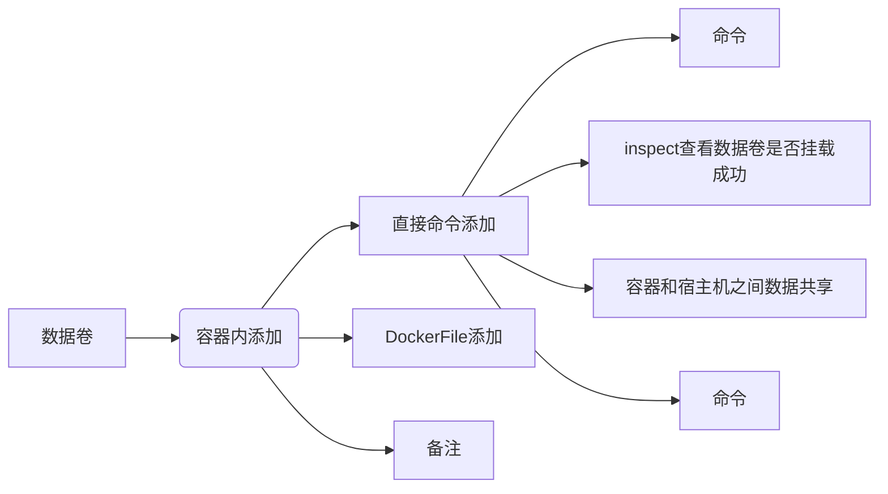

# 1. Centos 7.2

1. 设置允许连接网络： 

   ```shell
   vi /etc/sysconfig/network-scripts/ifcfg-enp0s3  
   #编辑配置文件
   BOOTPROTO=static
   ONBOOT=yes
   
   IPADDR=172.16.40.173
   NETMASK=255.255.255.0
   GATEWAY=172.16.40.1
   DNS1=114.114.114.114
   #重启service
   service network restart
   ```
   
2. 安装软件
   ```shell
   yum install net-tools
   yum install wget
   yum install vim
   yum install ntpdate
   yum -y install lrzsz
   ```

3. 换源 进入到/etc/yum.repos.d/目录：
   ```shell
   cd /etc/yum.repos.d/
   mv /etc/yum.repos.d/CentOS-Base.repo /etc/yum.repos.d/CentOS-Base.repo.bak
   wget -O /etc/yum.repos.d/CentOS-Base.repo http://mirrors.aliyun.com/repo/Centos-7.repo
   yum clean all
   yum makecache
   #安装epel源
   yum list | grep epel-release
   yum install -y epel-release
   wget -O /etc/yum.repos.d/epel-7.repo http://mirrors.aliyun.com/repo/epel-7.repo
   yum clean all
   yum makecache
   #
   yum repolist enabled
   yum repolist all
   
   ```

4. 修改时间
  
      ```shell
      #改时间
      ntpdate 218.186.3.36
   timedatectl set-timezone Asia/Shanghai
      
      0 */2 * * * /usr/sbin/ntpdate -u ntp.api.bz > /dev/null 2>&1; /sbin/hwclock -w
      #改时区
   ```


# 2. 指令

```shell
#添加一个user的新账号
groupadd user
tail /etc/group
useradd -d /home/user -g 1001 -u 1001 -m -s /bin/bash user
passwd user


#更改文件所属用户组
chown -R user /home/software
chgrp -R user /home/software


#查看端口
netstat命令各个参数说明如下：
　　-t : 指明显示TCP端口
　　-u : 指明显示UDP端口
　　-l : 仅显示监听套接字(所谓套接字就是使应用程序能够读写与收发通讯协议(protocol)与资料的程序)
　　-p : 显示进程标识符和程序名称，每一个套接字/端口都属于一个程序。
　　-n : 不进行DNS轮询，显示IP(可以加速操作)
即可显示当前服务器上所有端口及进程服务，于grep结合可查看某个具体端口及服务情况··
netstat -ntlp   //查看当前所有tcp端口·
netstat -ntulp |grep 80   //查看所有80端口使用情况·
netstat -an | grep 3306   //查看所有3306端口使用情况·
查看一台服务器上面哪些服务及端口
netstat  -lanp
#查看一个服务有几个端口。比如要查看mysqld
ps -ef |grep mysqld
#查看java
jps
查看某一端口的连接数量,比如3306端口
netstat -pnt |grep :3306 |wc
#查看某一端口的连接客户端IP 比如3306端口
netstat -anp |grep 3306
netstat -an 查看网络端口 

#查看文件大小
du -h ftp
#查看磁盘
df -u
#测速
pip install speedtest-cli
运行命令：
speedtest-cli --bytes


lsof -i :port，使用lsof -i :port就能看见所指定端口运行的程序，同时还有当前连接。 

nmap 端口扫描
netstat -nupl  (UDP类型的端口)
netstat -ntpl  (TCP类型的端口)
netstat -anp 显示系统端口使用情况
常用组合：
netstat -lntup 
说明： l:listening   n:num   t:tcp  u:udp  p:process 


#安装lrzsz 
#apt-get install lrzsz
yum -y install lrzsz 
#上传文件，执行命令rz，会跳出文件选择窗口，选择好文件，点击确认即可。
rz
#下载文件，执行命令sz
sz


```


# 3. mysql安装
1. 移除mariadb数据库
      yum remove mariadb-libs.x86_64

2. cd /usr/local/

3. wget https://dev.mysql.com/get/mysql57-community-release-e17-11.noarch.rpm

4. yum localinstall mysql57-community-release-el7-11.noarch.rpm

5. yum install mysql-community-server

6. service muysqld start

7. 查密码cat /var/log/mysqld.log |grep password

8. mysql -uroot -p

9. 输入密码

10. 修改全局参数：
        set global validate_password_policy=0;
        set global validate_password_length=1;

11. 设密码
    SET PASSWORD = PASSWORD('123456');

12. exit

13. iptables -l INPUT 1 -p tcp --dport 3306 -j ACCEPT

14. mysql -uroot -p123456

15. 依次执行如下命令：(添加远程连接)

    use mysql;

    update user set host = '%' where user ='root';

    flush privileges;
    
16. 改字符集

    ```
    show VARIABLES like 'character%';
    修改my.cnf配置文件（mysql配置文件）
    character_set_server = utf8 #设置字符集
    
    
    wget https://repo.mysql.com//mysql80-community-release-el7-3.noarch.rpm
    rpm -ivh mysql80-community-release-el7-3.noarch.rpm
    yum install mysql mysql-server -y
    ```

## 3.1. 使用
1.service mysqld start
2.mysql -uroot -p123456
3.show databases;
4.use [数据库名]
5.show tables;
6.exit


# 4. tomcat

```shell
#tomcat
wget http://mirror.bit.edu.cn/apache/tomcat/tomcat-9/v9.0.20/bin/apache-tomcat-9.0.20.tar.gz
tar -zxvf apache-tomcat-9.0.20.tar.gz

sh /home/software/apache-tomcat-9.0.20/bin/startup.sh
sh /home/software/apache-tomcat-9.0.20/bin/shutdown.sh
ps -ef | grep java

kill -9 1858
lsof -i:8080
#netstat -p | grep 8080
vi /home/software/apache-tomcat-9.0.20/conf/server.xml
tail -100 /home/software/apache-tomcat-9.0.20/logs/catalina.out


mvn spring-boot:run
#mvn install:install-file -Dfile=/home/api-client-1.0.0.jar -DgroupId=org.huawei -DartifactId=api-jar -Dversion=1.0 -Dpackaging=jar
#mvn install:install-file -Dfile=E:\workspaces\OceanConnect_Java_SDK_Demo\lib\api-client-1.0.0.jar -DgroupId=org.huawei -DartifactId=api-jar -Dversion=1.0 -Dpackaging=jar
```


# 5. jdk
1.

```shell
cd /usr/local
mkdir java
cd /usr/local/java   
yum install tar
tar -zxvf jdk1.8.tar.gz
mv jdk1.8 jdk
vim /etc/profile
JAVA_HOME=/usr/local/java/jdk
PATH=$JAVA_HOME/bin:$PATH
CLASSPATH=$JAVA_HOME/jre/lib/ext:$JAVA_HOME/lib/tools.jar
export PATH JAVA_HOME CLASSPATH
source /etc/profile


#jdk
wget https://download.oracle.com/otn/java/jdk/8u211-b12/478a62b7d4e34b78b671c754eaaf38ab/jdk-8u211-linux-x64.tar.gz?AuthParam=1558042901_134f6c4f31ff682567fbd19dbbf85650
mv jdk-8u211-linux-x64.tar.gz?AuthParam=1558042901_134f6c4f31ff682567fbd19dbbf85650  jdk1.8.tar.gz
tar -zxvf jdk1.8.tar.gz
vi /etc/profile
#添加
export JAVA_HOME=/home/software/jdk1.8.0_211
export CLASSPATH=.:$JAVA_HOME/lib/dt.jar:$JAVA_HOME/lib/tools.jar:$JAVA_HOME/jre/lib/rt.jar
export PATH=$JAVA_HOME/bin:$PATH

```


# 6. kafka
1. wget http://apache.fayea.com/kafka/1.1.0/kafka_2.12-1.1.0.tgz
   /usr/local 路径下
2. 解压tar -zxvf kafka_2.12-1.1.0.tgz
   mv kafka_2.12-1.1.0.tgz-1.1.0 kafka
3. 编辑server.properties
vim /usr/local/kafka/config/server.properties

​       添加
​       listeners=PLAINTEXT://172.16.40.173:9092

4. 对外开放 9092端口
  iptables -l INPUT 1 -p tcp --dport 9092 -j ACCEPT

## 6.1. 使用


1. 启动Zookeeper服务器
   cd /usr/local/kafka
   bin/zookeeper-server-start.sh config/zookeeper.properties

2. 启动kafka服务
    cd /usr/local/kafka
    bin/kafka-server-start.sh config/server.properties &
    
    
    
3. 建"test" Topic 只有一个分区和一个备份
  
```shell
cd /usr/local/kafka
bin/kafka-topics.sh --create --zookeeper localhost:2181 --replication-factor 1 --partitions 1 --topic test
```

选项说明：

--topic 定义topic名

--replication-factor  定义副本数

--partitions  定义分区数

kafka0.9以后

```shell
#删除topic
bin/kafka-topics.sh --zookeeper hadoop102:2181 --delete --topic test
#需要server.properties中设置delete.topic.enable=true否则只是标记删除或者直接重启。
#生产者
bin/kafka-console-producer.sh --broker-list 172.16.40.173:9092 --topic test
#消费者
bin/kafka-console-consumer.sh --bootstrap-server 172.16.40.173:9092 --topic test --from-beginning
```


kafka之前

```shell

#发送消息
bin/kafka-console-producer.sh 
--broker-list hadoop102:9092 --topic first
>hello world
>atguigu  atguigu
#消费消息
bin/kafka-console-consumer.sh --zookeeper hadoop102:2181 --from-beginning --topic test
--from-beginning：会把first主题中以往所有的数据都读取出来。根据业务场景选择是否增加该配置。

#查看某个Topic的详情
[atguigu@hadoop102 kafka]$ bin/kafka-topics.sh --zookeeper hadoop102:2181 --describe --topic first

#通过以下命令查看已创建的topic信息
bin/kafka-topics.sh --list --zookeeper localhost:2181 test
#发送消息
bin/kafka-console-producer.sh --broker-list localhost:9092 --topic test
#消费消息
bin/kafka-console-consumer.sh --bootstrap-server localhost:9092 --topic test --from-beginning

```

~~bin/kafka-console-consumer.sh --zookeeper localhost:2181 --topic test --from-beginning~~

```shell
startvm "D:\VM\ubuntu\Ubuntu 16.04.6.vmx"
D:\virtualbox\VBManage.exe startvm centos
D:\virtualbox\VBManage.exe controlvm centos pause(savestate)
D:\virtualbox\VBManage.exe controlvm centos resume
schtasks /create /tn "shutdown" /tr "D:\timetask\shutdown.bat" /sc DAILY /st 16:59
schtasks /create /tn "vmstart" /tr "D:\timetask\vmstart.bat" /sc DAILY /st 08:33
schtasks /create /tn "vmsuspend" /tr "D:\timetask\vmsuspend.bat" /sc DAILY /st 16:58
```
# 7. docker

## 7.1. Docker
```shell
#安装docker
   yum remove docker \
                  docker-client \
                  docker-client-latest \
                  docker-common \
                  docker-latest \
                  docker-latest-logrotate \
                  docker-logrotate \
                  docker-selinux \
                  docker-engine-selinux \
                  docker-engine
   yum install -y yum-utils device-mapper-persistent-data lvm2
   yum-config-manager --add-repo http://mirrors.aliyun.com/docker-ce/linux/centos/docker-ce.repo
   yum makecache fast
   yum -y install docker-ce
   #配置docker加速器
   vim /etc/docker/daemon.json
   #编辑json文件
   {
    "registry-mirrors": ["https://czcjm3w6.mirror.aliyuncs.com"]
   }
   systemctl daemon-reload
   systemctl start docker
   systemctl enable docker
   docker version
```

```shell
#忽略 安装Docker维护的版本
sudo apt-get install -y curl
curl -sSL https://get.docker.com/ubuntu/ |sudo sh
docker run ubuntu echo 'Hello world'

使用非root用户：
sudo groupadd docker
sudo gpasswd -a ${USER} docker
sudo service docker restart 
```
## 7.2. docker命令
| 命令                                                         | 说明                                                      |
| ------------------------------------------------------------ | --------------------------------------------------------- |
| docker images  **--no-trunc**                                | 显示完整的镜像信息                                        |
| docker pull tomcat:latest                                    |                                                           |
| docker rmi -f $(docker images -qa)                           | 批量删除                                                  |
| docker run -it {id/name} --name=mycentos0115                 | 启动交互式                                                |
| docker run -d {id/name}                                      | 后台运行容器                                              |
| ctrl+P+Q                                                     |                                                           |
| docker attach {name}                                         | 附加到交互式容器 重新进入                                 |
| docker exec -t {name} ls -l /tmp                             | 执行任务 不需要进入交互式容器                             |
| docker start 容器ID/name                                     |                                                           |
| docker rm {docker ps -qa}                                    |                                                           |
| docker ps -qa \| xargs docker rm                             | 删除多个容器                                              |
| docker logs [-f] [-t] [--tail] 容器名                        | 查看容器日志                                              |
| docker logs -tf --tail 0 dc1                                 |                                                           |
| docker top dc1                                               | 查看容器进程                                              |
| docker ps                                                    | 查看容器：                                                |
| docker ps -a -l -q只显示编号 -n 3上3条启动信息               |                                                           |
| docker inspect {id/name}                                     | 查看容器内部细节                                          |
| docker cp {id}:/temp/yum.log /root                           | 从容器内拷贝文件到主机上                                  |
| docker run -it -p 8080:8080 <br/>docker exec -it {id} /bin/bash |                                                           |
| docker commit -a="zuozhe" -m="tomcat without docs" {id}  mytomcat:1.2 | "提交的描述信息" "作者" 容器ID要创建的目标镜像名:[标签名] |
|                                                              |                                                           |


容器数据卷:

1. docker cp

2. docker run -it -v /宿主机绝对路径目录:/容器内目录   {name}

   docker run -it centos /bin/bash

   

容器的持久化

容器间继承+共享数据




```shell
#启动交互式容器
docker run -it ubuntu /bin/bash
--name=container01

#附加到交互式容器
docker attach {name}
#查看容器：
docker ps 
docker ps -a -l -q只显示编号 -n 3上3条启动信息
#最新
-l

#重新启动已停止容器
docker start [-i] 容器名
#删除已经停止容器
docker rm [容器名]
```

```shell
#启动守护式容器
docker run --name dc1 -d ubuntu /bin/sh -c "while true;do echo hello world;sleep 2;done"
#查看容器日志
docker logs [-f] [-t] [--tail] 容器名
docker logs -tf --tail 0 dc1
#查看容器进程
docker top dc1
#在运行中容器进行多个进程
docker exec -i -t dc1 /bin/bash
#停止守护式容器
docker stop 容器名
docker kill 容器名
```

Nginx部署流程

1. 创建映射80端口的交互式容器
2. 安装Nginx
3. 安装文本编辑器vim
4. 创建静态页面
5. 修改Nginx配置文件
6. 运行Nginx
7. 验证网站访问

```shell
#设置容器的端口映射
docker run -p 80 --name web -i -t ubuntu /bin/bash
apt-get install -y nginx
apt-get install -y vim
mkdir -p /var/www/html
cd /var/www/html
vim index.html
whereis nginx
ls /etc/nginx/sites-enabled
vim default
改root /var/www/html
#查看端口映射情况
docker port web
curl http://ip:映射端口
docker inspect看IPAddress
#启动（重启容器时ip和端口可能变化）
docker exec web nginx
```

**xmind**
