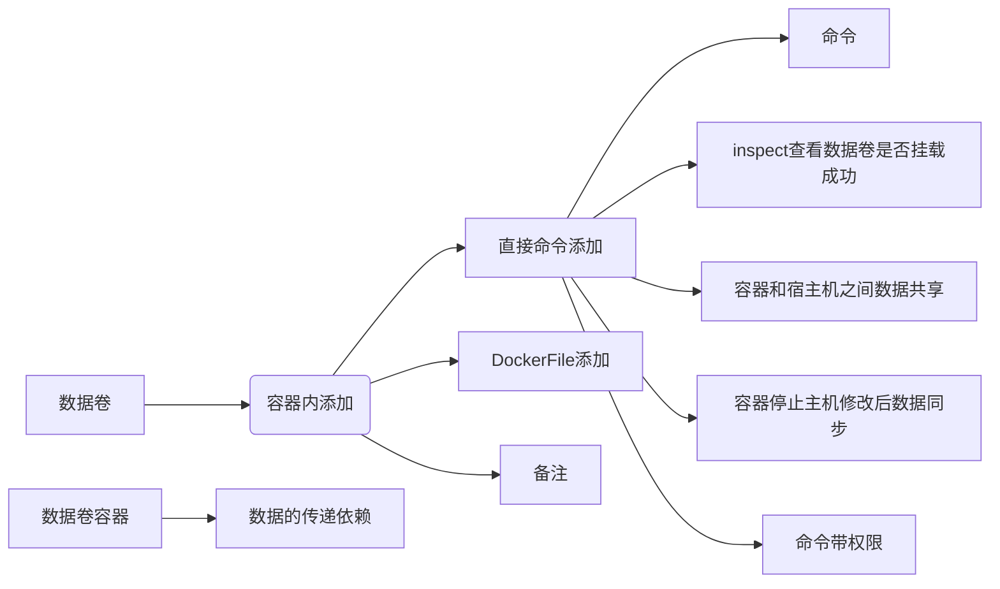

# 1. Centos 7.2

1. 设置允许连接网络： 

   ```shell
   vi /etc/sysconfig/network-scripts/ifcfg-enp0s3  
   #编辑配置文件
   BOOTPROTO=static
   ONBOOT=yes
   
   IPADDR=172.16.40.173
   NETMASK=255.255.255.0
   GATEWAY=172.16.40.1
   DNS1=114.114.114.114
   #重启service
   service network restart
   ```
   
2. 安装软件
   ```shell
   yum install net-tools
   yum install wget
   yum install vim
   yum install ntpdate
   yum -y install lrzsz
   yum -y install gcc
   yum -y install gcc-c++
   ```
卸载旧版本


3. 换源 进入到/etc/yum.repos.d/目录：
   ```shell
   cd /etc/yum.repos.d/
   mv /etc/yum.repos.d/CentOS-Base.repo /etc/yum.repos.d/CentOS-Base.repo.bak
   wget -O /etc/yum.repos.d/CentOS-Base.repo http://mirrors.aliyun.com/repo/Centos-7.repo
   yum clean all
   yum makecache
   #安装epel源
   yum list | grep epel-release
   yum install -y epel-release
   wget -O /etc/yum.repos.d/epel-7.repo http://mirrors.aliyun.com/repo/epel-7.repo
   yum clean all
   yum makecache
   #
   yum repolist enabled
   yum repolist all
   
   ```

4. 修改时间
  
      ```shell
      #改时间
      ntpdate 218.186.3.36
   timedatectl set-timezone Asia/Shanghai
      
      0 */2 * * * /usr/sbin/ntpdate -u ntp.api.bz > /dev/null 2>&1; /sbin/hwclock -w
      #改时区
      SSDB(sequence similarity database)
   ```


# 2. 指令

```shell
#添加一个user的新账号
groupadd user
tail /etc/group
useradd -d /home/user -g 1001 -u 1001 -m -s /bin/bash user
passwd user


#更改文件所属用户组
chown -R user /home/software
chgrp -R user /home/software


#查看端口
netstat命令各个参数说明如下：
　　-t : 指明显示TCP端口
　　-u : 指明显示UDP端口
　　-l : 仅显示监听套接字(所谓套接字就是使应用程序能够读写与收发通讯协议(protocol)与资料的程序)
　　-p : 显示进程标识符和程序名称，每一个套接字/端口都属于一个程序。
　　-n : 不进行DNS轮询，显示IP(可以加速操作)
即可显示当前服务器上所有端口及进程服务，于grep结合可查看某个具体端口及服务情况··
netstat -ntlp   //查看当前所有tcp端口·
netstat -ntulp |grep 80   //查看所有80端口使用情况·
netstat -an | grep 3306   //查看所有3306端口使用情况·
查看一台服务器上面哪些服务及端口
netstat  -lanp
#查看一个服务有几个端口。比如要查看mysqld
ps -ef |grep mysqld
#查看java
jps
查看某一端口的连接数量,比如3306端口
netstat -pnt |grep :3306 |wc
#查看某一端口的连接客户端IP 比如3306端口
netstat -anp |grep 3306
netstat -an 查看网络端口 

#查看文件大小
du -h ftp
#查看磁盘
df -u
#测速
pip install speedtest-cli
运行命令：
speedtest-cli --bytes


lsof -i :port，使用lsof -i :port就能看见所指定端口运行的程序，同时还有当前连接。 

nmap 端口扫描
netstat -nupl  (UDP类型的端口)
netstat -ntpl  (TCP类型的端口)
netstat -anp 显示系统端口使用情况
常用组合：
netstat -lntup 
说明： l:listening   n:num   t:tcp  u:udp  p:process 


#安装lrzsz 
#apt-get install lrzsz
yum -y install lrzsz 
#上传文件，执行命令rz，会跳出文件选择窗口，选择好文件，点击确认即可。
rz
#下载文件，执行命令sz
sz


```


# 3. mysql安装
1. 移除mariadb数据库
      yum remove mariadb-libs.x86_64

2. cd /usr/local/

3. wget https://dev.mysql.com/get/mysql57-community-release-e17-11.noarch.rpm

4. yum localinstall mysql57-community-release-el7-11.noarch.rpm

5. yum install mysql-community-server

6. service muysqld start

7. 查密码cat /var/log/mysqld.log |grep password

8. mysql -uroot -p

9. 输入密码

10. 修改全局参数：
        set global validate_password_policy=0;
        set global validate_password_length=1;

11. 设密码
    SET PASSWORD = PASSWORD('123456');

12. exit

13. iptables -l INPUT 1 -p tcp --dport 3306 -j ACCEPT

14. mysql -uroot -p123456

15. 依次执行如下命令：(添加远程连接)

    use mysql;

    update user set host = '%' where user ='root';

    flush privileges;
    
16. 改字符集

    ```
    show VARIABLES like 'character%';
    修改my.cnf配置文件（mysql配置文件）
    character_set_server = utf8 #设置字符集
    
    
    wget https://repo.mysql.com//mysql80-community-release-el7-3.noarch.rpm
    rpm -ivh mysql80-community-release-el7-3.noarch.rpm
    yum install mysql mysql-server -y
    ```

## 3.1. 使用
1.service mysqld start
2.mysql -uroot -p123456
3.show databases;
4.use [数据库名]
5.show tables;
6.exit


# 4. tomcat

```shell
#tomcat
wget http://mirror.bit.edu.cn/apache/tomcat/tomcat-9/v9.0.20/bin/apache-tomcat-9.0.20.tar.gz
tar -zxvf apache-tomcat-9.0.20.tar.gz

sh /home/software/apache-tomcat-9.0.20/bin/startup.sh
sh /home/software/apache-tomcat-9.0.20/bin/shutdown.sh
ps -ef | grep java

kill -9 1858
lsof -i:8080
#netstat -p | grep 8080
vi /home/software/apache-tomcat-9.0.20/conf/server.xml
tail -100 /home/software/apache-tomcat-9.0.20/logs/catalina.out


mvn spring-boot:run
#mvn install:install-file -Dfile=/home/api-client-1.0.0.jar -DgroupId=org.huawei -DartifactId=api-jar -Dversion=1.0 -Dpackaging=jar
#mvn install:install-file -Dfile=E:\workspaces\OceanConnect_Java_SDK_Demo\lib\api-client-1.0.0.jar -DgroupId=org.huawei -DartifactId=api-jar -Dversion=1.0 -Dpackaging=jar
```


# 5. jdk
1.

```shell
cd /usr/local
mkdir java
cd /usr/local/java   
yum install tar
tar -zxvf jdk1.8.tar.gz
mv jdk1.8 jdk
vim /etc/profile
JAVA_HOME=/usr/local/java/jdk
PATH=$JAVA_HOME/bin:$PATH
CLASSPATH=$JAVA_HOME/jre/lib/ext:$JAVA_HOME/lib/tools.jar
export PATH JAVA_HOME CLASSPATH
source /etc/profile


#jdk
wget https://download.oracle.com/otn/java/jdk/8u211-b12/478a62b7d4e34b78b671c754eaaf38ab/jdk-8u211-linux-x64.tar.gz?AuthParam=1558042901_134f6c4f31ff682567fbd19dbbf85650
mv jdk-8u211-linux-x64.tar.gz?AuthParam=1558042901_134f6c4f31ff682567fbd19dbbf85650  jdk1.8.tar.gz
tar -zxvf jdk1.8.tar.gz
vi /etc/profile
#添加
export JAVA_HOME=/home/software/jdk1.8.0_211
export CLASSPATH=.:$JAVA_HOME/lib/dt.jar:$JAVA_HOME/lib/tools.jar:$JAVA_HOME/jre/lib/rt.jar
export PATH=$JAVA_HOME/bin:$PATH

```


# 6. kafka
1. wget http://apache.fayea.com/kafka/1.1.0/kafka_2.12-1.1.0.tgz
   /usr/local 路径下
2. 解压tar -zxvf kafka_2.12-1.1.0.tgz
   mv kafka_2.12-1.1.0.tgz-1.1.0 kafka
3. 编辑server.properties
vim /usr/local/kafka/config/server.properties

​       添加
​       listeners=PLAINTEXT://172.16.40.173:9092

4. 对外开放 9092端口
  iptables -l INPUT 1 -p tcp --dport 9092 -j ACCEPT

## 6.1. 使用


1. 启动Zookeeper服务器
   cd /usr/local/kafka
   bin/zookeeper-server-start.sh config/zookeeper.properties

2. 启动kafka服务
    cd /usr/local/kafka
    bin/kafka-server-start.sh config/server.properties &
    
    
    
3. 建"test" Topic 只有一个分区和一个备份
  
```shell
cd /usr/local/kafka
bin/kafka-topics.sh --create --zookeeper localhost:2181 --replication-factor 1 --partitions 1 --topic test
```

选项说明：

--topic 定义topic名

--replication-factor  定义副本数

--partitions  定义分区数

kafka0.9以后

```shell
#删除topic
bin/kafka-topics.sh --zookeeper hadoop102:2181 --delete --topic test
#需要server.properties中设置delete.topic.enable=true否则只是标记删除或者直接重启。
#生产者
bin/kafka-console-producer.sh --broker-list 172.16.40.173:9092 --topic test
#消费者
bin/kafka-console-consumer.sh --bootstrap-server 172.16.40.173:9092 --topic test --from-beginning
```


kafka之前

```shell

#发送消息
bin/kafka-console-producer.sh 
--broker-list hadoop102:9092 --topic first
>hello world
>atguigu  atguigu
#消费消息
bin/kafka-console-consumer.sh --zookeeper hadoop102:2181 --from-beginning --topic test
--from-beginning：会把first主题中以往所有的数据都读取出来。根据业务场景选择是否增加该配置。

#查看某个Topic的详情
[atguigu@hadoop102 kafka]$ bin/kafka-topics.sh --zookeeper hadoop102:2181 --describe --topic first

#通过以下命令查看已创建的topic信息
bin/kafka-topics.sh --list --zookeeper localhost:2181 test
#发送消息
bin/kafka-console-producer.sh --broker-list localhost:9092 --topic test
#消费消息
bin/kafka-console-consumer.sh --bootstrap-server localhost:9092 --topic test --from-beginning

```

~~bin/kafka-console-consumer.sh --zookeeper localhost:2181 --topic test --from-beginning~~

```shell
startvm "D:\VM\ubuntu\Ubuntu 16.04.6.vmx"
D:\virtualbox\VBManage.exe startvm centos
D:\virtualbox\VBManage.exe controlvm centos pause(savestate)
D:\virtualbox\VBManage.exe controlvm centos resume
schtasks /create /tn "shutdown" /tr "D:\timetask\shutdown.bat" /sc DAILY /st 16:59
schtasks /create /tn "vmstart" /tr "D:\timetask\vmstart.bat" /sc DAILY /st 08:33
schtasks /create /tn "vmsuspend" /tr "D:\timetask\vmsuspend.bat" /sc DAILY /st 16:58
```
# 7. docker

## 7.1. Docker
leobuskin/ssdb-docker

```shell
#安装docker
   yum remove docker \
                  docker-client \
                  docker-client-latest \
                  docker-common \
                  docker-latest \
                  docker-latest-logrotate \
                  docker-logrotate \
                  docker-selinux \
                  docker-engine-selinux \
                  docker-engine
   yum install -y yum-utils device-mapper-persistent-data lvm2
   yum-config-manager --add-repo http://mirrors.aliyun.com/docker-ce/linux/centos/docker-ce.repo
   yum makecache fast
   yum -y install docker-ce
   #配置docker加速器
   vim /etc/docker/daemon.json
   #编辑json文件
   {
    "registry-mirrors": ["https://czcjm3w6.mirror.aliyuncs.com"]
   }
   systemctl daemon-reload
   systemctl start docker
   systemctl enable docker
   docker version
```

```shell
#忽略 安装Docker维护的版本
sudo apt-get install -y curl
curl -sSL https://get.docker.com/ubuntu/ |sudo sh
docker run ubuntu echo 'Hello world'

使用非root用户：
sudo groupadd docker
sudo gpasswd -a ${USER} docker
sudo service docker restart 
```
## 7.2. docker命令
|                                 命令                                  |                         说明                         |
| --------------------------------------------------------------------- | ---------------------------------------------------- |
| docker images  **--no-trunc**                                         | 显示完整的镜像信息                                     |
| docker pull tomcat:latest                                             |                                                      |
| docker rmi -f $(docker images -qa)                                    | 批量删除                                              |
| docker run -it --name=mycentos0115 {id/name}                          | 启动交互式                                            |
| docker run -d {id/name}                                               | 后台运行容器                                          |
| ctrl+P+Q                                                              |                                                      |
| docker attach {name}                                                  | 附加到交互式容器 重新进入                               |
| docker exec -t {name} ls -l /tmp                                      | 执行任务 不需要进入交互式容器                           |
| docker start 容器ID/name                                              |                                                      |
| docker rm {docker ps -qa}                                             |                                                      |
| docker ps -qa \| xargs docker rm                                      | 删除多个容器                                          |
| docker logs [-f] [-t] [--tail] 容器名                                  | 查看容器日志                                          |
| docker logs -tf --tail 0 dc1                                          |                                                      |
| docker top dc1                                                        | 查看容器进程                                          |
| docker ps                                                             | 查看容器：                                            |
| docker ps -a -l -q只显示编号 -n 3上3条启动信息                          |                                                      |
| docker inspect {id/name}                                              | 查看容器内部细节                                       |
| docker cp {id}:/temp/yum.log /root                                    | 从容器内拷贝文件到主机上                                |
| docker run -it -p 8080:8080 <br/>docker exec -it {id} /bin/bash       |                                                      |
| docker commit -a="zuozhe" -m="tomcat without docs" {id}  mytomcat:1.2 | "提交的描述信息" "作者" 容器ID要创建的目标镜像名:[标签名] |
|                                                                       |                                                      |


容器数据卷:

1. docker cp

2. docker run -it -v /宿主机绝对路径目录:/容器内目录   {name}

   docker run -it centos /bin/bash

docker run -it --name {name} --volumes-from {name} {image}
数据卷的生命周期一直持续至没有容器使用为止

   

   

容器的持久化

容器间继承+共享数据




1. 手动编写一个dockerfile文件，当然，必须要符合file的规范
2. 有这个文件后，直接docker build命令执行，获得一个自定义的镜像
3. run

>maven build
>
>jar
>
>java -jar mession...

### 7.2.1. Dockerfile 

是用来构建docker镜像的构建文件，是由一系列命令和参数构成的脚本。

#### 7.2.1.1. 构建三步骤 

1. 编写dockerfile文件 
2. docker build
3. docker run

#### 7.2.1.2. dockerfile构建过程解析

docker run -it centos /bin/bash

#### 7.2.1.3. dockerfile内容基础知识

1. 每条保留字指令都必须为大写字母且后面要跟随至少一个参数
2. 指令按照从上到下，顺序执行
3. \#表示注释
4. 每条指令都会创建一个新的镜像层，并对镜像进行提交

#### 7.2.1.4. docker执行dockerfile的大致流程

1. docker从基础镜像运行一个容器
2. 执行一条指令并对容器作出修改
3. 执行类似docker commit的操作提交一个新的镜像层
4. docker再基于刚提交的镜像运行一个新容器
5. 执行dockerfile中的下一条指令知道所有指令都执行完成

> 从应用软件的角度来看，dockerfile、docker镜像与docker容器分别代表软件的三个不同阶段
>
> - dockerfile是软件的原材料
> - docker镜像是软件的交付品
> - docker容器则可以认为是软件的运行态

#### 7.2.1.5. dockerfile保留字指令

|||
|----|----|
|FROM|基础镜像，当前新镜像是基于哪个镜像的|
|MAINTAINER|镜像维护者的姓名和邮箱地址|
|RUN|容器构建时需要运行的命令|
|EXPOSE|暴露的端口号|
|WORKDIR|指定在创建容器后，终端默认登录的进来工作目录，一个落脚点|
|ENV|用来在构建镜像过程中设置环境变量|
|ADD|拷贝加解压缩还会自动处理URL|
|COPY|拷贝|
|VOLUME|容器数据卷|
|CMD|指定启动执行命令cmd会被docker run之后的参数替换|
|ENTRYPOINT|同cmd 但会追加|
|ONBUILD|当构建一个被继承的dockerfile时运行命令，父镜像在被子继承后父镜像的onbuild被触发|

```dockerfile
from centos

ENV mypath /tmp
WORKDIR $mypath

RUN yum -y install vim 
RUN yum -y install net-tools

EXPOSE 80

CMD echo $MYPATH
CMD echo "success--------ok"
CMD /bin/bash
```
```shell
docker build -f /mydocker/Dockerfile2 -t mycentos:1.3 .
```

entrypoint

> docker run 之后的参数会被当做参数传递给ENTRYPOINT，之后

以当前dockerfile build新镜像

```shell
docker images mycentos:1.3
docker images mycentos
docker run -it mycentos:1.3
```

 

```dockerfile
FROM centos
MAINTAINER GDZY<gdzy@126.com>
#把宿主机当前上下文的c.txt拷贝到容器/usr/local/路径下
COPY c.txt /usr/local/cincontainer.txt
#把java与tomcat添加到容器中
ADD jdk-8u171-linux-x64.tar.gz /usr/local/
ADD apache-tomcat-9.0.8.tar.gz /usr/local/
#安装vim编辑器
RUN yum -y install vim
#设置工作访问时候的WORKDIR路径，登录落脚点
ENV MYPATH /usr/local
WORKDIR $MYPATH
#配置java与tomcat环境变量
ENV JAVA_HOME /usr/local/jdk1.8.0_171
ENV CLASSPATH $JAVA_HOME/lib/dt.jar:$JAVA_HOME/lib/tools.jar
ENV CATALINA_HOME /usr/local/apache-tomcat-9.0.8
ENV CATALINA_BASE /usr/local/apache-tomcat-9.0.8
ENV PATH $PATH:$JAVA_HOME/bin:$CATALINA_HOME/lib:$CATALINA_HOME/bin
#容器运行时监听的端口
EXPOSE 8080
#启动时运行tomcat
#ENTARYPOINT ["/usr/local/apache-tomcat-9.0.8/bin/startup.sh"]
#CMD ["/usr/local/apache-tomcat-9.0.8/bin/catalina.sh","run"]
CMD /usr/local/apache-tomcat-9.0.8/bin/startup.sh && tail -F /usr/local/apache-tomcat-9.0.8/bin/logs/catalina.out

```
在当前路径有Dockerfile直接构建
docker build -t zzyytomcat9 . 

docker run -d -p 9080:8080 --name myt9 
-v /zzyyuse/mydockerfile/tomcat9/test:/usr/local/apache-tomcat-9.0.8/webapps/test 
-v /zzyyuse/mydockerfile/tomcat9/tomcat9logs/:/usr/local/apache-tomcat-9.0.8/logs 
--privileged=true 
zzyy tomcat9
docker pull mysql:5.6
docker exec {ID} sh -c ' exec mysqldump --all-databases -uroot -p"123456" ' > /zzyyuse/all-databases.sql

docker pull redis:3.2
docker run -p 6379:6379 
-v /zzyyuse/myredis/data:/data
-v /zzyyuse/myredis/conf/redis.conf:/usr/local/etc/redis/redis.conf
-d redis:3.2 redis-server /usr/local/etc/redis/redis.conf
--appendonly yes

docker commit -a zzyy -m "new mycentos1.4 with vim and ifconfig" {ID} mycentos:1.4
把war包丢到宿主机 在丢到container里面丢到tomcat/webapps
docker cp NginxDemo.war {ID} :/usr/local/tomcat/webapps


```shell
#启动交互式容器
docker run -it ubuntu /bin/bash
--name=container01

#附加到交互式容器
docker attach {name}
#查看容器：
docker ps 
docker ps -a -l -q只显示编号 -n 3上3条启动信息
#最新
-l

#重新启动已停止容器
docker start [-i] 容器名
#删除已经停止容器
docker rm [容器名]
```

```shell
#启动守护式容器
docker run --name dc1 -d ubuntu /bin/sh -c "while true;do echo hello world;sleep 2;done"
#查看容器日志
docker logs [-f] [-t] [--tail] 容器名
docker logs -tf --tail 0 dc1
#查看容器进程
docker top dc1
#在运行中容器进行多个进程
docker exec -i -t dc1 /bin/bash
#停止守护式容器
docker stop 容器名
docker kill 容器名
```

Nginx部署流程

1. 创建映射80端口的交互式容器
2. 安装Nginx
3. 安装文本编辑器vim
4. 创建静态页面
5. 修改Nginx配置文件
6. 运行Nginx
7. 验证网站访问

```shell
#设置容器的端口映射
docker run -p 80 --name web -i -t ubuntu /bin/bash
apt-get install -y nginx
apt-get install -y vim
mkdir -p /var/www/html
cd /var/www/html
vim index.html
whereis nginx
ls /etc/nginx/sites-enabled
vim default
改root /var/www/html
#查看端口映射情况
docker port web
curl http://ip:映射端口
docker inspect看IPAddress
#启动（重启容器时ip和端口可能变化）
docker exec web nginx
```
#### 7.2.1.6. ubuntu18.04安装docker
开始安装doker
由于apt官方库里的docker版本可能比较旧，所以先卸载可能存在的旧版本：
sudo apt-get remove docker docker-engine docker-ce docker.io
 

更新apt包索引：
sudo apt-get update
 

安装以下包以使apt可以通过HTTPS使用存储库（repository）：
sudo apt-get install -y apt-transport-https ca-certificates curl software-properties-common
 

添加Docker官方的GPG密钥：
curl -fsSL https://download.docker.com/linux/ubuntu/gpg | sudo apt-key add -
 

这个时间点（2018.06.09），Ubuntu 18.04 LTS (Bionic Beaver) 对应的docker package is not available，所以只能通过下面的语句安装stable存储库
add-apt-repository "deb [arch=amd64] https://download.docker.com/linux/ubuntu artful stable" 
不能使用下面的语句，我就踩了很多坑，很多博客都推荐下面的语句，这样就会导出docker-ce安装不上

sudo add-apt-repository "deb [arch=amd64] https://download.docker.com/linux/ubuntu $(lsb_release -cs) stable"
 

再更新一下apt包索引：
sudo apt-get update
 

安装最新版本的Docker CE：
sudo apt-get install -y docker-ce
**xmind**

# 8. git

0）安装依赖软件
[root@uatjenkins01 ~]# yum install curl-devel expat-devel gettext-devel openssl-devel zlib-devel asciidoc
[root@uatjenkins01 ~]# yum install  gcc perl-ExtUtils-MakeMaker
 
1）卸载系统自带的底版本git（1.7.1）
[root@uatjenkins01 ~]# git --version
git version 1.7.1
[root@uatjenkins01 ~]# yum remove git
  
2）编译安装最新的git版本
[root@uatjenkins01 ~]# cd /usr/local/src/
[root@uatjenkins01 src]# wget https://www.kernel.org/pub/software/scm/git/git-2.15.1.tar.xz
[root@uatjenkins01 src]# tar -vxf git-2.15.1.tar.xz
[root@uatjenkins01 src]# cd git-2.15.1
[root@uatjenkins01 git-2.15.1]# make prefix=/usr/local/git all
[root@uatjenkins01 git-2.15.1]# make prefix=/usr/local/git install
[root@uatjenkins01 git-2.15.1]# echo "export PATH=$PATH:/usr/local/git/bin" >> /etc/profile
[root@uatjenkins01 git-2.15.1]# source /etc/profile
  
[root@uatjenkins01 ~]# git --version
git version 2.15.1

# 9. vscode

> IdentityFile  C:\Users\fineg\.ssh\id_rsa

安装oh-my-zsh（自动）
sh -c "$(curl -fsSL https://raw.githubusercontent.com/robbyrussell/oh-my-zsh/master/tools/install.sh)"
1. ssh-keygen -t rsa -b 4096 -f C:\Users\fineg\.ssh\id_rsa
2. ssh-copy-id -i id_rsa.pub 19.110.1.99
> cat id_rsa.pub >> authorized_keys
> authorized_keys
18.04默认root不开启ssh

修改SSH配置文件

 　命令：sudo vim /etc/ssh/sshd_config，找到PermitRootLogin without-password 修改为PermitRootLogin yes

重启SSH服务

　命令：service ssh restart
