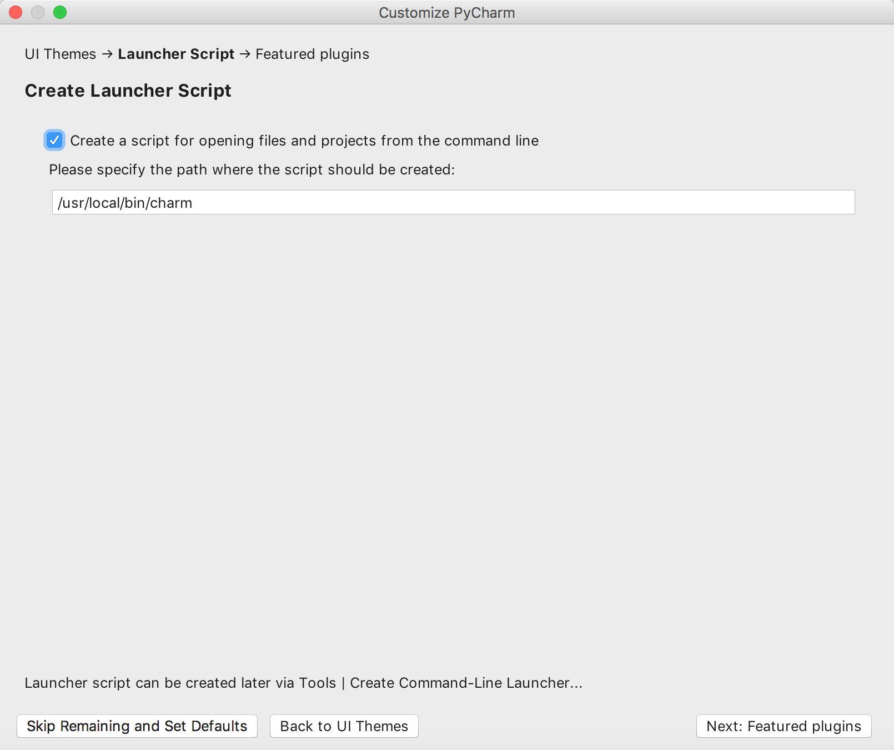
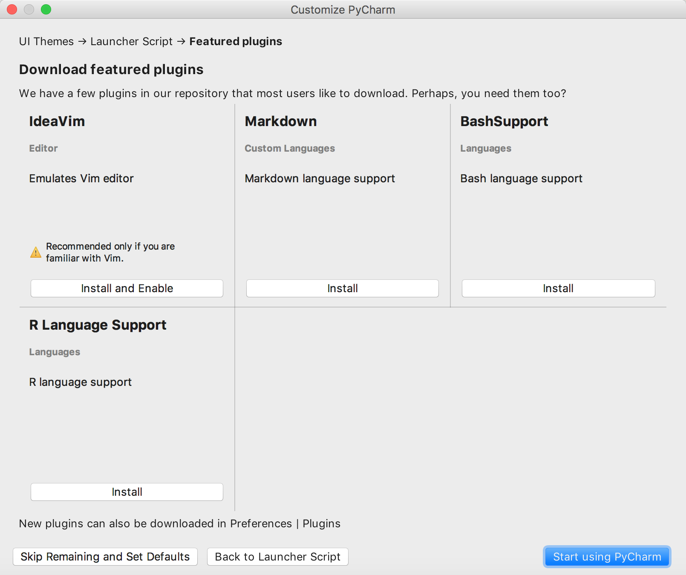
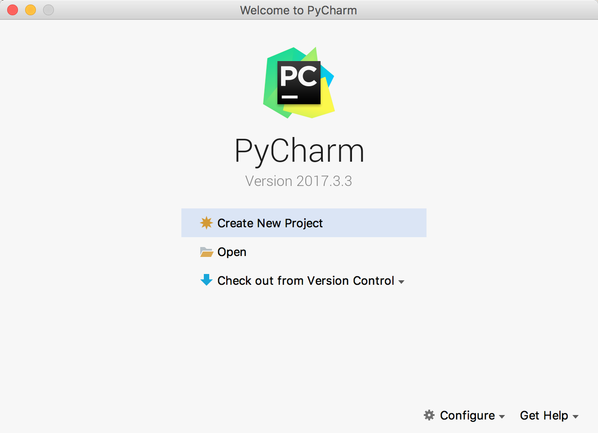
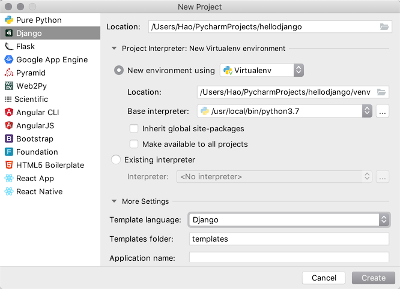

```shell
conda config --show
 
conda config --set auto_activate_base False
```


# 1. 玩转PyCharm

PyCharm是由JetBrains公司开发的提供给Python专业的开发者的一个集成开发环境，它最大的优点是能够大大提升Python开发者的工作效率，为开发者集成了很多用起来非常顺手的功能，包括代码调试、高亮语法、代码跳转、智能提示、自动补全、单元测试、版本控制等等。此外，PyCharm还提供了对一些高级功能的支持，包括支持基于Django框架的Web开发、。

### 1.1.1. PyCharm的安装

可以在[JetBrains公司的官方网站]()找到PyCharm的[下载链接](https://www.jetbrains.com/pycharm/download/)，有两个可供下载的版本一个是社区版一个是专业版，社区版在[Apache许可证](https://zh.wikipedia.org/wiki/Apache%E8%AE%B8%E5%8F%AF%E8%AF%81)下发布，专业版在专用许可证下发布（需要购买授权下载后可试用30天），其拥有许多额外功能。安装PyCharm需要有JRE（Java运行时环境）的支持，如果没有可以在安装过程中选择在线下载安装。

> 说明：如果你是一名学生，希望购买PyCharm来使用，可以看看[教育优惠官方申请指南](https://sales.jetbrains.com/hc/zh-cn/articles/207154369)。

### 1.1.2. 首次使用的设置

第一次使用PyCharm时，会有一个导入设置的向导，如果之前没有使用PyCharm或者没有保存过设置的就直接选择“Do not import settings”进入下一步即可。


专业版的PyCharm是需要激活的，**强烈建议为优秀的软件支付费用**，如果不用做商业用途，我们可以暂时选择试用30天或者使用社区版的PyCharm。


 接下来是选择UI主题，这个可以根据个人喜好进行选择。


 再接下来是创建可以在终端（命令行）中使用PyCharm项目的启动脚本，当然也可以直接跳过这一步。



然后可以选择需要安装哪些插件，我们可以暂时什么都不安装等需要的时候再来决定。



### 1.1.3. 配置解析器，将PyCharm与Python环境连接起来

File->Settings->Project Interpreter(Add Conda Environment python.exe)

### 1.1.4. 用PyCharm创建项目

点击上图中的“Start using PyCharm”按钮就可以开始使用PyCharm啦，首先来到的是一个欢迎页，在欢迎页上我们可以选择“创建新项目”、“打开已有项目”和“从版本控制系统中检出项目”。



如果选择了“Create New Project”来创建新项目就会打一个创建项目的向导页。


在如上图所示的界面中，我们可以选择创建项目的模板，包括了纯Python项目、基于各种不同框架的Web项目、Web前端项目、跨平台项目等各种不同的项目模板。如果选择Python的项目，那么有一个非常重要的设定是选择“New environment…”（创建新的虚拟环境）还是使用“Existing Interpreter”（已经存在的解释器）。前者肯定是更好的选择，因为新的虚拟环境不会对系统环境变量中配置的Python环境造成影响，简单举个例子就是你在虚拟环境下安装或者更新了任何三方库，它并不会对系统原有的Python解释器造成任何的影响，但代价是需要额外的存储空间来建立这个虚拟环境。

项目创建完成后就可以开始新建各种文件来书写Python代码了。


在工作窗口的右键菜单中可以找到“Run ...”和“Debug ...”菜单项，通过这两个菜单项我们就可以运行和调试我们的代码啦。建议关注一下菜单栏中的“Code”、“Refactor”和“Tools”菜单，这里面为编写Python代码提供了很多有用的帮助。

### 1.1.5. 创建Django项目

#### 1.1.5.1. 专业版

PyCharm专业版提供了对Django、Flask、Google App Engine、web2py等Python Web框架以及SQL、UML、前端语言和框架、远程调试、虚拟化部署等功能的支持，如果使用PyCharm专业版，在创建项目时可以直接选择创建Django项目并设置模板语言以及放置模板页的文件夹。



创建好项目之后，打开终端输入`pip list`命令，可以看到项目所需的依赖项已经安装好了，而且可以直接点击屏幕右上方的运行或调试按钮来直接运行Django项目。


#### 1.1.5.2. 社区版

PyCharm社区版只能创建Python项目，如果项目中需要Django的支持，可以自行安装依赖库并创建Django项目。


创建好Python项目之后，可以打开屏幕下方的终端（Terminal），并通过`pip install`安装Django项目的依赖项。


当然也可以在项目的设置菜单中找到解释器配置，并选择要添加的依赖项。


接下来可以在终端中输入`django-amdin startproject`指令来创建项目。


如果要运行项目，可以在终端中输入`python manage.py runserver`启动测试服务器。当然，也可以点击屏幕右上方的“Add Configuration”按钮，进入如下所示的配置界面，并点击窗口左上角的“+”来添加一个运行配置。


在配置窗口的右侧，指定要执行的脚本路径（Django项目的manage.py文件的位置）和运行参数（runserver）。


注意到窗口的右上角了吗？现在可以点击运行或调试按钮来启动测试服务器运行项目了。


### 1.1.6. 优点

1. 方便的环境管理
  因为平时跑代码会有很多环境，结合Anaconda，会有tensorflow,pytorch, keras等等之类好的环境，Pycharm可以为当前项目指定环境，File→setting→Project Interpreter→ 选择自己的环境

2. 自动导入包

  - 这点主要是相比于VS Code，因为前几天一直想用用VS Code, 一通折腾之后，发现对于python代码编写，暂时没有这个功能o(╥﹏╥)o
  - Pycharm 可以通过Alt + Enter（visual studio快捷键下），自动导入包

3. 方便的代码调试

  - 最让我喜欢的就是这点, 通过设置Keymap 为 Visual Studio,
    - Ctrl + F5 run，
    - Alt +F5 Debug,
    - F10 step over(遇见函数，不进去)，
    - F11 step into(代码执行过程中，遇见函数，进入)，
    - shift + F11 step out(从当前函数跳出)，
    - F5 运行到下一断点（如果有断点的话）
    - 还有一点就是，程序在Debug下，可以通过
      　进入Console窗口，交互式运行，和运行代码共享变量空间（意思是所有出现的变量，你都可以访问，有没有想到一些好用的功能），如下图红框所示：

  

4. Git管理
  可以通过File→ setting →Version Control 做版本控制，设置登录之后的Login 和 Password，之后可以很方便的commit.
### 1.1.7. 缺点
- 刚开始打开，索引包较慢(写这篇博客时，打开Pycharm，电脑卡的要死中-_-)
  内存占用太高（电脑内存小的（4G），打开之后，内存直接占用70-80%）

- 使用Pycharm的时候，使用from引入自己模块报错
  原因
  pycharm不会将当前文件目录自动加入自己的sourse_path。右键make_directory as–>sources path将当前工作的文件夹加入source_path就可以了。

​        解决方案 右键文件夹，make_directory as --> sources path 将当前工作的文件夹加入source_path

### 1.1.8. Pycharm

PyCharm

sublime

**anaconda prompt**

\>>>conda create --name newpy36 python=3.6

\>>>activate newpy36

---deactive newpy36

pandas做数据处理与分析

机器学习：

统计、线性代数、微积分

python

打开界面：命令行执行jupyter notebook

python

网站、爬虫、大数据处理、机器学习

print（'hello,world'）

import this

%matplotlib inline

import  matplotlib.pyplot as plt

x=[1,2,3,4]

y=[5,4,3,2]

plt.figure()

plt.subplot(221)

plt.plot(x,y)

plt.subplot(222)

plt.bar(x,y)

plt.subplots_adjust(wspace=0)

plt.show()


import requests,re,json

from pandas import DataFrame,Series

url=u'<http://data.stats.gov.cn/search.htm?s=CPI&m=searchdata&db=&p=0>'

res=requests.get(url)

pat=[re.compile(r'result](http://re.compile(r'result/)":(\[.*?\])',re.S)

m=pat.search(res.text)

if m:

​    print('success')

m

tt=json.loads(m.group(1))

frame=DataFrame(tt)

frame

success

\>python test.py

变量类型

1.字符串str

2.数字int float complex

3.列表list

4.元组 tuple

5.字典dict

import math

math.pow(10,2)

math.floor(2.1)2

math.ceil(2.1)3

math.radians(100)度的转换

min(10,12,234)

max(10,12,234)

sum([10,12,234])367

divmod(10,3)(3,1)商和余数

--bool型

True == 1

False == 0

True + 10 #11

True and False

True or False

not True

--字符串

line_1 = "ni hao"

line_2 = "xiaojiejie"

line_1+line_2  'ni haoxiaojiejie'

line = 'nihao '

line * 3

len(line)

id(line)返回一个身份识别符，可以理解为一个变量的内存地址#字符串是不可变类型的变量

line中原先指向的字符地址没有改变

切片

line ='huan ying da jia lai wan '

\#取前十个字符

line[0:10]

**line[0:10:2]每俩个取一个**

**line[-10:]取后十个**

**line[::-1]翻转字符**

序列 列表是一种容器型的序列；字符串是一种扁平型的序列

**单字符line[-1]**

line.center(20,'%')居中两端用''填满

line.count('A')计数

line.endswith('F')匹配是否已XX结尾

line.startswith('F')匹配是否已XX开始

line.find('A')寻找XX字符的下标 找不到返回-1

line.index('A')寻找XX字符的下标 找不到报错

line.upper()

line.lower()

line.capitalize()'Huan ying da jia lai wan '

line.istitle()

line.isupper() line.islower()

line.strip()去空格line.rstrip() line.ltrip()

line.swapcase()大小写颠倒

都是生成新字符 原字符不变

--列表--列表是可变类型的

varibals = [1,2,3，‘hello,python’,[100,100]]

varibals.append(1)

varibals.append('ni hao')

python是一种动态类型的语言，一个变量是什么类型要看程序在运行过程中变量所代表的的值是什么

varibals + [1,23]

varibals[-2:]

len(varibals)

varibals.clear()

varibals..copy()

a.extend(b)拼接

a.insert(0,100)

a.pop(0)弹出

a.remove(23)删除第一个匹配的

a.sort(reverse=True)默认升序reverse=True降序

a.reverse()翻转

4 in a判断是否存在

--元组 tuple不可变的序列

var= tuple()

var= ()

type(var)#tuple

var.count(1)计数

var.index()

--字典类型

var= {}

var= dict{}

type(var)#dict

var={

​     '中':100,

​     '左':200

}

var['中']

拉锁函数

new_var= list(zip[words,location])

dict(new_var)列表转换为字典

students= ['a','s','d']

money= dict.fromkeys[students,10]给初值

money['a']访问字典中的值

a= money.get('f",100)如果找不到赋个值

money.keys()

money.values()

money.items()拆成单个

money.pop('a')删除操作

money['g']= 10增加

money.setdefault('haha',1000)

Out[2]:


|      | data  | db       | exp                                                          | prank    | rank | reg  | report                      | sj        | zb                               |
| ---- | ----- | -------- | ------------------------------------------------------------ | -------- | ---- | ---- | --------------------------- | --------- | -------------------------------- |
| 0    | 102.0 | 年度数据 | 居民消费价格指数是反映一定时期内城乡居民所购买的生活消费品和服务项目价格变动趋势和程度的相对... | 0.001629 | 151  | 全国 | cn=C01&zb=A0901&sj=2016     | 2016年    | 居民消费价格指数(上年=100)       |
| 1    | 101.4 | 年度数据 | 居民消费价格指数是反映一定时期内城乡居民所购买的生活消费品和服务项目价格变动趋势和程度的相对... | 0.001629 | 151  | 全国 | cn=C01&zb=A0901&sj=2015     | 2015年    | 居民消费价格指数(上年=100)       |
| 2    | 102.9 | 月度数据 |                                                              | 0.001831 | 151  | 全国 | cn=A01&zb=A010101&sj=201802 | 2018年2月 | 居民消费价格指数(上年同月=100)   |
| 3    | 101.2 | 月度数据 |                                                              | 0.001631 | 140  | 全国 | cn=A01&zb=A010301&sj=201802 | 2018年2月 | 居民消费价格指数(上月=100)       |
| 4    | 627.5 | 年度数据 | 居民消费价格指数是反映一定时期内居民所消费商品及服务项目的价格水平变动趋势和变动程度。取自统... | 0.001829 | 140  | 全国 | cn=C01&zb=A0902&sj=2016     | 2016年    | 居民消费价格指数(1978=100)       |
| 5    | 615.2 | 年度数据 | 居民消费价格指数是反映一定时期内居民所消费商品及服务项目的价格水平变动趋势和变动程度。取自统... | 0.001829 | 140  | 全国 | cn=C01&zb=A0902&sj=2015     | 2015年    | 居民消费价格指数(1978=100)       |
| 6    | 102.2 | 月度数据 |                                                              | 0.001831 | 140  | 全国 | cn=A01&zb=A010201&sj=201802 | 2018年2月 | 居民消费价格指数(上年同期=100)   |
| 7    | 102.1 | 年度数据 | 城市居民消费价格指数是反映一定时期内城市居民家庭所购买的生活消费品价格和服务项目价格变动趋势... | 2.001829 | 140  | 全国 | cn=C01&zb=A0901&sj=2016     | 2016年    | 城市居民消费价格指数(上年=100)   |
| 8    | 101.5 | 年度数据 | 城市居民消费价格指数是反映一定时期内城市居民家庭所购买的生活消费品价格和服务项目价格变动趋势... | 2.001829 | 140  | 全国 | cn=C01&zb=A0901&sj=2015     | 2015年    | 城市居民消费价格指数(上年=100)   |
| 9    | 101.9 | 年度数据 | 农村居民消费价格指数是反映一定时期内农村居民家庭所购买的生活消费品价格和服务项目价格变动趋势... | 2.001829 | 140  | 全国 | cn=C01&zb=A0901&sj=2016     | 2016年    | 农村居民消费价格指数(上年=100)   |
| 10   | 101.3 | 年度数据 | 农村居民消费价格指数是反映一定时期内农村居民家庭所购买的生活消费品价格和服务项目价格变动趋势... | 2.001829 | 140  | 全国 | cn=C01&zb=A0901&sj=2015     | 2015年    | 农村居民消费价格指数(上年=100)   |
| 11   | 104.4 | 月度数据 | 2001-至今，食品指可供人类食用或饮用的物质，包括加工食品，半成品和未加工食品，不包括烟草... | 2.001831 | 140  | 全国 | cn=A01&zb=A010303&sj=201802 | 2018年2月 | 食品类居民消费价格指数(上月=100) |
| 12   |       | 月度数据 | 城市居民消费价格指数是反映一定时期内城市居民家庭所购买的生活消费品价格和服务项目价格变动趋势... | 2.001831 | 140  | 全国 | cn=A01&zb=A010305&sj=201802 | 2018年2月 | 城市居民消费价格指数(上月=100)   |
| 13   | 676.5 | 年度数据 | 城市居民消费价格指数是反映一定时期内城市居民家庭所购买的生活消费品价格和服务项目价格变动趋势... | 2.002029 | 140  | 全国 | cn=C01&zb=A0902&sj=2016     | 2016年    | 城市居民消费价格指数(1978=100)   |
| 14   | 662.6 | 年度数据 | 城市居民消费价格指数是反映一定时期内城市居民家庭所购买的生活消费品价格和服务项目价格变动趋势... | 2.002029 | 140  | 全国 | cn=C01&zb=A0902&sj=2015     | 2015年    | 城市居民消费价格指数(1978=100)   |


语句后加？出现函数解释 l显示行号 m为markdown shift+enter运行

### 1.1.9. python

```python

条件判断
if total_cost>50:
elif total_cost>30:
else:
else elif可有可无
空值为False 有值为True
断言
assert age== 18,'错误信息'不是就报错
循环
for 循环 -遍历循环
while 循环-条件循环

for cost incousts:
print('消费（）元'.format(str(cost).center(10)))

import random
#random.randint(1,10)整数
random_number = []
while len(random_numbers)<=20：
random_numbers.append(random.randint(1,10))
print(random_numbers,len(random_numbers))

for i in range(20)：同理
当循环的条件与数量没有关系时必须用while
print(,end/='\r')
元组中只有1个元素时类型设定元组类型
单元素元组（1,）
for number in random_numbers:
if numer % 2 ==0:
print ('偶数')
else:
print('奇数')
循环中的else：如果在循环过程中没有碰到break语句，就会执行else里的语句
continue break

for循环可以构建推导式
random_numbers= list(range(10))
new_numbers= []
for number in random_numbers:
new_numbers.append(number*10)
new_numbers

new_bumbers= [number*10 for number in random_numbers]
字典推导式
dict_numbers= {number:'A' for number in random_numbers}
生成器
tuple_numbers= (number*10 for number in random_numbers)
tuple(tuple_numbers)

--函数
[key for key,value in varibal.items() if value== 100]


def get_keys(dict_varibal,value):
return [k for k,vin varibal.items() if v== value]
get_keys[varibal,200]
1位置参数 2关键字参数，可以不按照顺序去写
参数的收集
def test(name,age,*args,**kargs):*位置参数 **关键字参数
print(name,age,*args,**kargs)
装饰器
可以把函数赋值给一个变量
函数可以当做函数的返回值进行返回
import random
random.random()
#返回一个从0到1的浮点值
@decorator
def test():
return random.random()
@decorator
def test_two():
return random.random()*10
#函数返回的浮点值保留三个有效数字
语法糖，装饰器
def decorator(func):
def wrapper(*args,**kargs)
#do something
return round(func(*args,**kargs),3)
return wrapper
test()

--类
class Person:
def __init__(self,name,age):
self._name= name
self._age= age
@property
def name(self):
return self._name
def rename(self,new_name):
self.name= new_name
p= Person('wan',12)
p.name#不用加括号
p.getname#普通
class Student(Person):
# pass#代表什么都不做，只是占个位
def self_score(self,score):
self._score= score
def get_score(self):
return self._score
初始化函数中self后面实例对象属性，加下划线表示属性私有
```

### 1.1.10. Jupyter notebook使用说明

pycharm

project interpreter Add


**1、创建新的ipynb文件**


按照视频教程，win系统的学员通过cmd打开命令行，输入jupyter notebook命令，通过jupyter notebook打开该文件夹，单击显示的ipynb格式的文件，即可进行代码编辑，此外，通过右上方的New按钮，选择Python3解释器【选择自己的解释器】，可以创建一个新的ipynb文件。

若是mac系统，则不通过cmd打开notebook，通过打开终端，将当前路径进行切换到感兴趣的ipynb文件所在的文件夹下，输入jupyter notebook命令，则也可以通过Jupyter notebook打开打开该文件夹。

**2、修改ipynb文件的名字**


打开一个ipynb文件后，可以单击1表示的红框名称，打开白色的框后，在2表示的红框位置输入适合的文件名字，单击3表示的红框，即可修改ipynb文件的名称。

**3、将ipynb文件保存为html文件**


第一步点击file文件按钮，第二步点击Download as，第三步选择HTML，然后保存即可。

**4、Jupyter notebook界面功能介绍**


In [ ]表示一个代码cell，每个cell里写的是代码

(1)+：表示在选中的cell的下方添加一个新的cell

(2)上箭头：表示将选中的cell往上移动

(3)下箭头：表示将选中的cell往下移动

(4)三角Run：表示运行选中的cell代码，也可以通过快捷键shift+enter来运行cell，当cell中的代码运行完毕后，则左侧会显示In[数字]。

(5)黑色方块：表示停止运行当前的cell，一般会用在当cell的左侧显示为In[*]的时候，*表示该cell在执行，其他的cell则处于阻塞状态

**5、编码cell和描述cell**


当cell前面有In [] 时，表示该cell是代码cell，表示这个cell主要用来编写代码。

当cell前面没有In []时，表示该cell是描述cell，表示这个cell主要用来用来进行文字描述。

红框位置，通过下拉按钮可以展开里面的选项，通过Code可以将选中的cell切换为代码cell，通过Markdown可以将选中的cell切换为描述cell。

 


# 2. DAY-11 文件和异常

在实际开发中，常常需要对程序中的数据进行[持久化](https://baike.baidu.com/item/%E6%95%B0%E6%8D%AE%E6%8C%81%E4%B9%85%E5%8C%96)操作，而实现数据持久化最直接简单的方式就是将数据保存到文件中。说到“文件”这个词，可能需要先科普一下关于[文件系统](https://zh.wikipedia.org/wiki/%E6%96%87%E4%BB%B6%E7%B3%BB%E7%BB%9F)的知识，对于这个概念，维基百科上给出了很好的诠释，这里不再浪费笔墨。

在Python中实现文件的读写操作其实非常简单，通过Python内置的`open`函数，我们可以指定文件名、操作模式、编码信息等来获得操作文件的对象，接下来就可以对文件进行读写操作了。这里所说的操作模式是指要打开什么样的文件（字符文件还是二进制文件）以及做什么样的操作（读、写还是追加），具体的如下表所示。

| 操作模式 | 具体含义                         |
| -------- | -------------------------------- |
| `'r'`    | 读取 （默认）                    |
| `'w'`    | 写入（会先截断之前的内容）       |
| `'x'`    | 写入，如果文件已经存在会产生异常 |
| `'a'`    | 追加，将内容写入到已有文件的末尾 |
| `'b'`    | 二进制模式                       |
| `'t'`    | 文本模式（默认）                 |
| `'+'`    | 更新（既可以读又可以写）         |

下面这张图来自于[菜鸟教程](http://www.runoob.com)网站，它展示了如果根据应用程序的需要来设置操作模式。


### 2.1.1. 读写文本文件

读取文本文件时，需要在使用`open`函数时指定好带路径的文件名（可以使用相对路径或绝对路径）并将文件模式设置为`'r'`（如果不指定，默认值也是`'r'`），然后通过`encoding`参数指定编码（如果不指定，默认值是None，那么在读取文件时使用的是操作系统默认的编码），如果不能保证保存文件时使用的编码方式与encoding参数指定的编码方式是一致的，那么就可能因无法解码字符而导致读取失败。下面的例子演示了如何读取一个纯文本文件。

```Python
def main():
    f = open('致橡树.txt', 'r', encoding='utf-8')
    print(f.read())
    f.close()


if __name__ == '__main__':
    main()
```

请注意上面的代码，如果`open`函数指定的文件并不存在或者无法打开，那么将引发异常状况导致程序崩溃。为了让代码有一定的健壮性和容错性，我们可以使用Python的异常机制对可能在运行时发生状况的代码进行适当的处理，如下所示。

```Python
def main():
    f = None
    try:
        f = open('致橡树.txt', 'r', encoding='utf-8')
        print(f.read())
    except FileNotFoundError:
        print('无法打开指定的文件!')
    except LookupError:
        print('指定了未知的编码!')
    except UnicodeDecodeError:
        print('读取文件时解码错误!')
    finally:
        if f:
            f.close()


if __name__ == '__main__':
    main()
```

在Python中，我们可以将那些在运行时可能会出现状况的代码放在`try`代码块中，在`try`代码块的后面可以跟上一个或多个`except`来捕获可能出现的异常状况。例如在上面读取文件的过程中，文件找不到会引发`FileNotFoundError`，指定了未知的编码会引发`LookupError`，而如果读取文件时无法按指定方式解码会引发`UnicodeDecodeError`，我们在`try`后面跟上了三个`except`分别处理这三种不同的异常状况。最后我们使用`finally`代码块来关闭打开的文件，释放掉程序中获取的外部资源，由于`finally`块的代码不论程序正常还是异常都会执行到（甚至是调用了`sys`模块的`exit`函数退出Python环境，`finally`块都会被执行，因为`exit`函数实质上是引发了`SystemExit`异常），因此我们通常把`finally`块称为“总是执行代码块”，它最适合用来做释放外部资源的操作。如果不愿意在`finally`代码块中关闭文件对象释放资源，也可以使用上下文语法，通过`with`关键字指定文件对象的上下文环境并在离开上下文环境时自动释放文件资源，代码如下所示。

```Python
def main():
    try:
        with open('致橡树.txt', 'r', encoding='utf-8') as f:
            print(f.read())
    except FileNotFoundError:
        print('无法打开指定的文件!')
    except LookupError:
        print('指定了未知的编码!')
    except UnicodeDecodeError:
        print('读取文件时解码错误!')


if __name__ == '__main__':
    main()
```

除了使用文件对象的`read`方法读取文件之外，还可以使用`for-in`循环逐行读取或者用`readlines`方法将文件按行读取到一个列表容器中，代码如下所示。

```Python
import time


def main():
    # 一次性读取整个文件内容
    with open('致橡树.txt', 'r', encoding='utf-8') as f:
        print(f.read())

    # 通过for-in循环逐行读取
    with open('致橡树.txt', mode='r') as f:
        for line in f:
            print(line, end='')
            time.sleep(0.5)
    print()

    # 读取文件按行读取到列表中
    with open('致橡树.txt') as f:
        lines = f.readlines()
    print(lines)
    

if __name__ == '__main__':
    main()
```

要将文本信息写入文件文件也非常简单，在使用`open`函数时指定好文件名并将文件模式设置为`'w'`即可。注意如果需要对文件内容进行追加式写入，应该将模式设置为`'a'`。如果要写入的文件不存在会自动创建文件而不是引发异常。下面的例子演示了如何将1-9999之间的素数分别写入三个文件中（1-99之间的素数保存在a.txt中，100-999之间的素数保存在b.txt中，1000-9999之间的素数保存在c.txt中）。

```Python
from math import sqrt


def is_prime(n):
    """判断素数的函数"""
    assert n > 0
    for factor in range(2, int(sqrt(n)) + 1):
        if n % factor == 0:
            return False
    return True if n != 1 else False


def main():
    filenames = ('a.txt', 'b.txt', 'c.txt')
    fs_list = []
    try:
        for filename in filenames:
            fs_list.append(open(filename, 'w', encoding='utf-8'))
        for number in range(1, 10000):
            if is_prime(number):
                if number < 100:
                    fs_list[0].write(str(number) + '\n')
                elif number < 1000:
                    fs_list[1].write(str(number) + '\n')
                else:
                    fs_list[2].write(str(number) + '\n')
    except IOError as ex:
        print(ex)
        print('写文件时发生错误!')
    finally:
        for fs in fs_list:
            fs.close()
    print('操作完成!')


if __name__ == '__main__':
    main()
```

### 2.1.2. 读写二进制文件

知道了如何读写文本文件要读写二进制文件也就很简单了，下面的代码实现了复制图片文件的功能。

```Python
def main():
    try:
        with open('guido.jpg', 'rb') as fs1:
            data = fs1.read()
            print(type(data))  # <class 'bytes'>
        with open('吉多.jpg', 'wb') as fs2:
            fs2.write(data)
    except FileNotFoundError as e:
        print('指定的文件无法打开.')
    except IOError as e:
        print('读写文件时出现错误.')
    print('程序执行结束.')


if __name__ == '__main__':
    main()
```

### 2.1.3. 读写JSON文件

通过上面的讲解，我们已经知道如何将文本数据和二进制数据保存到文件中，那么这里还有一个问题，如果希望把一个列表或者一个字典中的数据保存到文件中又该怎么做呢？答案是将数据以JSON格式进行保存。JSON是“JavaScript Object Notation”的缩写，它本来是JavaScript语言中创建对象的一种字面量语法，现在已经被广泛的应用于跨平台跨语言的数据交换，原因很简单，因为JSON也是纯文本，任何系统任何编程语言处理纯文本都是没有问题的。目前JSON基本上已经取代了XML作为异构系统间交换数据的事实标准。关于JSON的知识，更多的可以参考[JSON的官方网站](http://json.org)，从这个网站也可以了解到每种语言处理JSON数据格式可以使用的工具或三方库，下面是一个JSON的简单例子。

```JSON
{
    "name": "骆昊",
    "age": 38,
    "qq": 957658,
    "friends": ["王大锤", "白元芳"],
    "cars": [
        {"brand": "BYD", "max_speed": 180},
        {"brand": "Audi", "max_speed": 280},
        {"brand": "Benz", "max_speed": 320}
    ]
}
```

可能大家已经注意到了，上面的JSON跟Python中的字典其实是一样一样的，事实上JSON的数据类型和Python的数据类型是很容易找到对应关系的，如下面两张表所示。

| JSON                | Python       |
| ------------------- | ------------ |
| object              | dict         |
| array               | list         |
| string              | str          |
| number (int / real) | int / float  |
| true / false        | True / False |
| null                | None         |

| Python                                 | JSON         |
| -------------------------------------- | ------------ |
| dict                                   | object       |
| list, tuple                            | array        |
| str                                    | string       |
| int, float, int- & float-derived Enums | number       |
| True / False                           | true / false |
| None                                   | null         |

我们使用Python中的json模块就可以将字典或列表以JSON格式保存到文件中，代码如下所示。

```Python
import json


def main():
    mydict = {
        'name': '骆昊',
        'age': 38,
        'qq': 957658,
        'friends': ['王大锤', '白元芳'],
        'cars': [
            {'brand': 'BYD', 'max_speed': 180},
            {'brand': 'Audi', 'max_speed': 280},
            {'brand': 'Benz', 'max_speed': 320}
        ]
    }
    try:
        with open('data.json', 'w', encoding='utf-8') as fs:
            json.dump(mydict, fs)
    except IOError as e:
        print(e)
    print('保存数据完成!')


if __name__ == '__main__':
    main()
```

json模块主要有四个比较重要的函数，分别是：

- `dump` - 将Python对象按照JSON格式序列化到文件中
- `dumps` - 将Python对象处理成JSON格式的字符串
- `load` - 将文件中的JSON数据反序列化成对象
- `loads` - 将字符串的内容反序列化成Python对象

这里出现了两个概念，一个叫序列化，一个叫反序列化。自由的百科全书[维基百科](https://zh.wikipedia.org/)上对这两个概念是这样解释的：“序列化（serialization）在计算机科学的数据处理中，是指将数据结构或对象状态转换为可以存储或传输的形式，这样在需要的时候能够恢复到原先的状态，而且通过序列化的数据重新获取字节时，可以利用这些字节来产生原始对象的副本（拷贝）。与这个过程相反的动作，即从一系列字节中提取数据结构的操作，就是反序列化（deserialization）”。

目前绝大多数网络数据服务（或称之为网络API）
