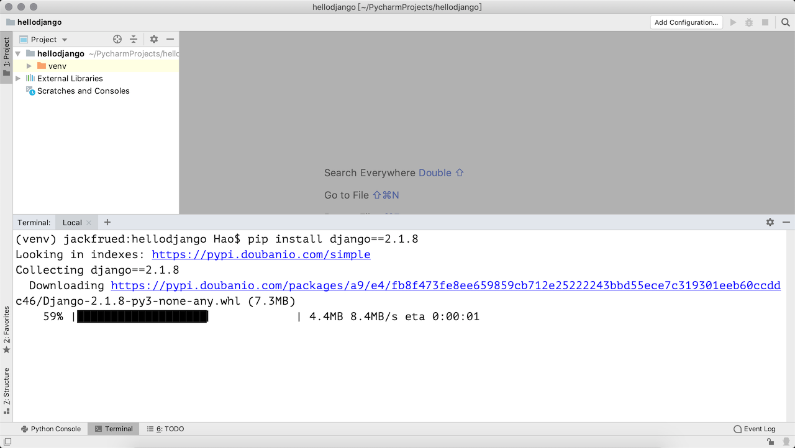
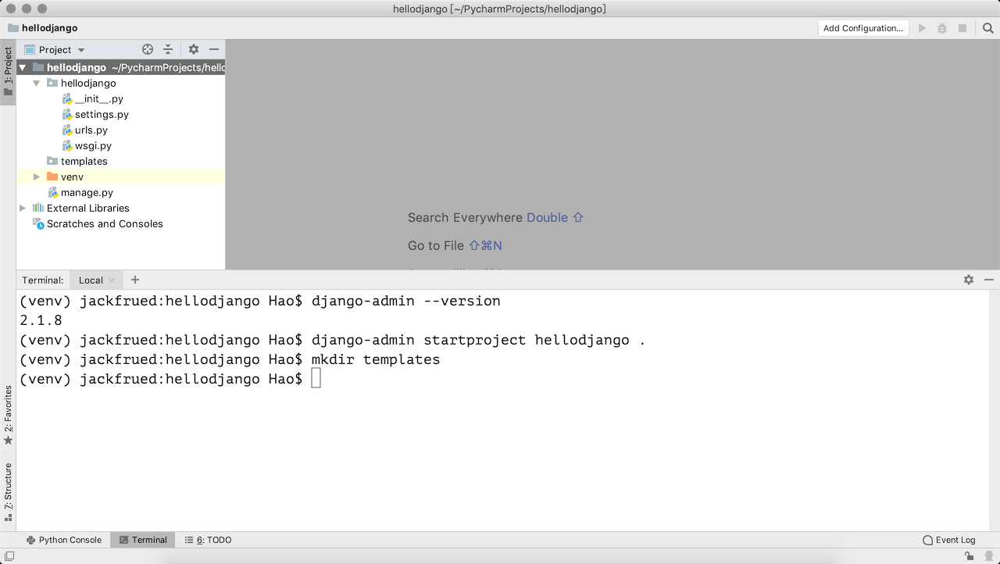
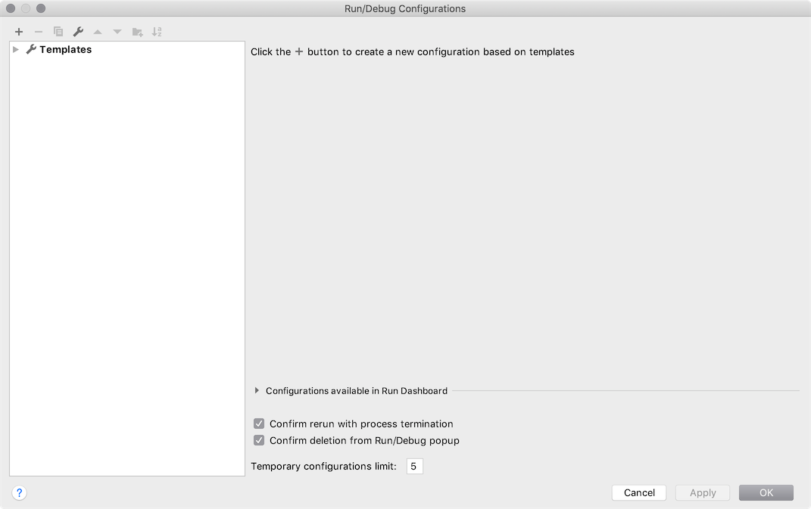
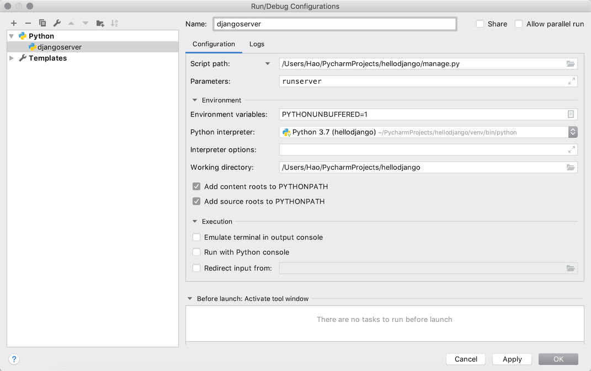
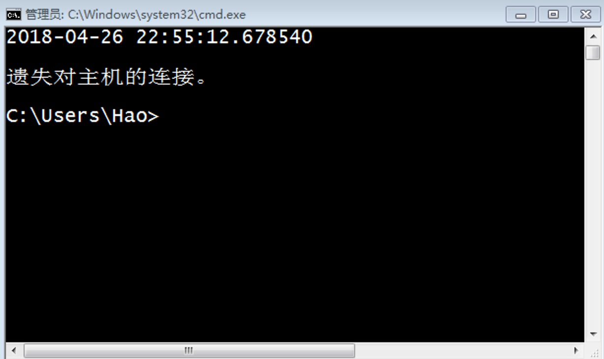
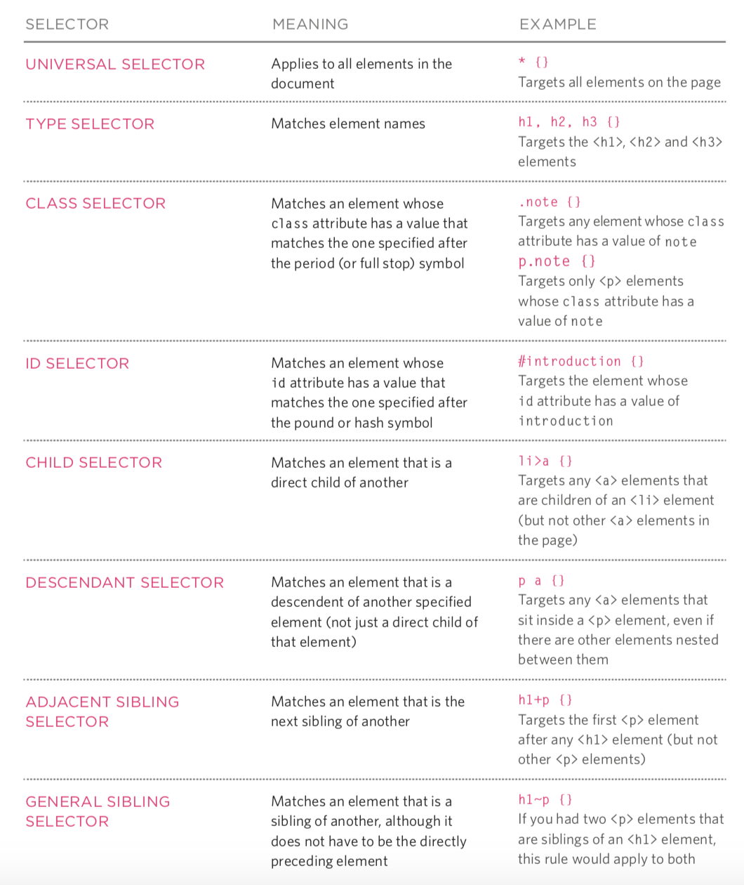
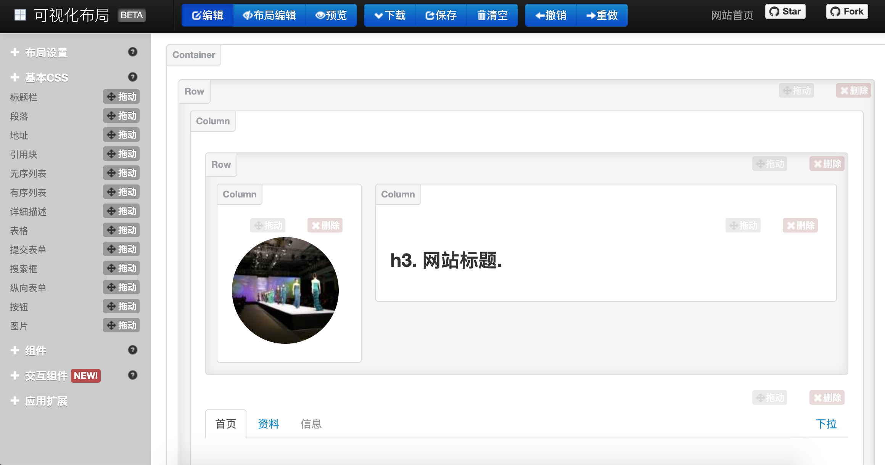

# 玩转PyCharm

PyCharm是由JetBrains公司开发的提供给Python专业的开发者的一个集成开发环境，它最大的优点是能够大大提升Python开发者的工作效率，为开发者集成了很多用起来非常顺手的功能，包括代码调试、高亮语法、代码跳转、智能提示、自动补全、单元测试、版本控制等等。此外，PyCharm还提供了对一些高级功能的支持，包括支持基于Django框架的Web开发、。

### PyCharm的安装

可以在[JetBrains公司的官方网站]()找到PyCharm的[下载链接](https://www.jetbrains.com/pycharm/download/)，有两个可供下载的版本一个是社区版一个是专业版，社区版在[Apache许可证](https://zh.wikipedia.org/wiki/Apache%E8%AE%B8%E5%8F%AF%E8%AF%81)下发布，专业版在专用许可证下发布（需要购买授权下载后可试用30天），其拥有许多额外功能。安装PyCharm需要有JRE（Java运行时环境）的支持，如果没有可以在安装过程中选择在线下载安装。

> 说明：如果你是一名学生，希望购买PyCharm来使用，可以看看[教育优惠官方申请指南](https://sales.jetbrains.com/hc/zh-cn/articles/207154369)。

### 首次使用的设置

第一次使用PyCharm时，会有一个导入设置的向导，如果之前没有使用PyCharm或者没有保存过设置的就直接选择“Do not import settings”进入下一步即可。


专业版的PyCharm是需要激活的，**强烈建议为优秀的软件支付费用**，如果不用做商业用途，我们可以暂时选择试用30天或者使用社区版的PyCharm。


 接下来是选择UI主题，这个可以根据个人喜好进行选择。


 再接下来是创建可以在终端（命令行）中使用PyCharm项目的启动脚本，当然也可以直接跳过这一步。


然后可以选择需要安装哪些插件，我们可以暂时什么都不安装等需要的时候再来决定。


### 配置解析器，将PyCharm与Python环境连接起来

File->Settings->Project Interpreter(Add Conda Environment python.exe)

### 用PyCharm创建项目

点击上图中的“Start using PyCharm”按钮就可以开始使用PyCharm啦，首先来到的是一个欢迎页，在欢迎页上我们可以选择“创建新项目”、“打开已有项目”和“从版本控制系统中检出项目”。


如果选择了“Create New Project”来创建新项目就会打一个创建项目的向导页。


在如上图所示的界面中，我们可以选择创建项目的模板，包括了纯Python项目、基于各种不同框架的Web项目、Web前端项目、跨平台项目等各种不同的项目模板。如果选择Python的项目，那么有一个非常重要的设定是选择“New environment…”（创建新的虚拟环境）还是使用“Existing Interpreter”（已经存在的解释器）。前者肯定是更好的选择，因为新的虚拟环境不会对系统环境变量中配置的Python环境造成影响，简单举个例子就是你在虚拟环境下安装或者更新了任何三方库，它并不会对系统原有的Python解释器造成任何的影响，但代价是需要额外的存储空间来建立这个虚拟环境。

项目创建完成后就可以开始新建各种文件来书写Python代码了。


在工作窗口的右键菜单中可以找到“Run ...”和“Debug ...”菜单项，通过这两个菜单项我们就可以运行和调试我们的代码啦。建议关注一下菜单栏中的“Code”、“Refactor”和“Tools”菜单，这里面为编写Python代码提供了很多有用的帮助。

### 创建Django项目

#### 专业版

PyCharm专业版提供了对Django、Flask、Google App Engine、web2py等Python Web框架以及SQL、UML、前端语言和框架、远程调试、虚拟化部署等功能的支持，如果使用PyCharm专业版，在创建项目时可以直接选择创建Django项目并设置模板语言以及放置模板页的文件夹。


创建好项目之后，打开终端输入`pip list`命令，可以看到项目所需的依赖项已经安装好了，而且可以直接点击屏幕右上方的运行或调试按钮来直接运行Django项目。


#### 社区版

PyCharm社区版只能创建Python项目，如果项目中需要Django的支持，可以自行安装依赖库并创建Django项目。


创建好Python项目之后，可以打开屏幕下方的终端（Terminal），并通过`pip install`安装Django项目的依赖项。



当然也可以在项目的设置菜单中找到解释器配置，并选择要添加的依赖项。


接下来可以在终端中输入`django-amdin startproject`指令来创建项目。



如果要运行项目，可以在终端中输入`python manage.py runserver`启动测试服务器。当然，也可以点击屏幕右上方的“Add Configuration”按钮，进入如下所示的配置界面，并点击窗口左上角的“+”来添加一个运行配置。



在配置窗口的右侧，指定要执行的脚本路径（Django项目的manage.py文件的位置）和运行参数（runserver）。



注意到窗口的右上角了吗？现在可以点击运行或调试按钮来启动测试服务器运行项目了。


###  优点

1. 方便的环境管理
  因为平时跑代码会有很多环境，结合Anaconda，会有tensorflow,pytorch, keras等等之类好的环境，Pycharm可以为当前项目指定环境，File→setting→Project Interpreter→ 选择自己的环境

2. 自动导入包

  - 这点主要是相比于VS Code，因为前几天一直想用用VS Code, 一通折腾之后，发现对于python代码编写，暂时没有这个功能o(╥﹏╥)o
  - Pycharm 可以通过Alt + Enter（visual studio快捷键下），自动导入包

3. 方便的代码调试

  - 最让我喜欢的就是这点, 通过设置Keymap 为 Visual Studio,
    - Ctrl + F5 run，
    - Alt +F5 Debug,
    - F10 step over(遇见函数，不进去)，
    - F11 step into(代码执行过程中，遇见函数，进入)，
    - shift + F11 step out(从当前函数跳出)，
    - F5 运行到下一断点（如果有断点的话）
    - 还有一点就是，程序在Debug下，可以通过
      　进入Console窗口，交互式运行，和运行代码共享变量空间（意思是所有出现的变量，你都可以访问，有没有想到一些好用的功能），如下图红框所示：

  

4. Git管理
  可以通过File→ setting →Version Control 做版本控制，设置登录之后的Login 和 Password，之后可以很方便的commit.
### 缺点
- 刚开始打开，索引包较慢(写这篇博客时，打开Pycharm，电脑卡的要死中-_-)
  内存占用太高（电脑内存小的（4G），打开之后，内存直接占用70-80%）

- 使用Pycharm的时候，使用from引入自己模块报错
  原因
  pycharm不会将当前文件目录自动加入自己的sourse_path。右键make_directory as–>sources path将当前工作的文件夹加入source_path就可以了。

​        解决方案 右键文件夹，make_directory as --> sources path 将当前工作的文件夹加入source_path

### Pycharm

PyCharm

sublime

**anaconda prompt**

\>>>conda create --name newpy36 python=3.6

\>>>activate newpy36

---deactive newpy36

pandas做数据处理与分析

机器学习：

统计、线性代数、微积分

python

打开界面：命令行执行jupyter notebook

python

网站、爬虫、大数据处理、机器学习

print（'hello,world'）

import this

%matplotlib inline

import  matplotlib.pyplot as plt

x=[1,2,3,4]

y=[5,4,3,2]

plt.figure()

plt.subplot(221)

plt.plot(x,y)

plt.subplot(222)

plt.bar(x,y)

plt.subplots_adjust(wspace=0)

plt.show()


import requests,re,json

from pandas import DataFrame,Series

url=u'<http://data.stats.gov.cn/search.htm?s=CPI&m=searchdata&db=&p=0>'

res=requests.get(url)

pat=[re.compile(r'result](http://re.compile(r'result/)":(\[.*?\])',re.S)

m=pat.search(res.text)

if m:

​    print('success')

m

tt=json.loads(m.group(1))

frame=DataFrame(tt)

frame

success

\>python test.py

变量类型

1.字符串str

2.数字int float complex

3.列表list

4.元组 tuple

5.字典dict

import math

math.pow(10,2)

math.floor(2.1)2

math.ceil(2.1)3

math.radians(100)度的转换

min(10,12,234)

max(10,12,234)

sum([10,12,234])367

divmod(10,3)(3,1)商和余数

--bool型

True == 1

False == 0

True + 10 #11

True and False

True or False

not True

--字符串

line_1 = "ni hao"

line_2 = "xiaojiejie"

line_1+line_2  'ni haoxiaojiejie'

line = 'nihao '

line * 3

len(line)

id(line)返回一个身份识别符，可以理解为一个变量的内存地址#字符串是不可变类型的变量

line中原先指向的字符地址没有改变

切片

line ='huan ying da jia lai wan '

\#取前十个字符

line[0:10]

**line[0:10:2]每俩个取一个**

**line[-10:]取后十个**

**line[::-1]翻转字符**

序列 列表是一种容器型的序列；字符串是一种扁平型的序列

**单字符line[-1]**

line.center(20,'%')居中两端用''填满

line.count('A')计数

line.endswith('F')匹配是否已XX结尾

line.startswith('F')匹配是否已XX开始

line.find('A')寻找XX字符的下标 找不到返回-1

line.index('A')寻找XX字符的下标 找不到报错

line.upper()

line.lower()

line.capitalize()'Huan ying da jia lai wan '

line.istitle()

line.isupper() line.islower()

line.strip()去空格line.rstrip() line.ltrip()

line.swapcase()大小写颠倒

都是生成新字符 原字符不变

--列表--列表是可变类型的

varibals = [1,2,3，‘hello,python’,[100,100]]

varibals.append(1)

varibals.append('ni hao')

python是一种动态类型的语言，一个变量是什么类型要看程序在运行过程中变量所代表的的值是什么

varibals + [1,23]

varibals[-2:]

len(varibals)

varibals.clear()

varibals..copy()

a.extend(b)拼接

a.insert(0,100)

a.pop(0)弹出

a.remove(23)删除第一个匹配的

a.sort(reverse=True)默认升序reverse=True降序

a.reverse()翻转

4 in a判断是否存在

--元组 tuple不可变的序列

var= tuple()

var= ()

type(var)#tuple

var.count(1)计数

var.index()

--字典类型

var= {}

var= dict{}

type(var)#dict

var={

​     '中':100,

​     '左':200

}

var['中']

拉锁函数

new_var= list(zip[words,location])

dict(new_var)列表转换为字典

students= ['a','s','d']

money= dict.fromkeys[students,10]给初值

money['a']访问字典中的值

a= money.get('f",100)如果找不到赋个值

money.keys()

money.values()

money.items()拆成单个

money.pop('a')删除操作

money['g']= 10增加

money.setdefault('haha',1000)

Out[2]:


|      | data  | db       | exp                                                          | prank    | rank | reg  | report                      | sj        | zb                               |
| ---- | ----- | -------- | ------------------------------------------------------------ | -------- | ---- | ---- | --------------------------- | --------- | -------------------------------- |
| 0    | 102.0 | 年度数据 | 居民消费价格指数是反映一定时期内城乡居民所购买的生活消费品和服务项目价格变动趋势和程度的相对... | 0.001629 | 151  | 全国 | cn=C01&zb=A0901&sj=2016     | 2016年    | 居民消费价格指数(上年=100)       |
| 1    | 101.4 | 年度数据 | 居民消费价格指数是反映一定时期内城乡居民所购买的生活消费品和服务项目价格变动趋势和程度的相对... | 0.001629 | 151  | 全国 | cn=C01&zb=A0901&sj=2015     | 2015年    | 居民消费价格指数(上年=100)       |
| 2    | 102.9 | 月度数据 |                                                              | 0.001831 | 151  | 全国 | cn=A01&zb=A010101&sj=201802 | 2018年2月 | 居民消费价格指数(上年同月=100)   |
| 3    | 101.2 | 月度数据 |                                                              | 0.001631 | 140  | 全国 | cn=A01&zb=A010301&sj=201802 | 2018年2月 | 居民消费价格指数(上月=100)       |
| 4    | 627.5 | 年度数据 | 居民消费价格指数是反映一定时期内居民所消费商品及服务项目的价格水平变动趋势和变动程度。取自统... | 0.001829 | 140  | 全国 | cn=C01&zb=A0902&sj=2016     | 2016年    | 居民消费价格指数(1978=100)       |
| 5    | 615.2 | 年度数据 | 居民消费价格指数是反映一定时期内居民所消费商品及服务项目的价格水平变动趋势和变动程度。取自统... | 0.001829 | 140  | 全国 | cn=C01&zb=A0902&sj=2015     | 2015年    | 居民消费价格指数(1978=100)       |
| 6    | 102.2 | 月度数据 |                                                              | 0.001831 | 140  | 全国 | cn=A01&zb=A010201&sj=201802 | 2018年2月 | 居民消费价格指数(上年同期=100)   |
| 7    | 102.1 | 年度数据 | 城市居民消费价格指数是反映一定时期内城市居民家庭所购买的生活消费品价格和服务项目价格变动趋势... | 2.001829 | 140  | 全国 | cn=C01&zb=A0901&sj=2016     | 2016年    | 城市居民消费价格指数(上年=100)   |
| 8    | 101.5 | 年度数据 | 城市居民消费价格指数是反映一定时期内城市居民家庭所购买的生活消费品价格和服务项目价格变动趋势... | 2.001829 | 140  | 全国 | cn=C01&zb=A0901&sj=2015     | 2015年    | 城市居民消费价格指数(上年=100)   |
| 9    | 101.9 | 年度数据 | 农村居民消费价格指数是反映一定时期内农村居民家庭所购买的生活消费品价格和服务项目价格变动趋势... | 2.001829 | 140  | 全国 | cn=C01&zb=A0901&sj=2016     | 2016年    | 农村居民消费价格指数(上年=100)   |
| 10   | 101.3 | 年度数据 | 农村居民消费价格指数是反映一定时期内农村居民家庭所购买的生活消费品价格和服务项目价格变动趋势... | 2.001829 | 140  | 全国 | cn=C01&zb=A0901&sj=2015     | 2015年    | 农村居民消费价格指数(上年=100)   |
| 11   | 104.4 | 月度数据 | 2001-至今，食品指可供人类食用或饮用的物质，包括加工食品，半成品和未加工食品，不包括烟草... | 2.001831 | 140  | 全国 | cn=A01&zb=A010303&sj=201802 | 2018年2月 | 食品类居民消费价格指数(上月=100) |
| 12   |       | 月度数据 | 城市居民消费价格指数是反映一定时期内城市居民家庭所购买的生活消费品价格和服务项目价格变动趋势... | 2.001831 | 140  | 全国 | cn=A01&zb=A010305&sj=201802 | 2018年2月 | 城市居民消费价格指数(上月=100)   |
| 13   | 676.5 | 年度数据 | 城市居民消费价格指数是反映一定时期内城市居民家庭所购买的生活消费品价格和服务项目价格变动趋势... | 2.002029 | 140  | 全国 | cn=C01&zb=A0902&sj=2016     | 2016年    | 城市居民消费价格指数(1978=100)   |
| 14   | 662.6 | 年度数据 | 城市居民消费价格指数是反映一定时期内城市居民家庭所购买的生活消费品价格和服务项目价格变动趋势... | 2.002029 | 140  | 全国 | cn=C01&zb=A0902&sj=2015     | 2015年    | 城市居民消费价格指数(1978=100)   |


语句后加？出现函数解释 l显示行号 m为markdown shift+enter运行

### python

```python

条件判断
if total_cost>50:
elif total_cost>30:
else:
else elif可有可无
空值为False 有值为True
断言
assert age== 18,'错误信息'不是就报错
循环
for 循环 -遍历循环
while 循环-条件循环

for cost incousts:
print('消费（）元'.format(str(cost).center(10)))

import random
#random.randint(1,10)整数
random_number = []
while len(random_numbers)<=20：
random_numbers.append(random.randint(1,10))
print(random_numbers,len(random_numbers))

for i in range(20)：同理
当循环的条件与数量没有关系时必须用while
print(,end/='\r')
元组中只有1个元素时类型设定元组类型
单元素元组（1,）
for number in random_numbers:
if numer % 2 ==0:
print ('偶数')
else:
print('奇数')
循环中的else：如果在循环过程中没有碰到break语句，就会执行else里的语句
continue break

for循环可以构建推导式
random_numbers= list(range(10))
new_numbers= []
for number in random_numbers:
new_numbers.append(number*10)
new_numbers

new_bumbers= [number*10 for number in random_numbers]
字典推导式
dict_numbers= {number:'A' for number in random_numbers}
生成器
tuple_numbers= (number*10 for number in random_numbers)
tuple(tuple_numbers)

--函数
[key for key,value in varibal.items() if value== 100]


def get_keys(dict_varibal,value):
return [k for k,vin varibal.items() if v== value]
get_keys[varibal,200]
1位置参数 2关键字参数，可以不按照顺序去写
参数的收集
def test(name,age,*args,**kargs):*位置参数 **关键字参数
print(name,age,*args,**kargs)
装饰器
可以把函数赋值给一个变量
函数可以当做函数的返回值进行返回
import random
random.random()
#返回一个从0到1的浮点值
@decorator
def test():
return random.random()
@decorator
def test_two():
return random.random()*10
#函数返回的浮点值保留三个有效数字
语法糖，装饰器
def decorator(func):
def wrapper(*args,**kargs)
#do something
return round(func(*args,**kargs),3)
return wrapper
test()

--类
class Person:
def __init__(self,name,age):
self._name= name
self._age= age
@property
def name(self):
return self._name
def rename(self,new_name):
self.name= new_name
p= Person('wan',12)
p.name#不用加括号
p.getname#普通
class Student(Person):
# pass#代表什么都不做，只是占个位
def self_score(self,score):
self._score= score
def get_score(self):
return self._score
初始化函数中self后面实例对象属性，加下划线表示属性私有
```

### Jupyter notebook使用说明

pycharm

project interpreter Add


**1、创建新的ipynb文件**


按照视频教程，win系统的学员通过cmd打开命令行，输入jupyter notebook命令，通过jupyter notebook打开该文件夹，单击显示的ipynb格式的文件，即可进行代码编辑，此外，通过右上方的New按钮，选择Python3解释器【选择自己的解释器】，可以创建一个新的ipynb文件。

若是mac系统，则不通过cmd打开notebook，通过打开终端，将当前路径进行切换到感兴趣的ipynb文件所在的文件夹下，输入jupyter notebook命令，则也可以通过Jupyter notebook打开打开该文件夹。

**2、修改ipynb文件的名字**


打开一个ipynb文件后，可以单击1表示的红框名称，打开白色的框后，在2表示的红框位置输入适合的文件名字，单击3表示的红框，即可修改ipynb文件的名称。

**3、将ipynb文件保存为html文件**


第一步点击file文件按钮，第二步点击Download as，第三步选择HTML，然后保存即可。

**4、Jupyter notebook界面功能介绍**


In [ ]表示一个代码cell，每个cell里写的是代码

(1)+：表示在选中的cell的下方添加一个新的cell

(2)上箭头：表示将选中的cell往上移动

(3)下箭头：表示将选中的cell往下移动

(4)三角Run：表示运行选中的cell代码，也可以通过快捷键shift+enter来运行cell，当cell中的代码运行完毕后，则左侧会显示In[数字]。

(5)黑色方块：表示停止运行当前的cell，一般会用在当cell的左侧显示为In[*]的时候，*表示该cell在执行，其他的cell则处于阻塞状态

**5、编码cell和描述cell**


当cell前面有In [] 时，表示该cell是代码cell，表示这个cell主要用来编写代码。

当cell前面没有In []时，表示该cell是描述cell，表示这个cell主要用来用来进行文字描述。

红框位置，通过下拉按钮可以展开里面的选项，通过Code可以将选中的cell切换为代码cell，通过Markdown可以将选中的cell切换为描述cell。

 


# DAY-11 文件和异常

在实际开发中，常常需要对程序中的数据进行[持久化](https://baike.baidu.com/item/%E6%95%B0%E6%8D%AE%E6%8C%81%E4%B9%85%E5%8C%96)操作，而实现数据持久化最直接简单的方式就是将数据保存到文件中。说到“文件”这个词，可能需要先科普一下关于[文件系统](https://zh.wikipedia.org/wiki/%E6%96%87%E4%BB%B6%E7%B3%BB%E7%BB%9F)的知识，对于这个概念，维基百科上给出了很好的诠释，这里不再浪费笔墨。

在Python中实现文件的读写操作其实非常简单，通过Python内置的`open`函数，我们可以指定文件名、操作模式、编码信息等来获得操作文件的对象，接下来就可以对文件进行读写操作了。这里所说的操作模式是指要打开什么样的文件（字符文件还是二进制文件）以及做什么样的操作（读、写还是追加），具体的如下表所示。

| 操作模式 | 具体含义                         |
| -------- | -------------------------------- |
| `'r'`    | 读取 （默认）                    |
| `'w'`    | 写入（会先截断之前的内容）       |
| `'x'`    | 写入，如果文件已经存在会产生异常 |
| `'a'`    | 追加，将内容写入到已有文件的末尾 |
| `'b'`    | 二进制模式                       |
| `'t'`    | 文本模式（默认）                 |
| `'+'`    | 更新（既可以读又可以写）         |

下面这张图来自于[菜鸟教程](http://www.runoob.com)网站，它展示了如果根据应用程序的需要来设置操作模式。


### 读写文本文件

读取文本文件时，需要在使用`open`函数时指定好带路径的文件名（可以使用相对路径或绝对路径）并将文件模式设置为`'r'`（如果不指定，默认值也是`'r'`），然后通过`encoding`参数指定编码（如果不指定，默认值是None，那么在读取文件时使用的是操作系统默认的编码），如果不能保证保存文件时使用的编码方式与encoding参数指定的编码方式是一致的，那么就可能因无法解码字符而导致读取失败。下面的例子演示了如何读取一个纯文本文件。

```Python
def main():
    f = open('致橡树.txt', 'r', encoding='utf-8')
    print(f.read())
    f.close()


if __name__ == '__main__':
    main()
```

请注意上面的代码，如果`open`函数指定的文件并不存在或者无法打开，那么将引发异常状况导致程序崩溃。为了让代码有一定的健壮性和容错性，我们可以使用Python的异常机制对可能在运行时发生状况的代码进行适当的处理，如下所示。

```Python
def main():
    f = None
    try:
        f = open('致橡树.txt', 'r', encoding='utf-8')
        print(f.read())
    except FileNotFoundError:
        print('无法打开指定的文件!')
    except LookupError:
        print('指定了未知的编码!')
    except UnicodeDecodeError:
        print('读取文件时解码错误!')
    finally:
        if f:
            f.close()


if __name__ == '__main__':
    main()
```

在Python中，我们可以将那些在运行时可能会出现状况的代码放在`try`代码块中，在`try`代码块的后面可以跟上一个或多个`except`来捕获可能出现的异常状况。例如在上面读取文件的过程中，文件找不到会引发`FileNotFoundError`，指定了未知的编码会引发`LookupError`，而如果读取文件时无法按指定方式解码会引发`UnicodeDecodeError`，我们在`try`后面跟上了三个`except`分别处理这三种不同的异常状况。最后我们使用`finally`代码块来关闭打开的文件，释放掉程序中获取的外部资源，由于`finally`块的代码不论程序正常还是异常都会执行到（甚至是调用了`sys`模块的`exit`函数退出Python环境，`finally`块都会被执行，因为`exit`函数实质上是引发了`SystemExit`异常），因此我们通常把`finally`块称为“总是执行代码块”，它最适合用来做释放外部资源的操作。如果不愿意在`finally`代码块中关闭文件对象释放资源，也可以使用上下文语法，通过`with`关键字指定文件对象的上下文环境并在离开上下文环境时自动释放文件资源，代码如下所示。

```Python
def main():
    try:
        with open('致橡树.txt', 'r', encoding='utf-8') as f:
            print(f.read())
    except FileNotFoundError:
        print('无法打开指定的文件!')
    except LookupError:
        print('指定了未知的编码!')
    except UnicodeDecodeError:
        print('读取文件时解码错误!')


if __name__ == '__main__':
    main()
```

除了使用文件对象的`read`方法读取文件之外，还可以使用`for-in`循环逐行读取或者用`readlines`方法将文件按行读取到一个列表容器中，代码如下所示。

```Python
import time


def main():
    # 一次性读取整个文件内容
    with open('致橡树.txt', 'r', encoding='utf-8') as f:
        print(f.read())

    # 通过for-in循环逐行读取
    with open('致橡树.txt', mode='r') as f:
        for line in f:
            print(line, end='')
            time.sleep(0.5)
    print()

    # 读取文件按行读取到列表中
    with open('致橡树.txt') as f:
        lines = f.readlines()
    print(lines)
    

if __name__ == '__main__':
    main()
```

要将文本信息写入文件文件也非常简单，在使用`open`函数时指定好文件名并将文件模式设置为`'w'`即可。注意如果需要对文件内容进行追加式写入，应该将模式设置为`'a'`。如果要写入的文件不存在会自动创建文件而不是引发异常。下面的例子演示了如何将1-9999之间的素数分别写入三个文件中（1-99之间的素数保存在a.txt中，100-999之间的素数保存在b.txt中，1000-9999之间的素数保存在c.txt中）。

```Python
from math import sqrt


def is_prime(n):
    """判断素数的函数"""
    assert n > 0
    for factor in range(2, int(sqrt(n)) + 1):
        if n % factor == 0:
            return False
    return True if n != 1 else False


def main():
    filenames = ('a.txt', 'b.txt', 'c.txt')
    fs_list = []
    try:
        for filename in filenames:
            fs_list.append(open(filename, 'w', encoding='utf-8'))
        for number in range(1, 10000):
            if is_prime(number):
                if number < 100:
                    fs_list[0].write(str(number) + '\n')
                elif number < 1000:
                    fs_list[1].write(str(number) + '\n')
                else:
                    fs_list[2].write(str(number) + '\n')
    except IOError as ex:
        print(ex)
        print('写文件时发生错误!')
    finally:
        for fs in fs_list:
            fs.close()
    print('操作完成!')


if __name__ == '__main__':
    main()
```

### 读写二进制文件

知道了如何读写文本文件要读写二进制文件也就很简单了，下面的代码实现了复制图片文件的功能。

```Python
def main():
    try:
        with open('guido.jpg', 'rb') as fs1:
            data = fs1.read()
            print(type(data))  # <class 'bytes'>
        with open('吉多.jpg', 'wb') as fs2:
            fs2.write(data)
    except FileNotFoundError as e:
        print('指定的文件无法打开.')
    except IOError as e:
        print('读写文件时出现错误.')
    print('程序执行结束.')


if __name__ == '__main__':
    main()
```

### 读写JSON文件

通过上面的讲解，我们已经知道如何将文本数据和二进制数据保存到文件中，那么这里还有一个问题，如果希望把一个列表或者一个字典中的数据保存到文件中又该怎么做呢？答案是将数据以JSON格式进行保存。JSON是“JavaScript Object Notation”的缩写，它本来是JavaScript语言中创建对象的一种字面量语法，现在已经被广泛的应用于跨平台跨语言的数据交换，原因很简单，因为JSON也是纯文本，任何系统任何编程语言处理纯文本都是没有问题的。目前JSON基本上已经取代了XML作为异构系统间交换数据的事实标准。关于JSON的知识，更多的可以参考[JSON的官方网站](http://json.org)，从这个网站也可以了解到每种语言处理JSON数据格式可以使用的工具或三方库，下面是一个JSON的简单例子。

```JSON
{
    "name": "骆昊",
    "age": 38,
    "qq": 957658,
    "friends": ["王大锤", "白元芳"],
    "cars": [
        {"brand": "BYD", "max_speed": 180},
        {"brand": "Audi", "max_speed": 280},
        {"brand": "Benz", "max_speed": 320}
    ]
}
```

可能大家已经注意到了，上面的JSON跟Python中的字典其实是一样一样的，事实上JSON的数据类型和Python的数据类型是很容易找到对应关系的，如下面两张表所示。

| JSON                | Python       |
| ------------------- | ------------ |
| object              | dict         |
| array               | list         |
| string              | str          |
| number (int / real) | int / float  |
| true / false        | True / False |
| null                | None         |

| Python                                 | JSON         |
| -------------------------------------- | ------------ |
| dict                                   | object       |
| list, tuple                            | array        |
| str                                    | string       |
| int, float, int- & float-derived Enums | number       |
| True / False                           | true / false |
| None                                   | null         |

我们使用Python中的json模块就可以将字典或列表以JSON格式保存到文件中，代码如下所示。

```Python
import json


def main():
    mydict = {
        'name': '骆昊',
        'age': 38,
        'qq': 957658,
        'friends': ['王大锤', '白元芳'],
        'cars': [
            {'brand': 'BYD', 'max_speed': 180},
            {'brand': 'Audi', 'max_speed': 280},
            {'brand': 'Benz', 'max_speed': 320}
        ]
    }
    try:
        with open('data.json', 'w', encoding='utf-8') as fs:
            json.dump(mydict, fs)
    except IOError as e:
        print(e)
    print('保存数据完成!')


if __name__ == '__main__':
    main()
```

json模块主要有四个比较重要的函数，分别是：

- `dump` - 将Python对象按照JSON格式序列化到文件中
- `dumps` - 将Python对象处理成JSON格式的字符串
- `load` - 将文件中的JSON数据反序列化成对象
- `loads` - 将字符串的内容反序列化成Python对象

这里出现了两个概念，一个叫序列化，一个叫反序列化。自由的百科全书[维基百科](https://zh.wikipedia.org/)上对这两个概念是这样解释的：“序列化（serialization）在计算机科学的数据处理中，是指将数据结构或对象状态转换为可以存储或传输的形式，这样在需要的时候能够恢复到原先的状态，而且通过序列化的数据重新获取字节时，可以利用这些字节来产生原始对象的副本（拷贝）。与这个过程相反的动作，即从一系列字节中提取数据结构的操作，就是反序列化（deserialization）”。

目前绝大多数网络数据服务（或称之为网络API）都是基于[HTTP协议](https://zh.wikipedia.org/wiki/%E8%B6%85%E6%96%87%E6%9C%AC%E4%BC%A0%E8%BE%93%E5%8D%8F%E8%AE%AE)提供JSON格式的数据，关于HTTP协议的相关知识，可以看看阮一峰老师的[《HTTP协议入门》](http://www.ruanyifeng.com/blog/2016/08/http.html)，如果想了解国内的网络数据服务，可以看看[聚合数据](https://www.juhe.cn/)和[阿凡达数据](http://www.avatardata.cn/)等网站，国外的可以看看[{API}Search](http://apis.io/)网站。下面的例子演示了如何使用[requests](http://docs.python-requests.org/zh_CN/latest/)模块（封装得足够好的第三方网络访问模块）访问网络API获取国内新闻，如何通过json模块解析JSON数据并显示新闻标题，这个例子使用了[天行数据](https://www.tianapi.com/)提供的国内新闻数据接口，其中的APIKey需要自己到该网站申请。

```Python
import requests
import json


def main():
    resp = requests.get('http://api.tianapi.com/guonei/?key=APIKey&num=10')
    data_model = json.loads(resp.text)
    for news in data_model['newslist']:
        print(news['title'])


if __name__ == '__main__':
    main()
```

在Python中要实现序列化和反序列化除了使用json模块之外，还可以使用pickle和shelve模块，但是这两个模块是使用特有的序列化协议来序列化数据，因此序列化后的数据只能被Python识别。关于这两个模块的相关知识可以自己看看网络上的资料。另外，如果要了解更多的关于Python异常机制的知识，可以看看segmentfault上面的文章[《总结：Python中的异常处理》](https://segmentfault.com/a/1190000007736783)，这篇文章不仅介绍了Python中异常机制的使用，还总结了一系列的最佳实践，很值得一读。

# DAY-12 使用正则表达式

### 正则表达式相关知识

在编写处理字符串的程序或网页时，经常会有查找符合某些复杂规则的字符串的需要，正则表达式就是用于描述这些规则的工具，换句话说正则表达式是一种工具，它定义了字符串的匹配模式（如何检查一个字符串是否有跟某种模式匹配的部分或者从一个字符串中将与模式匹配的部分提取出来或者替换掉）。如果你在Windows操作系统中使用过文件查找并且在指定文件名时使用过通配符（\*和?），那么正则表达式也是与之类似的用来进行文本匹配的工具，只不过比起通配符正则表达式更强大，它能更精确地描述你的需求（当然你付出的代价是书写一个正则表达式比打出一个通配符要复杂得多，要知道任何给你带来好处的东西都是有代价的，就如同学习一门编程语言一样），比如你可以编写一个正则表达式，用来查找所有以0开头，后面跟着2-3个数字，然后是一个连字号“-”，最后是7或8位数字的字符串（像028-12345678或0813-7654321），这不就是国内的座机号码吗。最初计算机是为了做数学运算而诞生的，处理的信息基本上都是数值，而今天我们在日常工作中处理的信息基本上都是文本数据，我们希望计算机能够识别和处理符合某些模式的文本，正则表达式就显得非常重要了。今天几乎所有的编程语言都提供了对正则表达式操作的支持，Python通过标准库中的re模块来支持正则表达式操作。

我们可以考虑下面一个问题：我们从某个地方（可能是一个文本文件，也可能是网络上的一则新闻）获得了一个字符串，希望在字符串中找出手机号和座机号。当然我们可以设定手机号是11位的数字（注意并不是随机的11位数字，因为你没有见过“25012345678”这样的手机号吧）而座机号跟上一段中描述的模式相同，如果不使用正则表达式要完成这个任务就会很麻烦。

关于正则表达式的相关知识，大家可以阅读一篇非常有名的博客叫[《正则表达式30分钟入门教程》](https://deerchao.net/tutorials/regex/regex.htm)，读完这篇文章后你就可以看懂下面的表格，这是我们对正则表达式中的一些基本符号进行的扼要总结。

| 符号                     | 解释                             | 示例                | 说明                                                         |
| ------------------------ | -------------------------------- | ------------------- | ------------------------------------------------------------ |
| .                        | 匹配任意字符                     | b.t                 | 可以匹配bat / but / b#t / b1t等                              |
| \\w                      | 匹配字母/数字/下划线             | b\\wt               | 可以匹配bat / b1t / b_t等<br>但不能匹配b#t                   |
| \\s                      | 匹配空白字符（包括\r、\n、\t等） | love\\syou          | 可以匹配love you                                             |
| \\d                      | 匹配数字                         | \\d\\d              | 可以匹配01 / 23 / 99等                                       |
| \\b                      | 匹配单词的边界                   | \\bThe\\b           |                                                              |
| ^                        | 匹配字符串的开始                 | ^The                | 可以匹配The开头的字符串                                      |
| $                        | 匹配字符串的结束                 | .exe$               | 可以匹配.exe结尾的字符串                                     |
| \\W                      | 匹配非字母/数字/下划线           | b\\Wt               | 可以匹配b#t / b@t等<br>但不能匹配but / b1t / b_t等           |
| \\S                      | 匹配非空白字符                   | love\\Syou          | 可以匹配love#you等<br>但不能匹配love you                     |
| \\D                      | 匹配非数字                       | \\d\\D              | 可以匹配9a / 3# / 0F等                                       |
| \\B                      | 匹配非单词边界                   | \\Bio\\B            |                                                              |
| []                       | 匹配来自字符集的任意单一字符     | [aeiou]             | 可以匹配任一元音字母字符                                     |
| [^]                      | 匹配不在字符集中的任意单一字符   | [^aeiou]            | 可以匹配任一非元音字母字符                                   |
| *                        | 匹配0次或多次                    | \\w*                |                                                              |
| +                        | 匹配1次或多次                    | \\w+                |                                                              |
| ?                        | 匹配0次或1次                     | \\w?                |                                                              |
| {N}                      | 匹配N次                          | \\w{3}              |                                                              |
| {M,}                     | 匹配至少M次                      | \\w{3,}             |                                                              |
| {M,N}                    | 匹配至少M次至多N次               | \\w{3,6}            |                                                              |
| \|                       | 分支                             | foo\|bar            | 可以匹配foo或者bar                                           |
| (?#)                     | 注释                             |                     |                                                              |
| (exp)                    | 匹配exp并捕获到自动命名的组中    |                     |                                                              |
| (?&nbsp;&lt;name&gt;exp) | 匹配exp并捕获到名为name的组中    |                     |                                                              |
| (?:exp)                  | 匹配exp但是不捕获匹配的文本      |                     |                                                              |
| (?=exp)                  | 匹配exp前面的位置                | \\b\\w+(?=ing)      | 可以匹配I'm dancing中的danc                                  |
| (?<=exp)                 | 匹配exp后面的位置                | (?<=\\bdanc)\\w+\\b | 可以匹配I love dancing and reading中的第一个ing              |
| (?!exp)                  | 匹配后面不是exp的位置            |                     |                                                              |
| (?<!exp)                 | 匹配前面不是exp的位置            |                     |                                                              |
| *?                       | 重复任意次，但尽可能少重复       | a.\*b<br>a.\*?b     | 将正则表达式应用于aabab，前者会匹配整个字符串aabab，后者会匹配aab和ab两个字符串 |
| +?                       | 重复1次或多次，但尽可能少重复    |                     |                                                              |
| ??                       | 重复0次或1次，但尽可能少重复     |                     |                                                              |
| {M,N}?                   | 重复M到N次，但尽可能少重复       |                     |                                                              |
| {M,}?                    | 重复M次以上，但尽可能少重复      |                     |                                                              |

> **说明：** 如果需要匹配的字符是正则表达式中的特殊字符，那么可以使用\\进行转义处理，例如想匹配小数点可以写成\\.就可以了，因为直接写.会匹配任意字符；同理，想匹配圆括号必须写成\\(和\\)，否则圆括号被视为正则表达式中的分组。

### Python对正则表达式的支持

Python提供了re模块来支持正则表达式相关操作，下面是re模块中的核心函数。

| 函数                                         | 说明                                                         |
| -------------------------------------------- | ------------------------------------------------------------ |
| compile(pattern, flags=0)                    | 编译正则表达式返回正则表达式对象                             |
| match(pattern, string, flags=0)              | 用正则表达式匹配字符串 成功返回匹配对象 否则返回None         |
| search(pattern, string, flags=0)             | 搜索字符串中第一次出现正则表达式的模式 成功返回匹配对象 否则返回None |
| split(pattern, string, maxsplit=0, flags=0)  | 用正则表达式指定的模式分隔符拆分字符串 返回列表              |
| sub(pattern, repl, string, count=0, flags=0) | 用指定的字符串替换原字符串中与正则表达式匹配的模式 可以用count指定替换的次数 |
| fullmatch(pattern, string, flags=0)          | match函数的完全匹配（从字符串开头到结尾）版本                |
| findall(pattern, string, flags=0)            | 查找字符串所有与正则表达式匹配的模式 返回字符串的列表        |
| finditer(pattern, string, flags=0)           | 查找字符串所有与正则表达式匹配的模式 返回一个迭代器          |
| purge()                                      | 清除隐式编译的正则表达式的缓存                               |
| re.I / re.IGNORECASE                         | 忽略大小写匹配标记                                           |
| re.M / re.MULTILINE                          | 多行匹配标记                                                 |

> **说明：** 上面提到的re模块中的这些函数，实际开发中也可以用正则表达式对象的方法替代对这些函数的使用，如果一个正则表达式需要重复的使用，那么先通过compile函数编译正则表达式并创建出正则表达式对象无疑是更为明智的选择。

下面我们通过一系列的例子来告诉大家在Python中如何使用正则表达式。

#### 例子1：验证输入用户名和QQ号是否有效并给出对应的提示信息。

```Python
"""
验证输入用户名和QQ号是否有效并给出对应的提示信息

要求：用户名必须由字母、数字或下划线构成且长度在6~20个字符之间，QQ号是5~12的数字且首位不能为0
"""
import re


def main():
    username = input('请输入用户名: ')
    qq = input('请输入QQ号: ')
    # match函数的第一个参数是正则表达式字符串或正则表达式对象
    # 第二个参数是要跟正则表达式做匹配的字符串对象
    m1 = re.match(r'^[0-9a-zA-Z_]{6,20}$', username)
    if not m1:
        print('请输入有效的用户名.')
    m2 = re.match(r'^[1-9]\d{4,11}$', qq)
    if not m2:
        print('请输入有效的QQ号.')
    if m1 and m2:
        print('你输入的信息是有效的!')


if __name__ == '__main__':
    main()
```

> **提示：** 上面在书写正则表达式时使用了“原始字符串”的写法（在字符串前面加上了r），所谓“原始字符串”就是字符串中的每个字符都是它原始的意义，说得更直接一点就是字符串中没有所谓的转义字符啦。因为正则表达式中有很多元字符和需要进行转义的地方，如果不使用原始字符串就需要将反斜杠写作\\\\，例如表示数字的\\d得书写成\\\\d，这样不仅写起来不方便，阅读的时候也会很吃力。

#### 例子2：从一段文字中提取出国内手机号码。

下面这张图是截止到2017年底，国内三家运营商推出的手机号段。


```Python
import re


def main():
    # 创建正则表达式对象 使用了前瞻和回顾来保证手机号前后不应该出现数字
    pattern = re.compile(r'(?<=\D)1[34578]\d{9}(?=\D)')
    sentence = '''
    重要的事情说8130123456789遍，我的手机号是13512346789这个靓号，
    不是15600998765，也是110或119，王大锤的手机号才是15600998765。
    '''
    # 查找所有匹配并保存到一个列表中
    mylist = re.findall(pattern, sentence)
    print(mylist)
    print('--------华丽的分隔线--------')
    # 通过迭代器取出匹配对象并获得匹配的内容
    for temp in pattern.finditer(sentence):
        print(temp.group())
    print('--------华丽的分隔线--------')
    # 通过search函数指定搜索位置找出所有匹配
    m = pattern.search(sentence)
    while m:
        print(m.group())
        m = pattern.search(sentence, m.end())


if __name__ == '__main__':
    main()
```

> **说明：** 上面匹配国内手机号的正则表达式并不够好，因为像14开头的号码只有145或147，而上面的正则表达式并没有考虑这种情况，要匹配国内手机号，更好的正则表达式的写法是：`(?<=\D)(1[38]\d{9}|14[57]\d{8}|15[0-35-9]\d{8}|17[678]\d{8})(?=\D)`，国内最近好像有19和16开头的手机号了，但是这个暂时不在我们考虑之列。

#### 例子3：替换字符串中的不良内容

```Python
import re


def main():
    sentence = '你丫是傻叉吗? 我操你大爷的. Fuck you.'
    purified = re.sub('[操肏艹]|fuck|shit|傻[比屄逼叉缺吊屌]|煞笔',
                      '*', sentence, flags=re.IGNORECASE)
    print(purified)  # 你丫是*吗? 我*你大爷的. * you.


if __name__ == '__main__':
    main()
```

> **说明：** re模块的正则表达式相关函数中都有一个flags参数，它代表了正则表达式的匹配标记，可以通过该标记来指定匹配时是否忽略大小写、是否进行多行匹配、是否显示调试信息等。如果需要为flags参数指定多个值，可以使用[按位或运算符](http://www.runoob.com/python/python-operators.html#ysf5)进行叠加，如`flags=re.I | re.M`。

#### 例子4：拆分长字符串

```Python
import re


def main():
    poem = '窗前明月光，疑是地上霜。举头望明月，低头思故乡。'
    sentence_list = re.split(r'[，。, .]', poem)
    while '' in sentence_list:
        sentence_list.remove('')
    print(sentence_list)  # ['窗前明月光', '疑是地上霜', '举头望明月', '低头思故乡']


if __name__ == '__main__':
    main()
```

### 后话

如果要从事爬虫类应用的开发，那么正则表达式一定是一个非常好的助手，因为它可以帮助我们迅速的从网页代码中发现某种我们指定的模式并提取出我们需要的信息，当然对于初学者来收，要编写一个正确的适当的正则表达式可能并不是一件容易的事情（当然有些常用的正则表达式可以直接在网上找找），所以实际开发爬虫应用的时候，有很多人会选择[Beautiful Soup](https://www.crummy.com/software/BeautifulSoup/)或[Lxml](http://lxml.de/)来进行匹配和信息的提取，前者简单方便但是性能较差，后者既好用性能也好，但是安装稍嫌麻烦，这些内容我们会在后期的爬虫专题中为大家介绍。

# DAY-13 进程和线程

今天我们使用的计算机早已进入多CPU或多核时代，而我们使用的操作系统都是支持“多任务”的操作系统，这使得我们可以同时运行多个程序，也可以将一个程序分解为若干个相对独立的子任务，让多个子任务并发的执行，从而缩短程序的执行时间，同时也让用户获得更好的体验。因此在当下不管是用什么编程语言进行开发，实现让程序同时执行多个任务也就是常说的“并发编程”，应该是程序员必备技能之一。为此，我们需要先讨论两个概念，一个叫进程，一个叫线程。

### 概念

进程就是操作系统中执行的一个程序，操作系统以进程为单位分配存储空间，每个进程都有自己的地址空间、数据栈以及其他用于跟踪进程执行的辅助数据，操作系统管理所有进程的执行，为它们合理的分配资源。进程可以通过fork或spawn的方式来创建新的进程来执行其他的任务，不过新的进程也有自己独立的内存空间，因此必须通过进程间通信机制（IPC，Inter-Process Communication）来实现数据共享，具体的方式包括管道、信号、套接字、共享内存区等。

一个进程还可以拥有多个并发的执行线索，简单的说就是拥有多个可以获得CPU调度的执行单元，这就是所谓的线程。由于线程在同一个进程下，它们可以共享相同的上下文，因此相对于进程而言，线程间的信息共享和通信更加容易。当然在单核CPU系统中，真正的并发是不可能的，因为在某个时刻能够获得CPU的只有唯一的一个线程，多个线程共享了CPU的执行时间。使用多线程实现并发编程为程序带来的好处是不言而喻的，最主要的体现在提升程序的性能和改善用户体验，今天我们使用的软件几乎都用到了多线程技术，这一点可以利用系统自带的进程监控工具（如macOS中的“活动监视器”、Windows中的“任务管理器”）来证实，如下图所示。


当然多线程也并不是没有坏处，站在其他进程的角度，多线程的程序对其他程序并不友好，因为它占用了更多的CPU执行时间，导致其他程序无法获得足够的CPU执行时间；另一方面，站在开发者的角度，编写和调试多线程的程序都对开发者有较高的要求，对于初学者来说更加困难。

Python既支持多进程又支持多线程，因此使用Python实现并发编程主要有3种方式：多进程、多线程、多进程+多线程。

### Python中的多进程

Unix和Linux操作系统上提供了`fork()`系统调用来创建进程，调用`fork()`函数的是父进程，创建出的是子进程，子进程是父进程的一个拷贝，但是子进程拥有自己的PID。`fork()`函数非常特殊它会返回两次，父进程中可以通过`fork()`函数的返回值得到子进程的PID，而子进程中的返回值永远都是0。Python的os模块提供了`fork()`函数。由于Windows系统没有`fork()`调用，因此要实现跨平台的多进程编程，可以使用multiprocessing模块的`Process`类来创建子进程，而且该模块还提供了更高级的封装，例如批量启动进程的进程池（`Pool`）、用于进程间通信的队列（`Queue`）和管道（`Pipe`）等。

下面用一个下载文件的例子来说明使用多进程和不使用多进程到底有什么差别，先看看下面的代码。

```Python
from random import randint
from time import time, sleep


def download_task(filename):
    print('开始下载%s...' % filename)
    time_to_download = randint(5, 10)
    sleep(time_to_download)
    print('%s下载完成! 耗费了%d秒' % (filename, time_to_download))


def main():
    start = time()
    download_task('Python从入门到住院.pdf')
    download_task('Peking Hot.avi')
    end = time()
    print('总共耗费了%.2f秒.' % (end - start))


if __name__ == '__main__':
    main()
```

下面是运行程序得到的一次运行结果。

```Shell
开始下载Python从入门到住院.pdf...
Python从入门到住院.pdf下载完成! 耗费了6秒
开始下载Peking Hot.avi...
Peking Hot.avi下载完成! 耗费了7秒
总共耗费了13.01秒.
```

从上面的例子可以看出，如果程序中的代码只能按顺序一点点的往下执行，那么即使执行两个毫不相关的下载任务，也需要先等待一个文件下载完成后才能开始下一个下载任务，很显然这并不合理也没有效率。接下来我们使用多进程的方式将两个下载任务放到不同的进程中，代码如下所示。

```Python
from multiprocessing import Process
from os import getpid
from random import randint
from time import time, sleep


def download_task(filename):
    print('启动下载进程，进程号[%d].' % getpid())
    print('开始下载%s...' % filename)
    time_to_download = randint(5, 10)
    sleep(time_to_download)
    print('%s下载完成! 耗费了%d秒' % (filename, time_to_download))


def main():
    start = time()
    p1 = Process(target=download_task, args=('Python从入门到住院.pdf', ))
    p1.start()
    p2 = Process(target=download_task, args=('Peking Hot.avi', ))
    p2.start()
    p1.join()
    p2.join()
    end = time()
    print('总共耗费了%.2f秒.' % (end - start))


if __name__ == '__main__':
    main()
```

在上面的代码中，我们通过`Process`类创建了进程对象，通过`target`参数我们传入一个函数来表示进程启动后要执行的代码，后面的`args`是一个元组，它代表了传递给函数的参数。`Process`对象的`start`方法用来启动进程，而`join`方法表示等待进程执行结束。运行上面的代码可以明显发现两个下载任务“同时”启动了，而且程序的执行时间将大大缩短，不再是两个任务的时间总和。下面是程序的一次执行结果。

```Shell
启动下载进程，进程号[1530].
开始下载Python从入门到住院.pdf...
启动下载进程，进程号[1531].
开始下载Peking Hot.avi...
Peking Hot.avi下载完成! 耗费了7秒
Python从入门到住院.pdf下载完成! 耗费了10秒
总共耗费了10.01秒.
```

我们也可以使用subprocess模块中的类和函数来创建和启动子进程，然后通过管道来和子进程通信，这些内容我们不在此进行讲解，有兴趣的读者可以自己了解这些知识。接下来我们将重点放在如何实现两个进程间的通信。我们启动两个进程，一个输出Ping，一个输出Pong，两个进程输出的Ping和Pong加起来一共10个。听起来很简单吧，但是如果这样写可是错的哦。

```Python
from multiprocessing import Process
from time import sleep

counter = 0


def sub_task(string):
    global counter
    while counter < 10:
        print(string, end='', flush=True)
        counter += 1
        sleep(0.01)

        
def main():
    Process(target=sub_task, args=('Ping', )).start()
    Process(target=sub_task, args=('Pong', )).start()


if __name__ == '__main__':
    main()
```

看起来没毛病，但是最后的结果是Ping和Pong各输出了10个，Why？当我们在程序中创建进程的时候，子进程复制了父进程及其所有的数据结构，每个子进程有自己独立的内存空间，这也就意味着两个子进程中各有一个`counter`变量，所以结果也就可想而知了。要解决这个问题比较简单的办法是使用multiprocessing模块中的`Queue`类，它是可以被多个进程共享的队列，底层是通过管道和[信号量（semaphore）]()机制来实现的，有兴趣的读者可以自己尝试一下。


### Python中的多线程

在Python早期的版本中就引入了thread模块（现在名为_thread）来实现多线程编程，然而该模块过于底层，而且很多功能都没有提供，因此目前的多线程开发我们推荐使用threading模块，该模块对多线程编程提供了更好的面向对象的封装。我们把刚才下载文件的例子用多线程的方式来实现一遍。

```Python
from random import randint
from threading import Thread
from time import time, sleep


def download(filename):
    print('开始下载%s...' % filename)
    time_to_download = randint(5, 10)
    sleep(time_to_download)
    print('%s下载完成! 耗费了%d秒' % (filename, time_to_download))


def main():
    start = time()
    t1 = Thread(target=download, args=('Python从入门到住院.pdf',))
    t1.start()
    t2 = Thread(target=download, args=('Peking Hot.avi',))
    t2.start()
    t1.join()
    t2.join()
    end = time()
    print('总共耗费了%.3f秒' % (end - start))


if __name__ == '__main__':
    main()
```

我们可以直接使用threading模块的`Thread`类来创建线程，但是我们之前讲过一个非常重要的概念叫“继承”，我们可以从已有的类创建新类，因此也可以通过继承`Thread`类的方式来创建自定义的线程类，然后再创建线程对象并启动线程。代码如下所示。

```Python
from random import randint
from threading import Thread
from time import time, sleep


class DownloadTask(Thread):

    def __init__(self, filename):
        super().__init__()
        self._filename = filename

    def run(self):
        print('开始下载%s...' % self._filename)
        time_to_download = randint(5, 10)
        sleep(time_to_download)
        print('%s下载完成! 耗费了%d秒' % (self._filename, time_to_download))


def main():
    start = time()
    t1 = DownloadTask('Python从入门到住院.pdf')
    t1.start()
    t2 = DownloadTask('Peking Hot.avi')
    t2.start()
    t1.join()
    t2.join()
    end = time()
    print('总共耗费了%.2f秒.' % (end - start))


if __name__ == '__main__':
    main()
```

因为多个线程可以共享进程的内存空间，因此要实现多个线程间的通信相对简单，大家能想到的最直接的办法就是设置一个全局变量，多个线程共享这个全局变量即可。但是当多个线程共享同一个变量（我们通常称之为“资源”）的时候，很有可能产生不可控的结果从而导致程序失效甚至崩溃。如果一个资源被多个线程竞争使用，那么我们通常称之为“临界资源”，对“临界资源”的访问需要加上保护，否则资源会处于“混乱”的状态。下面的例子演示了100个线程向同一个银行账户转账（转入1元钱）的场景，在这个例子中，银行账户就是一个临界资源，在没有保护的情况下我们很有可能会得到错误的结果。

```Python
from time import sleep
from threading import Thread


class Account(object):

    def __init__(self):
        self._balance = 0

    def deposit(self, money):
        # 计算存款后的余额
        new_balance = self._balance + money
        # 模拟受理存款业务需要0.01秒的时间
        sleep(0.01)
        # 修改账户余额
        self._balance = new_balance

    @property
    def balance(self):
        return self._balance


class AddMoneyThread(Thread):

    def __init__(self, account, money):
        super().__init__()
        self._account = account
        self._money = money

    def run(self):
        self._account.deposit(self._money)


def main():
    account = Account()
    threads = []
    # 创建100个存款的线程向同一个账户中存钱
    for _ in range(100):
        t = AddMoneyThread(account, 1)
        threads.append(t)
        t.start()
    # 等所有存款的线程都执行完毕
    for t in threads:
        t.join()
    print('账户余额为: ￥%d元' % account.balance)


if __name__ == '__main__':
    main()
```

运行上面的程序，结果让人大跌眼镜，100个线程分别向账户中转入1元钱，结果居然远远小于100元。之所以出现这种情况是因为我们没有对银行账户这个“临界资源”加以保护，多个线程同时向账户中存钱时，会一起执行到`new_balance = self._balance + money`这行代码，多个线程得到的账户余额都是初始状态下的`0`，所以都是`0`上面做了+1的操作，因此得到了错误的结果。在这种情况下，“锁”就可以派上用场了。我们可以通过“锁”来保护“临界资源”，只有获得“锁”的线程才能访问“临界资源”，而其他没有得到“锁”的线程只能被阻塞起来，直到获得“锁”的线程释放了“锁”，其他线程才有机会获得“锁”，进而访问被保护的“临界资源”。下面的代码演示了如何使用“锁”来保护对银行账户的操作，从而获得正确的结果。

```Python
from time import sleep
from threading import Thread, Lock


class Account(object):

    def __init__(self):
        self._balance = 0
        self._lock = Lock()

    def deposit(self, money):
        # 先获取锁才能执行后续的代码
        self._lock.acquire()
        try:
            new_balance = self._balance + money
            sleep(0.01)
            self._balance = new_balance
        finally:
            # 在finally中执行释放锁的操作保证正常异常锁都能释放
            self._lock.release()

    @property
    def balance(self):
        return self._balance


class AddMoneyThread(Thread):

    def __init__(self, account, money):
        super().__init__()
        self._account = account
        self._money = money

    def run(self):
        self._account.deposit(self._money)


def main():
    account = Account()
    threads = []
    for _ in range(100):
        t = AddMoneyThread(account, 1)
        threads.append(t)
        t.start()
    for t in threads:
        t.join()
    print('账户余额为: ￥%d元' % account.balance)


if __name__ == '__main__':
    main()
```

比较遗憾的一件事情是Python的多线程并不能发挥CPU的多核特性，这一点只要启动几个执行死循环的线程就可以得到证实了。之所以如此，是因为Python的解释器有一个“全局解释器锁”（GIL）的东西，任何线程执行前必须先获得GIL锁，然后每执行100条字节码，解释器就自动释放GIL锁，让别的线程有机会执行，这是一个历史遗留问题，但是即便如此，就如我们之前举的例子，使用多线程在提升执行效率和改善用户体验方面仍然是有积极意义的。

### 多进程还是多线程

无论是多进程还是多线程，只要数量一多，效率肯定上不去，为什么呢？我们打个比方，假设你不幸正在准备中考，每天晚上需要做语文、数学、英语、物理、化学这5科的作业，每项作业耗时1小时。如果你先花1小时做语文作业，做完了，再花1小时做数学作业，这样，依次全部做完，一共花5小时，这种方式称为单任务模型。如果你打算切换到多任务模型，可以先做1分钟语文，再切换到数学作业，做1分钟，再切换到英语，以此类推，只要切换速度足够快，这种方式就和单核CPU执行多任务是一样的了，以旁观者的角度来看，你就正在同时写5科作业。

但是，切换作业是有代价的，比如从语文切到数学，要先收拾桌子上的语文书本、钢笔（这叫保存现场），然后，打开数学课本、找出圆规直尺（这叫准备新环境），才能开始做数学作业。操作系统在切换进程或者线程时也是一样的，它需要先保存当前执行的现场环境（CPU寄存器状态、内存页等），然后，把新任务的执行环境准备好（恢复上次的寄存器状态，切换内存页等），才能开始执行。这个切换过程虽然很快，但是也需要耗费时间。如果有几千个任务同时进行，操作系统可能就主要忙着切换任务，根本没有多少时间去执行任务了，这种情况最常见的就是硬盘狂响，点窗口无反应，系统处于假死状态。所以，多任务一旦多到一个限度，反而会使得系统性能急剧下降，最终导致所有任务都做不好。

是否采用多任务的第二个考虑是任务的类型，可以把任务分为计算密集型和I/O密集型。计算密集型任务的特点是要进行大量的计算，消耗CPU资源，比如对视频进行编码解码或者格式转换等等，这种任务全靠CPU的运算能力，虽然也可以用多任务完成，但是任务越多，花在任务切换的时间就越多，CPU执行任务的效率就越低。计算密集型任务由于主要消耗CPU资源，这类任务用Python这样的脚本语言去执行效率通常很低，最能胜任这类任务的是C语言，我们之前提到了Python中有嵌入C/C++代码的机制。

除了计算密集型任务，其他的涉及到网络、存储介质I/O的任务都可以视为I/O密集型任务，这类任务的特点是CPU消耗很少，任务的大部分时间都在等待I/O操作完成（因为I/O的速度远远低于CPU和内存的速度）。对于I/O密集型任务，如果启动多任务，就可以减少I/O等待时间从而让CPU高效率的运转。有一大类的任务都属于I/O密集型任务，这其中包括了我们很快会涉及到的网络应用和Web应用。

> **说明：** 上面的内容和例子来自于[廖雪峰官方网站的《Python教程》](https://www.liaoxuefeng.com/wiki/0014316089557264a6b348958f449949df42a6d3a2e542c000)，因为对作者文中的某些观点持有不同的看法，对原文的文字描述做了适当的调整。

### 单线程+异步I/O

现代操作系统对I/O操作的改进中最为重要的就是支持异步I/O。如果充分利用操作系统提供的异步I/O支持，就可以用单进程单线程模型来执行多任务，这种全新的模型称为事件驱动模型。Nginx就是支持异步I/O的Web服务器，它在单核CPU上采用单进程模型就可以高效地支持多任务。在多核CPU上，可以运行多个进程（数量与CPU核心数相同），充分利用多核CPU。用Node.js开发的服务器端程序也使用了这种工作模式，这也是当下实现多任务编程的一种趋势。

在Python语言中，单线程+异步I/O的编程模型称为协程，有了协程的支持，就可以基于事件驱动编写高效的多任务程序。协程最大的优势就是极高的执行效率，因为子程序切换不是线程切换，而是由程序自身控制，因此，没有线程切换的开销。协程的第二个优势就是不需要多线程的锁机制，因为只有一个线程，也不存在同时写变量冲突，在协程中控制共享资源不用加锁，只需要判断状态就好了，所以执行效率比多线程高很多。如果想要充分利用CPU的多核特性，最简单的方法是多进程+协程，既充分利用多核，又充分发挥协程的高效率，可获得极高的性能。关于这方面的内容，我稍后会做一个专题来进行讲解。

### 应用案例

#### 例子1：将耗时间的任务放到线程中以获得更好的用户体验。

如下所示的界面中，有“下载”和“关于”两个按钮，用休眠的方式模拟点击“下载”按钮会联网下载文件需要耗费10秒的时间，如果不使用“多线程”，我们会发现，当点击“下载”按钮后整个程序的其他部分都被这个耗时间的任务阻塞而无法执行了，这显然是非常糟糕的用户体验，代码如下所示。

```Python
import time
import tkinter
import tkinter.messagebox


def download():
    # 模拟下载任务需要花费10秒钟时间
    time.sleep(10)
    tkinter.messagebox.showinfo('提示', '下载完成!')


def show_about():
    tkinter.messagebox.showinfo('关于', '作者: 骆昊(v1.0)')


def main():
    top = tkinter.Tk()
    top.title('单线程')
    top.geometry('200x150')
    top.wm_attributes('-topmost', True)

    panel = tkinter.Frame(top)
    button1 = tkinter.Button(panel, text='下载', command=download)
    button1.pack(side='left')
    button2 = tkinter.Button(panel, text='关于', command=show_about)
    button2.pack(side='right')
    panel.pack(side='bottom')

    tkinter.mainloop()


if __name__ == '__main__':
    main()
```

如果使用多线程将耗时间的任务放到一个独立的线程中执行，这样就不会因为执行耗时间的任务而阻塞了主线程，修改后的代码如下所示。

```Python
import time
import tkinter
import tkinter.messagebox
from threading import Thread


def main():

    class DownloadTaskHandler(Thread):

        def run(self):
            time.sleep(10)
            tkinter.messagebox.showinfo('提示', '下载完成!')
            # 启用下载按钮
            button1.config(state=tkinter.NORMAL)

    def download():
        # 禁用下载按钮
        button1.config(state=tkinter.DISABLED)
        # 通过daemon参数将线程设置为守护线程(主程序退出就不再保留执行)
        # 在线程中处理耗时间的下载任务
        DownloadTaskHandler(daemon=True).start()

    def show_about():
        tkinter.messagebox.showinfo('关于', '作者: 骆昊(v1.0)')

    top = tkinter.Tk()
    top.title('单线程')
    top.geometry('200x150')
    top.wm_attributes('-topmost', 1)

    panel = tkinter.Frame(top)
    button1 = tkinter.Button(panel, text='下载', command=download)
    button1.pack(side='left')
    button2 = tkinter.Button(panel, text='关于', command=show_about)
    button2.pack(side='right')
    panel.pack(side='bottom')

    tkinter.mainloop()


if __name__ == '__main__':
    main()
```

#### 例子2：使用多进程对复杂任务进行“分而治之”。

我们来完成1~100000000求和的计算密集型任务，这个问题本身非常简单，有点循环的知识就能解决，代码如下所示。

```Python
from time import time


def main():
    total = 0
    number_list = [x for x in range(1, 100000001)]
    start = time()
    for number in number_list:
        total += number
    print(total)
    end = time()
    print('Execution time: %.3fs' % (end - start))


if __name__ == '__main__':
    main()
```

在上面的代码中，我故意先去创建了一个列表容器然后填入了100000000个数，这一步其实是比较耗时间的，所以为了公平起见，当我们将这个任务分解到8个进程中去执行的时候，我们暂时也不考虑列表切片操作花费的时间，只是把做运算和合并运算结果的时间统计出来，代码如下所示。

```Python
from multiprocessing import Process, Queue
from random import randint
from time import time


def task_handler(curr_list, result_queue):
    total = 0
    for number in curr_list:
        total += number
    result_queue.put(total)


def main():
    processes = []
    number_list = [x for x in range(1, 100000001)]
    result_queue = Queue()
    index = 0
    # 启动8个进程将数据切片后进行运算
    for _ in range(8):
        p = Process(target=task_handler,
                    args=(number_list[index:index + 12500000], result_queue))
        index += 12500000
        processes.append(p)
        p.start()
    # 开始记录所有进程执行完成花费的时间
    start = time()
    for p in processes:
        p.join()
    # 合并执行结果
    total = 0
    while not result_queue.empty():
        total += result_queue.get()
    print(total)
    end = time()
    print('Execution time: ', (end - start), 's', sep='')


if __name__ == '__main__':
    main()
```

比较两段代码的执行结果（在我目前使用的MacBook上，上面的代码需要大概6秒左右的时间，而下面的代码只需要不到1秒的时间，再强调一次我们只是比较了运算的时间，不考虑列表创建及切片操作花费的时间），使用多进程后由于获得了更多的CPU执行时间以及更好的利用了CPU的多核特性，明显的减少了程序的执行时间，而且计算量越大效果越明显。当然，如果愿意还可以将多个进程部署在不同的计算机上，做成分布式进程，具体的做法就是通过multiprocessing.managers模块中提供的管理器将`Queue`对象通过网络共享出来（注册到网络上让其他计算机可以访问），这部分内容也留到爬虫的专题再进行讲解。

# DAY-14 网络编程

## 网络编程入门

### 计算机网络基础

计算机网络是独立自主的计算机互联而成的系统的总称，组建计算机网络最主要的目的是实现多台计算机之间的通信和资源共享。今天计算机网络中的设备和计算机网络的用户已经多得不可计数，而计算机网络也可以称得上是一个“复杂巨系统”，对于这样的系统，我们不可能用一两篇文章把它讲清楚，有兴趣的读者可以自行阅读Andrew S.Tanenbaum老师的经典之作《计算机网络》或Kurose和Ross老师合著的《计算机网络:自顶向下方法》来了解计算机网络的相关知识。

#### 计算机网络发展史

1. 1960s - 美国国防部ARPANET项目问世，奠定了分组交换网络的基础。

   

2. 1980s - 国际标准化组织（ISO）发布OSI/RM，奠定了网络技术标准化的基础。

   

3. 1990s - 英国人[蒂姆·伯纳斯-李](https://zh.wikipedia.org/wiki/%E6%8F%90%E5%A7%86%C2%B7%E6%9F%8F%E5%85%A7%E8%8C%B2-%E6%9D%8E)发明了图形化的浏览器，浏览器的简单易用性使得计算机网络迅速被普及。

   在没有浏览器的年代，上网是这样的。

   

   有了浏览器以后，上网是这样的。

   

#### TCP/IP模型

实现网络通信的基础是网络通信协议，这些协议通常是由[互联网工程任务组](https://zh.wikipedia.org/wiki/%E4%BA%92%E8%81%94%E7%BD%91%E5%B7%A5%E7%A8%8B%E4%BB%BB%E5%8A%A1%E7%BB%84) （IETF）制定的。所谓“协议”就是通信计算机双方必须共同遵从的一组约定，例如怎样建立连接、怎样互相识别等，网络协议的三要素是：语法、语义和时序。构成我们今天使用的Internet的基础的是TCP/IP协议族，所谓协议族就是一系列的协议及其构成的通信模型，我们通常也把这套东西称为TCP/IP模型。与国际标准化组织发布的OSI/RM这个七层模型不同，TCP/IP是一个四层模型，也就是说，该模型将我们使用的网络从逻辑上分解为四个层次，自底向上依次是：网络接口层、网络层、传输层和应用层，如下图所示。


IP通常被翻译为网际协议，它服务于网络层，主要实现了寻址和路由的功能。接入网络的每一台主机都需要有自己的IP地址，IP地址就是主机在计算机网络上的身份标识。当然由于IPv4地址的匮乏，我们平常在家里、办公室以及其他可以接入网络的公共区域上网时获得的IP地址并不是全球唯一的IP地址，而是一个[局域网（LAN）](https://zh.wikipedia.org/zh-hans/%E5%B1%80%E5%9F%9F%E7%BD%91)中的内部IP地址，通过[网络地址转换（NAT）服务](https://zh.wikipedia.org/wiki/%E7%BD%91%E7%BB%9C%E5%9C%B0%E5%9D%80%E8%BD%AC%E6%8D%A2)我们也可以实现对网络的访问。计算机网络上有大量的被我们称为“[路由器](https://zh.wikipedia.org/wiki/%E8%B7%AF%E7%94%B1%E5%99%A8)”的网络中继设备，它们会存储转发我们发送到网络上的数据分组，让从源头发出的数据最终能够找到传送到目的地通路，这项功能就是所谓的路由。

TCP全称传输控制协议，它是基于IP提供的寻址和路由服务而建立起来的负责实现端到端可靠传输的协议，之所以将TCP称为可靠的传输协议是因为TCP向调用者承诺了三件事情：

1. 数据不传丢不传错（利用握手、校验和重传机制可以实现）。
2. 流量控制（通过滑动窗口匹配数据发送者和接收者之间的传输速度）。
3. 拥塞控制（通过RTT时间以及对滑动窗口的控制缓解网络拥堵）。


#### 网络应用模式

1. C/S模式和B/S模式。这里的C指的是Client（客户端），通常是一个需要安装到某个宿主操作系统上的应用程序；而B指的是Browser（浏览器），它几乎是所有图形化操作系统都默认安装了的一个应用软件；通过C或B都可以实现对S（服务器）的访问。关于二者的比较和讨论在网络上有一大堆的文章，在此我们就不再浪费笔墨了。
2. 去中心化的网络应用模式。不管是B/S还是C/S都需要服务器的存在，服务器就是整个应用模式的中心，而去中心化的网络应用通常没有固定的服务器或者固定的客户端，所有应用的使用者既可以作为资源的提供者也可以作为资源的访问者。

### 基于HTTP协议的网络资源访问

#### HTTP（超文本传输协议）

HTTP是超文本传输协议（Hyper-Text Transfer Proctol）的简称，维基百科上对HTTP的解释是：超文本传输协议是一种用于分布式、协作式和超媒体信息系统的应用层协议，它是[万维网](https://zh.wikipedia.org/wiki/%E5%85%A8%E7%90%83%E8%B3%87%E8%A8%8A%E7%B6%B2)数据通信的基础，设计HTTP最初的目的是为了提供一种发布和接收[HTML](https://zh.wikipedia.org/wiki/HTML)页面的方法，通过HTTP或者[HTTPS](https://zh.wikipedia.org/wiki/%E8%B6%85%E6%96%87%E6%9C%AC%E4%BC%A0%E8%BE%93%E5%AE%89%E5%85%A8%E5%8D%8F%E8%AE%AE)（超文本传输安全协议）请求的资源由URI（[统一资源标识符](https://zh.wikipedia.org/wiki/%E7%B5%B1%E4%B8%80%E8%B3%87%E6%BA%90%E6%A8%99%E8%AD%98%E7%AC%A6)）来标识。关于HTTP的更多内容，我们推荐阅读阮一峰老师的[《HTTP 协议入门》](http://www.ruanyifeng.com/blog/2016/08/http.html)，简单的说，通过HTTP我们可以获取网络上的（基于字符的）资源，开发中经常会用到的网络API（有的地方也称之为网络数据接口）就是基于HTTP来实现数据传输的。

#### JSON格式

**JSON**（**J**ava**S**cript **O**bject **N**otation）是一种轻量级的数据交换语言，该语言以易于让人阅读的文字（纯文本）为基础，用来传输由属性值或者序列性的值组成的数据对象。尽管JSON是最初只是Javascript中一种创建对象的字面量语法，但它在当下更是一种独立于语言的数据格式，很多编程语言都支持JSON格式数据的生成和解析，Python内置的json模块也提供了这方面的功能。由于JSON是纯文本，它和[XML](https://zh.wikipedia.org/wiki/XML)一样都适用于异构系统之间的数据交换，而相较于XML，JSON显得更加的轻便和优雅。下面是表达同样信息的XML和JSON，而JSON的优势是相当直观的。

XML的例子：

```XML
<?xml version="1.0" encoding="UTF-8"?>
<message>
	<from>Alice</from>
	<to>Bob</to>
	<content>Will you marry me?</content>
</message>
```

JSON的例子：

```JSON
{
    "from": "Alice",
    "to": "Bob",
    "content": "Will you marry me?"
}
```

#### requests库

requests是一个基于HTTP协议来使用网络的第三库，其[官方网站](http://cn.python-requests.org/zh_CN/latest/)有这样的一句介绍它的话：“Requests是唯一的一个**非转基因**的Python HTTP库，人类可以安全享用。”简单的说，使用requests库可以非常方便的使用HTTP，避免安全缺陷、冗余代码以及“重复发明轮子”（行业黑话，通常用在软件工程领域表示重新创造一个已有的或是早已被优化過的基本方法）。前面的文章中我们已经使用过这个库，下面我们还是通过requests来实现一个访问网络数据接口并从中获取美女图片下载链接然后下载美女图片到本地的例子程序，程序中使用了[天行数据](https://www.tianapi.com/)提供的网络API。

我们可以先通过pip安装requests及其依赖库。

```Shell
pip install requests
```

如果使用PyCharm作为开发工具，可以直接在代码中书写`import requests`，然后通过代码修复功能来自动下载安装requests。

```Python
from time import time
from threading import Thread

import requests


# 继承Thread类创建自定义的线程类
class DownloadHanlder(Thread):

    def __init__(self, url):
        super().__init__()
        self.url = url

    def run(self):
        filename = self.url[self.url.rfind('/') + 1:]
        resp = requests.get(self.url)
        with open('/Users/Hao/' + filename, 'wb') as f:
            f.write(resp.content)


def main():
    # 通过requests模块的get函数获取网络资源
    # 下面的代码中使用了天行数据接口提供的网络API
    # 要使用该数据接口需要在天行数据的网站上注册
    # 然后用自己的Key替换掉下面代码的中APIKey即可
    resp = requests.get(
        'http://api.tianapi.com/meinv/?key=APIKey&num=10')
    # 将服务器返回的JSON格式的数据解析为字典
    data_model = resp.json()
    for mm_dict in data_model['newslist']:
        url = mm_dict['picUrl']
        # 通过多线程的方式实现图片下载
        DownloadHanlder(url).start()


if __name__ == '__main__':
    main()
```

### 基于传输层协议的套接字编程

套接字这个词对很多不了解网络编程的人来说显得非常晦涩和陌生，其实说得通俗点，套接字就是一套用[C语言](https://zh.wikipedia.org/wiki/C%E8%AF%AD%E8%A8%80)写成的应用程序开发库，主要用于实现进程间通信和网络编程，在网络应用开发中被广泛使用。在Python中也可以基于套接字来使用传输层提供的传输服务，并基于此开发自己的网络应用。实际开发中使用的套接字可以分为三类：流套接字（TCP套接字）、数据报套接字和原始套接字。

#### TCP套接字

所谓TCP套接字就是使用TCP协议提供的传输服务来实现网络通信的编程接口。在Python中可以通过创建socket对象并指定type属性为SOCK_STREAM来使用TCP套接字。由于一台主机可能拥有多个IP地址，而且很有可能会配置多个不同的服务，所以作为服务器端的程序，需要在创建套接字对象后将其绑定到指定的IP地址和端口上。这里的端口并不是物理设备而是对IP地址的扩展，用于区分不同的服务，例如我们通常将HTTP服务跟80端口绑定，而MySQL数据库服务默认绑定在3306端口，这样当服务器收到用户请求时就可以根据端口号来确定到底用户请求的是HTTP服务器还是数据库服务器提供的服务。端口的取值范围是0~65535，而1024以下的端口我们通常称之为“著名端口”（留给像FTP、HTTP、SMTP等“著名服务”使用的端口，有的地方也称之为“周知端口”），自定义的服务通常不使用这些端口，除非自定义的是HTTP或FTP这样的著名服务。

下面的代码实现了一个提供时间日期的服务器。

```Python
from socket import socket, SOCK_STREAM, AF_INET
from datetime import datetime


def main():
    # 1.创建套接字对象并指定使用哪种传输服务
    # family=AF_INET - IPv4地址
    # family=AF_INET6 - IPv6地址
    # type=SOCK_STREAM - TCP套接字
    # type=SOCK_DGRAM - UDP套接字
    # type=SOCK_RAW - 原始套接字
    server = socket(family=AF_INET, type=SOCK_STREAM)
    # 2.绑定IP地址和端口(端口用于区分不同的服务)
    # 同一时间在同一个端口上只能绑定一个服务否则报错
    server.bind(('192.168.1.2', 6789))
    # 3.开启监听 - 监听客户端连接到服务器
    # 参数512可以理解为连接队列的大小
    server.listen(512)
    print('服务器启动开始监听...')
    while True:
        # 4.通过循环接收客户端的连接并作出相应的处理(提供服务)
        # accept方法是一个阻塞方法如果没有客户端连接到服务器代码不会向下执行
        # accept方法返回一个元组其中的第一个元素是客户端对象
        # 第二个元素是连接到服务器的客户端的地址(由IP和端口两部分构成)
        client, addr = server.accept()
        print(str(addr) + '连接到了服务器.')
        # 5.发送数据
        client.send(str(datetime.now()).encode('utf-8'))
        # 6.断开连接
        client.close()


if __name__ == '__main__':
    main()
```

运行服务器程序后我们可以通过Windows系统的telnet来访问该服务器，结果如下图所示。

```Shell
telnet 192.168.1.2 6789
```



当然我们也可以通过Python的程序来实现TCP客户端的功能，相较于实现服务器程序，实现客户端程序就简单多了，代码如下所示。

```Python
from socket import socket


def main():
    # 1.创建套接字对象默认使用IPv4和TCP协议
    client = socket()
    # 2.连接到服务器(需要指定IP地址和端口)
    client.connect(('192.168.1.2', 6789))
    # 3.从服务器接收数据
    print(client.recv(1024).decode('utf-8'))
    client.close()


if __name__ == '__main__':
    main()
```

需要注意的是，上面的服务器并没有使用多线程或者异步I/O的处理方式，这也就意味着当服务器与一个客户端处于通信状态时，其他的客户端只能排队等待。很显然，这样的服务器并不能满足我们的需求，我们需要的服务器是能够同时接纳和处理多个用户请求的。下面我们来设计一个使用多线程技术处理多个用户请求的服务器，该服务器会向连接到服务器的客户端发送一张图片。

服务器端代码：

```Python
from socket import socket, SOCK_STREAM, AF_INET
from base64 import b64encode
from json import dumps
from threading import Thread


def main():
    
    # 自定义线程类
    class FileTransferHandler(Thread):

        def __init__(self, cclient):
            super().__init__()
            self.cclient = cclient

        def run(self):
            my_dict = {}
            my_dict['filename'] = 'guido.jpg'
            # JSON是纯文本不能携带二进制数据
            # 所以图片的二进制数据要处理成base64编码
            my_dict['filedata'] = data
            # 通过dumps函数将字典处理成JSON字符串
            json_str = dumps(my_dict)
            # 发送JSON字符串
            self.cclient.send(json_str.encode('utf-8'))
            self.cclient.close()

    # 1.创建套接字对象并指定使用哪种传输服务
    server = socket()
    # 2.绑定IP地址和端口(区分不同的服务)
    server.bind(('192.168.1.2', 5566))
    # 3.开启监听 - 监听客户端连接到服务器
    server.listen(512)
    print('服务器启动开始监听...')
    with open('guido.jpg', 'rb') as f:
        # 将二进制数据处理成base64再解码成字符串
        data = b64encode(f.read()).decode('utf-8')
    while True:
        client, addr = server.accept()
        # 启动一个线程来处理客户端的请求
        FileTransferHandler(client).start()


if __name__ == '__main__':
    main()
```

客户端代码：

```Python
from socket import socket
from json import loads
from base64 import b64decode


def main():
    client = socket()
    client.connect(('192.168.1.2', 5566))
    # 定义一个保存二进制数据的对象
    in_data = bytes()
    # 由于不知道服务器发送的数据有多大每次接收1024字节
    data = client.recv(1024)
    while data:
        # 将收到的数据拼接起来
        in_data += data
        data = client.recv(1024)
    # 将收到的二进制数据解码成JSON字符串并转换成字典
    # loads函数的作用就是将JSON字符串转成字典对象
    my_dict = loads(in_data.decode('utf-8'))
    filename = my_dict['filename']
    filedata = my_dict['filedata'].encode('utf-8')
    with open('/Users/Hao/' + filename, 'wb') as f:
        # 将base64格式的数据解码成二进制数据并写入文件
        f.write(b64decode(filedata))
    print('图片已保存.')


if __name__ == '__main__':
    main()
```

在这个案例中，我们使用了JSON作为数据传输的格式（通过JSON格式对传输的数据进行了序列化和反序列化的操作），但是JSON并不能携带二进制数据，因此对图片的二进制数据进行了Base64编码的处理。Base64是一种用64个字符表示所有二进制数据的编码方式，通过将二进制数据每6位一组的方式重新组织，刚好可以使用0~9的数字、大小写字母以及“+”和“/”总共64个字符表示从`000000`到`111111`的64种状态。[维基百科](https://zh.wikipedia.org/wiki/Base64)上有关于Base64编码的详细讲解，不熟悉Base64的读者可以自行阅读。

> **说明：** 上面的代码主要为了讲解网络编程的相关内容因此并没有对异常状况进行处理，请读者自行添加异常处理代码来增强程序的健壮性。

#### UDP套接字

传输层除了有可靠的传输协议TCP之外，还有一种非常轻便的传输协议叫做用户数据报协议，简称UDP。TCP和UDP都是提供端到端传输服务的协议，二者的差别就如同打电话和发短信的区别，后者不对传输的可靠性和可达性做出任何承诺从而避免了TCP中握手和重传的开销，所以在强调性能和而不是数据完整性的场景中（例如传输网络音视频数据），UDP可能是更好的选择。可能大家会注意到一个现象，就是在观看网络视频时，有时会出现卡顿，有时会出现花屏，这无非就是部分数据传丢或传错造成的。在Python中也可以使用UDP套接字来创建网络应用，对此我们不进行赘述，有兴趣的读者可以自行研究。

## 网络应用开发

### 发送电子邮件

在即时通信软件如此发达的今天，电子邮件仍然是互联网上使用最为广泛的应用之一，公司向应聘者发出录用通知、网站向用户发送一个激活账号的链接、银行向客户推广它们的理财产品等几乎都是通过电子邮件来完成的，而这些任务应该都是由程序自动完成的。

就像我们可以用HTTP（超文本传输协议）来访问一个网站一样，发送邮件要使用SMTP（简单邮件传输协议），SMTP也是一个建立在TCP（传输控制协议）提供的可靠数据传输服务的基础上的应用级协议，它规定了邮件的发送者如何跟发送邮件的服务器进行通信的细节，而Python中的smtplib模块将这些操作简化成了几个简单的函数。

下面的代码演示了如何在Python发送邮件。

```Python
from smtplib import SMTP
from email.header import Header
from email.mime.text import MIMEText


def main():
    # 请自行修改下面的邮件发送者和接收者
    sender = 'abcdefg@126.com'
    receivers = ['uvwxyz@qq.com', 'uvwxyz@126.com']
    message = MIMEText('用Python发送邮件的示例代码.', 'plain', 'utf-8')
    message['From'] = Header('王大锤', 'utf-8')
    message['To'] = Header('骆昊', 'utf-8')
    message['Subject'] = Header('示例代码实验邮件', 'utf-8')
    smtper = SMTP('smtp.126.com')
    # 请自行修改下面的登录口令
    smtper.login(sender, 'secretpass')
    smtper.sendmail(sender, receivers, message.as_string())
    print('邮件发送完成!')


if __name__ == '__main__':
    main()
```

如果要发送带有附件的邮件，那么可以按照下面的方式进行操作。

```Python
from smtplib import SMTP
from email.header import Header
from email.mime.text import MIMEText
from email.mime.image import MIMEImage
from email.mime.multipart import MIMEMultipart

import urllib


def main():
    # 创建一个带附件的邮件消息对象
    message = MIMEMultipart()
    
    # 创建文本内容
    text_content = MIMEText('附件中有本月数据请查收', 'plain', 'utf-8')
    message['Subject'] = Header('本月数据', 'utf-8')
    # 将文本内容添加到邮件消息对象中
    message.attach(text_content)

    # 读取文件并将文件作为附件添加到邮件消息对象中
    with open('/Users/Hao/Desktop/hello.txt', 'rb') as f:
        txt = MIMEText(f.read(), 'base64', 'utf-8')
        txt['Content-Type'] = 'text/plain'
        txt['Content-Disposition'] = 'attachment; filename=hello.txt'
        message.attach(txt)
    # 读取文件并将文件作为附件添加到邮件消息对象中
    with open('/Users/Hao/Desktop/汇总数据.xlsx', 'rb') as f:
        xls = MIMEText(f.read(), 'base64', 'utf-8')
        xls['Content-Type'] = 'application/vnd.ms-excel'
        xls['Content-Disposition'] = 'attachment; filename=month-data.xlsx'
        message.attach(xls)
    
    # 创建SMTP对象
    smtper = SMTP('smtp.126.com')
    # 开启安全连接
    # smtper.starttls()
    sender = 'abcdefg@126.com'
    receivers = ['uvwxyz@qq.com']
    # 登录到SMTP服务器
    # 请注意此处不是使用密码而是邮件客户端授权码进行登录
    # 对此有疑问的读者可以联系自己使用的邮件服务器客服
    smtper.login(sender, 'secretpass')
    # 发送邮件
    smtper.sendmail(sender, receivers, message.as_string())
    # 与邮件服务器断开连接
    smtper.quit()
    print('发送完成!')


if __name__ == '__main__':
    main()
```

### 发送短信

发送短信也是项目中常见的功能，网站的注册码、验证码、营销信息基本上都是通过短信来发送给用户的。在下面的代码中我们使用了[互亿无线](http://www.ihuyi.com/)短信平台（该平台为注册用户提供了50条免费短信以及常用开发语言发送短信的demo，可以登录该网站并在用户自服务页面中对短信进行配置）提供的API接口实现了发送短信的服务，当然国内的短信平台很多，读者可以根据自己的需要进行选择（通常会考虑费用预算、短信达到率、使用的难易程度等指标），如果需要在商业项目中使用短信服务建议购买短信平台提供的套餐服务。

```Python
import urllib.parse
import http.client
import json


def main():
    host  = "106.ihuyi.com"
    sms_send_uri = "/webservice/sms.php?method=Submit"
    # 下面的参数需要填入自己注册的账号和对应的密码
    params = urllib.parse.urlencode({'account': '你自己的账号', 'password' : '你自己的密码', 'content': '您的验证码是：147258。请不要把验证码泄露给其他人。', 'mobile': '接收者的手机号', 'format':'json' })
    print(params)
    headers = {'Content-type': 'application/x-www-form-urlencoded', 'Accept': 'text/plain'}
    conn = http.client.HTTPConnection(host, port=80, timeout=30)
    conn.request('POST', sms_send_uri, params, headers)
    response = conn.getresponse()
    response_str = response.read()
    jsonstr = response_str.decode('utf-8')
    print(json.loads(jsonstr))
    conn.close()


if __name__ == '__main__':
    main()
```

# DAY-15 图像和办公文档处理

用程序来处理图像和办公文档经常出现在实际开发中，Python的标准库中虽然没有直接支持这些操作的模块，但我们可以通过Python生态圈中的第三方模块来完成这些操作。

### 操作图像

#### 计算机图像相关知识

1. 颜色。如果你有使用颜料画画的经历，那么一定知道混合红、黄、蓝三种颜料可以得到其他的颜色，事实上这三种颜色就是被我们称为美术三原色的东西，它们是不能再分解的基本颜色。在计算机中，我们可以将红、绿、蓝三种色光以不同的比例叠加来组合成其他的颜色，因此这三种颜色就是色光三原色，所以我们通常会将一个颜色表示为一个RGB值或RGBA值（其中的A表示Alpha通道，它决定了透过这个图像的像素，也就是透明度）。

   | 名称  |        RGBA值        |  名称  |       RGBA值       |
   | :---: | :------------------: | :----: | :----------------: |
   | White | (255, 255, 255, 255) |  Red   |  (255, 0, 0, 255)  |
   | Green |   (0, 255, 0, 255)   |  Blue  |  (0, 0, 255, 255)  |
   | Gray  | (128, 128, 128, 255) | Yellow | (255, 255, 0, 255) |
   | Black |    (0, 0, 0, 255)    | Purple | (128, 0, 128, 255) |

2. 像素。对于一个由数字序列表示的图像来说，最小的单位就是图像上单一颜色的小方格，这些小方块都有一个明确的位置和被分配的色彩数值，而这些一小方格的颜色和位置决定了该图像最终呈现出来的样子，它们是不可分割的单位，我们通常称之为像素（pixel）。每一个图像都包含了一定量的像素，这些像素决定图像在屏幕上所呈现的大小。

#### 用Pillow操作图像

Pillow是由从著名的Python图像处理库PIL发展出来的一个分支，通过Pillow可以实现图像压缩和图像处理等各种操作。可以使用下面的命令来安装Pillow。

```Shell
pip install pillow
```

Pillow中最为重要的是Image类，读取和处理图像都要通过这个类来完成。

```Python
>>> from PIL import Image
>>>
>>> image = Image.open('./guido.jpg')
>>> image.format, image.size, image.mode
('JPEG', (500, 750), 'RGB')
>>> image.show()
```


1. 剪裁图像

   ```Python
   >>> image = Image.open('./guido.jpg')
   >>> rect = 80, 20, 310, 360
   >>> image.crop(rect).show()
   ```

   

2. 生成缩略图

   ```Python
   >>> image = Image.open('./guido.jpg')
   >>> size = 128, 128
   >>> image.thumbnail(size)
   >>> image.show()
   ```

   

3. 缩放和黏贴图像

   ```Python
   >>> image1 = Image.open('./luohao.png')
   >>> image2 = Image.open('./guido.jpg')
   >>> rect = 80, 20, 310, 360
   >>> guido_head = image2.crop(rect)
   >>> width, height = guido_head.size
   >>> image1.paste(guido_head.resize((int(width / 1.5), int(height / 1.5))), (172, 40))
   ```

   

4. 旋转和翻转

   ```Python
   >>> image = Image.open('./guido.png')
   >>> image.rotate(180).show()
   >>> image.transpose(Image.FLIP_LEFT_RIGHT).show()
   ```

   

   

5. 操作像素

   ```Python
   >>> image = Image.open('./guido.jpg')
   >>> for x in range(80, 310):
   ...     for y in range(20, 360):
   ...         image.putpixel((x, y), (128, 128, 128))
   ... 
   >>> image.show()
   ```

   

6. 滤镜效果

   ```Python
   >>> from PIL import Image, ImageFilter
   >>>
   >>> image = Image.open('./guido.jpg')
   >>> image.filter(ImageFilter.CONTOUR).show()
   ```

   

### 处理Excel电子表格

Python的openpyxl模块让我们可以在Python程序中读取和修改Excel电子表格，当然实际工作中，我们可能会用LibreOffice Calc和OpenOffice Calc来处理Excel的电子表格文件，这就意味着openpyxl模块也能处理来自这些软件生成的电子表格。关于openpyxl的使用手册和使用文档可以查看它的[官方文档](https://openpyxl.readthedocs.io/en/stable/#)。

### 处理Word文档

利用python-docx模块，Pytho 可以创建和修改Word文档，当然这里的Word文档不仅仅是指通过微软的Office软件创建的扩展名为docx的文档，LibreOffice Writer和OpenOffice Writer都是免费的字处理软件。


### 处理PDF文档

PDF是Portable Document Format的缩写，使用.pdf作为文件扩展名。接下来我们就研究一下如何通过Python实现从PDF读取文本内容和从已有的文档生成新的PDF文件。


#DAY-16 数据结构和算法

1. - 算法：解决问题的方法和步骤

   - 评价算法的好坏：渐近时间复杂度和渐近空间复杂度。

   - 渐近时间复杂度的大O标记：
     -  - 常量时间复杂度 - 布隆过滤器 / 哈希存储
     -  - 对数时间复杂度 - 折半查找（二分查找）
     -  - 线性时间复杂度 - 顺序查找 / 桶排序
     -  - 对数线性时间复杂度 - 高级排序算法（归并排序、快速排序）
     -  - 平方时间复杂度 - 简单排序算法（选择排序、插入排序、冒泡排序）
     -  - 立方时间复杂度 - Floyd算法 / 矩阵乘法运算
     -  - 几何级数时间复杂度 - 汉诺塔
     -  - 阶乘时间复杂度 - 旅行经销商问题 - NP

     

     

   - 排序算法（选择、冒泡和归并）和查找算法（顺序和折半）

     ```Python
     def select_sort(origin_items, comp=lambda x, y: x < y):
         """简单选择排序"""
         items = origin_items[:]
         for i in range(len(items) - 1):
             min_index = i
             for j in range(i + 1, len(items)):
                 if comp(items[j], items[min_index]):
                     min_index = j
             items[i], items[min_index] = items[min_index], items[i]
         return items
     ```

     ```Python
     def bubble_sort(origin_items, comp=lambda x, y: x > y):
         """高质量冒泡排序(搅拌排序)"""
         items = origin_items[:]
         for i in range(len(items) - 1):
             swapped = False
             for j in range(i, len(items) - 1 - i):
                 if comp(items[j], items[j + 1]):
                     items[j], items[j + 1] = items[j + 1], items[j]
                     swapped = True
             if swapped:
                 swapped = False
                 for j in range(len(items) - 2 - i, i, -1):
                     if comp(items[j - 1], items[j]):
                         items[j], items[j - 1] = items[j - 1], items[j]
                         swapped = True
             if not swapped:
                 break
         return items
     ```

     ```Python
     def merge_sort(items, comp=lambda x, y: x <= y):
         """归并排序(分治法)"""
         if len(items) < 2:
             return items[:]
         mid = len(items) // 2
         left = merge_sort(items[:mid], comp)
         right = merge_sort(items[mid:], comp)
         return merge(left, right, comp)
     
     
     def merge(items1, items2, comp):
         """合并(将两个有序的列表合并成一个有序的列表)"""
         items = []
         index, index2 = 0, 0
         while index1 < len(items1) and index2 < len(items2):
             if comp(items1[index1], items2[index2]):
                 items.append(items1[index1])
                 index1 += 1
             else:
                 items.append(items2[index2])
                 index2 += 1
         items += items1[index1:]
         items += items2[index2:]
         return items
     ```

     ```Python
     def seq_search(items, key):
         """顺序查找"""
         for index, item in enumerate(items):
             if item == key:
                 return index
         return -1
     ```

     ```Python
     def bin_search(items, key):
         """折半查找"""
         start, end = 0, len(items) - 1
         while start <= end:
             mid = (start + end) // 2
             if key > items[mid]:
                 start = mid + 1
             elif key < items[mid]:
                 end = mid - 1
             else:
                 return mid
         return -1
     ```

   - 使用生成式（推导式）语法

     ```Python
     prices = {
         'AAPL': 191.88,
         'GOOG': 1186.96,
         'IBM': 149.24,
         'ORCL': 48.44,
         'ACN': 166.89,
         'FB': 208.09,
         'SYMC': 21.29
     }
     # 用股票价格大于100元的股票构造一个新的字典
     prices2 = {key: value for key, value in prices.items() if value > 100}
     print(prices2)
     ```

     > 说明：生成式（推导式）可以用来生成列表、集合和字典。

   - 嵌套的列表

     ```Python
     names = ['关羽', '张飞', '赵云', '马超', '黄忠']
     courses = ['语文', '数学', '英语']
     # 录入五个学生三门课程的成绩
     # 错误 - 参考http://pythontutor.com/visualize.html#mode=edit
     # scores = [[None] * len(courses)] * len(names)
     scores = [[None] * len(courses) for _ in range(len(names))]
     for row, name in enumerate(names):
         for col, course in enumerate(courses):
             scores[row][col] = float(input(f'请输入{name}的{course}成绩: '))
             print(scores)
     ```

     [Python Tutor](http://pythontutor.com/) - VISUALIZE CODE AND GET LIVE HELP

   - heapq、itertools等的用法
     ```Python
     """
     从列表中找出最大的或最小的N个元素
     堆结构(大根堆/小根堆)
     """
     import heapq
     
     list1 = [34, 25, 12, 99, 87, 63, 58, 78, 88, 92]
     list2 = [
         {'name': 'IBM', 'shares': 100, 'price': 91.1},
         {'name': 'AAPL', 'shares': 50, 'price': 543.22},
         {'name': 'FB', 'shares': 200, 'price': 21.09},
         {'name': 'HPQ', 'shares': 35, 'price': 31.75},
         {'name': 'YHOO', 'shares': 45, 'price': 16.35},
         {'name': 'ACME', 'shares': 75, 'price': 115.65}
     ]
     print(heapq.nlargest(3, list1))
     print(heapq.nsmallest(3, list1))
     print(heapq.nlargest(2, list2, key=lambda x: x['price']))
     print(heapq.nlargest(2, list2, key=lambda x: x['shares']))
     ```

     ```Python
     """
     迭代工具 - 排列 / 组合 / 笛卡尔积
     """
     import itertools
     
     itertools.permutations('ABCD')
     itertools.combinations('ABCDE', 3)
     itertools.product('ABCD', '123')
     ```

   - collections模块下的工具类

     ```Python
     """
     找出序列中出现次数最多的元素
     """
     from collections import Counter
     
     words = [
         'look', 'into', 'my', 'eyes', 'look', 'into', 'my', 'eyes',
         'the', 'eyes', 'the', 'eyes', 'the', 'eyes', 'not', 'around',
         'the', 'eyes', "don't", 'look', 'around', 'the', 'eyes',
         'look', 'into', 'my', 'eyes', "you're", 'under'
     ]
     counter = Counter(words)
     print(counter.most_common(3))
     ```

   - 常用算法：

     - 穷举法 - 又称为暴力破解法，对所有的可能性进行验证，直到找到正确答案。
     - 贪婪法 - 在对问题求解时，总是做出在当前看来
     - 最好的选择，不追求最优解，快速找到满意解。
     - 分治法 - 把一个复杂的问题分成两个或更多的相同或相似的子问题，再把子问题分成更小的子问题，直到可以直接求解的程度，最后将子问题的解进行合并得到原问题的解。
     - 回溯法 - 回溯法又称为试探法，按选优条件向前搜索，当搜索到某一步发现原先选择并不优或达不到目标时，就退回一步重新选择。
     - 动态规划 - 基本思想也是将待求解问题分解成若干个子问题，先求解并保存这些子问题的解，避免产生大量的重复运算。

     穷举法例子：百钱百鸡和五人分鱼。

     ```Python
     # 公鸡5元一只 母鸡3元一只 小鸡1元三只
     # 用100元买100只鸡 问公鸡/母鸡/小鸡各多少只
     for x in range(20):
         for y in range(33):
             z = 100 - x - y
             if 5 * x + 3 * y + z // 3 == 100 and z % 3 == 0:
                 print(x, y, z)
     
     # A、B、C、D、E五人在某天夜里合伙捕鱼 最后疲惫不堪各自睡觉
     # 第二天A第一个醒来 他将鱼分为5份 扔掉多余的1条 拿走自己的一份
     # B第二个醒来 也将鱼分为5份 扔掉多余的1条 拿走自己的一份
     # 然后C、D、E依次醒来也按同样的方式分鱼 问他们至少捕了多少条鱼
     fish = 1
     while True:
         total = fish
         enough = True
         for _ in range(5):
             if (total - 1) % 5 == 0:
                 total = (total - 1) // 5 * 4
             else:
                 enough = False
                 break
         if enough:
             print(fish)
             break
         fish += 1
     ```

     贪婪法例子：假设小偷有一个背包，最多能装20公斤赃物，他闯入一户人家，发现如下表所示的物品。很显然，他不能把所有物品都装进背包，所以必须确定拿走哪些物品，留下哪些物品。

     |  名称  | 价格（美元） | 重量（kg） |
     | :----: | :----------: | :--------: |
     |  电脑  |     200      |     20     |
     | 收音机 |      20      |     4      |
     |   钟   |     175      |     10     |
     |  花瓶  |      50      |     2      |
     |   书   |      10      |     1      |
     |  油画  |      90      |     9      |

     ```Python
     """
     贪婪法：在对问题求解时，总是做出在当前看来是最好的选择，不追求最优解，快速找到满意解。
     输入：
     20 6
     电脑 200 20
     收音机 20 4
     钟 175 10
     花瓶 50 2
     书 10 1
     油画 90 9
     """
     class Thing(object):
         """物品"""
     
         def __init__(self, name, price, weight):
             self.name = name
             self.price = price
             self.weight = weight
     
         @property
         def value(self):
             """价格重量比"""
             return self.price / self.weight
     
     
     def input_thing():
         """输入物品信息"""
         name_str, price_str, weight_str = input().split()
         return name_str, int(price_str), int(weight_str)
     
     
     def main():
         """主函数"""
         max_weight, num_of_things = map(int, input().split())
         all_things = []
         for _ in range(num_of_things):
             all_things.append(Thing(*input_thing()))
         all_things.sort(key=lambda x: x.value, reverse=True)
         total_weight = 0
         total_price = 0
         for thing in all_things:
             if total_weight + thing.weight <= max_weight:
                 print(f'小偷拿走了{thing.name}')
                 total_weight += thing.weight
                 total_price += thing.price
         print(f'总价值: {total_price}美元')
     
     
     if __name__ == '__main__':
         main()
     ```

     分治法例子：[快速排序](https://zh.wikipedia.org/zh/%E5%BF%AB%E9%80%9F%E6%8E%92%E5%BA%8F)。

     ```Python
     """
     快速排序 - 选择枢轴对元素进行划分，左边都比枢轴小右边都比枢轴大
     """
     def quick_sort(origin_items, comp=lambda x, y: x <= y):
         items = origin_items[:]
         _quick_sort(items, 0, len(items) - 1, comp)
         return items
     
     
     def _quick_sort(items, start, end, comp):
         if start < end:
             pos = _partition(items, start, end, comp)
             _quick_sort(items, start, pos - 1, comp)
             _quick_sort(items, pos + 1, end, comp)
     
     
     def _partition(items, start, end, comp):
         pivot = items[end]
         i = start - 1
         for j in range(start, end):
             if comp(items[j], pivot):
                 i += 1
                 items[i], items[j] = items[j], items[i]
         items[i + 1], items[end] = items[end], items[i + 1]
         return i + 1
     ```

     回溯法例子：[骑士巡逻](https://zh.wikipedia.org/zh/%E9%AA%91%E5%A3%AB%E5%B7%A1%E9%80%BB)。

     ```Python
     """
     递归回溯法：叫称为试探法，按选优条件向前搜索，当搜索到某一步，发现原先选择并不优或达不到目标时，就退回一步重新选择，比较经典的问题包括骑士巡逻、八皇后和迷宫寻路等。
     """
     import sys
     import time
     
     SIZE = 5
     total = 0
     
     
     def print_board(board):
         for row in board:
             for col in row:
                 print(str(col).center(4), end='')
             print()
     
     
     def patrol(board, row, col, step=1):
         if row >= 0 and row < SIZE and \
             col >= 0 and col < SIZE and \
             board[row][col] == 0:
             board[row][col] = step
             if step == SIZE * SIZE:
                 global total
                 total += 1
                 print(f'第{total}种走法: ')
                 print_board(board)
             patrol(board, row - 2, col - 1, step + 1)
             patrol(board, row - 1, col - 2, step + 1)
             patrol(board, row + 1, col - 2, step + 1)
             patrol(board, row + 2, col - 1, step + 1)
             patrol(board, row + 2, col + 1, step + 1)
             patrol(board, row + 1, col + 2, step + 1)
             patrol(board, row - 1, col + 2, step + 1)
             patrol(board, row - 2, col + 1, step + 1)
             board[row][col] = 0
     
     
     def main():
         board = [[0] * SIZE for _ in range(SIZE)]
         patrol(board, SIZE - 1, SIZE - 1)
     
     
     if __name__ == '__main__':
         main()
     ```

     动态规划例子1：[斐波拉切数列]()。（不使用动态规划将会是几何级数复杂度）

     ```Python
     """
     动态规划 - 适用于有重叠子问题和最优子结构性质的问题
     使用动态规划方法所耗时间往往远少于朴素解法(用空间换取时间)
     """
     def fib(num, temp={}):
         """用递归计算Fibonacci数"""
         if num in (1, 2):
             return 1
         try:
             return temp[num]
         except KeyError:
             temp[num] = fib(num - 1) + fib(num - 2)
             return temp[num]
     ```

     动态规划例子2：子列表元素之和的最大值。（使用动态规划可以避免二重循环）

     > 说明：子列表指的是列表中索引（下标）连续的元素构成的列表；列表中的元素是int类型，可能包含正整数、0、负整数；程序输入列表中的元素，输出子列表元素求和的最大值，例如：
     >
     > 输入：1 -2 3 5 -3 2
     >
     > 输出：8
     >
     > 输入：0 -2 3 5 -1 2
     >
     > 输出：9
     >
     > 输入：-9 -2 -3 -5 -3
     >
     > 输出：-2

     ```Python
     def main():
         items = list(map(int, input().split()))
         size = len(items)
         overall, partial = {}, {}
         overall[size - 1] = partial[size - 1] = items[size - 1]
         for i in range(size - 2, -1, -1):
             partial[i] = max(items[i], partial[i + 1] + items[i])
             overall[i] = max(partial[i], overall[i + 1])
         print(overall[0])
     
     
     if __name__ == '__main__':
         main()
     ```

#DAY-17 函数的使用方式

   - 将函数视为“一等公民”

     - 函数可以赋值给变量
     - 函数可以作为函数的参数
     - 函数可以作为函数的返回值

   - 高阶函数的用法（`filter`、`map`以及它们的替代品）

     ```Python
     items1 = list(map(lambda x: x ** 2, filter(lambda x: x % 2, range(1, 10))))
     items2 = [x ** 2 for x in range(1, 10) if x % 2]
     ```

   - 位置参数、可变参数、关键字参数、命名关键字参数

   - 参数的元信息（代码可读性问题）

   - 匿名函数和内联函数的用法（`lambda`函数）

   - 闭包和作用域问题

     - Python搜索变量的LEGB顺序（Local --> Embedded --> Global --> Built-in）

     - `global`和`nonlocal`关键字的作用

       `global`：声明或定义全局变量（要么直接使用现有的全局作用域的变量，要么定义一个变量放到全局作用域）。

       `nonlocal`：声明使用嵌套作用域的变量（嵌套作用域必须存在该变量，否则报错）。

   - 装饰器函数（使用装饰器和取消装饰器）

     例子：输出函数执行时间的装饰器。

     ```Python
     def record_time(func):
         """自定义装饰函数的装饰器"""
         
         @wraps(func)
         def wrapper(*args, **kwargs):
             start = time()
             result = func(*args, **kwargs)
             print(f'{func.__name__}: {time() - start}秒')
             return result
             
         return wrapper
     ```

     如果装饰器不希望跟`print`函数耦合，可以编写带参数的装饰器。

     ```Python
     from functools import wraps
     from time import time
     
     
     def record(output):
         """自定义带参数的装饰器"""
     	
     	def decorate(func):
     		
     		@wraps(func)
     		def wrapper(*args, **kwargs):
     			start = time()
     			result = func(*args, **kwargs)
     			output(func.__name__, time() - start)
     			return result
                 
     		return wrapper
     	
     	return decorate
     ```

     ```Python
     from functools import wraps
     from time import time
     
     
     class Record():
         """自定义装饰器类(通过__call__魔术方法使得对象可以当成函数调用)"""
     
         def __init__(self, output):
             self.output = output
     
         def __call__(self, func):
     
             @wraps(func)
             def wrapper(*args, **kwargs):
                 start = time()
                 result = func(*args, **kwargs)
                 self.output(func.__name__, time() - start)
                 return result
     
             return wrapper
     ```

     > 说明：由于对带装饰功能的函数添加了@wraps装饰器，可以通过`func.__wrapped__`方式获得被装饰之前的函数或类来取消装饰器的作用。

     例子：用装饰器来实现单例模式。

     ```Python
     from functools import wraps
     
     
     def singleton(cls):
         """装饰类的装饰器"""
         instances = {}
     
         @wraps(cls)
         def wrapper(*args, **kwargs):
             if cls not in instances:
                 instances[cls] = cls(*args, **kwargs)
             return instances[cls]
     
         return wrapper
     
     
     @singleton
     class President():
         """总统(单例类)"""
         pass
     ```

     > 说明：上面的代码中用到了闭包（closure），不知道你是否已经意识到了。还没有一个小问题就是，上面的代码并没有实现线程安全的单例，如果要实现线程安全的单例应该怎么做呢？

     ```Python
     from functools import wraps
     from threading import Lock
     
     
     def singleton(cls):
         """线程安全的单例装饰器"""
         instances = {}
         locker = Lock()
     
         @wraps(cls)
         def wrapper(*args, **kwargs):
             if cls not in instances:
                 with locker:
                     if cls not in instances:
                         instances[cls] = cls(*args, **kwargs)
             return instances[cls]
     
         return wrapper
     ```
# DAY-16 数据结构和算法
1. 数据结构和算法

   - 算法：解决问题的方法和步骤

   - 评价算法的好坏：渐近时间复杂度和渐近空间复杂度。

   - 渐近时间复杂度的大O标记：
     -  - 常量时间复杂度 - 布隆过滤器 / 哈希存储
     -  - 对数时间复杂度 - 折半查找（二分查找）
     -  - 线性时间复杂度 - 顺序查找 / 桶排序
     -  - 对数线性时间复杂度 - 高级排序算法（归并排序、快速排序）
     -  - 平方时间复杂度 - 简单排序算法（选择排序、插入排序、冒泡排序）
     -  - 立方时间复杂度 - Floyd算法 / 矩阵乘法运算
     -  - 几何级数时间复杂度 - 汉诺塔
     -  - 阶乘时间复杂度 - 旅行经销商问题 - NP


​     
     

   - 排序算法（选择、冒泡和归并）和查找算法（顺序和折半）

     ```Python
     def select_sort(origin_items, comp=lambda x, y: x < y):
         """简单选择排序"""
         items = origin_items[:]
         for i in range(len(items) - 1):
             min_index = i
             for j in range(i + 1, len(items)):
                 if comp(items[j], items[min_index]):
                     min_index = j
             items[i], items[min_index] = items[min_index], items[i]
         return items
     ```

     ```Python
     def bubble_sort(origin_items, comp=lambda x, y: x > y):
         """高质量冒泡排序(搅拌排序)"""
         items = origin_items[:]
         for i in range(len(items) - 1):
             swapped = False
             for j in range(i, len(items) - 1 - i):
                 if comp(items[j], items[j + 1]):
                     items[j], items[j + 1] = items[j + 1], items[j]
                     swapped = True
             if swapped:
                 swapped = False
                 for j in range(len(items) - 2 - i, i, -1):
                     if comp(items[j - 1], items[j]):
                         items[j], items[j - 1] = items[j - 1], items[j]
                         swapped = True
             if not swapped:
                 break
         return items
     ```

     ```Python
     def merge_sort(items, comp=lambda x, y: x <= y):
         """归并排序(分治法)"""
         if len(items) < 2:
             return items[:]
         mid = len(items) // 2
         left = merge_sort(items[:mid], comp)
         right = merge_sort(items[mid:], comp)
         return merge(left, right, comp)
     
     
     def merge(items1, items2, comp):
         """合并(将两个有序的列表合并成一个有序的列表)"""
         items = []
         index, index2 = 0, 0
         while index1 < len(items1) and index2 < len(items2):
             if comp(items1[index1], items2[index2]):
                 items.append(items1[index1])
                 index1 += 1
             else:
                 items.append(items2[index2])
                 index2 += 1
         items += items1[index1:]
         items += items2[index2:]
         return items
     ```

     ```Python
     def seq_search(items, key):
         """顺序查找"""
         for index, item in enumerate(items):
             if item == key:
                 return index
         return -1
     ```

     ```Python
     def bin_search(items, key):
         """折半查找"""
         start, end = 0, len(items) - 1
         while start <= end:
             mid = (start + end) // 2
             if key > items[mid]:
                 start = mid + 1
             elif key < items[mid]:
                 end = mid - 1
             else:
                 return mid
         return -1
     ```

   - 使用生成式（推导式）语法

     ```Python
     prices = {
         'AAPL': 191.88,
         'GOOG': 1186.96,
         'IBM': 149.24,
         'ORCL': 48.44,
         'ACN': 166.89,
         'FB': 208.09,
         'SYMC': 21.29
     }
     # 用股票价格大于100元的股票构造一个新的字典
     prices2 = {key: value for key, value in prices.items() if value > 100}
     print(prices2)
     ```

     > 说明：生成式（推导式）可以用来生成列表、集合和字典。

   - 嵌套的列表

     ```Python
     names = ['关羽', '张飞', '赵云', '马超', '黄忠']
     courses = ['语文', '数学', '英语']
     # 录入五个学生三门课程的成绩
     # 错误 - 参考http://pythontutor.com/visualize.html#mode=edit
     # scores = [[None] * len(courses)] * len(names)
     scores = [[None] * len(courses) for _ in range(len(names))]
     for row, name in enumerate(names):
         for col, course in enumerate(courses):
             scores[row][col] = float(input(f'请输入{name}的{course}成绩: '))
             print(scores)
     ```

     [Python Tutor](http://pythontutor.com/) - VISUALIZE CODE AND GET LIVE HELP

   - heapq、itertools等的用法
     ```Python
     """
     从列表中找出最大的或最小的N个元素
     堆结构(大根堆/小根堆)
     """
     import heapq
     
     list1 = [34, 25, 12, 99, 87, 63, 58, 78, 88, 92]
     list2 = [
         {'name': 'IBM', 'shares': 100, 'price': 91.1},
         {'name': 'AAPL', 'shares': 50, 'price': 543.22},
         {'name': 'FB', 'shares': 200, 'price': 21.09},
         {'name': 'HPQ', 'shares': 35, 'price': 31.75},
         {'name': 'YHOO', 'shares': 45, 'price': 16.35},
         {'name': 'ACME', 'shares': 75, 'price': 115.65}
     ]
     print(heapq.nlargest(3, list1))
     print(heapq.nsmallest(3, list1))
     print(heapq.nlargest(2, list2, key=lambda x: x['price']))
     print(heapq.nlargest(2, list2, key=lambda x: x['shares']))
     ```

     ```Python
     """
     迭代工具 - 排列 / 组合 / 笛卡尔积
     """
     import itertools
     
     itertools.permutations('ABCD')
     itertools.combinations('ABCDE', 3)
     itertools.product('ABCD', '123')
     ```

   - collections模块下的工具类

     ```Python
     """
     找出序列中出现次数最多的元素
     """
     from collections import Counter
     
     words = [
         'look', 'into', 'my', 'eyes', 'look', 'into', 'my', 'eyes',
         'the', 'eyes', 'the', 'eyes', 'the', 'eyes', 'not', 'around',
         'the', 'eyes', "don't", 'look', 'around', 'the', 'eyes',
         'look', 'into', 'my', 'eyes', "you're", 'under'
     ]
     counter = Counter(words)
     print(counter.most_common(3))
     ```

   - 常用算法：

     - 穷举法 - 又称为暴力破解法，对所有的可能性进行验证，直到找到正确答案。
     - 贪婪法 - 在对问题求解时，总是做出在当前看来是最好的选择，不追求最优解，快速找到满意解。
     - 分治法 - 把一个复杂的问题分成两个或更多的相同或相似的子问题，再把子问题分成更小的子问题，直到可以直接求解的程度，最后将子问题的解进行合并得到原问题的解。
     - 回溯法 - 回溯法又称为试探法，按选优条件向前搜索，当搜索到某一步发现原先选择并不优或达不到目标时，就退回一步重新选择。
     - 动态规划 - 基本思想也是将待求解问题分解成若干个子问题，先求解并保存这些子问题的解，避免产生大量的重复运算。

     穷举法例子：百钱百鸡和五人分鱼。

     ```Python
     # 公鸡5元一只 母鸡3元一只 小鸡1元三只
     # 用100元买100只鸡 问公鸡/母鸡/小鸡各多少只
     for x in range(20):
         for y in range(33):
             z = 100 - x - y
             if 5 * x + 3 * y + z // 3 == 100 and z % 3 == 0:
                 print(x, y, z)
     
     # A、B、C、D、E五人在某天夜里合伙捕鱼 最后疲惫不堪各自睡觉
     # 第二天A第一个醒来 他将鱼分为5份 扔掉多余的1条 拿走自己的一份
     # B第二个醒来 也将鱼分为5份 扔掉多余的1条 拿走自己的一份
     # 然后C、D、E依次醒来也按同样的方式分鱼 问他们至少捕了多少条鱼
     fish = 1
     while True:
         total = fish
         enough = True
         for _ in range(5):
             if (total - 1) % 5 == 0:
                 total = (total - 1) // 5 * 4
             else:
                 enough = False
                 break
         if enough:
             print(fish)
             break
         fish += 1
     ```

     贪婪法例子：假设小偷有一个背包，最多能装20公斤赃物，他闯入一户人家，发现如下表所示的物品。很显然，他不能把所有物品都装进背包，所以必须确定拿走哪些物品，留下哪些物品。

     |  名称  | 价格（美元） | 重量（kg） |
     | :----: | :----------: | :--------: |
     |  电脑  |     200      |     20     |
     | 收音机 |      20      |     4      |
     |   钟   |     175      |     10     |
     |  花瓶  |      50      |     2      |
     |   书   |      10      |     1      |
     |  油画  |      90      |     9      |

     ```Python
     """
     贪婪法：在对问题求解时，总是做出在当前看来是最好的选择，不追求最优解，快速找到满意解。
     输入：
     20 6
     电脑 200 20
     收音机 20 4
     钟 175 10
     花瓶 50 2
     书 10 1
     油画 90 9
     """
     class Thing(object):
         """物品"""
     
         def __init__(self, name, price, weight):
             self.name = name
             self.price = price
             self.weight = weight
     
         @property
         def value(self):
             """价格重量比"""
             return self.price / self.weight
     
     
     def input_thing():
         """输入物品信息"""
         name_str, price_str, weight_str = input().split()
         return name_str, int(price_str), int(weight_str)
     
     
     def main():
         """主函数"""
         max_weight, num_of_things = map(int, input().split())
         all_things = []
         for _ in range(num_of_things):
             all_things.append(Thing(*input_thing()))
         all_things.sort(key=lambda x: x.value, reverse=True)
         total_weight = 0
         total_price = 0
         for thing in all_things:
             if total_weight + thing.weight <= max_weight:
                 print(f'小偷拿走了{thing.name}')
                 total_weight += thing.weight
                 total_price += thing.price
         print(f'总价值: {total_price}美元')
     
     
     if __name__ == '__main__':
         main()
     ```

     分治法例子：[快速排序](https://zh.wikipedia.org/zh/%E5%BF%AB%E9%80%9F%E6%8E%92%E5%BA%8F)。

     ```Python
     """
     快速排序 - 选择枢轴对元素进行划分，左边都比枢轴小右边都比枢轴大
     """
     def quick_sort(origin_items, comp=lambda x, y: x <= y):
         items = origin_items[:]
         _quick_sort(items, 0, len(items) - 1, comp)
         return items
     
     
     def _quick_sort(items, start, end, comp):
         if start < end:
             pos = _partition(items, start, end, comp)
             _quick_sort(items, start, pos - 1, comp)
             _quick_sort(items, pos + 1, end, comp)
     
     
     def _partition(items, start, end, comp):
         pivot = items[end]
         i = start - 1
         for j in range(start, end):
             if comp(items[j], pivot):
                 i += 1
                 items[i], items[j] = items[j], items[i]
         items[i + 1], items[end] = items[end], items[i + 1]
         return i + 1
     ```

     回溯法例子：[骑士巡逻](https://zh.wikipedia.org/zh/%E9%AA%91%E5%A3%AB%E5%B7%A1%E9%80%BB)。

     ```Python
     """
     递归回溯法：叫称为试探法，按选优条件向前搜索，当搜索到某一步，发现原先选择并不优或达不到目标时，就退回一步重新选择，比较经典的问题包括骑士巡逻、八皇后和迷宫寻路等。
     """
     import sys
     import time
     
     SIZE = 5
     total = 0
     
     
     def print_board(board):
         for row in board:
             for col in row:
                 print(str(col).center(4), end='')
             print()
     
     
     def patrol(board, row, col, step=1):
         if row >= 0 and row < SIZE and \
             col >= 0 and col < SIZE and \
             board[row][col] == 0:
             board[row][col] = step
             if step == SIZE * SIZE:
                 global total
                 total += 1
                 print(f'第{total}种走法: ')
                 print_board(board)
             patrol(board, row - 2, col - 1, step + 1)
             patrol(board, row - 1, col - 2, step + 1)
             patrol(board, row + 1, col - 2, step + 1)
             patrol(board, row + 2, col - 1, step + 1)
             patrol(board, row + 2, col + 1, step + 1)
             patrol(board, row + 1, col + 2, step + 1)
             patrol(board, row - 1, col + 2, step + 1)
             patrol(board, row - 2, col + 1, step + 1)
             board[row][col] = 0
     
     
     def main():
         board = [[0] * SIZE for _ in range(SIZE)]
         patrol(board, SIZE - 1, SIZE - 1)
     
     
     if __name__ == '__main__':
         main()
     ```

     动态规划例子1：[斐波拉切数列]()。（不使用动态规划将会是几何级数复杂度）

     ```Python
     """
     动态规划 - 适用于有重叠子问题和最优子结构性质的问题
     使用动态规划方法所耗时间往往远少于朴素解法(用空间换取时间)
     """
     def fib(num, temp={}):
         """用递归计算Fibonacci数"""
         if num in (1, 2):
             return 1
         try:
             return temp[num]
         except KeyError:
             temp[num] = fib(num - 1) + fib(num - 2)
             return temp[num]
     ```

     动态规划例子2：子列表元素之和的最大值。（使用动态规划可以避免二重循环）

     > 说明：子列表指的是列表中索引（下标）连续的元素构成的列表；列表中的元素是int类型，可能包含正整数、0、负整数；程序输入列表中的元素，输出子列表元素求和的最大值，例如：
     >
     > 输入：1 -2 3 5 -3 2
     >
     > 输出：8
     >
     > 输入：0 -2 3 5 -1 2
     >
     > 输出：9
     >
     > 输入：-9 -2 -3 -5 -3
     >
     > 输出：-2

     ```Python
     def main():
         items = list(map(int, input().split()))
         size = len(items)
         overall, partial = {}, {}
         overall[size - 1] = partial[size - 1] = items[size - 1]
         for i in range(size - 2, -1, -1):
             partial[i] = max(items[i], partial[i + 1] + items[i])
             overall[i] = max(partial[i], overall[i + 1])
         print(overall[0])
     
     
     if __name__ == '__main__':
         main()
     ```
# DAY-18 面向对象相关知识

## 1.三大支柱：封装、继承、多态


例子：工资结算系统。

```Python
"""
月薪结算系统 - 部门经理每月15000 程序员每小时200 销售员1800底薪加销售额5%提成
"""
from abc import ABCMeta, abstractmethod


class Employee(metaclass=ABCMeta):
    """员工(抽象类)"""

    def __init__(self, name):
        self.name = name

    @abstractmethod
    def get_salary(self):
        """结算月薪(抽象方法)"""
        pass


class Manager(Employee):
    """部门经理"""

    def get_salary(self):
        return 15000.0


class Programmer(Employee):
    """程序员"""

    def __init__(self, name, working_hour=0):
        self.working_hour = working_hour
        super().__init__(name)

    def get_salary(self):
        return 200.0 * self.working_hour


class Salesman(Employee):
    """销售员"""

    def __init__(self, name, sales=0.0):
        self.sales = sales
        super().__init__(name)

    def get_salary(self):
        return 1800.0 + self.sales * 0.05


class EmployeeFactory():
    """创建员工的工厂（工厂模式 - 通过工厂实现对象使用者和对象之间的解耦合）"""

    @staticmethod
    def create(emp_type, *args, **kwargs):
        """创建员工"""
        emp_type = emp_type.upper()
        emp = None
        if emp_type == 'M':
            emp = Manager(*args, **kwargs)
        elif emp_type == 'P':
            emp = Programmer(*args, **kwargs)
        elif emp_type == 'S':
            emp = Salesman(*args, **kwargs)
        return emp


def main():
    """主函数"""
    emps = [
        EmployeeFactory.create('M', '曹操'), 
        EmployeeFactory.create('P', '荀彧', 120),
        EmployeeFactory.create('P', '郭嘉', 85), 
        EmployeeFactory.create('S', '典韦', 123000),
    ]
    for emp in emps:
        print('%s: %.2f元' % (emp.name, emp.get_salary()))


if __name__ == '__main__':
    main()
```

## 2.类与类之间的关系

     - is-a关系：继承
     - has-a关系：关联 / 聚合 / 合成
     - use-a关系：依赖
    
     例子：扑克游戏。
    
     ```Python
     """
     经验：符号常量总是优于字面常量，枚举类型是定义符号常量的最佳选择
     """
     from enum import Enum, unique
     
     import random


​     
​     @unique
​     class Suite(Enum):
​         """花色"""
​     
​         SPADE, HEART, CLUB, DIAMOND = range(4)
​     
​         def __lt__(self, other):
​             return self.value < other.value


​     
​     class Card():
​         """牌"""
​     
​         def __init__(self, suite, face):
​             """初始化方法"""
​             self.suite = suite
​             self.face = face
​     
​         def show(self):
​             """显示牌面"""
​             suites = ['♠️', '♥️', '♣️', '♦️']
​             faces = ['', 'A', '2', '3', '4', '5', '6', '7', '8', '9', '10', 'J', 'Q', 'K']
​             return f'{suites[self.suite.value]} {faces[self.face]}'
​     
​         def __str__(self):
​             return self.show()
​     
​         def __repr__(self):
​             return self.show()


​     
​     class Poker():
​         """扑克"""
​     
​         def __init__(self):
​             self.index = 0
​             self.cards = [Card(suite, face)
​                           for suite in Suite
​                           for face in range(1, 14)]
​     
​         def shuffle(self):
​             """洗牌（随机乱序）"""
​             random.shuffle(self.cards)
​             self.index = 0
​     
​         def deal(self):
​             """发牌"""
​             card = self.cards[self.index]
​             self.index += 1
​             return card
​     
​         @property
​         def has_more(self):
​             return self.index < len(self.cards)


​     
​     class Player():
​         """玩家"""
​     
​         def __init__(self, name):
​             self.name = name
​             self.cards = []
​     
​         def get_one(self, card):
​             """摸一张牌"""
​             self.cards.append(card)
​     
​         def sort(self, comp=lambda card: (card.suite, card.face)):
​             """整理手上的牌"""
​             self.cards.sort(key=comp)


​     
​     def main():
​         """主函数"""
​         poker = Poker()
​         poker.shuffle()
​         players = [Player('东邪'), Player('西毒'), Player('南帝'), Player('北丐')]
​         while poker.has_more:
​             for player in players:
​                     player.get_one(poker.deal())
​         for player in players:
​             player.sort()
​             print(player.name, end=': ')
​             print(player.cards)


​     
​     if __name__ == '__main__':
​         main()
​     ```

## 3.对象的复制（深复制/深拷贝/深度克隆和浅复制/浅拷贝/影子克隆）

## 4.垃圾回收、循环引用和弱引用

     Python使用了自动化内存管理，这种管理机制以**引用计数**为基础，同时也引入了**标记-清除**和**分代收集**两种机制为辅的策略。
    
     ```C
     typedef struct_object {
         /* 引用计数 */
         int ob_refcnt;
         /* 对象指针 */
         struct_typeobject *ob_type;
     } PyObject;
     ```
    
     ```C
     /* 增加引用计数的宏定义 */
     #define Py_INCREF(op)   ((op)->ob_refcnt++)
     /* 减少引用计数的宏定义 */
     #define Py_DECREF(op) \ //减少计数
         if (--(op)->ob_refcnt != 0) \
             ; \
         else \
             __Py_Dealloc((PyObject *)(op))
     ```
    
     导致引用计数+1的情况：
    
     - 对象被创建，例如`a = 23`
     - 对象被引用，例如`b = a`
     - 对象被作为参数，传入到一个函数中，例如`f(a)`
     - 对象作为一个元素，存储在容器中，例如`list1 = [a, a]`
    
     导致引用计数-1的情况：
    
     - 对象的别名被显式销毁，例如`del a`
     - 对象的别名被赋予新的对象，例如`a = 24`
     - 一个对象离开它的作用域，例如f函数执行完毕时，f函数中的局部变量（全局变量不会）
     - 对象所在的容器被销毁，或从容器中删除对象
    
     引用计数可能会导致循环引用问题，而循环引用会导致内存泄露，如下面的代码所示。为了解决这个问题，Python中引入了“标记-清除”和“分代收集”。在创建一个对象的时候，对象被放在第一代中，如果在第一代的垃圾检查中对象存活了下来，该对象就会被放到第二代中，同理在第二代的垃圾检查中对象存活下来，该对象就会被放到第三代中。
    
     ```Python
     # 循环引用会导致内存泄露 - Python除了引用技术还引入了标记清理和分代回收
     # 在Python 3.6以前如果重写__del__魔术方法会导致循环引用处理失效
     # 如果不想造成循环引用可以使用弱引用
     list1 = []
     list2 = [] 
     list1.append(list2)
     list2.append(list1)
     ```
    
     以下情况会导致垃圾回收：
    
     - 调用`gc.collect()`
     - gc模块的计数器达到阀值
     - 程序退出
    
     如果循环引用中两个对象都定义了`__del__`方法，gc模块不会销毁这些不可达对象，因为gc模块不知道应该先调用哪个对象的`__del__`方法，这个问题在Python 3.6中得到了解决。
    
     也可以通过`weakref`模块构造弱引用的方式来解决循环引用的问题。

   - 魔法属性和方法（请参考《Python魔法方法指南》）

     有几个小问题请大家思考：

     - 自定义的对象能不能使用运算符做运算？
     - 自定义的对象能不能放到set中？能去重吗？
     - 自定义的对象能不能作为dict的键？
     - 自定义的对象能不能使用上下文语法？

   - 混入（Mixin）

     例子：自定义字典限制只有在指定的key不存在时才能在字典中设置键值对。

     ```Python
     class SetOnceMappingMixin():
         """自定义混入类"""
         __slots__ = ()
     
         def __setitem__(self, key, value):
             if key in self:
                 raise KeyError(str(key) + ' already set')
             return super().__setitem__(key, value)
     
     
     class SetOnceDict(SetOnceMappingMixin, dict):
         """自定义字典"""
         pass
     
     
     my_dict= SetOnceDict()
     try:
         my_dict['username'] = 'jackfrued'
         my_dict['username'] = 'hellokitty'
     except KeyError:
         pass
     print(my_dict)
     ```

   - 元编程和元类

     例子：用元类实现单例模式。

     ```Python
     import threading
     
     
     class SingletonMeta(type):
         """自定义元类"""
     
         def __init__(cls, *args, **kwargs):
             cls.__instance = None
             cls.__lock = threading.Lock()
             super().__init__(*args, **kwargs)
     
         def __call__(cls, *args, **kwargs):
             if cls.__instance is None:
                 with cls.__lock:
                     if cls.__instance is None:
                         cls.__instance = super().__call__(*args, **kwargs)
             return cls.__instance
     
     
     class President(metaclass=SingletonMeta):
         """总统(单例类)"""
         pass
     ```

## 5.面向对象设计原则

     - 单一职责原则 （**S**RP）- 一个类只做该做的事情（类的设计要高内聚）
     - 开闭原则 （**O**CP）- 软件实体应该对扩展开发对修改关闭
     - 依赖倒转原则（DIP）- 面向抽象编程（在弱类型语言中已经被弱化）
     - 里氏替换原则（**L**SP） - 任何时候可以用子类对象替换掉父类对象
     - 接口隔离原则（**I**SP）- 接口要小而专不要大而全（Python中没有接口的概念）
     - 合成聚合复用原则（CARP） - 优先使用强关联关系而不是继承关系复用代码
     - 最少知识原则（迪米特法则，Lo**D**）- 不要给没有必然联系的对象发消息
    
     > 说明：上面加粗的字母放在一起称为面向对象的**SOLID**原则。

## 6.GoF设计模式

     - 创建型模式：单例、工厂、建造者、原型
     - 结构型模式：适配器、门面（外观）、代理
     - 行为型模式：迭代器、观察者、状态、策略
    
     例子：可插拔的哈希算法。
    
     ```Python
     class StreamHasher():
         """哈希摘要生成器(策略模式)"""
     
         def __init__(self, alg='md5', size=4096):
             self.size = size
             alg = alg.lower()
             self.hasher = getattr(__import__('hashlib'), alg.lower())()
     
         def __call__(self, stream):
             return self.to_digest(stream)
     
         def to_digest(self, stream):
             """生成十六进制形式的摘要"""
             for buf in iter(lambda: stream.read(self.size), b''):
                 self.hasher.update(buf)
             return self.hasher.hexdigest()
     
     def main():
         """主函数"""
         hasher1 = StreamHasher()
         with open('Python-3.7.1.tgz', 'rb') as stream:
             print(hasher1.to_digest(stream))
         hasher2 = StreamHasher('sha1')
         with open('Python-3.7.1.tgz', 'rb') as stream:
             print(hasher2(stream))


​     
​     if __name__ == '__main__':
​         main()
​     ```

# DAY-19 迭代器和生成器

   - 和迭代器相关的魔术方法（`__iter__`和`__next__`）

   - 两种创建生成器的方式（生成器表达式和`yield`关键字）

     ```Python
     def fib(num):
         """生成器"""
         a, b = 0, 1
         for _ in range(num):
             a, b = b, a + b
             yield a
        
        
     class Fib(object):
         """迭代器"""
         
         def __init__(self, num):
             self.num = num
             self.a, self.b = 0, 1
             self.idx = 0
        
         def __iter__(self):
             return self
     
         def __next__(self):
             if self.idx < self.num:
                 self.a, self.b = self.b, self.a + self.b
                 self.idx += 1
                 return self.a
             raise StopIteration()
     ```

# DAY-20 并发编程

   Python中实现并发编程的三种方案：多线程、多进程和异步I/O。并发编程的好处在于可以提升程序的执行效率以及改善用户体验；坏处在于并发的程序不容易开发和调试，同时对其他程序来说它并不友好。

   - 多线程：Python中提供了Thread类并辅以Lock、Condition、Event、Semaphore和Barrier。Python中有GIL来防止多个线程同时执行本地字节码，这个锁对于CPython是必须的，因为CPython的内存管理并不是线程安全的，因为GIL的存在多线程并不能发挥CPU的多核特性。

     ```Python
     """
     面试题：进程和线程的区别和联系？
     进程 - 操作系统分配内存的基本单位 - 一个进程可以包含一个或多个线程
     线程 - 操作系统分配CPU的基本单位
     并发编程（concurrent programming）
     1. 提升执行性能 - 让程序中没有因果关系的部分可以并发的执行
     2. 改善用户体验 - 让耗时间的操作不会造成程序的假死
     """
     import glob
     import os
     import threading
     
     from PIL import Image
     
     PREFIX = 'thumbnails'
     
     
     def generate_thumbnail(infile, size, format='PNG'):
         """生成指定图片文件的缩略图"""
     	file, ext = os.path.splitext(infile)
     	file = file[file.rfind('/') + 1:]
     	outfile = f'{PREFIX}/{file}_{size[0]}_{size[1]}.{ext}'
     	img = Image.open(infile)
     	img.thumbnail(size, Image.ANTIALIAS)
     	img.save(outfile, format)
     
     
     def main():
         """主函数"""
     	if not os.path.exists(PREFIX):
     		os.mkdir(PREFIX)
     	for infile in glob.glob('images/*.png'):
     		for size in (32, 64, 128):
                 # 创建并启动线程
     			threading.Thread(
     				target=generate_thumbnail, 
     				args=(infile, (size, size))
     			).start()
     			
     
     if __name__ == '__main__':
     	main()
     ```

     多个线程竞争资源的情况

     ```Python
     """
     多线程程序如果没有竞争资源处理起来通常也比较简单
     当多个线程竞争临界资源的时候如果缺乏必要的保护措施就会导致数据错乱
     说明：临界资源就是被多个线程竞争的资源
     """
     import time
     import threading
     
     from concurrent.futures import ThreadPoolExecutor
     
     
     class Account(object):
         """银行账户"""
     
         def __init__(self):
             self.balance = 0.0
             self.lock = threading.Lock()
     
         def deposit(self, money):
             # 通过锁保护临界资源
             with self.lock:
                 new_balance = self.balance + money
                 time.sleep(0.001)
                 self.balance = new_balance
     
     
     class AddMoneyThread(threading.Thread):
         """自定义线程类"""
     
         def __init__(self, account, money):
             self.account = account
             self.money = money
             # 自定义线程的初始化方法中必须调用父类的初始化方法
             super().__init__()
     
         def run(self):
             # 线程启动之后要执行的操作
             self.account.deposit(self.money)
     
     def main():
         """主函数"""
         account = Account()
         # 创建线程池
         pool = ThreadPoolExecutor(max_workers=10)
         futures = []
         for _ in range(100):
             # 创建线程的第1种方式
             # threading.Thread(
             #     target=account.deposit, args=(1, )
             # ).start()
             # 创建线程的第2种方式
             # AddMoneyThread(account, 1).start()
             # 创建线程的第3种方式
             # 调用线程池中的线程来执行特定的任务
             future = pool.submit(account.deposit, 1)
             futures.append(future)
         # 关闭线程池
         pool.shutdown()
         for future in futures:
             future.result()
         print(account.balance)
     
     
     if __name__ == '__main__':
         main()
     ```

     修改上面的程序，启动5个线程向账户中存钱，5个线程从账户中取钱，取钱时如果余额不足就暂停线程进行等待。为了达到上述目标，需要对存钱和取钱的线程进行调度，在余额不足时取钱的线程暂停并释放锁，而存钱的线程将钱存入后要通知取钱的线程，使其从暂停状态被唤醒。可以使用`threading`模块的Condition来实现线程调度，该对象也是基于锁来创建的，代码如下所示：

     ```Python
     """
     多个线程竞争一个资源 - 保护临界资源 - 锁（Lock/RLock）
     多个线程竞争多个资源（线程数>资源数） - 信号量（Semaphore）
     多个线程的调度 - 暂停线程执行/唤醒等待中的线程 - Condition
     """
     from concurrent.futures import ThreadPoolExecutor
     from random import randint
     from time import sleep
     
     import threading
     
     
     class Account():
         """银行账户"""
     
         def __init__(self, balance=0):
             self.balance = balance
             lock = threading.Lock()
             self.condition = threading.Condition(lock)
     
         def withdraw(self, money):
             """取钱"""
             with self.condition:
                 while money > self.balance:
                     self.condition.wait()
                 new_balance = self.balance - money
                 sleep(0.001)
                 self.balance = new_balance
     
         def deposit(self, money):
             """存钱"""
             with self.condition:
                 new_balance = self.balance + money
                 sleep(0.001)
                 self.balance = new_balance
                 self.condition.notify_all()
     
     
     def add_money(account):
         while True:
             money = randint(5, 10)
             account.deposit(money)
             print(threading.current_thread().name, 
                   ':', money, '====>', account.balance)
             sleep(0.5)
     
     
     def sub_money(account):
         while True:
             money = randint(10, 30)
             account.withdraw(money)
             print(threading.current_thread().name, 
                   ':', money, '<====', account.balance)
             sleep(1)
     
     
     def main():
         account = Account()
         with ThreadPoolExecutor(max_workers=10) as pool:
             for _ in range(5):
                 pool.submit(add_money, account)
                 pool.submit(sub_money, account)
     
     
     if __name__ == '__main__':
         main()
     ```

   - 多进程：多进程可以有效的解决GIL的问题，实现多进程主要的类是Process，其他辅助的类跟threading模块中的类似，进程间共享数据可以使用管道、套接字等，在multiprocessing模块中有一个Queue类，它基于管道和锁机制提供了多个进程共享的队列。下面是官方文档上关于多进程和进程池的一个示例。

     ```Python
     """
     多进程和进程池的使用
     多线程因为GIL的存在不能够发挥CPU的多核特性
     对于计算密集型任务应该考虑使用多进程
     time python3 example22.py
     real    0m11.512s
     user    0m39.319s
     sys     0m0.169s
     使用多进程后实际执行时间为11.512秒，而用户时间39.319秒约为实际执行时间的4倍
     这就证明我们的程序通过多进程使用了CPU的多核特性，而且这台计算机配置了4核的CPU
     """
     import concurrent.futures
     import math
     
     PRIMES = [
         1116281,
         1297337,
         104395303,
         472882027,
         533000389,
         817504243,
         982451653,
         112272535095293,
         112582705942171,
         112272535095293,
         115280095190773,
         115797848077099,
         1099726899285419
     ] * 5
     
     
     def is_prime(n):
         """判断素数"""
         if n % 2 == 0:
             return False
     
         sqrt_n = int(math.floor(math.sqrt(n)))
         for i in range(3, sqrt_n + 1, 2):
             if n % i == 0:
                 return False
         return True
     
     
     def main():
         """主函数"""
         with concurrent.futures.ProcessPoolExecutor() as executor:
             for number, prime in zip(PRIMES, executor.map(is_prime, PRIMES)):
                 print('%d is prime: %s' % (number, prime))
     
     
     if __name__ == '__main__':
         main()
     ```

     > 说明：**多线程和多进程的比较**。
     >
     > 以下情况需要使用多线程：
     >
     > 1. 程序需要维护许多共享的状态（尤其是可变状态），Python中的列表、字典、集合都是线程安全的，所以使用线程而不是进程维护共享状态的代价相对较小。
     > 2. 程序会花费大量时间在I/O操作上，没有太多并行计算的需求且不需占用太多的内存。
     >
     > 以下情况需要使用多进程：
     >
     > 1. 程序执行计算密集型任务（如：字节码操作、数据处理、科学计算）。
     > 2. 程序的输入可以并行的分成块，并且可以将运算结果合并。
     > 3. 程序在内存使用方面没有任何限制且不强依赖于I/O操作（如：读写文件、套接字等）。

   - 异步处理：从调度程序的任务队列中挑选任务，该调度程序以交叉的形式执行这些任务，我们并不能保证任务将以某种顺序去执行，因为执行顺序取决于队列中的一项任务是否愿意将CPU处理时间让位给另一项任务。异步任务通常通过多任务协作处理的方式来实现，由于执行时间和顺序的不确定，因此需要通过回调式编程或者`future`对象来获取任务执行的结果。Python 3通过`asyncio`模块和`await`和`async`关键字（在Python 3.7中正式被列为关键字）来支持异步处理。

     ```Python
     """
     异步I/O - async / await
     """
     import asyncio
     
     
     def num_generator(m, n):
         """指定范围的数字生成器"""
         yield from range(m, n + 1)
     
     
     async def prime_filter(m, n):
         """素数过滤器"""
         primes = []
         for i in num_generator(m, n):
             flag = True
             for j in range(2, int(i ** 0.5 + 1)):
                 if i % j == 0:
                     flag = False
                     break
             if flag:
                 print('Prime =>', i)
                 primes.append(i)
     
             await asyncio.sleep(0.001)
         return tuple(primes)
     
     
     async def square_mapper(m, n):
         """平方映射器"""
         squares = []
         for i in num_generator(m, n):
             print('Square =>', i * i)
             squares.append(i * i)
     
             await asyncio.sleep(0.001)
         return squares
     
     
     def main():
         """主函数"""
         loop = asyncio.get_event_loop()
         future = asyncio.gather(prime_filter(2, 100), square_mapper(1, 100))
         future.add_done_callback(lambda x: print(x.result()))
         loop.run_until_complete(future)
         loop.close()
     
     
     if __name__ == '__main__':
         main()
     ```

     > 说明：上面的代码使用`get_event_loop`函数获得系统默认的事件循环，通过`gather`函数可以获得一个`future`对象，`future`对象的`add_done_callback`可以添加执行完成时的回调函数，`loop`对象的`run_until_complete`方法可以等待通过`future`对象获得协程执行结果。

     Python中有一个名为`aiohttp`的三方库，它提供了异步的HTTP客户端和服务器，这个三方库可以跟`asyncio`模块一起工作，并提供了对`Future`对象的支持。Python 3.6中引入了async和await来定义异步执行的函数以及创建异步上下文，在Python 3.7中它们正式成为了关键字。下面的代码异步的从5个URL中获取页面并通过正则表达式的命名捕获组提取了网站的标题。

     ```Python
     import asyncio
     import re
     
     import aiohttp
     
     PATTERN = re.compile(r'\<title\>(?P<title>.*)\<\/title\>')
     
     
     async def fetch_page(session, url):
         async with session.get(url, ssl=False) as resp:
             return await resp.text()
     
     
     async def show_title(url):
         async with aiohttp.ClientSession() as session:
             html = await fetch_page(session, url)
             print(PATTERN.search(html).group('title'))
     
     
     def main():
         urls = ('https://www.python.org/',
                 'https://git-scm.com/',
                 'https://www.jd.com/',
                 'https://www.taobao.com/',
                 'https://www.douban.com/')
         loop = asyncio.get_event_loop()
         tasks = [show_title(url) for url in urls]
         loop.run_until_complete(asyncio.wait(tasks))
         loop.close()
     
     
     if __name__ == '__main__':
         main()
     ```

     > 说明：**异步I/O与多进程的比较**。
     >
     > 当程序不需要真正的并发性或并行性，而是更多的依赖于异步处理和回调时，asyncio就是一种很好的选择。如果程序中有大量的等待与休眠时，也应该考虑asyncio，它很适合编写没有实时数据处理需求的Web应用服务器。

     Python还有很多用于处理并行任务的三方库，例如：joblib、PyMP等。实际开发中，要提升系统的可扩展性和并发性通常有垂直扩展（增加单个节点的处理能力）和水平扩展（将单个节点变成多个节点）两种做法。可以通过消息队列来实现应用程序的解耦合，消息队列相当于是多线程同步队列的扩展版本，不同机器上的应用程序相当于就是线程，而共享的分布式消息队列就是原来程序中的Queue。消息队列（面向消息的中间件）的最流行和最标准化的实现是AMQP（高级消息队列协议），AMQP源于金融行业，提供了排队、路由、可靠传输、安全等功能，最著名的实现包括：Apache的ActiveMQ、RabbitMQ等。

     要实现任务的异步化，可以使用名为Celery的三方库。Celery是Python编写的分布式任务队列，它使用分布式消息进行工作，可以基于RabbitMQ或Redis来作为后端的消息代理。


# DAY-21 Web前端概述

> 说明：本文使用的部分插图来自*Jon Duckett*先生的*[HTML and CSS: Design and Build Websites](https://www.amazon.cn/dp/1118008189/ref=sr_1_5?__mk_zh_CN=%E4%BA%9A%E9%A9%AC%E9%80%8A%E7%BD%91%E7%AB%99&keywords=html+%26+css&qid=1554609325&s=gateway&sr=8-5)*一书，这是一本非常棒的前端入门书，有兴趣的读者可以在亚马逊或者其他网站上找到该书的购买链接。

### HTML简史

1. 1991年10月：一个非正式CERN（[欧洲核子研究中心](https://zh.wikipedia.org/wiki/%E6%AD%90%E6%B4%B2%E6%A0%B8%E5%AD%90%E7%A0%94%E7%A9%B6%E7%B5%84%E7%B9%94)）文件首次公开18个HTML标签，这个文件的作者是物理学家[蒂姆·伯纳斯-李](https://zh.wikipedia.org/wiki/%E8%92%82%E5%A7%86%C2%B7%E4%BC%AF%E7%BA%B3%E6%96%AF-%E6%9D%8E)，因此他是[万维网](https://zh.wikipedia.org/wiki/%E4%B8%87%E7%BB%B4%E7%BD%91)的发明者，也是[万维网联盟](https://zh.wikipedia.org/wiki/%E4%B8%87%E7%BB%B4%E7%BD%91%E8%81%94%E7%9B%9F)的主席。
2. 1995年11月：HTML 2.0标准发布（RFC 1866）。
3. 1997年1月：HTML 3.2作为[W3C](https://zh.wikipedia.org/wiki/W3C)推荐标准发布。
4. 1997年12月：HTML 4.0作为W3C推荐标准发布。
5.  1999年12月：HTML4.01作为W3C推荐标准发布。
6. 2008年1月：HTML5由W3C作为工作草案发布。
7. 2011年5月：W3C将HTML5推进至“最终征求”（Last Call）阶段。
8. 2012年12月：W3C指定HTML5作为“候选推荐”阶段。
9. 2014年10月：HTML5作为稳定W3C推荐标准发布，这意味着HTML5的标准化已经完成。

#### HTML5新特性

1. 引入原生多媒体支持（audio和video标签）
2. 引入可编程内容（canvas标签）
3. 引入语义Web（article、aside、details、figure、footer、header、nav、section、summary等标签）
4. 引入新的表单控件（日历、邮箱、搜索、滑条等）
5. 引入对离线存储更好的支持（localStorage和sessionStorage）
6. 引入对定位、拖放、WebSocket、后台任务等的支持

### 1.使用标签承载内容

#### 结构

- head
  - title
  - meta
- body

#### 文本

- 标题和段落
  - h1 ~ h6
  - p
- 上标和下标
  - sup
  - sub
- 空白（白色空间折叠）
- 折行和水平标尺
  - br
  - hr
- 语义化标签
  - 加粗和强调 - strong
  - 引用 - blockquote
  - 缩写词和首字母缩写词 - abbr / acronym
  - 引文 - cite
  - 所有者联系信息 - address
  - 内容的修改 - ins / del

#### 列表（list）

 - 有序列表（ordered list）- ol / li
 - 无序列表（unordered list）- ul / li
 - 定义列表（definition list）- dl / dt / dd

#### 链接（anchor）

- 页面链接
- 锚链接
- 功能链接

#### 图像（image）

- 图像存储位置

  

- 图像及其宽高

- 选择正确的图像格式
  - JPEG
  - GIF
  - PNG

- 矢量图

- 语义化标签 - figure / figcaption

#### 表格（table）

- 基本的表格结构 - table / tr / td
- 表格的标题 - caption
- 跨行和跨列 - rowspan属性 / colspan属性
- 长表格 - thead / tbody / tfoot

#### 表单（form）

- 重要属性 - action / method
- 表单控件（input）- type属性
  - 文本框 - text / 密码框 - password / 数字框 - number
  - 邮箱 - email / 电话 - tel / 日期 - date / 滑条 - range / URL - url / 搜索 - search
  - 单选按钮 - radio / 复选按钮 - checkbox
  - 文件上传 - file / 隐藏域（埋点）- hidden
  - 提交按钮 - submit / 图像按钮 - image  / 重置按钮 - reset
- 下拉列表 - select / option
- 文本域（多行文本）- textarea
- 组合表单元素 - fieldset / legend

#### 音视频（audio / video）

- 视频格式和播放器
- 视频托管服务
- 添加视频的准备工作
- video标签和属性 - autoplay / controls / loop / muted / preload / src
- audio标签和属性 - autoplay / controls / loop / muted / preload / src / width / height / poster

#### 其他

- 文档类型

- 注释

- 属性
  - id
  - class

- 块级元素 / 行级元素

- 内联框架（internal frame）

- 字符实体（实体替换符）

  

### 2.使用CSS渲染页面

#### 简介

- CSS的作用

- CSS的工作原理

- 规则、属性和值

  

- 常用选择器

  

#### 颜色（color）

- 如何指定颜色
- 颜色术语和颜色对比
- 背景色

#### 文本（text / font）

- 文本的大小和字型(font-size / font-family)

  

  

- 粗细、样式、拉伸和装饰(font-weight / font-style / font-stretch / text-decoration)

  

- 行间距(line-height)、字母间距(letter-spacing)和单词间距(word-spacing)

- 对齐(text-align)方式和缩进(text-ident)

- 链接样式（:link / :visited / :active / :hover）

- CSS3新属性
  - 阴影效果 - text-shadow
  - 首字母和首行文本(:first-letter / :first-line)
  - 响应用户

#### 盒子（box model）

- 盒子大小的控制（width / height）

  

- 盒子的边框、外边距和内边距（border /  margin / padding）

  

- 盒子的显示和隐藏（display / visibility）

- CSS3新属性
  - 边框图像（border-image）
  - 投影（border-shadow）
  - 圆角（border-radius）

#### 列表、表格和表单

- 列表的项目符号（list-style）
- 表格的边框和背景（border-collapse）
- 表单控件的外观
- 表单控件的对齐
- 浏览器的开发者工具

#### 图像

- 控制图像的大小（display: inline-block）
- 对齐图像
- 背景图像（background / background-image / background-repeat / background-position）

#### 布局

- 控制元素的位置（position / z-index）
  - 普通流
  - 相对定位
  - 绝对定位
  - 固定定位
  - 浮动元素（float / clear）
- 网站布局

  - HTML5布局

    
- 适配屏幕尺寸
  - 固定宽度布局
  - 流体布局
  - 布局网格

### 3.使用JavaScript控制行为

#### JavaScript基本语法

- 语句和注释
- 变量和数据类型
  - 声明和赋值
  - 简单数据类型和复杂数据类型
  - 变量的命名规则
- 表达式和运算符
  - 赋值运算符
  - 算术运算符
  - 比较运算符
  - 逻辑运算符
- 分支结构
  - `if...else...`
  - `switch...cas...default...`
- 循环结构
  - `for`循环
  - `while`循环
  - `do...while`循环
- 数组
  - 创建数组
  - 操作数组中的元素
- 函数
  - 声明函数
  - 调用函数
  - 参数和返回值
  - 匿名函数
  - 立即调用函数

#### 面向对象

 - 对象的概念
 - 创建对象的字面量语法
 - 访问成员运算符
 - 创建对象的构造函数语法
    - `this`关键字
 - 添加和删除属性
    - `delete`关键字
 - 标准对象
    - `Number` / `String` / `Boolean` / `Symbol` / `Array` / `Function` 
    - `Date` / `Error` / `Math` / `RegEx` / `Object` / `Map` / `Set`
    - `JSON` / `Promise` / `Generator` / `Reflect` / `Proxy`

#### BOM

 - `window`对象的属性和方法
 - `history`对象
    - `forward()` / `back()` / `go()`
 - `location`对象
 - `navigator`对象
 - `screen`对象

#### DOM

 - DOM树
 - 访问元素
    - `getElementById()` / `querySelector()`
    - `getElementsByClassName()` / `getElementsByTagName()` / `querySelectorAll()`
    - `parentNode` / `previousSibling` / `nextSibling` / `children` / `firstChild` / `lastChild`
- 操作元素
  - `nodeValue`
  - `innerHTML` / `textContent` / `createElement()` / `createTextNode()` / `appendChild()` / `insertBefore()` / `removeChild()`
  - `className` / `id` / `hasAttribute()` / `getAttribute()` / `setAttribute()` / `removeAttribute()`
- 事件处理
  - 事件类型
    - UI事件：`load` / `unload` / `error` / `resize` / `scroll`
    - 键盘事件：`keydown` / `keyup` / `keypress`
    - 鼠标事件：`click` / `dbclick` / `mousedown` / `mouseup` / `mousemove` / `mouseover` / `mouseout`
    - 焦点事件：`focus` / `blur`
    - 表单事件：`input` / `change` / `submit` / `reset` / `cut` / `copy` / `paste` / `select`
  - 事件绑定
    - HTML事件处理程序（不推荐使用，因为要做到标签与代码分离）
    - 传统的DOM事件处理程序（只能附加一个回调函数）
    - 事件监听器（旧的浏览器中不被支持）
  - 事件流：事件捕获 / 事件冒泡
  - 事件对象（低版本IE中的window.event）
    - `target`（有些浏览器使用srcElement）
    - `type`
    - `cancelable`
    - `preventDefault()`
    - `stopPropagation()`（低版本IE中的cancelBubble）
  - 鼠标事件 - 事件发生的位置
    - 屏幕位置：`screenX`和`screenY`
    - 页面位置：`pageX`和`pageY`
    - 客户端位置：`clientX`和`clientY`
  - 键盘事件 - 哪个键被按下了
    - `keyCode`属性（有些浏览器使用`which`）
    - `String.fromCharCode(event.keyCode)`
  - HTML5事件
    - `DOMContentLoaded`
    - `hashchange`
    - `beforeunload`

#### JavaScript API

- 客户端存储 - `localStorage`和`sessionStorage`

  ```JavaScript
  localStorage.colorSetting = '#a4509b';
  localStorage['colorSetting'] = '#a4509b';
  localStorage.setItem('colorSetting', '#a4509b');
  ```

- 获取位置信息 - `geolocation`

  ```JavaScript
  navigator.geolocation.getCurrentPosition(function(pos) { 		  
      console.log(pos.coords.latitude)
      console.log(pos.coords.longitude)
  })
  ```

- 从服务器获取数据 - Fetch API
- 绘制图形 - `<canvas>`的API
- 音视频 - `<audio>`和`<video>`的API

# DAY-22 使用jQuery

#### jQuery概述

1. Write Less Do More（用更少的代码来完成更多的工作）
2. 使用CSS选择器来查找元素（更简单更方便）
3. 使用jQuery方法来操作元素（解决浏览器兼容性问题、应用于所有元素并施加多个方法）

#### 引入jQuery

- 下载jQuery的开发版和压缩版
- 从CDN加载jQuery

```HTML
<script src="https://cdn.bootcss.com/jquery/3.3.1/jquery.min.js"></script>
<script>
    window.jQuery || 
        document.write('<script src="js/jquery-3.3.1.min.js"></script>')
</script>
```

#### 查找元素

- 选择器
  - \* / element / #id / .class / selector1, selector2
  - ancestor descendant / parent>child / previous+next / previous~siblings 
- 筛选器
  - 基本筛选器：:not(selector) / :first / :last / :even / :odd / :eq(index) / :gt(index) / :lt(index) / :animated / :focus
  - 内容筛选器：:contains('…') / :empty / :parent / :has(selector)
  - 可见性筛选器：:hidden / :visible
  - 子节点筛选器：:nth-child(expr) / :first-child / :last-child / :only-child
  - 属性筛选器：[attribute] / [attribute='value'] / [attribute!='value'] / [attribute^='value'] / [attribute$='value'] / [attribute|='value'] / [attribute~='value']
- 表单：:input / :text / :password / :radio / :checkbox / :submit / :image / :reset / :button / :file / :selected / :enabled / :disabled / :checked

#### 执行操作

- 内容操作
  - 获取/修改内容：`html()` / `text()` / `replaceWith()` / `remove()`
  - 获取/设置元素：`before()` / `after()` / `prepend()` / `append()` / `remove()` / `clone()` / `unwrap()` / `detach()` / `empty()` / `add()`
  - 获取/修改属性：`attr()` / `removeAttr()` / `addClass()` / `removeClass()` / `css()`
  - 获取/设置表单值：`val()`
- 查找操作
  - 查找方法：`find()` /  `parent()` / `children()` / `siblings()` / `next()` / `nextAll()` / `prev()` / `prevAll()`
  - 筛选器：`filter()` / `not()` / `has()` / `is()` / `contains()`
  - 索引编号：`eq()`
- 尺寸和位置
  - 尺寸相关：`height()` / `width()` / `innerHeight()` / `innerWidth()` / `outerWidth()` / `outerHeight()`
  - 位置相关：`offset()` / `position()` / `scrollLeft()` / `scrollTop()`
- 特效和动画
  - 基本动画：`show()` / `hide()` / `toggle()`
  - 消失出现：`fadeIn()` / `fadeOut()` / `fadeTo()` / `fadeToggle()`
  - 滑动效果：`slideDown()` / `slideUp()` / `slideToggle()`
  - 自定义：`delay()` / `stop()` / `animate()`
- 事件
  - 文档加载：`ready()` / `load()`
  - 用户交互：`on()` / `off()`

#### 链式操作

#### 检测页面是否可用

```HTML
<script>
    $(document).ready(function() {
        
    });
</script>
```

```HTML
<script>
    $(function() {
        
    });
</script>
```

#### jQuery插件

- jQuery Validation
- jQuery Treeview
- jQuery Autocomplete
- jQuery UI

#### 避免和其他库的冲突

先引入其他库再引入jQuery的情况。

```HTML
<script src="other.js"></script>
<script src="jquery.js"></script>
<script>
	jQuery.noConflict();
    jQuery(function() {
        jQuery('div').hide();
    });
</script>
```

先引入jQuery再引入其他库的情况。

```HTML

<script src="jquery.js"></script>
<script src="other.js"></script>
<script>
    jQuery(function() {
        jQuery('div').hide();
    });
</script>
```

#### 使用Ajax

Ajax是一种在无需重新加载整个网页的情况下，能够更新部分网页的技术。

- 原生的Ajax
- 基于jQuery的Ajax
  - 加载内容
  - 提交表单

#DAY-23 前端框架

#### 1.渐进式框架 - [Vue.js](<https://cn.vuejs.org/>)

前后端分离开发（前端渲染）必选框架。

##### 快速上手

1. 引入Vue的JavaScript文件，我们仍然推荐从CDN服务器加载它。

   ```HTML
   <script src="https://cdn.jsdelivr.net/npm/vue"></script>
   ```

2. 数据绑定（声明式渲染 ）。

   ```HTML
   <div id="app">
   	<h1>{{ product }}库存信息</h1>
   </div>
   
   <script src="https://cdn.jsdelivr.net/npm/vue"></script>
   <script>
   	const app = new Vue({
   		el: '#app',
   		data: {
   			product: 'iPhone X'
   		}
   	});
   </script>
   ```

3. 条件与循环。

   ```HTML
   <div id="app">
   	<h1>库存信息</h1>
       <hr>
   	<ul>
   		<li v-for="product in products">
   			{{ product.name }} - {{ product.quantity }}
   			<span v-if="product.quantity === 0">
   				已经售罄
   			</span>
   		</li>
   	</ul>
   </div>
   
   <script src="https://cdn.jsdelivr.net/npm/vue"></script>
   <script>
   	const app = new Vue({
   		el: '#app',
   		data: {
   			products: [
   				{"id": 1, "name": "iPhone X", "quantity": 20},
   				{"id": 2, "name": "华为 Mate20", "quantity": 0},
   				{"id": 3, "name": "小米 Mix3", "quantity": 50}
   			]
   		}
   	});
   </script>
   ```

4. 计算属性。

   ```HTML
   <div id="app">
   	<h1>库存信息</h1>
   	<hr>
   	<ul>
   		<li v-for="product in products">
   			{{ product.name }} - {{ product.quantity }}
   			<span v-if="product.quantity === 0">
   				已经售罄
   			</span>
   		</li>
   	</ul>
   	<h2>库存总量：{{ totalQuantity }}台</h2>
   </div>
   
   <script src="https://cdn.jsdelivr.net/npm/vue"></script>
   <script>
   	const app = new Vue({
   		el: '#app',
   		data: {
   			products: [
   				{"id": 1, "name": "iPhone X", "quantity": 20},
   				{"id": 2, "name": "华为 Mate20", "quantity": 0},
   				{"id": 3, "name": "小米 Mix3", "quantity": 50}
   			]
   		},
   		computed: {
   			totalQuantity() {
   				return this.products.reduce((sum, product) => {
   					return sum + product.quantity
   				}, 0);
   			}
   		}
   	});
   </script>
   ```

5. 处理事件。

   ```HTML
   <div id="app">
   	<h1>库存信息</h1>
   	<hr>
   	<ul>
   		<li v-for="product in products">
   			{{ product.name }} - {{ product.quantity }}
   			<span v-if="product.quantity === 0">
   				已经售罄
   			</span>
   			<button @click="product.quantity += 1">
   				增加库存
   			</button>
   		</li>
   	</ul>
   	<h2>库存总量：{{ totalQuantity }}台</h2>
   </div>
   
   <script src="https://cdn.jsdelivr.net/npm/vue"></script>
   <script>
   	const app = new Vue({
   		el: '#app',
   		data: {
   			products: [
   				{"id": 1, "name": "iPhone X", "quantity": 20},
   				{"id": 2, "name": "华为 Mate20", "quantity": 0},
   				{"id": 3, "name": "小米 Mix3", "quantity": 50}
   			]
   		},
   		computed: {
   			totalQuantity() {
   				return this.products.reduce((sum, product) => {
   					return sum + product.quantity
   				}, 0);
   			}
   		}
   	});
   </script>
   ```

6. 用户输入。

   ```HTML
   <div id="app">
   	<h1>库存信息</h1>
   	<hr>
   	<ul>
   		<li v-for="product in products">
   			{{ product.name }} - 
   			<input type="number" v-model.number="product.quantity" min="0">
   			<span v-if="product.quantity === 0">
   				已经售罄
   			</span>
   			<button @click="product.quantity += 1">
   				增加库存
   			</button>
   		</li>
   	</ul>
   	<h2>库存总量：{{ totalQuantity }}台</h2>
   </div>
   
   <script src="https://cdn.jsdelivr.net/npm/vue"></script>
   <script>
   	const app = new Vue({
   		el: '#app',
   		data: {
   			products: [
   				{"id": 1, "name": "iPhone X", "quantity": 20},
   				{"id": 2, "name": "华为 Mate20", "quantity": 0},
   				{"id": 3, "name": "小米 Mix3", "quantity": 50}
   			]
   		},
   		computed: {
   			totalQuantity() {
   				return this.products.reduce((sum, product) => {
   					return sum + product.quantity
   				}, 0);
   			}
   		}
   	});
   </script>
   ```

7. 通过网络加载JSON数据。

   ```HTML
   <div id="app">
   	<h2>库存信息</h2>
   	<ul>
   		<li v-for="product in products">
   			{{ product.name }} - {{ product.quantity }}
   			<span v-if="product.quantity === 0">
   				已经售罄
   			</span>
   		</li>
   	</ul>
   </div>
   
   <script src="https://cdn.jsdelivr.net/npm/vue"></script>
   <script>
   	const app = new Vue({
   		el: '#app',
   		data: {
   			products: []
   		}，
   		created() {
   			fetch('https://jackfrued.top/api/products')
   				.then(response => response.json())
   				.then(json => {
   					this.products = json
   				});
   		}
   	});
   </script>
   ```

##### 使用脚手架 - vue-cli

Vue为商业项目开发提供了非常便捷的脚手架工具vue-cli，通过工具可以省去手工配置开发环境、测试环境和运行环境的步骤，让开发者只需要关注要解决的问题。

1. 安装脚手架。
2. 创建项目。
3. 安装依赖包。
4. 运行项目。


#### 2.UI框架 - [Element](<http://element-cn.eleme.io/#/zh-CN>)

基于Vue 2.0的桌面端组件库，用于构造用户界面，支持响应式布局。

1. 引入Element的CSS和JavaScript文件。

   ```HTML
   <!-- 引入样式 -->
   <link rel="stylesheet" href="https://unpkg.com/element-ui/lib/theme-chalk/index.css">
   <!-- 引入组件库 -->
   <script src="https://unpkg.com/element-ui/lib/index.js"></script>
   ```

2. 一个简单的例子。

   ```HTML
   <!DOCTYPE html>
   <html>
   	<head>
   		<meta charset="UTF-8">
   		<link rel="stylesheet" href="https://unpkg.com/element-ui/lib/theme-chalk/index.css">
   	</head>
   	<body>
   		<div id="app">
   			<el-button @click="visible = true">点我</el-button>
   			<el-dialog :visible.sync="visible" title="Hello world">
   				<p>开始使用Element吧</p>
   			</el-dialog>
               </div>
   	</body>
   	<script src="https://unpkg.com/vue/dist/vue.js"></script>
   	<script src="https://unpkg.com/element-ui/lib/index.js"></script>
   	<script>
   		new Vue({
   			el: '#app',
   			data: {
   				visible: false,
   			}
   		})
   	</script>
   </html>
   ```

3. 使用组件。

   ```HTML
   <!DOCTYPE html>
   <html>
   	<head>
   		<meta charset="UTF-8">
   		<link rel="stylesheet" href="https://unpkg.com/element-ui/lib/theme-chalk/index.css">
   	</head>
   	<body>
   		<div id="app">
   			<el-table :data="tableData" stripe style="width: 100%">
   				<el-table-column prop="date" label="日期" width="180">
   				</el-table-column>
   				<el-table-column prop="name" label="姓名" width="180">
   				</el-table-column>
   				<el-table-column prop="address" label="地址">
   				</el-table-column>
   			</el-table>
   		</div>
   	</body>
   	<script src="https://unpkg.com/vue/dist/vue.js"></script>
   	<script src="https://unpkg.com/element-ui/lib/index.js"></script>
   	<script>
   		new Vue({
   			el: '#app',
   			data: {
   				tableData:  [
   					{
   						date: '2016-05-02',
   						name: '王一霸',
   						address: '上海市普陀区金沙江路 1518 弄'
   					}, 
   					{
   						date: '2016-05-04',
   						name: '刘二狗',
   						address: '上海市普陀区金沙江路 1517 弄'
   					}, 
   					{
   						date: '2016-05-01',
   						name: '杨三萌',
   						address: '上海市普陀区金沙江路 1519 弄'
   					}, 
   					{
   						date: '2016-05-03',
   						name: '陈四吹',
   						address: '上海市普陀区金沙江路 1516 弄'
   					}
   				]
   			}
   		})
   	</script>
   </html>
   ```


#### 3.报表框架 - [ECharts](<https://echarts.baidu.com>)

百度出品的开源可视化库，常用于生成各种类型的报表。


#### 4.基于弹性盒子的CSS框架 - [Bulma](<https://bulma.io/>)

Bulma是一个基于Flexbox的现代化的CSS框架，其初衷就是移动优先（Mobile First），模块化设计，可以轻松用来实现各种简单或者复杂的内容布局，即使不懂CSS的开发者也能够使用它定制出漂亮的页面。

```HTML
<!DOCTYPE html>
<html lang="en">
<head>
	<meta charset="UTF-8">
	<title>Bulma</title>
	<link href="https://cdn.bootcss.com/bulma/0.7.4/css/bulma.min.css" rel="stylesheet">
	<style type="text/css">
		div { margin-top: 10px; }
		.column { color: #fff; background-color: #063; margin: 10px 10px; text-align: center; }
	</style>
</head>
<body>
	<div class="columns">
		<div class="column">1</div>
		<div class="column">2</div>
		<div class="column">3</div>
		<div class="column">4</div>
	</div>
	<div>
		<a class="button is-primary">Primary</a>
		<a class="button is-link">Link</a>
		<a class="button is-info">Info</a>
		<a class="button is-success">Success</a>
		<a class="button is-warning">Warning</a>
		<a class="button is-danger">Danger</a>
	</div>
	<div>
		<progress class="progress is-danger is-medium" max="100">60%</progress>
	</div>
	<div>
		<table class="table is-hoverable">
			<tr>
				<th>One</th>
				<th>Two</th>
			</tr>
			<tr>
				<td>Three</td>
				<td>Four</td>
			</tr>
			<tr>
				<td>Five</td>
				<td>Six</td>
			</tr>
			<tr>
				<td>Seven</td>
				<td>Eight</td>
			</tr>
			<tr>
				<td>Nine</td>
				<td>Ten</td>
			</tr>
			<tr>
				<td>Eleven</td>
				<td>Twelve</td>
			</tr>
		</table>
	</div>
</body>
</html>
```

#### 5.响应式布局框架 - [Bootstrap](<http://www.bootcss.com/>)

用于快速开发Web应用程序的前端框架，支持响应式布局。

1. 特点
   - 支持主流的浏览器和移动设备
   - 容易上手
   - 响应式设计

2. 内容
   - 网格系统
   - 封装的CSS
   - 现成的组件
   - JavaScript插件

3. 可视化

   