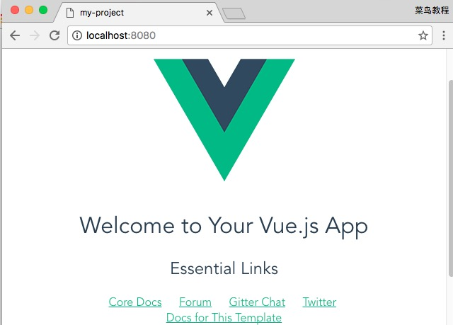
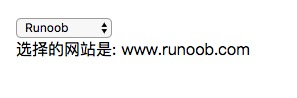
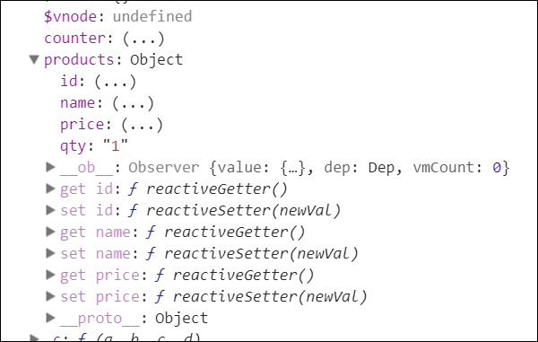
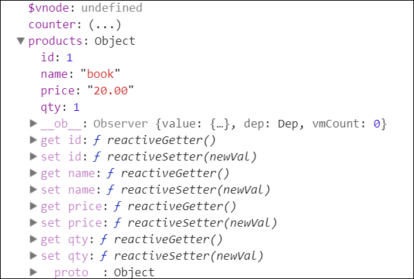
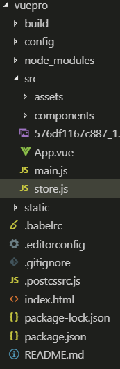

# 1. Vue.js

## 1.1. Vue.js是什么?

```
1). 作用: 动态构建用户界面
2). 特点:
	* 遵循MVVM模式
	* 编码简洁, 体积小, 运行效率高, 移动/PC端开发
	* 它本身只关注UI, 可以轻松引入vue插件和其它第三库开发项目
3). 与其它框架的关联:
	* 借鉴angular的模板和数据绑定技术
	* 借鉴react的组件化和虚拟DOM技术
4). vue包含一系列的扩展插件(库):
	* vue-cli: vue脚手架
	* vue-resource(axios): ajax请求
	* vue-router: 路由
	* vuex: 状态管理
	* vue-lazyload: 图片懒加载
	* vue-scroller: 页面滑动相关
	* element-ui: 基于vue的组件库(PC端)
	* mint-ui: 基于vue的组件库(移动端)
	
```

## 1.2. 基本使用

```
1). 引入vue.js
2). 创建Vue实例对象(vm), 指定选项(配置)对象
	el : 指定dom标签容器的选择器
	data : 指定初始化状态数据的对象/函数(返回一个对象)
3). 在页面模板中使用{{}}或vue指令
```

```vue
<!DOCTYPE html>
<html>
<head>
<meta charset="utf-8">
<title>Vue 测试实例 - 菜鸟教程(runoob.com)</title>
<script src="https://cdn.staticfile.org/vue/2.2.2/vue.min.js"></script>
</head>
<body>
<div id="app">
  <p>{{ message }}</p>
</div>

<script>
new Vue({
  el: '#app',
  data: {
    message: 'Hello Vue.js!'
  }
})
</script>
</body>
</html>
```

cdn

```js
<script src="https://cdn.staticfile.org/vue/2.2.2/vue.min.js"></script>
```


## 1.3. 安装-NPM 方法

由于 npm 安装速度慢，本教程使用了淘宝的镜像及其命令 cnpm

### 1.3.1. 使用淘宝 NPM 镜像

大家都知道国内直接使用 npm 的官方镜像是非常慢的，这里推荐使用淘宝 NPM 镜像。

淘宝 NPM 镜像是一个完整 npmjs.org 镜像，你可以用此代替官方版本(只读)，同步频率目前为 10分钟 一次以保证尽量与官方服务同步。

添加仓库地址

```shell
npm install --registry=https://registry.npm.taobao.org
```


你可以使用淘宝定制的 cnpm (gzip 压缩支持) 命令行工具代替默认的 npm:

```shell
$ npm install -g cnpm --registry=https://registry.npm.taobao.org
```

这样就可以使用 cnpm 命令来安装模块了：

```shell
$ cnpm install [name]
```

npm 版本需要大于 3.0，如果低于此版本需要升级它：

```shell
# 查看版本
$ npm -v
2.3.0

#升级 npm
cnpm install npm -g

# 升级或安装 cnpm
npm install cnpm -g
```

在用 Vue.js 构建大型应用时推荐使用 NPM 安装：

```shell
# 最新稳定版
$ npm install vue
```

如果你遇到了使用 npm 安 装node_modules 总是提示报错：报错: **npm resource busy or locked.....**。

可以先删除以前安装的 node_modules :

```shell
npm cache clean
npm install
```


### 1.3.2. 命令行工具

Vue.js 提供一个官方命令行工具，可用于快速搭建大型单页应用。

```shell
# 全局安装 vue-cli
$ cnpm install --global vue-cli
# 创建一个基于 webpack 模板的新项目
$ vue init webpack my-project
# 这里需要进行一些配置，默认回车即可
This will install Vue 2.x version of the template.

For Vue 1.x use: vue init webpack#1.0 my-project

? Project name my-project
? Project description A Vue.js project
? Author runoob <test@runoob.com>
? Vue build standalone
? Use ESLint to lint your code? Yes
? Pick an ESLint preset Standard
? Setup unit tests with Karma + Mocha? Yes
? Setup e2e tests with Nightwatch? Yes

   vue-cli · Generated "my-project".

   To get started:
   
     cd my-project
     npm install
     npm run dev
   
   Documentation can be found at https://vuejs-templates.github.io/webpack
```

进入项目，安装并运行：

```shell
$ cd my-project
$ cnpm install
$ cnpm run dev
 DONE  Compiled successfully in 4388ms

> Listening at http://localhost:8080
```

成功执行以上命令后访问 http://localhost:8080/，输出结果如下所示：



> **注意：**Vue.js 不支持 IE8 及其以下 IE 版本。


## 1.4. Vue对象的选项

上一章节中我们使用了 npm 安装项目，我们在 IDE（Eclipse、Atom等） 中打开该目录，结构如下所示：


### 1.4.1. 目录解析

| 目录/文件    | 说明                                                         |
| :----------- | :----------------------------------------------------------- |
| build        | 项目构建(webpack)相关代码                                    |
| config       | 配置目录，包括端口号等。我们初学可以使用默认的。             |
| node_modules | npm 加载的项目依赖模块                                       |
| src          | 这里是我们要开发的目录，基本上要做的事情都在这个目录里。里面包含了几个目录及文件：assets: 放置一些图片，如logo等。components: 目录里面放了一个组件文件，可以不用。App.vue: 项目入口文件，我们也可以直接将组件写这里，而不使用 components 目录。main.js: 项目的核心文件。 |
| static       | 静态资源目录，如图片、字体等。                               |
| test         | 初始测试目录，可删除                                         |
| .xxxx文件    | 这些是一些配置文件，包括语法配置，git配置等。                |
| index.html   | 首页入口文件，你可以添加一些 meta 信息或统计代码啥的。       |
| package.json | 项目配置文件。                                               |
| README.md    | 项目的说明文档，markdown 格式                                |

### 1.4.2. 起步

每个 Vue 应用都需要通过实例化 Vue 来实现。

语法格式如下：

```vue
var vm = new Vue({
  // 选项
})
```

接下来让我们通过实例来看下 Vue 构造器中需要哪些内容：

实例

```vue
<div id="vue_det">
    <h1>site : {{site}}</h1>
    <h1>url : {{url}}</h1>
    <h1>{{details()}}</h1>
</div>
<script type="text/javascript">
    var vm = new Vue({
        el: '#vue_det',
        data: {
            site: "菜鸟教程",
            url: "www.runoob.com",
            alexa: "10000"
        },
        methods: {
            details: function() {
                return  this.site + " - 学的不仅是技术，更是梦想！";
            }
        }
    })
</script>
```

可以看到在 Vue 构造器中有一个el 参数，它是 DOM 元素中的 id。在上面实例中 id 为 vue_det，在 div 元素中：

```
<div id = "vue_det"></div>
```

这意味着我们接下来的改动全部在以上指定的 div 内，div 外部不受影响。

接下来我们看看如何定义数据对象。

**data** 用于定义属性，实例中有三个属性分别为：site、url、alexa。

**methods** 用于定义的函数，可以通过 return 来返回函数值。

**{{ }}** 用于输出对象属性和函数返回值。

```
<div id="vue_det">
    <h1>site : {{site}}</h1>
    <h1>url : {{url}}</h1>
    <h1>{{details()}}</h1>
</div>
```

当一个 Vue 实例被创建时，它向 Vue 的响应式系统中加入了其 data 对象中能找到的所有的属性。当这些属性的值发生改变时，html 视图将也会产生相应的变化。

```vue
<div id="vue_det">
    <h1>site : {{site}}</h1>
    <h1>url : {{url}}</h1>
    <h1>Alexa : {{alexa}}</h1>
</div>
<script type="text/javascript">
// 我们的数据对象
var data = { site: "菜鸟教程", url: "www.runoob.com", alexa: 10000}
var vm = new Vue({
    el: '#vue_det',
    data: data
})
// 它们引用相同的对象！
document.write(vm.site === data.site) // true
document.write("<br>")
// 设置属性也会影响到原始数据
vm.site = "Runoob"
document.write(data.site + "<br>") // Runoob
 
// ……反之亦然
data.alexa = 1234
document.write(vm.alexa) // 1234
</script>
```

### 1.4.3. 模板语法

**使用 v-html 指令用于输出 html 代码：**

```vue
<div id="app">
    <div v-html="message"></div>
</div>
    
<script>
new Vue({
  el: '#app',
  data: {
    message: '<h1>菜鸟教程</h1>'
  }
})
</script>
```

**属性**

HTML 属性中的值应使用 v-bind 指令。

以下实例判断 class1 的值，如果为 true 使用 class1 类的样式，否则不使用该类：

```html
<!DOCTYPE html>
<html>
<head>
<meta charset="utf-8">
<title>Vue 测试实例 - 菜鸟教程(runoob.com)</title>
</head>
<style>
.class1{
  background: #444;
  color: #eee;
}
</style>
<body>
<script src="https://cdn.staticfile.org/vue/2.2.2/vue.min.js"></script>

<div id="app">
  <label for="r1">修改颜色</label><input type="checkbox" v-model="use" id="r1">
  <br><br>
  <div v-bind:class="{'class1': use}">
    v-bind:class 指令
  </div>
</div>
    
<script>
new Vue({
    el: '#app',
  data:{
      use: false
  }
});
</script>
</body>
```

**指令**

指令是带有 v- 前缀的特殊属性。

指令用于在表达式的值改变时，将某些行为应用到 DOM 上。如下例子：

```html
<div id="app">
    <p v-if="seen">现在你看到我了</p>
</div>
```

### 1.4.4. 参数

参数在指令后以冒号指明。例如， v-bind 指令被用来响应地更新 HTML 属性：

```html
<div id="app">
    <pre><a v-bind:href="url">菜鸟教程</a></pre>
</div>
    
```

在这里 href 是参数，告知 v-bind 指令将该元素的 href 属性与表达式 url 的值绑定。

另一个例子是 v-on 指令，它用于监听 DOM 事件：

```
<a v-on:click="doSomething">
```

在这里参数是监听的事件名。

**修饰符**

修饰符是以半角句号 **.** 指明的特殊后缀，用于指出一个指令应该以特殊方式绑定。例如，**.prevent** 修饰符告诉 **v-on** 指令对于触发的事件调用 **event.preventDefault()**：

```
<form v-on:submit.prevent="onSubmit"></form>
```

### 1.4.5. ==用户输入==

在 input 输入框中我们可以使用 v-model 指令来实现双向数据绑定：

```html
<div id="app">
    <p>{{ message }}</p>
    <input v-model="message">
</div>
    
<script>
new Vue({
  el: '#app',
  data: {
    message: 'Runoob!'
  }
})
</script>
```

**==v-model==** 指令用来在 input、select、textarea、checkbox、radio 等表单控件元素上创建双向数据绑定，根据表单上的值，自动更新绑定的元素的值。

按钮的事件我们可以使用 **v-on** 监听事件，并对用户的输入进行响应。

**过滤器**

Vue.js 允许你自定义过滤器，被用作一些常见的文本格式化。由"管道符"指示, 格式如下：

```html
<!-- 在两个大括号中 -->
{{ message | capitalize }}

<!-- 在 v-bind 指令中 -->
<div v-bind:id="rawId | formatId"></div>
```

过滤器函数接受表达式的值作为第一个参数。

以下实例对输入的字符串第一个字母转为大写：

```html
<div id="app">
  {{ message | capitalize }}
</div>
    
<script>
new Vue({
  el: '#app',
  data: {
    message: 'runoob'
  },
  filters: {
    capitalize: function (value) {
      if (!value) return ''
      value = value.toString()
      return value.charAt(0).toUpperCase() + value.slice(1)
    }
  }
})
</script>
```


过滤器可以串联：

```
{{ message | filterA | filterB }}
```

过滤器是 JavaScript 函数，因此可以接受参数：

```
{{ message | filterA('arg1', arg2) }}
```

这里，message 是第一个参数，字符串 'arg1' 将传给过滤器作为第二个参数， arg2 表达式的值将被求值然后传给过滤器作为第三个参数。

**缩写**

v-bind 缩写

Vue.js 为两个最为常用的指令提供了特别的缩写：

```
<!-- 完整语法 -->
<a v-bind:href="url"></a>
<!-- 缩写 -->
<a :href="url"></a>
```

v-on 缩写

```
<!-- 完整语法 -->
<a v-on:click="doSomething"></a>
<!-- 缩写 -->
<a @click="doSomething"></a>
```

### 1.4.6. 条件

```
<div id="app">
    <div v-if="type === 'A'">
      A
    </div>
    <div v-else-if="type === 'B'">
      B
    </div>
    <div v-else-if="type === 'C'">
      C
    </div>
    <div v-else>
      Not A/B/C
    </div>
</div>
    
<script>
new Vue({
  el: '#app',
  data: {
    type: 'C'
  }
})
</script>
```

**v-show**

我们也可以使用 v-show 指令来根据条件展示元素：

v-show 指令

```
<h1 v-show="ok">Hello!</h1>
```

### 1.4.7. 循环语句

循环使用 v-for 指令。

v-for 指令需要以 **site in sites** 形式的特殊语法， sites 是源数据数组并且 site 是数组元素迭代的别名。

v-for 可以绑定数据到数组来渲染一个列表：

```
<div id="app">
  <ol>
    <li v-for="site in sites">
      {{ site.name }}
    </li>
  </ol>
</div>
 
<script>
new Vue({
  el: '#app',
  data: {
    sites: [
      { name: 'Runoob' },
      { name: 'Google' },
      { name: 'Taobao' }
    ]
  }
})
</script>
```

**v-for 迭代对象**

v-for 可以通过一个对象的属性来迭代数据：

```
<div id="app">
  <ul>
    <li v-for="value in object">
    {{ value }}
    </li>
  </ul>
</div>
 
<script>
new Vue({
  el: '#app',
  data: {
    object: {
      name: '菜鸟教程',
      url: 'http://www.runoob.com',
      slogan: '学的不仅是技术，更是梦想！'
    }
  }
})
</script>

```

你也可以提供第二个的参数为键名：

```
<!DOCTYPE html>
<html>
<head>
<meta charset="utf-8">
<title>Vue 测试实例 - 菜鸟教程(runoob.com)</title>
<script src="https://cdn.staticfile.org/vue/2.2.2/vue.min.js"></script>
</head>
<body>
<div id="app">
  <ul>
    <li v-for="(value, key) in object">
    {{ key }} : {{ value }}
    </li>
  </ul>
</div>

<script>
new Vue({
  el: '#app',
  data: {
    object: {
      name: '菜鸟教程',
      url: 'http://www.runoob.com',
      slogan: '学的不仅是技术，更是梦想！'
    }
  }
})
</script>
</body>
</html>
```

第三个参数为索引：

```
<div id="app">
  <ul>
    <li v-for="(value, key, index) in object">
     {{ index }}. {{ key }} : {{ value }}
    </li>
  </ul>
</div>
```

### 1.4.8. 计算属性

computer 属性“依赖缓存”的概念以及与 method 的差别。如下面代码，cnt 是独立于 vm 对象的变量。在使用 reversedMessage 这个计算属性的时候，第一次会执行代码，得到一个值，以后再使用 reversedMessage 这个计算属性，因为 vm 对象没有发生改变，于是界面渲染就直接用这个值，不再重复执行代码。而 reversedMessage2 没有这个缓存，只要用一次，函数代码就执行一次，于是每次返回值都不一样。


当你没有使用到计算属性的依赖缓存的时候，可以使用定义方法来代替计算属性，在 methods 里定义一个方法可以实现相同的效果，甚至该方法还可以接受参数，使用起来更灵活。

### 1.4.9. Vue.js 监听属性


```html
<div id = "app">
    <p style = "font-size:25px;">计数器: {{ counter }}</p>
    <button @click = "counter++" style = "font-size:25px;">点我</button>
</div>
<script type = "text/javascript">
var vm = new Vue({
    el: '#app',
    data: {
        counter: 1
    }
});
vm.$watch('counter', function(nval, oval) {
    alert('计数器值的变化 :' + oval + ' 变为 ' + nval + '!');
});
</script>
```

### 1.4.10. 样式绑定

**Vue.js class**

class 与 style 是 HTML 元素的属性，用于设置元素的样式，我们可以用 v-bind 来设置样式属性。

Vue.js v-bind 在处理 class 和 style 时， 专门增强了它。表达式的结果类型除了字符串之外，还可以是对象或数组。

```
<div class="active"></div>
```

### 1.4.11. Vue.js 事件处理器

通常情况下，我们需要使用一个方法来调用 JavaScript 方法。

v-on 可以接收一个定义的方法来调用。

```html
<!DOCTYPE html>
<html>
<head>
<meta charset="utf-8">
<title>Vue 测试实例 - 菜鸟教程(runoob.com)</title>
<script src="https://cdn.staticfile.org/vue/2.2.2/vue.min.js"></script>
</head>
<body>
<div id="app">
   <!-- `greet` 是在下面定义的方法名 -->
  <button v-on:click="greet">Greet</button>
</div>

<script>
var app = new Vue({
  el: '#app',
  data: {
    name: 'Vue.js'
  },
  // 在 `methods` 对象中定义方法
  methods: {
    greet: function (event) {
      // `this` 在方法里指当前 Vue 实例
      alert('Hello ' + this.name + '!')
      // `event` 是原生 DOM 事件
	  if (event) {
		  alert(event.target.tagName)
	  }
    }
  }
})
// 也可以用 JavaScript 直接调用方法
app.greet() // -> 'Hello Vue.js!'
</script>
</body>
</html>
```

### 1.4.12. 事件修饰符

Vue.js 为 v-on 提供了事件修饰符来处理 DOM 事件细节，如：event.preventDefault() 或 event.stopPropagation()。

Vue.js通过由点(.)表示的指令后缀来调用修饰符。

- `.stop`
- `.prevent`
- `.capture`
- `.self`
- `.once`

```
<!-- 阻止单击事件冒泡 -->
<a v-on:click.stop="doThis"></a>
<!-- 提交事件不再重载页面 -->
<form v-on:submit.prevent="onSubmit"></form>
<!-- 修饰符可以串联  -->
<a v-on:click.stop.prevent="doThat"></a>
<!-- 只有修饰符 -->
<form v-on:submit.prevent></form>
<!-- 添加事件侦听器时使用事件捕获模式 -->
<div v-on:click.capture="doThis">...</div>
<!-- 只当事件在该元素本身（而不是子元素）触发时触发回调 -->
<div v-on:click.self="doThat">...</div>

<!-- click 事件只能点击一次，2.1.4版本新增 -->
<a v-on:click.once="doThis"></a>
```

### 1.4.13. 按键修饰符

Vue 允许为 v-on 在监听键盘事件时添加按键修饰符：

```
<!-- 只有在 keyCode 是 13 时调用 vm.submit() -->
<input v-on:keyup.13="submit">
```

记住所有的 keyCode 比较困难，所以 Vue 为最常用的按键提供了别名：

```
<!-- 同上 -->
<input v-on:keyup.enter="submit">
<!-- 缩写语法 -->
<input @keyup.enter="submit">
```

全部的按键别名：

- `.enter`
- `.tab`
- `.delete` (捕获 "删除" 和 "退格" 键)
- `.esc`
- `.space`
- `.up`
- `.down`
- `.left`
- `.right`
- `.ctrl`
- `.alt`
- `.shift`
- `.meta`

实例

```
<p><!-- Alt + C -->
<input @keyup.alt.67="clear">
<!-- Ctrl + Click -->
<div @click.ctrl="doSomething">Do something</div>
```

### 1.4.14. ==Vue.js 表单==

这节我们为大家介绍 Vue.js 表单上的应用。

你可以用 v-model 指令在表单控件元素上创建双向数据绑定。g](vue_res/


v-model 会根据控件类型自动选取正确的方法来更新元素。

## 1.5. 输入框

实例中演示了 input 和 textarea 元素中使用 v-model 实现双向数据绑定：

```html
<div id="app">
  <p>input 元素：</p>
  <input v-model="message" placeholder="编辑我……">
  <p>消息是: {{ message }}</p>
    
  <p>textarea 元素：</p>
  <p style="white-space: pre">{{ message2 }}</p>
  <textarea v-model="message2" placeholder="多行文本输入……"></textarea>
</div>
 
<script>
new Vue({
  el: '#app',
  data: {
    message: 'Runoob',
    message2: '菜鸟教程\r\nhttp://www.runoob.com'
  }
})
</script>
```


### 1.5.1. 复选框

复选框如果是一个为逻辑值，如果是多个则绑定到同一个数组：

## 1.6. 复选框

```
<div id="app">
  <p>单个复选框：</p>
  <input type="checkbox" id="checkbox" v-model="checked">
  <label for="checkbox">{{ checked }}</label>
    
  <p>多个复选框：</p>
  <input type="checkbox" id="runoob" value="Runoob" v-model="checkedNames">
  <label for="runoob">Runoob</label>
  <input type="checkbox" id="google" value="Google" v-model="checkedNames">
  <label for="google">Google</label>
  <input type="checkbox" id="taobao" value="Taobao" v-model="checkedNames">
  <label for="taobao">taobao</label>
  <br>
  <span>选择的值为: {{ checkedNames }}</span>
</div>
 
<script>
new Vue({
  el: '#app',
  data: {
    checked : false,
    checkedNames: []
  }
})
</script>
```


### 1.6.1. 单选按钮

以下实例中演示了单选按钮的双向数据绑定：

```
<div id="app">
  <input type="radio" id="runoob" value="Runoob" v-model="picked">
  <label for="runoob">Runoob</label>
  <br>
  <input type="radio" id="google" value="Google" v-model="picked">
  <label for="google">Google</label>
  <br>
  <span>选中值为: {{ picked }}</span>
</div>
 
<script>
new Vue({
  el: '#app',
  data: {
    picked : 'Runoob'
  }
})
</script>
```


选中后，效果如下图所示g](vue_res/vue_res/


### 1.6.2. select 列表

以下实例中演示了下拉列表的双向数据绑定：

```
<div id="app">
  <select v-model="selected" name="fruit">
    <option value="">选择一个网站</option>
    <option value="www.runoob.com">Runoob</option>
    <option value="www.google.com">Google</option>
  </select>
 
  <div id="output">
      选择的网站是: {{selected}}
  </div>
</div>
 
<script>
new Vue({
  el: '#app',
  data: {
    selected: '' 
  }
})
</script>
```


选取 Runoob，g](vue_res/(vue_res/如下所示：



------

### 1.6.3. 修饰符

#### 1.6.3.1. .lazy

在默认情况下， v-model 在 input 事件中同步输入框的值与数据，但你可以添加一个修饰符 lazy ，从而转变为在 change 事件中同步：

```
<!-- 在 "change" 而不是 "input" 事件中更新 -->
<input v-model.lazy="msg" >
```

#### 1.6.3.2. .number

如果想自动将用户的输入值转为 Number 类型（如果原值的转换结果为 NaN 则返回原值），可以添加一个修饰符 number 给 v-model 来处理输入值：

```
<input v-model.number="age" type="number">
```

这通常很有用，因为在 type="number" 时 HTML 中输入的值也总是会返回字符串类型。

#### 1.6.3.3. .trim

如果要自动过滤用户输入的首尾空格，可以添加 trim 修饰符到 v-model 上过滤输入：

```
<input v-model.trim="msg">
```

### 1.6.4. ==Vue.js 组件==

组件（Component）是 Vue.js 最强大的功能之一。

组件可以扩展 HTML 元素，封装可重用的代码。

组件系统让我们可以用独立可复用的小组件来构建大型应用，几乎任意类型的g](vue_res/(vue_res/面都可以抽象为一个组件树：


注册一个全局组件语法格式如下：

```
Vue.component(tagName, options)
```

tagName 为组件名，options 为配置选项。注册后，我们可以使用以下方式来调用组件：

```
<tagName></tagName>
```

#### 1.6.4.1. 全局组件

所有实例都能用全局组件。

```
<div id="app">
    <runoob></runoob>
</div>
 
<script>
// 注册
Vue.component('runoob', {
  template: '<h1>自定义组件!</h1>'
})
// 创建根实例
new Vue({
  el: '#app'
})
</script>
```

#### 1.6.4.2. 局部组件

我们也可以在实例选项中注册局部组件，这样组件只能在这个实例中使用：

```
<div id="app">
    <runoob></runoob>
</div>
 
<script>
var Child = {
  template: '<h1>自定义组件!</h1>'
}
 
// 创建根实例
new Vue({
  el: '#app',
  components: {
    // <runoob> 将只在父模板可用
    'runoob': Child
  }
})
</script>
```

#### 1.6.4.3. Prop

prop 是父组件用来传递数据的一个自定义属性。

父组件的数据需要通过 props 把数据传给子组件，子组件需要显式地用 props 选项声明 "prop"：

```
<div id="app">
    <child message="hello!"></child>
</div>
 
<script>
// 注册
Vue.component('child', {
  // 声明 props
  props: ['message'],
  // 同样也可以在 vm 实例中像 "this.message" 这样使用
  template: '<span>{{ message }}</span>'
})
// 创建根实例
new Vue({
  el: '#app'
})
</script>
```

#### 1.6.4.4. 动态 Prop

类似于用 v-bind 绑定 HTML 特性到一个表达式，也可以用 v-bind 动态绑定 props 的值到父组件的数据中。每当父组件的数据变化时，该变化也会传导给子组件：

```
<div id="app">
    <div>
      <input v-model="parentMsg">
      <br>
      <child v-bind:message="parentMsg"></child>
    </div>
</div>
 
<script>
// 注册
Vue.component('child', {
  // 声明 props
  props: ['message'],
  // 同样也可以在 vm 实例中像 "this.message" 这样使用
  template: '<span>{{ message }}</span>'
})
// 创建根实例
new Vue({
  el: '#app',
  data: {
    parentMsg: '父组件内容'
  }
})
</script>
```

以下实例中将 v-bind 指令将 todo 传到每一个重复的组件中：

```
<div id="app">
    <ol>
    <todo-item v-for="item in sites" v-bind:todo="item"></todo-item>
      </ol>
</div>
 
<script>
Vue.component('todo-item', {
  props: ['todo'],
  template: '<li>{{ todo.text }}</li>'
})
new Vue({
  el: '#app',
  data: {
    sites: [
      { text: 'Runoob' },
      { text: 'Google' },
      { text: 'Taobao' }
    ]
  }
})
</script>
```

注意: prop 是单向绑定的：当父组件的属性变化时，将传导给子组件，但是不会反过来。

#### 1.6.4.5. Prop 验证

组件可以为 props 指定验证要求。

为了定制 prop 的验证方式，你可以为 props 中的值提供一个带有验证需求的对象，而不是一个字符串数组。例如：

```
Vue.component('my-component', {
  props: {
    // 基础的类型检查 (`null` 和 `undefined` 会通过任何类型验证)
    propA: Number,
    // 多个可能的类型
    propB: [String, Number],
    // 必填的字符串
    propC: {
      type: String,
      required: true
    },
    // 带有默认值的数字
    propD: {
      type: Number,
      default: 100
    },
    // 带有默认值的对象
    propE: {
      type: Object,
      // 对象或数组默认值必须从一个工厂函数获取
      default: function () {
        return { message: 'hello' }
      }
    },
    // 自定义验证函数
    propF: {
      validator: function (value) {
        // 这个值必须匹配下列字符串中的一个
        return ['success', 'warning', 'danger'].indexOf(value) !== -1
      }
    }
  }
})
```

当 prop 验证失败的时候，(开发环境构建版本的) Vue 将会产生一个控制台的警告。

type 可以是下面原生构造器：

- `String`
- `Number`
- `Boolean`
- `Array`
- `Object`
- `Date`
- `Function`
- `Symbol`

type 也可以是一个自定义构造器，使用 instanceof 检测。

------

#### 1.6.4.6. 自定义事件

父组件是使用 props 传递数据给子组件，但如果子组件要把数据传递回去，就需要使用自定义事件！

我们可以使用 v-on 绑定自定义事件, 每个 Vue 实例都实现了事件接口(Events interface)，即：

- 使用 `$on(eventName)` 监听事件
- 使用 `$emit(eventName)` 触发事件

另外，父组件可以在使用子组件的地方直接用 v-on 来监听子组件触发的事件。

以下实例中子组件已经和它外部完全解耦了。它所做的只是触发一个父组件关心的内部事件。

```
<div id="app">
    <div id="counter-event-example">
      <p>{{ total }}</p>
      <button-counter v-on:increment="incrementTotal"></button-counter>
      <button-counter v-on:increment="incrementTotal"></button-counter>
    </div>
</div>
 
<script>
Vue.component('button-counter', {
  template: '<button v-on:click="incrementHandler">{{ counter }}</button>',
  data: function () {
    return {
      counter: 0
    }
  },
  methods: {
    incrementHandler: function () {
      this.counter += 1
      this.$emit('increment')
    }
  },
})
new Vue({
  el: '#counter-event-example',
  data: {
    total: 0
  },
  methods: {
    incrementTotal: function () {
      this.total += 1
    }
  }
})
</script>
```

如果你想在某个组件的根元素上监听一个原生事件。可以使用 .native 修饰 v-on 。例如：

```
<my-component v-on:click.native="doTheThing"></my-component>
```

data **必须是一个函数**

上面例子中，可以看到 button-counter 组件中的 data 不是一个对象，而是一个函数：

```
data: function () {
  return {
    count: 0
  }
}
```

这样的好处就是每个实例可以维护一份被返回对象的独立的拷贝，如果 data 是一个对象则会影响到其他实例，如下所示：

```
<div id="components-demo3" class="demo">
    <button-counter2></button-counter2>
    <button-counter2></button-counter2>
    <button-counter2></button-counter2>
</div>
 
<script>
var buttonCounter2Data = {
  count: 0
}
Vue.component('button-counter2', {
    /*
    data: function () {
        // data 选项是一个函数，组件不相互影响
        return {
            count: 0
        }
    },
    */
    data: function () {
        // data 选项是一个对象，会影响到其他实例
        return buttonCounter2Data
    },
    template: '<button v-on:click="count++">点击了 {{ count }} 次。</button>'
})
new Vue({ el: '#components-demo3' })
</script>
```

### 1.6.5. Vue.js 自定义指令

除了默认设置的核心指令( v-model 和 v-show ), Vue 也允许注册自定义指令。

下面我们注册一个全局指令 v-focus, 该指令的功能是在页面加载时，元素获得焦点：

```
<div id="app">
    <p>页面载入时，input 元素自动获取焦点：</p>
    <input v-focus>
</div>
 
<script>
// 注册一个全局自定义指令 v-focus
Vue.directive('focus', {
  // 当绑定元素插入到 DOM 中。
  inserted: function (el) {
    // 聚焦元素
    el.focus()
  }
})
// 创建根实例
new Vue({
  el: '#app'
})
</script>	
```

我们也可以在实例使用 directives 选项来注册局部指令，这样指令只能在这个实例中使用：

```
<div id="app">
  <p>页面载入时，input 元素自动获取焦点：</p>
  <input v-focus>
</div>
 
<script>
// 创建根实例
new Vue({
  el: '#app',
  directives: {
    // 注册一个局部的自定义指令 v-focus
    focus: {
      // 指令的定义
      inserted: function (el) {
        // 聚焦元素
        el.focus()
      }
    }
  }
})
</script>
```

### 1.6.6. 钩子

#### 1.6.6.1. 钩子函数

指令定义函数提供了几个钩子函数（可选）：

- `bind`: 只调用一次，指令第一次绑定到元素时调用，用这个钩子函数可以定义一个在绑定时执行一次的初始化动作。
- `inserted`: 被绑定元素插入父节点时调用（父节点存在即可调用，不必存在于 document 中）。
- `update`: 被绑定元素所在的模板更新时调用，而不论绑定值是否变化。通过比较更新前后的绑定值，可以忽略不必要的模板更新（详细的钩子函数参数见下）。
- `componentUpdated`: 被绑定元素所在模板完成一次更新周期时调用。
- `unbind`: 只调用一次， 指令与元素解绑时调用。

#### 1.6.6.2. 钩子函数参数

钩子函数的参数有：

- **el**: 指令所绑定的元素，可以用来直接操作 DOM 。

- binding

  : 一个对象，包含以下属性：

  - **name**: 指令名，不包括 `v-` 前缀。
  - **value**: 指令的绑定值， 例如： `v-my-directive="1 + 1"`, value 的值是 `2`。
  - **oldValue**: 指令绑定的前一个值，仅在 `update` 和 `componentUpdated` 钩子中可用。无论值是否改变都可用。
  - **expression**: 绑定值的表达式或变量名。 例如 `v-my-directive="1 + 1"` ， expression 的值是 `"1 + 1"`。
  - **arg**: 传给指令的参数。例如 `v-my-directive:foo`， arg 的值是 `"foo"`。
  - **modifiers**: 一个包含修饰符的对象。 例如： `v-my-directive.foo.bar`, 修饰符对象 modifiers 的值是 `{ foo: true, bar: true }`。

- **vnode**: Vue 编译生成的虚拟节点。

- **oldVnode**: 上一个虚拟节点，仅在 `update` 和 `componentUpdated` 钩子中可用。

```
<div id="app"  v-runoob:hello.a.b="message">
</div>
 
<script>
Vue.directive('runoob', {
  bind: function (el, binding, vnode) {
    var s = JSON.stringify
    el.innerHTML =
      'name: '       + s(binding.name) + '<br>' +
      'value: '      + s(binding.value) + '<br>' +
      'expression: ' + s(binding.expression) + '<br>' +
      'argument: '   + s(binding.arg) + '<br>' +
      'modifiers: '  + s(binding.modifiers) + '<br>' +
      'vnode keys: ' + Object.keys(vnode).join(', ')
  }
})
new Vue({
  el: '#app',
  data: {
    message: '菜鸟教程!'
  }
})
</script>
```

有时候我们不需要其他钩子函数，我们可以简写函数，如下格式：

```
Vue.directive('runoob', function (el, binding) {
  // 设置指令的背景颜色
  el.style.backgroundColor = binding.value.color
})
```

指令函数可接受所有合法的 JavaScript 表达式，以下实例传入了 JavaScript 对象：

```
<div id="app">
    <div v-runoob="{ color: 'green', text: '菜鸟教程!' }"></div>
</div>
 
<script>
Vue.directive('runoob', function (el, binding) {
    // 简写方式设置文本及背景颜色
    el.innerHTML = binding.value.text
    el.style.backgroundColor = binding.value.color
})
new Vue({
  el: '#app'
})
</script>
```

### 1.6.7. Vue.js 路由

Vue.js 路由允许我们通过不同的 URL 访问不同的内容。

通过 Vue.js 可以实现多视图的单页Web应用（single page web application，SPA）。

Vue.js 路由需要载入 [vue-router 库](https://github.com/vuejs/vue-router)

中文文档地址：[vue-router文档](http://router.vuejs.org/zh-cn/)。

#### 1.6.7.1. 安装

##### 1.6.7.1.1. 1、直接下载 / CDN

```
https://unpkg.com/vue-router/dist/vue-router.js
```

##### 1.6.7.1.2. NPM

推荐使用淘宝镜像：

```
cnpm install vue-router
```

#### 1.6.7.2. 简单实例

Vue.js + vue-router 可以很简单的实现单页应用。

**<router-link>** 是一个组件，该组件用于设置一个导航链接，切换不同 HTML 内容。 **to** 属性为目标地址， 即要显示的内容。

以下实例中我们将 vue-router 加进来，然后配置组件和路由映射，再告诉 vue-router 在哪里渲染它们。代码如下所示：

```html
<script src="https://unpkg.com/vue/dist/vue.js"></script>
<script src="https://unpkg.com/vue-router/dist/vue-router.js"></script>
 
<div id="app">
  <h1>Hello App!</h1>
  <p>
    <!-- 使用 router-link 组件来导航. -->
    <!-- 通过传入 `to` 属性指定链接. -->
    <!-- <router-link> 默认会被渲染成一个 `<a>` 标签 -->
    <router-link to="/foo">Go to Foo</router-link>
    <router-link to="/bar">Go to Bar</router-link>
  </p>
  <!-- 路由出口 -->
  <!-- 路由匹配到的组件将渲染在这里 -->
  <router-view></router-view>
</div>
```

```js
// 0. 如果使用模块化机制编程，导入 Vue 和 VueRouter，要调用 Vue.use(VueRouter)
 
// 1. 定义（路由）组件。
// 可以从其他文件 import 进来
const Foo = { template: '<div>foo</div>' }
const Bar = { template: '<div>bar</div>' }
 
// 2. 定义路由
// 每个路由应该映射一个组件。 其中"component" 可以是
// 通过 Vue.extend() 创建的组件构造器，
// 或者，只是一个组件配置对象。
// 我们晚点再讨论嵌套路由。
const routes = [
  { path: '/foo', component: Foo },
  { path: '/bar', component: Bar }
]
 
// 3. 创建 router 实例，然后传 `routes` 配置
// 你还可以传别的配置参数, 不过先这么简单着吧。
const router = new VueRouter({
  routes // （缩写）相当于 routes: routes
})
 
// 4. 创建和挂载根实例。
// 记得要通过 router 配置参数注入路由，
// 从而让整个应用都有路由功能
const app = new Vue({
  router
}).$mount('#app')
 
// 现在，应用已经启动了！
```

点击过的导航链接都会加上样式 **class ="router-link-exact-active router-link-active"**。

#### 1.6.7.3. <router-link> 相关属性

接下来我们可以了解下更多关于 <router-link> 的属性。

##### 1.6.7.3.1. to

表示目标路由的链接。 当被点击后，内部会立刻把 to 的值传到 router.push()，所以这个值可以是一个字符串或者是描述目标位置的对象。

```
<!-- 字符串 -->
<router-link to="home">Home</router-link>
<!-- 渲染结果 -->
<a href="home">Home</a>

<!-- 使用 v-bind 的 JS 表达式 -->
<router-link v-bind:to="'home'">Home</router-link>

<!-- 不写 v-bind 也可以，就像绑定别的属性一样 -->
<router-link :to="'home'">Home</router-link>

<!-- 同上 -->
<router-link :to="{ path: 'home' }">Home</router-link>

<!-- 命名的路由 -->
<router-link :to="{ name: 'user', params: { userId: 123 }}">User</router-link>

<!-- 带查询参数，下面的结果为 /register?plan=private -->
<router-link :to="{ path: 'register', query: { plan: 'private' }}">Register</router-link>
```

##### 1.6.7.3.2. replace

设置 replace 属性的话，当点击时，会调用 router.replace() 而不是 router.push()，导航后不会留下 history 记录。

```
<router-link :to="{ path: '/abc'}" replace></router-link>
```

##### 1.6.7.3.3. append

设置 append 属性后，则在当前 (相对) 路径前添加基路径。例如，我们从 /a 导航到一个相对路径 b，如果没有配置 append，则路径为 /b，如果配了，则为 /a/b

```
<router-link :to="{ path: 'relative/path'}" append></router-link>
```

##### 1.6.7.3.4. tag

有时候想要 `<router-link>` 渲染成某种标签，例如 `<li>`。 于是我们使用 `tag` prop 类指定何种标签，同样它还是会监听点击，触发导航。

```
<router-link to="/foo" tag="li">foo</router-link>
<!-- 渲染结果 -->
<li>foo</li>
```

##### 1.6.7.3.5. active-class

设置 链接激活时使用的 CSS 类名。可以通过以下代码来替代。

```
<style>
   ._active{
      background-color : red;
   }
</style>
<p>
   <router-link v-bind:to = "{ path: '/route1'}" active-class = "_active">Router Link 1</router-link>
   <router-link v-bind:to = "{ path: '/route2'}" tag = "span">Router Link 2</router-link>
</p>
```

注意这里 **class** 使用 **active_class="_active"**。

##### 1.6.7.3.6. exact-active-class

配置当链接被精确匹配的时候应该激活的 class。可以通过以下代码来替代。

```
<p>
   <router-link v-bind:to = "{ path: '/route1'}" exact-active-class = "_active">Router Link 1</router-link>
   <router-link v-bind:to = "{ path: '/route2'}" tag = "span">Router Link 2</router-link>
</p>
```

##### 1.6.7.3.7. event

声明可以用来触发导航的事件。可以是一个字符串或是一个包含字符串的数组。

```
<router-link v-bind:to = "{ path: '/route1'}" event = "mouseover">Router Link 1</router-link>
```

以上代码设置了 event 为 mouseover ，及在鼠标移动到 Router Link 1 上时导航的 HTML 内容会发生改变。

#### 1.6.7.4. NPM 路由实例

接下来我们演示了一个使用 npm 简单的路由实例，开始前，请先下载该实例源代码：

路由实例


你也可以在 Github 上下载：<https://github.com/chrisvfritz/vue-2.0-simple-routing-example>

下载完后，解压该目录，重命名目录为 vue-demo，vu 并进入该目录，执行以下命令：

```
# 安装依赖，使用淘宝资源命令 cnpm
cnpm install

# 启动应用，地址为 localhost:8080
cnpm run dev
```

如果你需要发布到正式环境可以执行以下命令：

```
cnpm run build
```

执行成功后，访g](vue_res/ttp://localhost:8080 即可看到如下界面：


### 1.6.8. Vue.js Ajax(axios)
#### 1.6.8.1. test
Vue.js 2.0 版本推荐使用 axios 来完成 ajax 请求。

Axios 是一个基于 Promise 的 HTTP 库，可以用在浏览器和 node.js 中。

Github开源地址： <https://github.com/axios/axios>

##### 1.6.8.1.1. 安装方法

**使用 cdn:**

```
<script src="https://unpkg.com/axios/dist/axios.min.js"></script>
```

或

```
<script src="https://cdn.staticfile.org/axios/0.18.0/axios.min.js"></script>
```

**使用 npm:**

```
$ npm install axios
```

**使用 bower:**

```
$ bower install axios
```

**使用 yarn:**

```
$ yarn add axios
```

##### 1.6.8.1.2. GET 方法

我们可以简单的读取 JSON 数据：

```
new Vue({
  el: '#app',
  data () {
    return {
      info: null
    }
  },
  mounted () {
    axios
      .get('https://www.runoob.com/try/ajax/json_demo.json')
      .then(response => (this.info = response))
      .catch(function (error) { // 请求失败处理
        console.log(error);
      });
  }
})
```

使用 **response.data** 读取 JSON 数据：

```
<div id="app">
  <h1>网站列表</h1>
  <div
    v-for="site in info"
  >
    {{ site.name }}
  </div>
</div>
<script type = "text/javascript">
new Vue({
  el: '#app',
  data () {
    return {
      info: null
    }
  },
  mounted () {
    axios
      .get('https://www.runoob.com/try/ajax/json_demo.json')
      .then(response => (this.info = response.data.sites))
      .catch(function (error) { // 请求失败处理
        console.log(error);
      });
  }
})
</script>
```

GET 方法传递参数格式如下：

```
// 直接在 URL 上添加参数 ID=12345
axios.get('/user?ID=12345')
  .then(function (response) {
    console.log(response);
  })
  .catch(function (error) {
    console.log(error);
  });
 
// 也可以通过 parmas 设置参数：
axios.get('/user', {
    params: {
      ID: 12345
    }
  })
  .then(function (response) {
    console.log(response);
  })
  .catch(function (error) {
    console.log(error);
  });
```

##### 1.6.8.1.3. POST 方法

```
new Vue({
  el: '#app',
  data () {
    return {
      info: null
    }
  },
  mounted () {
    axios
      .post('https://www.runoob.com/try/ajax/json_demo.json')
      .then(response => (this.info = response))
      .catch(function (error) { // 请求失败处理
        console.log(error);
      });
  }
})

```
POST 方法传递参数格式如下：
```
axios.post('/user', {
    firstName: 'Fred',        // 参数 firstName
    lastName: 'Flintstone'    // 参数 lastName
  })
  .then(function (response) {
    console.log(response);
  })
  .catch(function (error) {
    console.log(error);
  });
```

##### 1.6.8.1.4. 执行多个并发请求

```
function getUserAccount() {
  return axios.get('/user/12345');
}
 
function getUserPermissions() {
  return axios.get('/user/12345/permissions');
}
axios.all([getUserAccount(), getUserPermissions()])
  .then(axios.spread(function (acct, perms) {
    // 两个请求现在都执行完成
  }));
```

##### 1.6.8.1.5. axios API

可以通过向 axios 传递相关配置来创建请求。

```
axios(config)
// 发送 POST 请求
axios({
  method: 'post',
  url: '/user/12345',
  data: {
    firstName: 'Fred',
    lastName: 'Flintstone'
  }
});
//  GET 请求远程图片
axios({
  method:'get',
  url:'http://bit.ly/2mTM3nY',
  responseType:'stream'
})
  .then(function(response) {
  response.data.pipe(fs.createWriteStream('ada_lovelace.jpg'))
});
axios(url[, config])
// 发送 GET 请求（默认的方法）
axios('/user/12345');
```

##### 1.6.8.1.6. 请求方法的别名

为方便使用，官方为所有支持的请求方法提供了别名，可以直接使用别名来发起请求：

```
axios.request(config)
axios.get(url[, config])
axios.delete(url[, config])
axios.head(url[, config])
axios.post(url[, data[, config]])
axios.put(url[, data[, config]])
axios.patch(url[, data[, config]])
```

**注意：**在使用别名方法时， url、method、data 这些属性都不必在配置中指定。

##### 1.6.8.1.7. 并发

处理并发请求的助手函数：

```
axios.all(iterable)
axios.spread(callback)
```

##### 1.6.8.1.8. 创建实例

可以使用自定义配置新建一个 axios 实例：

```
axios.create([config])
const instance = axios.create({
  baseURL: 'https://some-domain.com/api/',
  timeout: 1000,
  headers: {'X-Custom-Header': 'foobar'}
});
```

##### 1.6.8.1.9. 实例方法

以下是可用的实例方法。指定的配置将与实例的配置合并：

```
axios#request(config)
axios#get(url[, config])
axios#delete(url[, config])
axios#head(url[, config])
axios#post(url[, data[, config]])
axios#put(url[, data[, config]])
axios#patch(url[, data[, config]])
```

##### 1.6.8.1.10. 请求配置项

下面是创建请求时可用的配置选项，注意只有 url 是必需的。如果没有指定 method，请求将默认使用 get 方法。

```
{
  // `url` 是用于请求的服务器 URL
  url: "/user",

  // `method` 是创建请求时使用的方法
  method: "get", // 默认是 get

  // `baseURL` 将自动加在 `url` 前面，除非 `url` 是一个绝对 URL。
  // 它可以通过设置一个 `baseURL` 便于为 axios 实例的方法传递相对 URL
  baseURL: "https://some-domain.com/api/",

  // `transformRequest` 允许在向服务器发送前，修改请求数据
  // 只能用在 "PUT", "POST" 和 "PATCH" 这几个请求方法
  // 后面数组中的函数必须返回一个字符串，或 ArrayBuffer，或 Stream
  transformRequest: [function (data) {
    // 对 data 进行任意转换处理

    return data;
  }],

  // `transformResponse` 在传递给 then/catch 前，允许修改响应数据
  transformResponse: [function (data) {
    // 对 data 进行任意转换处理

    return data;
  }],

  // `headers` 是即将被发送的自定义请求头
  headers: {"X-Requested-With": "XMLHttpRequest"},

  // `params` 是即将与请求一起发送的 URL 参数
  // 必须是一个无格式对象(plain object)或 URLSearchParams 对象
  params: {
    ID: 12345
  },

  // `paramsSerializer` 是一个负责 `params` 序列化的函数
  // (e.g. https://www.npmjs.com/package/qs, http://api.jquery.com/jquery.param/)
  paramsSerializer: function(params) {
    return Qs.stringify(params, {arrayFormat: "brackets"})
  },

  // `data` 是作为请求主体被发送的数据
  // 只适用于这些请求方法 "PUT", "POST", 和 "PATCH"
  // 在没有设置 `transformRequest` 时，必须是以下类型之一：
  // - string, plain object, ArrayBuffer, ArrayBufferView, URLSearchParams
  // - 浏览器专属：FormData, File, Blob
  // - Node 专属： Stream
  data: {
    firstName: "Fred"
  },

  // `timeout` 指定请求超时的毫秒数(0 表示无超时时间)
  // 如果请求话费了超过 `timeout` 的时间，请求将被中断
  timeout: 1000,

  // `withCredentials` 表示跨域请求时是否需要使用凭证
  withCredentials: false, // 默认的

  // `adapter` 允许自定义处理请求，以使测试更轻松
  // 返回一个 promise 并应用一个有效的响应 (查阅 [response docs](#response-api)).
  adapter: function (config) {
    /* ... */
  },

  // `auth` 表示应该使用 HTTP 基础验证，并提供凭据
  // 这将设置一个 `Authorization` 头，覆写掉现有的任意使用 `headers` 设置的自定义 `Authorization`头
  auth: {
    username: "janedoe",
    password: "s00pers3cret"
  },

  // `responseType` 表示服务器响应的数据类型，可以是 "arraybuffer", "blob", "document", "json", "text", "stream"
  responseType: "json", // 默认的

  // `xsrfCookieName` 是用作 xsrf token 的值的cookie的名称
  xsrfCookieName: "XSRF-TOKEN", // default

  // `xsrfHeaderName` 是承载 xsrf token 的值的 HTTP 头的名称
  xsrfHeaderName: "X-XSRF-TOKEN", // 默认的

  // `onUploadProgress` 允许为上传处理进度事件
  onUploadProgress: function (progressEvent) {
    // 对原生进度事件的处理
  },

  // `onDownloadProgress` 允许为下载处理进度事件
  onDownloadProgress: function (progressEvent) {
    // 对原生进度事件的处理
  },

  // `maxContentLength` 定义允许的响应内容的最大尺寸
  maxContentLength: 2000,

  // `validateStatus` 定义对于给定的HTTP 响应状态码是 resolve 或 reject  promise 。如果 `validateStatus` 返回 `true` (或者设置为 `null` 或 `undefined`)，promise 将被 resolve; 否则，promise 将被 rejecte
  validateStatus: function (status) {
    return status &gt;= 200 &amp;&amp; status &lt; 300; // 默认的
  },

  // `maxRedirects` 定义在 node.js 中 follow 的最大重定向数目
  // 如果设置为0，将不会 follow 任何重定向
  maxRedirects: 5, // 默认的

  // `httpAgent` 和 `httpsAgent` 分别在 node.js 中用于定义在执行 http 和 https 时使用的自定义代理。允许像这样配置选项：
  // `keepAlive` 默认没有启用
  httpAgent: new http.Agent({ keepAlive: true }),
  httpsAgent: new https.Agent({ keepAlive: true }),

  // "proxy" 定义代理服务器的主机名称和端口
  // `auth` 表示 HTTP 基础验证应当用于连接代理，并提供凭据
  // 这将会设置一个 `Proxy-Authorization` 头，覆写掉已有的通过使用 `header` 设置的自定义 `Proxy-Authorization` 头。
  proxy: {
    host: "127.0.0.1",
    port: 9000,
    auth: : {
      username: "mikeymike",
      password: "rapunz3l"
    }
  },

  // `cancelToken` 指定用于取消请求的 cancel token
  // （查看后面的 Cancellation 这节了解更多）
  cancelToken: new CancelToken(function (cancel) {
  })
}
```

##### 1.6.8.1.11. 响应结构

axios请求的响应包含以下信息：

```
{
  // `data` 由服务器提供的响应
  data: {},

  // `status`  HTTP 状态码
  status: 200,

  // `statusText` 来自服务器响应的 HTTP 状态信息
  statusText: "OK",

  // `headers` 服务器响应的头
  headers: {},

  // `config` 是为请求提供的配置信息
  config: {}
}
```

使用 then 时，会接收下面这样的响应：

```
axios.get("/user/12345")
  .then(function(response) {
    console.log(response.data);
    console.log(response.status);
    console.log(response.statusText);
    console.log(response.headers);
    console.log(response.config);
  });
```

在使用 `catch` 时，或传递 [rejection callback](https://developer.mozilla.org/en-US/docs/Web/JavaScript/Reference/Global_Objects/Promise/then) 作为 `then` 的第二个参数时，响应可以通过 `error` 对象可被使用。

##### 1.6.8.1.12. 配置的默认值

你可以指定将被用在各个请求的配置默认值。

全局的 axios 默认值：

```
axios.defaults.baseURL = 'https://api.example.com';
axios.defaults.headers.common['Authorization'] = AUTH_TOKEN;
axios.defaults.headers.post['Content-Type'] = 'application/x-www-form-urlencoded';
```

自定义实例默认值：

```
// 创建实例时设置配置的默认值
var instance = axios.create({
  baseURL: 'https://api.example.com'
});

// 在实例已创建后修改默认值
instance.defaults.headers.common['Authorization'] = AUTH_TOKEN;
```

##### 1.6.8.1.13. 配置的优先顺序

配置会以一个优先顺序进行合并。这个顺序是：在 lib/defaults.js 找到的库的默认值，然后是实例的 defaults 属性，最后是请求的 config 参数。后者将优先于前者。这里是一个例子：

```
// 使用由库提供的配置的默认值来创建实例
// 此时超时配置的默认值是 `0`
var instance = axios.create();

// 覆写库的超时默认值
// 现在，在超时前，所有请求都会等待 2.5 秒
instance.defaults.timeout = 2500;

// 为已知需要花费很长时间的请求覆写超时设置
instance.get('/longRequest', {
  timeout: 5000
});
```

##### 1.6.8.1.14. 拦截器

在请求或响应被 then 或 catch 处理前拦截它们。

```
// 添加请求拦截器
axios.interceptors.request.use(function (config) {
    // 在发送请求之前做些什么
    return config;
  }, function (error) {
    // 对请求错误做些什么
    return Promise.reject(error);
  });

// 添加响应拦截器
axios.interceptors.response.use(function (response) {
    // 对响应数据做点什么
    return response;
  }, function (error) {
    // 对响应错误做点什么
    return Promise.reject(error);
  });
```

如果你想在稍后移除拦截器，可以这样：

```
var myInterceptor = axios.interceptors.request.use(function () {/*...*/});
axios.interceptors.request.eject(myInterceptor);
```

可以为自定义 axios 实例添加拦截器。

```
var instance = axios.create();
instance.interceptors.request.use(function () {/*...*/});
```

错误处理：

```
axios.get('/user/12345')
  .catch(function (error) {
    if (error.response) {
      // 请求已发出，但服务器响应的状态码不在 2xx 范围内
      console.log(error.response.data);
      console.log(error.response.status);
      console.log(error.response.headers);
    } else {
      // Something happened in setting up the request that triggered an Error
      console.log('Error', error.message);
    }
    console.log(error.config);
  });
```

可以使用 validateStatus 配置选项定义一个自定义 HTTP 状态码的错误范围。

```
axios.get('/user/12345', {
  validateStatus: function (status) {
    return status < 500; // 状态码在大于或等于500时才会 reject
  }
})
```

##### 1.6.8.1.15. 取消

使用 cancel token 取消请求。

Axios 的 cancel token API 基于[cancelable promises proposal](https://github.com/tc39/proposal-cancelable-promises)

可以使用 CancelToken.source 工厂方法创建 cancel token，像这样：

```
var CancelToken = axios.CancelToken;
var source = CancelToken.source();

axios.get('/user/12345', {
  cancelToken: source.token
}).catch(function(thrown) {
  if (axios.isCancel(thrown)) {
    console.log('Request canceled', thrown.message);
  } else {
    // 处理错误
  }
});

// 取消请求（message 参数是可选的）
source.cancel('Operation canceled by the user.');
```

还可以通过传递一个 executor 函数到 CancelToken 的构造函数来创建 cancel token：

```
var CancelToken = axios.CancelToken;
var cancel;

axios.get('/user/12345', {
  cancelToken: new CancelToken(function executor(c) {
    // executor 函数接收一个 cancel 函数作为参数
    cancel = c;
  })
});

// 取消请求
cancel();
```

**注意**：可以使用同一个 cancel token 取消多个请求。

##### 1.6.8.1.16. 请求时使用 application/x-www-form-urlencoded

axios 会默认序列化 JavaScript 对象为 JSON。 如果想使用 application/x-www-form-urlencoded 格式，你可以使用下面的配置。

**浏览器**

在浏览器环境，你可以使用 URLSearchParams API：

```
const params = new URLSearchParams();
params.append('param1', 'value1');
params.append('param2', 'value2');
axios.post('/foo', params);
```

URLSearchParams 不是所有的浏览器均支持。

除此之外，你可以使用 qs 库来编码数据:

```
const qs = require('qs');
axios.post('/foo', qs.stringify({ 'bar': 123 }));

// Or in another way (ES6),

import qs from 'qs';
const data = { 'bar': 123 };
const options = {
  method: 'POST',
  headers: { 'content-type': 'application/x-www-form-urlencoded' },
  data: qs.stringify(data),
  url,
};
axios(options);
```

##### 1.6.8.1.17. Node.js 环境

在 node.js里, 可以使用 querystring 模块:

```
const querystring = require('querystring');
axios.post('http://something.com/', querystring.stringify({ foo: 'bar' }));
```

当然，同浏览器一样，你还可以使用 qs 库。

###### 1.6.8.1.17.1. Promises

axios 依赖原生的 ES6 Promise 实现而[被支持](http://caniuse.com/promises)。

如果你的环境不支持 ES6 Promise，你可以使用 [polyfill](https://github.com/jakearchibald/es6-promise)。

###### 1.6.8.1.17.2. TypeScript支持

axios 包含 TypeScript 的定义。

```
import axios from "axios";
axios.get("/user?ID=12345");
```

### 1.6.9. Vue.js Ajax(vue-resource)

Vue 要实现异步加载需要使用到 vue-resource 库。

Vue.js 2.0 版本推荐使用 [axios](https://www.runoob.com/vue2/vuejs-ajax-axios.html) 来完成 ajax 请求。

```
<script src="https://cdn.staticfile.org/vue-resource/1.5.1/vue-resource.min.js"></script>
```

#### 1.6.9.1. Get 请求

以下是一个简单的 Get 请求实例，请求地址是一个简单的 txt 文本：

##### 1.6.9.1.1. 实例

window.onload = function(){     var vm = new Vue({         el:'#box',         data:{             msg:'Hello World!',         },         methods:{             get:function(){                 //发送get请求                 this.$http.get('/try/ajax/ajax_info.txt').then(function(res){                     document.write(res.body);                     },function(){                     console.log('请求失败处理');                 });             }         }     }); }

尝试一下 »

如果需要传递数据，可以使用 **this.$http.get('get.php',{params : jsonData})** 格式，第二个参数 **jsonData** 就是传到后端的数据。

```
this.$http.get('get.php',{params : {a:1,b:2}}).then(function(res){
    document.write(res.body);    
},function(res){
    console.log(res.status);
});
```

#### 1.6.9.2. post 请求

post 发送数据到后端，需要第三个参数 **{emulateJSON:true}**。

emulateJSON 的作用： 如果Web服务器无法处理编码为 application/json 的请求，你可以启用 emulateJSON 选项。

##### 1.6.9.2.1. 实例

window.onload = function(){     var vm = new Vue({         el:'#box',         data:{             msg:'Hello World!',         },         methods:{             post:function(){                 //发送 post 请求                 this.$http.post('/try/ajax/demo_test_post.php',{name:"菜鸟教程",url:"http://www.runoob.com"},{emulateJSON:true}).then(function(res){                     document.write(res.body);                     },function(res){                     console.log(res.status);                 });             }         }     }); }

尝试一下 »

demo_test_post.php 代码如下：

```
<?php
$name = isset($_POST['name']) ? htmlspecialchars($_POST['name']) : '';
$city = isset($_POST['url']) ? htmlspecialchars($_POST['url']) : '';
echo '网站名: ' . $name;
echo "\n";
echo 'URL 地址: ' .$city;
?>
```

#### 1.6.9.3. 语法 & API

你可以使用全局对象方式 Vue.http 或者在一个 Vue 实例的内部使用 this.$http来发起 HTTP 请求。

```
// 基于全局Vue对象使用http
Vue.http.get('/someUrl', [options]).then(successCallback, errorCallback);
Vue.http.post('/someUrl', [body], [options]).then(successCallback, errorCallback);

// 在一个Vue实例内使用$http
this.$http.get('/someUrl', [options]).then(successCallback, errorCallback);
this.$http.post('/someUrl', [body], [options]).then(successCallback, errorCallback);
```

vue-resource 提供了 7 种请求 API(REST 风格)：

```
get(url, [options])
head(url, [options])
delete(url, [options])
jsonp(url, [options])
post(url, [body], [options])
put(url, [body], [options])
patch(url, [body], [options])
```

除了 jsonp 以外，另外 6 种的 API 名称是标准的 HTTP 方法。

options 参数说明:

| 参数        | 类型                           | 描述                                                         |
| :---------- | :----------------------------- | :----------------------------------------------------------- |
| url         | `string`                       | 请求的目标URL                                                |
| body        | `Object`, `FormData`, `string` | 作为请求体发送的数据                                         |
| headers     | `Object`                       | 作为请求头部发送的头部对象                                   |
| params      | `Object`                       | 作为URL参数的参数对象                                        |
| method      | `string`                       | HTTP方法 (例如GET，POST，...)                                |
| timeout     | `number`                       | 请求超时（单位：毫秒） (`0`表示永不超时)                     |
| before      | `function(request)`            | 在请求发送之前修改请求的回调函数                             |
| progress    | `function(event)`              | 用于处理上传进度的回调函数 ProgressEvent                     |
| credentials | `boolean`                      | 是否需要出示用于跨站点请求的凭据                             |
| emulateHTTP | `boolean`                      | 是否需要通过设置`X-HTTP-Method-Override`头部并且以传统POST方式发送PUT，PATCH和DELETE请求。 |
| emulateJSON | `boolean`                      | 设置请求体的类型为`application/x-www-form-urlencoded`        |

通过如下属性和方法处理一个请求获取到的响应对象：

| 属性       | 类型                       | 描述                                                |
| :--------- | :------------------------- | :-------------------------------------------------- |
| url        | `string`                   | 响应的 URL 源                                       |
| body       | `Object`, `Blob`, `string` | 响应体数据                                          |
| headers    | `Header`                   | 请求头部对象                                        |
| ok         | `boolean`                  | 当 HTTP 响应码为 200 到 299 之间的数值时该值为 true |
| status     | `number`                   | HTTP 响应码                                         |
| statusText | `string`                   | HTTP 响应状态                                       |
| **方法**   | **类型**                   | **描述**                                            |
| text()     | `约定值`                   | 以字符串方式返回响应体                              |
| json()     | `约定值`                   | 以格式化后的 json 对象方式返回响应体                |
| blob()     | `约定值`                   | 以二进制 Blob 对象方式返回响应体                    |

### 1.6.10. Vue.js 响应接口

Vue 可以添加数据动态响应接口。

例如以下实例，我们通过使用 $watch 属性来实现数据的监听，$watch 必须添加在 Vue 实例之外才能实现正确的响应。

实例中通过点击按钮计数器会加 1。setTimeout 设置 10 秒后计算器的值加上 20 。

#### 1.6.10.1. 实例
```
<div id = "app">
    <p style = "font-size:25px;">计数器: {{ counter }}</p>
    <button @click = "counter++" style = "font-size:25px;">点我</button>
</div>
<script type = "text/javascript">
var vm = new Vue({
    el: '#app',
    data: {
        counter: 1
    }
});
vm.$watch('counter', function(nval, oval) {
    alert('计数器值的变化 :' + oval + ' 变为 ' + nval + '!');
});
setTimeout(
    function(){
        vm.counter += 20;
    },10000
);
</script>
```
尝试一下 »

Vue 不允许在已经创建的实例上动态添加新的根级响应式属性。

Vue 不能检测到对象属性的添加或删除，最好的方式就是在初始化实例前声明根级响应式属性，哪怕只是一个空值。

如果我们需要在运行过程中实现属性的添加或删除，则可以使用全局 Vue，Vue.set 和 Vue.delete 方法。

#### 1.6.10.2. Vue.set

Vue.set 方法用于设置对象的属性，它可以解决 Vue 无法检测添加属性的限制，语法格式如下：

```
Vue.set( target, key, value )
```

参数说明：

- target: 可以是对象或数组
- key : 可以是字符串或数字
- value: 可以是任何类型

#### 1.6.10.3. 实例
```
<div id = "app">
   <p style = "font-size:25px;">计数器: {{ products.id }}</p>
   <button @click = "products.id++" style = "font-size:25px;">点我</button>
</div>
<script type = "text/javascript">
var myproduct = {"id":1, name:"book", "price":"20.00"};
   var vm = new Vue({
   el: '#app',
   data: {
      counter: 1,
      products: myproduct
   }
});
vm.products.qty = "1";
console.log(vm);
vm.$watch('counter', function(nval, oval) {
   alert('计数器值的变化 :' + oval + ' 变为 ' + nval + '!');
});
</script>
```


在以上实例中，使用以下代码在开始时创建了一个变量 myproduct：

```
var myproduct = {"id":1, name:"book", "price":"20.00"};
```

该变量在赋值给了 Vue 实例的 data 对象：
```
var vm = new Vue({ el: '#app', data: { counter: 1, products: myproduct } });
```
如果我们想给 myproduct 数组添加一个或多个属性，我们可以在 Vue 实例创建后使用以下代码：

```g](vue_res/m.products.qty = "1";

```

查看控制台输出：



如上图看到的，在产品中添加了数量属性 qty，但是 get/set 方法只可用于 id，name 和 price 属性，却不能在 qty 属性中使用。

我们不能通过添加 Vue 对象来实现响应。 Vue 主要在开始时创建所有属性。 如果我们要实现这个功能，可以通过 Vue.set 来实现：

#### 1.6.10.4. 实例
```
<div id = "app">
<p style = "font-size:25px;">计数器: {{ products.id }}</p>
<button @click = "products.id++" style = "font-size:25px;">点我</button>
</div>
<script type = "text/javascript">
var myproduct = {"id":1, name:"book", "price":"20.00"};
var vm = new Vue({
   el: '#app',
   data: {
      counter: 1,
      products: myproduct
   }
});
Vue.set(myproduct, 'qty', 1);
console.log(vm);
vm.$watch('counter', function(nval, oval) {
   alert('计数器值的变化 :' + ovg](vue_res/+ ' 变为 ' + nval + '!');
});
</script>
```




从控制台输出的结果可以看出 get/set 方法可用于qty 属性。

#### 1.6.10.5. Vue.delete

Vue.delete 用于删除动态添加的属性 语法格式：

```
Vue.delete( target, key )
```

参数说明：

- target: 可以是对象或数组
- key : 可以是字符串或数字

#### 1.6.10.6. 实例
```
<div id = "app">
   <p style = "font-size:25px;">计数器: {{ products.id }}</p>
   <button @click = "products.id++" style = "font-size:25px;">点我</button>
</div>
<script type = "text/javascript">
var myproduct = {"id":1, name:"book", "price":"20.00"};
var vm = new Vue({
   el: '#app',
   data: {
      counter: 1,
      products: myproduct
   }
});
Vue.delete(myproduct, 'price');
console.log(vm);
vm.$watch('counter', function(nval, oval) {
   alert('计数器值的变化 :' + oval + ' 变为 ' + nval + '!');
});
</scriptg](vue_res/```


以上实例中我们使用 Vue.delete 来删除 price 属性。以下是控制台输出结果：


从上图输出结果中，我们可以看到 price 属性已删除，只剩下了 id 和 name 属性，price 属性的 get/set 方法也已删除。

### Vue.js 实例

本章节为大家介绍几个 Vue.js 实例，通过实例练习来巩固学到的知识点。

#### 导航菜单实例

##### 导航菜单

创建一个简单的导航菜单：
```
<div id="main">

    <!-- 激活的菜单样式为  active 类 -->
    <!-- 为了阻止链接在点击时跳转，我们使用了 "prevent" 修饰符 (preventDefault 的简称)。 -->
    
    <nav v-bind:class="active" v-on:click.prevent>
    
        <!-- 当菜单上的链接被点击时，我们调用了 makeActive 方法, 该方法在 Vue 实例中创建。 -->
    
        <a href="#" class="home" v-on:click="makeActive('home')">Home</a>
        <a href="#" class="projects" v-on:click="makeActive('projects')">Projects</a>
        <a href="#" class="services" v-on:click="makeActive('services')">Services</a>
        <a href="#" class="contact" v-on:click="makeActive('contact')">Contact</a>
    </nav>
    
     <!-- 以下 "active" 变量会根据当前选中的值来自动变换 -->
    
    <p>您选择了 <b>{{active}} 菜单</b></p>
</div>

<script>
// 创建一个新的 Vue 实例
var demo = new Vue({
    // DOM 元素，挂载视图模型
    el: '#main',

    // 定义属性，并设置初始值
    data: {
        active: 'home'
    },
    
    // 点击菜单使用的函数
    methods: {
        makeActive: function(item){
            // 模型改变，视图会自动更新
            this.active = item;
        }
    }
});
</script>
```


#### 编辑文本实例

##### 文本编辑
```
点击指定文本编辑内容：

<!-- v-cloak 隐藏未编译的变量，直到 Vue 实例准备就绪。 -->
<!-- 元素点击后 hideTooltp() 方法被调用 -->

<div id="main" v-cloak v-on:click="hideTooltip">

    <!-- 这是一个提示框
         v-on:click.stop 是一个点击事件处理器，stop 修饰符用于阻止事件传递
         v-if 用来判断 show_tooltip 为 true 时才显示 -->
    
    <div class="tooltip" v-on:click.stop v-if="show_tooltip">
    
        <!-- v-model 绑定了文本域的内容
         在文本域内容改变时，对应的变量也会实时改变  -->
    
        <input type="text" v-model="text_content" />
    </div>
    
    <!-- 点击后调用 "toggleTooltip" 方法并阻止事件传递 -->
    
    <!--  "text_content" 变量根据文本域内容的变化而变化 -->
    
    <p v-on:click.stop="toggleTooltip">{{text_content}}</p>

</div>

<script>
var demo = new Vue({
    el: '#main',
    data: {
        show_tooltip: false,
        text_content: '点我，并编辑内容。'
    },
    methods: {
        hideTooltip: function(){
            // 在模型改变时，视图也会自动更新
            this.show_tooltip = false;
        },
        toggleTooltip: function(){
            this.show_tooltip = !this.show_tooltip;
        }
    }
})
</script>
```


#### 订单列表实例

##### 订单列表
```
创建一个订单列表，并计算总价：

<form id="main" v-cloak>

    <h1>Services</h1>
    
    <ul>
    
        <!-- 循环输出 services 数组, 设置选项点击后的样式 -->
    
        <li v-for="service in services" v-on:click="toggleActive(service)" v-bind:class="{ 'active': service.active}">
    
            <!-- 显示订单中的服务名，价格
                 Vue.js 定义了货币过滤器，用于格式化价格 -->
    
            {{service.name}} <span>{{service.price | currency}}</span>
    
        </li>
    </ul>
    
    <div class="total">
    
        <!-- 计算所有服务的价格，并格式化货币 -->
    
        Total: <span>{{total() | currency}}</span>
        
    </div>

</form>
<script>

// 自定义过滤器 "currency". 
Vue.filter('currency', function (value) {
    return '$' + value.toFixed(2);
});

var demo = new Vue({
    el: '#main',
    data: {
        // 定义模型属性 the model properties. The view will loop
        // 视图将循环输出数组的数据
        services: [
            {
                name: 'Web Development',
                price: 300,
                active:true
            },{
                name: 'Design',
                price: 400,
                active:false
            },{
                name: 'Integration',
                price: 250,
                active:false
            },{
                name: 'Training',
                price: 220,
                active:false
            }
        ]
    },
    methods: {
        toggleActive: function(s){
            s.active = !s.active;
        },
        total: function(){

            var total = 0;
    
            this.services.forEach(function(s){
                if (s.active){
                    total+= s.price;
                }
            });
    
           return total;
        }
    }
});
    </script>

```


#### 搜索页面实例

##### 搜索页面
```
在输入框输入搜索内容，列表显示配置的列表：

<form id="main" v-cloak>

    <div class="bar">
        <!-- searchString 模型与文本域创建绑定 -->
    
        <input type="text" v-model="searchString" placeholder="输入搜索内容" />
   </div>

    <ul>
        <!-- 循环输出数据 -->
    
        <li v-for="article in filteredArticles">
           <a v-bind:href="article.url"></a>
            <p>{{article.title}}</p>
       </li>
   </ul>

</form>
<script>

var demo = new Vue({
    el: '#main',
    data: {
        searchString: "",

       // 数据模型，实际环境你可以根据 Ajax 来获取
    
       articles: [
           {
               "title": "What You Need To Know About CSS Variables",
               "url": "https://www.runoob.com/css/css-tutorial.html",
               "image": "https://static.runoob.com/images/icon/css.png"
           },
           {
               "title": "Freebie: 4 Great Looking Pricing Tables",
               "url": "https://www.runoob.com/html/html-tutorial.html",
               "image": "https://static.runoob.com/images/icon/html.png"
            },
            {
                "title": "20 Interesting JavaScript and CSS Libraries for February 2016",
                "url": "https://www.runoob.com/css3/css3-tutorial.html",
                "image": "https://static.runoob.com/images/icon/css3.png"
            },
            {
                "title": "Quick Tip: The Easiest Way To Make Responsive Headers",
                "url": "https://www.runoob.com/css3/css3-tutorial.html",
                "image": "https://static.runoob.com/images/icon/css3.png"
            },
            {
                "title": "Learn SQL In 20 Minutes",
                "url": "https://www.runoob.com/sql/sql-tutorial.html",
                "image": "https://static.runoob.com/images/icon/sql.png"
            },
            {
                "title": "Creating Your First Desktop App With HTML, JS and Electron",
                "url": "https://www.runoob.com/js/js-tutorial.html",
                "image": "https://static.runoob.com/images/icon/html.png"
            }
        ]
    },
    computed: {
        // 计算数学，匹配搜索
        filteredArticles: function () {
            var articles_array = this.articles,
                searchString = this.searchString;
    
            if(!searchString){
                return articles_array;
            }
    
            searchString = searchString.trim().toLowerCase();
    
            articles_array = articles_array.filter(function(item){
                if(item.title.toLowerCase().indexOf(searchString) !== -1){
                    return item;
                }
            })
    
            // 返回过来后的数组
            return articles_array;;
        }
    }
    });
    </script>


```


#### 切换不同布局实例

##### 切换不同布局

点击右上角的按钮来切换不同页面布局：
```
<form id="main" v-cloak>

    <div class="bar">
    
        <!-- 两个按钮用于切换不同的列表布局 -->
    
        <a class="list-icon" v-bind:class="{ 'active': layout == 'list'}" v-on:click="layout = 'list'"></a>
        <a class="grid-icon" v-bind:class="{ 'active': layout == 'grid'}" v-on:click="layout = 'grid'"></a>
    </div>
    
    <!-- 我们设置了两套布局页面。使用哪套依赖于 "layout" 绑定 -->
    
    <ul v-if="layout == 'grid'" class="grid">
        <!-- 使用大图，没有文本 -->
        <li v-for="a in articles">
            <a v-bind:href="a.url" target="_blank"></a>
        </li>
    </ul>
    
    <ul v-if="layout == 'list'" class="list">
        <!-- 使用小图及标题 -->
        <li v-for="a in articles">
            <a v-bind:href="a.url" target="_blank"></a>
            <p>{{a.title}}</p>
        </li>
    </ul>
    </form>


<script>

    <script>
    var demo = new Vue({
        el: '#main',
        data: {
            // 视图模型，可能的值是 "grid" 或 "list"。
            layout: 'grid',
    
            articles: [{
                "title": "HTML 教程",
                "url": "https://www.runoob.com/html/html-tutorial.html",
                "image": {
                    "large": "https://static.runoob.com/images/mix/htmlbig.png",
                    "small": "https://static.runoob.com/images/icon/html.png"
                }
            },
            {
                "title": "CSS 教程",
                "url": "https://www.runoob.com/css/css-tutorial.html",
                "image": {
                    "large": "https://static.runoob.com/images/mix/cssbig.png",
                    "small": "https://static.runoob.com/images/icon/css.png"
                }
            },
            {
                "title": "JS 教程",
                "url": "https://www.runoob.com/js/js-tutorial.html",
                "image": {
                    "large": "https://static.runoob.com/images/mix/jsbig.jpeg",
                    "small": "https://static.runoob.com/images/icon/js.png"
                }
            },
            {
                "title": "SQL  教程",
                "url": "https://www.runoob.com/sql/sql-tutorial.html",
                "image": {
                    "large": "https://static.runoob.com/images/mix/sqlbig.png",
                    "small": "https://static.runoob.com/images/icon/sql.png"
                }
            },
            {
                "title": "Ajax 教程",
                "url": "https://www.runoob.com/ajax/ajax-tutorial.html",
                "image": {
                    "large": "https://static.runoob.com/images/mix/ajaxbig.png",
                    "small": "https://static.runoob.com/images/icon/ajax.png"
                }
            },
            {
                "title": "Python 教程",
                "url": "https://www.runoob.com/pyhton/pyhton-tutorial.html",
                "image": {
                    "large": "https://static.runoob.com/images/mix/pythonbig.png",
                    "small": "https://static.runoob.com/images/icon/python.png"
                }
            }]
    
        }
    });
    </script>


```
### 1). el

```
指定dom标签容器的选择器
Vue就会管理对应的标签及其子标签
```

### 2). data

```
对象或函数类型
指定初始化状态属性数据的对象
vm也会自动拥有data中所有属性
页面中可以直接访问使用
数据代理: 由vm对象来代理对data中所有属性的操作(读/写)
```

### 3). methods

```
包含多个方法的对象
供页面中的事件指令来绑定回调
回调函数默认有event参数, 但也可以指定自己的参数
所有的方法由vue对象来调用, 访问data中的属性直接使用this.xxx
```

### 4). computed

```
包含多个方法的对象
对状态属性进行计算返回一个新的数据, 供页面获取显示
一般情况下是相当于是一个只读的属性
利用set/get方法来实现属性数据的计算读取, 同时监视属性数据的变化
如何给对象定义get/set属性
	在创建对象时指定: get name () {return xxx} / set name (value) {}
  	对象创建之后指定: Object.defineProperty(obj, age, {get(){}, set(value){}})
```

### 5). watch

```
包含多个属性监视的对象
分为一般监视和深度监视
    xxx: function(value){}
	xxx : {
		deep : true,
		handler : fun(value)
	}
另一种添加监视方式: vm.$watch('xxx', function(value){})
```

## 4. 过渡动画

​```vue
<div id = "databinding">
<button v-on:click = "show = !show">点我</button>
<transition name = "fade">
    <p v-show = "show" v-bind:style = "styleobj">动画实例</p>
</transition>
</div>
<script type = "text/javascript">
var vm = new Vue({
el: '#databinding',
    data: {
        show:true,
        styleobj :{
            fontSize:'30px',
            color:'red'
        }
    },
    methods : {
    }
});
</script>
```


```
利用vue去操控css的transition/animation动画
模板: 使用<transition name='xxx'>包含带动画的标签
css样式
	.fade-enter-active: 进入过程, 指定进入的transition
	.fade-leave-active: 离开过程, 指定离开的transition
	.xxx-enter, .xxx-leave-to: 指定隐藏的样式
编码例子
    .xxx-enter-active, .xxx-leave-active {
      transition: opacity .5s
    }
    .xxx-enter, .xxx-leave-to {
      opacity: 0
    }
    
    <transition name="xxx">
      <p v-if="show">hello</p>
    </transition>
```

## 1.7. 生命周期

```
vm/组件对象
生命周期图
主要的生命周期函数(钩子)
	created() / mounted(): 启动异步任务(启动定时器,发送ajax请求, 绑定监听)
	beforeDestroy(): 做一些收尾的工作
```

## 1.8. 自定义过滤器

### 1.8.1.  理解

```
对需要显示的数据进行格式化后再显示
```

### 1.8.2.  编码

```
1). 定义过滤器
	Vue.filter(filterName, function(value[,arg1,arg2,...]){
	  // 进行一定的数据处理
	  return newValue
	})
2). 使用过滤器
	<div>{{myData | filterName}}</div>
	<div>{{myData | filterName(arg)}}</div>
```

## 1.9. vue内置指令

```
v-text/v-html: 指定标签体
	* v-text : 当作纯文本
	* v-html : 将value作为html标签来解析
v-if v-else v-show: 显示/隐藏元素
	* v-if : 如果vlaue为true, 当前标签会输出在页面中
	* v-else : 与v-if一起使用, 如果value为false, 将当前标签输出到页面中
	* v-show: 就会在标签中添加display样式, 如果vlaue为true, display=block, 否则是none
v-for : 遍历
	* 遍历数组 : v-for="(person, index) in persons"   
	* 遍历对象 : v-for="value in person"   $key
v-on : 绑定事件监听
	* v-on:事件名, 可以缩写为: @事件名
	* 监视具体的按键: @keyup.keyCode   @keyup.enter
	* 停止事件的冒泡和阻止事件默认行为: @click.stop   @click.prevent
	* 隐含对象: $event
v-bind : 强制绑定解析表达式  
	* html标签属性是不支持表达式的, 就可以使用v-bind
	* 可以缩写为:  :id='name'
	* :class
	  * :class="a"
		* :class="{classA : isA, classB : isB}"
		* :class="[classA, classB]"
	* :style
		:style="{color : color}"
v-model
	* 双向数据绑定
	* 自动收集用户输入数据
ref : 标识某个标签
	* ref='xxx'
	* 读取得到标签对象: this.$refs.xxx
```

## 1.10. 自定义指令

### 1.10.1. 1). 注册全局指令

```
Vue.directive('my-directive', function(el, binding){
  el.innerHTML = binding.value.toUpperCase()
})
```

### 1.10.2. 2). 注册局部指令

```
directives : {
  'my-directive' : function(el, binding) {
      el.innerHTML = binding.value.toUpperCase()
  }
}
```

### 1.10.3. 3). 使用指令

```
<div v-my-directive='xxx'>
```

## 1.11. 9.实现一个脚手架（vue-cli）创建的一个简单 to do list 实例。

完整项目下载：

[Download](https://www.runoob.com/wp-content/uploads/2018/11/vuepro.zip)

下载后进入项目目录执行 **npm install** 命令导入依赖模块。

g](vue_res/下命令启动项目：

```
npm run dev
```

此项目端口号设为 6060。

项目目录结构：



**src/App.vue** 文件代码：

```
<template>
  <div id="app">
    <h1 v-html = "title"></h1>
    <input v-model="newItem" v-on:keyup.enter="addNew" ></input>
    <ul>
      <li v-for="item in items" v-bind:class="{finished:item.isFinished}" v-on:click="toggleFinish(item)">{{item.label}}</li>
    </ul>
  </div>
 
</template>


<script>
import Store from './store'
export default {
  data:function(){
    return {
      title:"This is a Todolist",
      items:Store.fetch(),
      newItem:""
    }
  },
  watch:{
    items:{
      handler:function(items){
        Store.save(items)
      },
      deep:true
    }
  },
  methods:{
    toggleFinish:function(item){
      item.isFinished = !item.isFinished
    },
    addNew:function(){
      this.items.push({
        label:this.newItem,
        "isFinished":false 
      })
      this.newItem=""
    }
  }
}
</script>

<style>
.finished{
  text-decoration:line-through;
}
li{
  list-style:none;
  font-size:1.6em;
  margin-top:10px;
}

#app {
  background-image:url(./576df1167c887_1024.jpg);
  font-family: 'Avenir', Helvetica, Arial, sans-serif;
  -webkit-font-smoothing: antialiased;
  -moz-osx-font-smoothing: grayscale;
  text-align: center;
  color: #2c3e50;
  margin-top: 60px;
}
input{
  width:230px;
  height:40px;
  border-radius:20px;
  padding: 0.4em 0.35em;
  border:3px solid #CFCFCF;
  font-size: 1.55em;
}
</style>
```

**src/store.js** 实现存储，即刷新数据不消失：

```
const STORAGE_KEY='todos-vuejs'
export default {
 fetch:function(){
  return JSON.parse(window.localStorage.getItem(STORAGE_KEY)||'[]');
 },
 save:function(items){
  window.localStorage.setItem(STORAGE_KEY,JSON.stringify(items))
 }
}
```

# 2. vuex是什么


## 2.1. 1.vuex

```
github站点: https://github.com/vuejs/vuex
在线文档: https://vuex.vuejs.org/zh-cn/
简单来说: 对应用中组件的状态进行集中式的管理(读/写)
```

## 2.2. 状态自管理应用

```
state: 驱动应用的数据源
view: 以声明方式将state映射到视图
actions: 响应在view上的用户输入导致的状态变化(包含n个更新状态的方法)
```


## 2.3. 多组件共享状态的问题

```
多个视图依赖于同一状态
来自不同视图的行为需要变更同一状态
以前的解决办法
	* 将数据以及操作数据的行为都定义在父组件
	* 将数据以及操作数据的行为传递给需要的各个子组件(有可能需要多级传递)
vuex就是用来解决这个问题的
```


## 2.4. vuex的核心概念

### 2.4.1.  state

```
vuex管理的状态对象
它应该是唯一的
const state = {
	xxx: initValue
}
```

### 2.4.2.  mutations

```
包含多个直接更新state的方法(回调函数)的对象
谁来触发: action中的commit('mutation名称')
只能包含同步的代码, 不能写异步代码
const mutations = {
	yyy (state, data) { 
		// 更新state的某个属性
	}
}
```

### 2.4.3.  actions

```
包含多个事件回调函数的对象
通过执行: commit()来触发mutation的调用, 间接更新state
谁来触发: 组件中: $store.dispatch('action名称')  // 'zzz'
可以包含异步代码(定时器, ajax)
const actions = {
	zzz ({commit, state}, data1) {
		commit('yyy', data2)
	}
}
```

### 2.4.4.  getters

```
包含多个计算属性(get)的对象
谁来读取: 组件中: $store.getters.xxx
const getters = {
	mmm (state) {
		return ...
	}
}
```

### 2.4.5.  modules

```
包含多个module
一个module是一个store的配置对象
与一个组件(包含有共享数据)对应
```

### 2.4.6.  向外暴露store对象

```
export default new Vuex.Store({
	state,
	mutations,
	actions,
	getters
})
```

### 2.4.7.  组件中:

```
import {mapGetters, mapActions} from 'vuex'
export default {
	computed: mapGetters(['mmm'])
	methods: mapActions(['zzz'])
}

{{mmm}} @click="zzz(data)"
```

### 2.4.8.  映射store

```
import store from './store'
new Vue({
	store
})
```

### 2.4.9.  store对象

```
1.所有用vuex管理的组件中都多了一个属性$store, 它就是一个store对象
2.属性:
  state: 注册的state对象
  getters: 注册的getters对象
3.方法:
  dispatch(actionName, data): 分发action 
```

## 2.5. 将vuex引到项目中

### 2.5.1.  下载: npm install vuex --save

### 2.5.2.  使用vuex

```
1.store.js
	import Vuex from 'vuex'
	export default new Vuex.Store({
		state,
		mutations,
		actions,
		getters,
		modules
	})
2.main.js
	import store from './store.js'
	new Vue({
		store
	})
```

# 3. VueSource准备
## 3.1. vueSource

```
1.[].slice.call(lis): 将伪数组转换为真数组
2.node.nodeType: 得到节点类型
3.Object.defineProperty(obj, propertyName, {}): 给对象添加/修改属性(指定描述符)
	configurable: true/false  是否可以重新define
	enumerable: true/false 是否可以枚举(for..in / keys())
	value: 指定初始值
	writable: true/false value是否可以修改存取(访问)描述符
	get: 函数, 用来得到当前属性值
	set: 函数, 用来监视当前属性值的变化
```

  	4.Object.keys(obj): 得到对象自身可枚举的属性名的数组
  	5.DocumentFragment: 文档碎片(高效批量更新多个节点)
  	6.obj.hasOwnProperty(prop): 判断prop是否是obj自身的属性

## 3.2. 数据代理(MVVM.js)

```
1.通过一个对象代理对另一个对象中属性的操作(读/写)
```

  	2.通过vm对象来代理data对象中所有属性的操作
  	3.好处: 更方便的操作data中的数据
  	4.基本实现流程
    	1). 通过Object.defineProperty()给vm添加与data对象的属性对应的属性描述符
    	2). 所有添加的属性都包含getter/setter
    	3). 在getter/setter内部去操作data中对应的属性数据
    

## 3.3. 模板解析(compile.js)

  	1.模板解析的关键对象: compile对象
  	2.模板解析的基本流程:
    	1). 将el的所有子节点取出, 添加到一个新建的文档fragment对象中
    	2). 对fragment中的所有层次子节点递归进行编译解析处理
        	* 对表达式文本节点进行解析
        	* 对元素节点的指令属性进行解析
            	* 事件指令解析
            	* 一般指令解析
      	3). 将解析后的fragment添加到el中显示
    3.解析表达式文本节点: textNode.textContent = value
      	1). 根据正则对象得到匹配出的表达式字符串: 子匹配/RegExp.$1
      	2). 从data中取出表达式对应的属性值
      	3). 将属性值设置为文本节点的textContent
    4.事件指令解析: elementNode.addEventListener(事件名, 回调函数.bind(vm))
        v-on:click="test"
      	1). 从指令名中取出事件名
      	2). 根据指令的值(表达式)从methods中得到对应的事件处理函数对象
      	3). 给当前元素节点绑定指定事件名和回调函数的dom事件监听
      	4). 指令解析完后, 移除此指令属性
    5.一般指令解析: elementNode.xxx = value
      	1). 得到指令名和指令值(表达式)
      	2). 从data中根据表达式得到对应的值
      	3). 根据指令名确定需要操作元素节点的什么属性
	        * v-text---textContent属性
	        * v-html---innerHTML属性
	        * v-class--className属性
      	4). 将得到的表达式的值设置到对应的属性上
      	5). 移除元素的指令属性

## 3.4. 数据劫持-->数据绑定
```html
<div id="app">

	<ul v-for="value in object">
    <label>
    {{ value[0] }}
    </label>
		<input type="text" :placeholder="value[1]">
	  </ul>
  
</div>

<script>
new Vue({
  el: '#app',
  data: {
    object: {
           "HeartBeatTime": [
            "心跳周期时长",
            "11",
            "分钟"
        ],
        "RetransmissionCounts": [
            "重传次数",
            "22",
            "次"
        ],
        "SearchNetTime": [
            "搜网周期时长",
            "33",
            "分钟"
        ]
    }
  }
})
</script>
</body>
</html>
```

```
1.数据绑定(model==>View):
	1). 一旦更新了data中的某个属性数据, 所有界面上直接使用或间接使用了此属性的节点都会更新(更新)
```

  	2.数据劫持
		1). 数据劫持是vue中用来实现数据绑定的一种技术
		2). 基本思想: 通过defineProperty()来监视data中所有属性(任意层次)数据的变化, 一旦变化就去更新界面
  	3.四个重要对象
    	1). Observer
			* 用来对data所有属性数据进行劫持的构造函数
	      	* 给data中所有属性重新定义属性描述(get/set)
	      	* 为data中的每个属性创建对应的dep对象
	    2). Dep(Depend)
	      	* data中的每个属性(所有层次)都对应一个dep对象
	      	* 创建的时机:
	        	* 在初始化define data中各个属性时创建对应的dep对象
	        	* 在data中的某个属性值被设置为新的对象时
	      	* 对象的结构
		        {
		          id, // 每个dep都有一个唯一的id
		          subs //包含n个对应watcher的数组(subscribes的简写)
		        }
			* subs属性说明
				* 当一个watcher被创建时, 内部会将当前watcher对象添加到对应的dep对象的subs中
				* 当此data属性的值发生改变时, 所有subs中的watcher都会收到更新的通知, 从而最终更新对应的界面
		3). Compile
			* 用来解析模板页面的对象的构造函数(一个实例)
			* 利用compile对象解析模板页面
			* 每解析一个表达式(非事件指令)都会创建一个对应的watcher对象, 并建立watcher与dep的关系
			* complie与watcher关系: 一对多的关系
		4). Watcher
	      	* 模板中每个非事件指令或表达式都对应一个watcher对象
	      	* 监视当前表达式数据的变化
	      	* 创建的时机: 在初始化编译模板时
	      	* 对象的组成
				{
		          vm,  //vm对象
		          exp, //对应指令的表达式
		          cb, //当表达式所对应的数据发生改变的回调函数
		          value, //表达式当前的值
		          depIds //表达式中各级属性所对应的dep对象的集合对象
		                  //属性名为dep的id, 属性值为dep
				}
			

```
	5). 总结: dep与watcher的关系: 多对多
		* 一个data中的属性对应对应一个dep, 一个dep中可能包含多个watcher(模板中有几个表达式使用到了属性)
		* 模板中一个非事件表达式对应一个watcher, 一个watcher中可能包含多个dep(表达式中包含了几个data属性)
		* 数据绑定使用到2个核心技术
			* defineProperty()
			* 消息订阅与发布

4.双向数据绑定
	1). 双向数据绑定是建立在单向数据绑定(model==>View)的基础之上的
	2). 双向数据绑定的实现流程:
      	* 在解析v-model指令时, 给当前元素添加input监听
      	* 当input的value发生改变时, 将最新的值赋值给当前表达式所对应的data属性
```

# 4. vue脚手架 

## 4.1. vue-cli

    用来创建vue项目的工具包
    创建项目:
        npm install -g vue-cli
        vue init webpack VueDemo
    开发环境运行:
        cd VueDemo
        npm install
        npm run dev
    生产环境打包发布
        npm run build
        npm install -g serve
        serve dist
        http://localhost:5000

## 4.2. eslint
    用来做项目编码规范检查的工具
    基本原理: 定义了很多规则, 检查项目的代码一旦发现违背了某个规则就输出相应的提示信息
    有相应的配置, 可定制检查

## 4.3. 组件化编程
    vue文件包含3个部分
        <template>
          <div></div>
        </template>
        <script>
            export default {
    		  props: []/{}
              data(){},
    		  computed: {}
              methods: {},
    		  
    		  watch: {}
    		  filters: {}
    		  directives: {}
    		  components: {}
            }
        </script>
        <style>
        </style>
    组件化编码的基本流程
    	1). 拆分界面, 抽取组件
    	2). 编写静态组件
    	3). 编写动态组件
        	初始化数据, 动态显示初始化界面
        	实现与用户交互功能
    组件通信的5种方式
    	props
    	vue的自定义事件
    	pubsub第三方库
    	slot
    	vuex(后面单独讲)
    props:
        父子组件间通信的基本方式
        属性值的2大类型: 
            一般: 父组件-->子组件
            函数: 子组件-->父组件
    	隔层组件间传递: 必须逐层传递(麻烦)
    	兄弟组件间: 必须借助父组件(麻烦)
    vue自定义事件
        子组件与父组件的通信方式
        用来取代function props
        不适合隔层组件和兄弟组件间的通信
    pubsub第三方库(消息订阅与发布)
        适合于任何关系的组件间通信
    slot
        通信是带数据的标签
        注意: 标签是在父组件中解析
    vuex
        多组件共享状态(数据的管理)
        组件间的关系也没有限制
        功能比pubsub强大, 更适用于vue项目

## 4.4. ajax
    相关库:
        vue-resource: vue插件, 多用于vue1.x
        axios: 第三方库, 多用于vue2.x
    vue-resource使用
        // 引入模块
        import VueResource from 'vue-resource'
        // 使用插件
        Vue.use(VueResource)
        
        // 通过vue/组件对象发送ajax请求
        this.$http.get('/someUrl').then((response) => {
          // success callback
          console.log(response.data) //返回结果数据
        }, (response) => {
          // error callback
          console.log(response.statusText) //错误信息
        })
    axios使用
        // 引入模块
        import axios from 'axios'
        
        // 发送ajax请求
        axios.get(url)
          .then(response => {
            console.log(response.data) // 得到返回结果数据
          })
          .catch(error => {
        	console.log(error.message)
          })

## 4.5. vue-router
    vue用来实现SPA的插件
    使用vue-router
        1. 创建路由器: router/index.js
          new VueRouter({
            routes: [
              { // 一般路由
                path: '/about',
                component: about
              },
              { // 自动跳转路由
                path: '/', 
                redirect: '/about'
              }
            ]
          })
        2. 注册路由器: main.js
           import router from './router'
           	new Vue({
           		router
           	})
        3. 使用路由组件标签:
           	<router-link to="/xxx">Go to XXX</router-link>
           	<router-view></router-view>
    编写路由的3步
        1. 定义路由组件    
        2. 映射路由
        3. 编写路由2个标签
    嵌套路由
        children: [
            {
              path: '/home/news',
              component: news
            },
            {
              path: 'message',
              component: message
            }
         ]
    向路由组件传递数据
        params: <router-link to="/home/news/abc/123">
        props: <router-view msg='abc'>
    缓存路由组件
        <keep-alive>
          <router-view></router-view>
        </keep-alive>
    路由的编程式导航
    	this.$router.push(path): 相当于点击路由链接(可以返回到当前路由界面)
    	this.$router.replace(path): 用新路由替换当前路由(不可以返回到当前路由界面)
    	this.$router.back(): 请求(返回)上一个记录路由